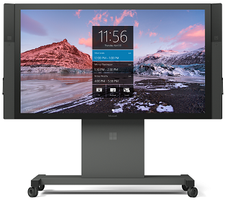

# Microsoft Surface Hub

>[Looking for the user's guide for Surface Hub?](https://www.microsoft.com/surface/support/surface-hub)

<table><tr><td style="border: 0px;width: 75%;valign= top">Microsoft Surface Hub is an all-in-one productivity device that is intended for brainstorming, collaboration, and presentations. In order to get the maximum benefit from Surface Hub, your organization’s infrastructure and the Surface Hub itself must be properly set up and integrated. The documentation in this library describes what needs to be done both before and during setup in order to help you optimize your use of the device.</td><td align="left" style="border: 0px"> </td></tr></table>
 

## Surface Hub setup process

In some ways, adding your new Surface Hub is just like adding any other Microsoft Windows-based device to your network. However, in order to get your Surface Hub up and running at its full capacity, there are some very specific requirements. Here are the next topics you'll need:

1. [Prepare your environment for Surface Hub](prepare-your-environment-for-surface-hub.md)
2. [Gather the information listed in the Setup worksheet](setup-worksheet-surface-hub.md)
2. [Physically install your Surface Hub device](physically-install-your-surface-hub-device.md)
3. [Run the Surface Hub first-run setup program (OOBE)](first-run-program-surface-hub.md)

## In this section

| Topic | Description |
| --- | --- |
| [What's new in Windows 10, version 1703 for Surface Hub?](surfacehub-whats-new-1703.md) | Discover the changes and improvements for Microsoft Surface Hub in the Windows 10, version 1703 release (also known as Creators Update). |
| [Differences between Surface Hub and Windows 10 Enterprise](differences-between-surface-hub-and-windows-10-enterprise.md) | This topic explains the differences between the operating system on Surface Hub and Windows 10 Enterprise. |
| [Prepare your environment for Microsoft Surface Hub](prepare-your-environment-for-surface-hub.md) | This section contains an overview of the steps required to prepare your environment so that you can use all of the features of Surface Hub. See [Intro to Surface Hub](intro-to-surface-hub.md) for a description of how the device and its features interact with your IT environment. |
| [Set up Microsoft Surface Hub](set-up-your-surface-hub.md) | Set up instructions for Surface Hub include a setup worksheet, and a walkthrough of the first-run program. |
| [Manage Microsoft Surface Hub](manage-surface-hub.md) | How to manage your Surface Hub after finishing the first-run program. |
| [PowerShell for Surface Hub](appendix-a-powershell-scripts-for-surface-hub.md) | 
| [How Surface Hub addresses Wi-Fi Direct security issues](surface-hub-wifi-direct.md) | This topic provides guidance on Wi-Fi Direct security risks, how the Surface Hub has addressed those risks, and how Surface Hub administrators can configure the device for the highest level of security.  | PowerShell scripts to help set up and manage your Surface Hub. |
| [Troubleshoot Microsoft Surface Hub](troubleshoot-surface-hub.md) | Troubleshoot common problems, including setup issues, Exchange ActiveSync errors. |
| [Useful downloads for Surface Hub administrators](surface-hub-downloads.md) | This topic provides links to useful Surface Hub documents, such as product datasheets, the site readiness guide, and user's guide. |
| [Change history for Surface Hub](change-history-surface-hub.md) | This topic lists new and updated topics in the Surface Hub documentation library. |

