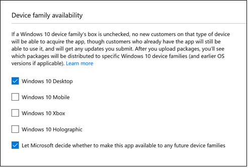

# Install apps on your Microsoft Surface Hub

You can install additional apps on your Surface Hub to fit your team or organization's needs. There are different methods for installing apps depending on if you are developing and testing an app, or deploying a released app. This topic describes methods for installing apps for either scenario. 

A few things to know about apps on Surface Hub:
- Surface Hub only runs [Universal Windows Platform (UWP) apps](https://msdn.microsoft.com/windows/uwp/get-started/whats-a-uwp).
- Apps must be targeted for the [Universal device family](https://msdn.microsoft.com/library/windows/apps/dn894631).
- By default, apps must be Store-signed to be installed. During testing and development, you can also choose to run developer-signed UWP apps by placing the device in developer mode.
- You need admin credentials to install apps on your Surface Hub. Since the device is designed to be used in communal spaces like meeting rooms, people can't access the Windows Store to download and install apps.

There are a few different ways to install apps on your Surface Hub depending on whether you are testing apps, or deploying them. This table outlines supported the supported methods:

| Install method             | Testing and   developing apps | Deploying   apps |
| -------------------------- | --------------------------- | -------------- |
| Developer mode             | X |  |
| Visual Studio              | X |  |
| Windows Store app          | X |  |
| Provisioning package       |  | X |
| Configuration manager      |  | X |

## Test and develop apps
While you're developing your own app, or evaluating apps to deploy to your organization, there are a few options for testing apps on Surface Hub. 

### Developer Mode
By default, Surfacve Hub only runs UWP apps that have been published to and signed by the Windows Store. Apps submitted to the Windows Store go through  security and compliance tests as part of the app certification process, so this helps safeguard your Surface Hub against malicious apps.
 
By enabling developer mode, you can also install developer-signed UWP apps.
 
> [!NOTE]
> After developer mode has been enabled, you will need to reset the Surface Hub to disable it. Resetting the device removes all local user files and configurations and then reinstalls Windows.
 
**To turn on developer mode** 
1.	From your Surface Hub, start **Settings**.
2.	Type the device admin credentials when prompted.
3.	Navigate to **Update & security** > **For developers**.
4.	Select **Developer mode** and accept the warning prompt.

### Visual Studio
During development, the easiest way to test your app on a Surface Hub is using Visual Studio. Visual Studio's remote debugging feature helps discover issues in your app before deploying it broadly. For more information, see [Test Surface Hub apps using Visual Studio](https://msdn.microsoft.com/windows/uwp/debug-test-perf/test-surface-hub-apps-using-visual-studio).

### Windows Store app
Use Windows Store app to browse and download apps to test them on your Surface Hub.

**To browse the Windows Store on Surface Hub** 
1.	From your Surface Hub, start **Settings**.
2.	Type the device admin credentials when prompted.
3.	Navigate to **This device** > **Apps & features**.
4.	Select **Open Store**.
 
Downloading apps from the Store is not the recommended method of deploying apps at scale to your organization:
- Downloading apps from the Store requires you to sign in to the Store app with a Microsoft account or organizational account. However, you can only connect an account to a maximum of 10 devices at once. If you have more than 10 Surface Hubs, you will need to create multiple accounts or remove devices from your account between app installations.
- To install apps, you will need to manually sign in to the Store app on each Surface Hub you own.

### Provisioning package
Use Visual Studio to [create an app package](https://msdn.microsoft.com/library/windows/apps/hh454036.aspx) for your UWP app, signed using a test certificate. Then use Windows Imaging and Configuration Designer (WICD) to create a provisioning package containing the app package and license file. For more information, see [Create provisioning packages](provisioning-packages-for-certificates-surface-hub.md).

## Submit the app to the Windows Store
Once an app is ready for release, developers need to submit and publish it to the Windows Store. For more information, see [Publish Windows apps](https://developer.microsoft.com/store/publish-apps).

During app submission, developers need to set **Device family availability** and **Organizational licensing** options to make sure the app will be available to run on Surface Hub. 

**To set device family availability**  

- On Device familiy availability, select these options:
    - **Windows 10 Desktop** (other device families are optional)
    - **Let Microsoft decide whether to make the app available to any future device families**. 
  
  
    
For more information, see [Device family availability](https://msdn.microsoft.com/windows/uwp/publish/upload-app-packages#device-family-availability).

**To set organizational licensing**
- On **Organizational licensing**, select **Allow disconnected (offline) licensing for organizations**.  

> [!NOTE]
> **Make my app available to organizations with Store-managed (online) volume licensing** is selected by default.

For more information, see [Organizational licensing options](https://msdn.microsoft.com/windows/uwp/publish/organizational-licensing).

Developers can also publish line-of-business apps directly to enterprises without making them broadly available in the Store. For more information, see [Distribute LOB apps to enterprises](https://msdn.microsoft.com/windows/uwp/publish/distribute-lob-apps-to-enterprises).

## Deploy apps to your organization
After you've tested your apps, and submitted them to Windows Store, there are a few options for deploying apps to your organization. 

### Download apps from Windows Store for Business
To download the app package you need to install apps on your Surface Hub, visit the [Windows Store for Business](https://www.microsoft.com/business-store). The Store for Business is where you can find, acquire, and manage apps for the Windows 10 devices in your organization, including Surface Hub.
 
> [!NOTE]
> Currently, Surface Hub only supports offline-licensed apps available through  Store for Business. App developers set offline-license avaialability when they submit apps. 
 
Find and acquire the app you want, then download the offline-licensed app package and the encoded license file. For more information, see [Download an offline-licensed app](https://technet.microsoft.com/itpro/windows/manage/distribute-offline-apps#download-an-offline-licensed-app).

### Provisioning package
Use Windows Imaging and Configuration Designer (WICD) to create a provisioning package containing the app package and license file that you downloaded from the Store for Business. For more information, see Create provisioning packages to learn more.

### System Center Configuration Manager
If your organization uses Configuration Manager SP1, System Center 2012 R2 Configuration Manager, or System Center Configuration Manager (current branch), you can use it to deploy apps remotely to Surface Hubs in your organization.
 
1. Enroll your Surface Hubs to Configuration Manager. For more information, see [Enroll a Surface Hub into MDM](manage-settings-with-mdm-for-surface-hub.md).
2. Create and deploy a Configuration Manager application using your offline-licensed app package and encoded license file. For more information, see [Create and deploy an application with SCCM](https://technet.microsoft.com/library/mt595707.aspx). Use these tips for the Create Application wizard:  
    - Choose to **Automatically detect information about this application from installation files, and choose Windows app package (*.appx, *.appxbundle)**.
    - Point the location to a folder containing the offline-licensed app package and encoded license file that you downloaded from the Store for Business.
    - Ensure that you provide an encoded license file.
    - In the Summary page of the wizard, ensure that your license file was properly detected.
3. As needed, update the app by downloading a new package from the Store for Business, and publishing an application revision in Configuration Manager. For more information, see [Update and retire applications with SCCM](https://technet.microsoft.com/library/mt595704.aspx). 

> [!NOTE] 
> If you are using System Center Configuration Manager (current branch), you can bypass the above steps by connecting the Store for Business to Configuration Manager. By doing so, you can synchronize the list of apps you've purchased with Configuration Manager, view these in the Configuration Manager console, and deploy them like you would any other app. For more information, see [Manage apps from the Windows Store for Business with SCCM](https://technet.microsoft.com/library/mt740630.aspx).

## Related topics

[Manage Microsoft Surface Hub](manage-surface-hub.md)

[Microsoft Surface Hub administrator's guide](surface-hub-administrators-guide.md)

 

 

