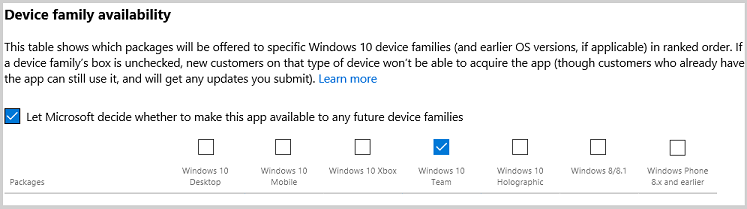
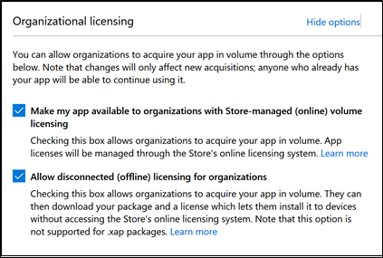

# Install apps on your Microsoft Surface Hub

You can install additional apps on your Surface Hub to fit your team or organization's needs. There are different methods for installing apps depending on whether you are developing and testing an app, or deploying a released app. This topic describes methods for installing apps for either scenario.

A few things to know about apps on Surface Hub:
- Surface Hub only runs [Universal Windows Platform (UWP) apps](https://msdn.microsoft.com/windows/uwp/get-started/whats-a-uwp). Apps created using the [Desktop App Converter](https://docs.microsoft.com/windows/uwp/porting/desktop-to-uwp-run-desktop-app-converter) will not run on Surface Hub.
- Apps must be targeted for the [Universal device family](https://msdn.microsoft.com/library/windows/apps/dn894631) or Windows Team device family.
- Surface Hub only supports [offline-licensed apps](https://docs.microsoft.com/microsoft-store/distribute-offline-apps) from Microsoft Store for Business.
- By default, apps must be Store-signed to be installed. During testing and development, you can also choose to run developer-signed UWP apps by placing the device in developer mode.
- When submitting an app to the Microsoft Store, developers need to set Device family availability and Organizational licensing options to make sure an app will be available to run on Surface Hub.
- You need admin credentials to install apps on your Surface Hub. Since the device is designed to be used in communal spaces like meeting rooms, people can't access the Microsoft Store to download and install apps.

## Develop and test apps
While you're developing your own app, there are a few options for testing apps on Surface Hub.

### Developer Mode
By default, Surface Hub only runs UWP apps that have been published to and signed by the Microsoft Store. Apps submitted to the Microsoft Store go through security and compliance tests as part of the [app certification process](https://msdn.microsoft.com/windows/uwp/publish/the-app-certification-process), so this helps safeguard your Surface Hub against malicious apps.
 
By enabling developer mode, you can also install developer-signed UWP apps.
 
> [!IMPORTANT]
> After developer mode has been enabled, you will need to reset the Surface Hub to disable it. Resetting the device removes all local user files and configurations and then reinstalls Windows.

**To turn on developer mode** 
1.	From your Surface Hub, start **Settings**.
2.	Type the device admin credentials when prompted.
3.	Navigate to **Update & security** > **For developers**.
4.	Select **Developer mode** and accept the warning prompt.

### Visual Studio
During development, the easiest way to test your app on a Surface Hub is using Visual Studio. Visual Studio's remote debugging feature helps you discover issues in your app before deploying it broadly. For more information, see [Test Surface Hub apps using Visual Studio](https://msdn.microsoft.com/windows/uwp/debug-test-perf/test-surface-hub-apps-using-visual-studio).

### Provisioning package
Use Visual Studio to [create an app package](https://msdn.microsoft.com/library/windows/apps/hh454036.aspx) for your UWP app, signed using a test certificate. Then use Windows Imaging and Configuration Designer (ICD) to create a provisioning package containing the app package. For more information, see [Create provisioning packages](provisioning-packages-for-certificates-surface-hub.md).

## Submit apps to the Microsoft Store
Once an app is ready for release, developers need to submit and publish it to the Microsoft Store. For more information, see [Publish Windows apps](https://developer.microsoft.com/store/publish-apps).

During app submission, developers need to set **Device family availability** and **Organizational licensing** options to make sure the app will be available to run on Surface Hub.

**To set device family availability**  
1. On the [Windows Dev Center](https://developer.microsoft.com), navigate to your app submission page.
2. Select **Packages**.
3. Under **Device family availability**, select these options:
    
    - **Windows 10 Team**
    - **Let Microsoft decide whether to make the app available to any future device families**
  
  
    
For more information, see [Device family availability](https://msdn.microsoft.com/windows/uwp/publish/upload-app-packages#device-family-availability).

**To set organizational licensing**
1. On the [Windows Dev Center](https://developer.microsoft.com), navigate to your app submission page.
2. Select **Pricing and availability**.
3. Under Organizational licensing, select **Allow disconnected (offline) licensing for organizations**.

> [!NOTE]
> **Make my app available to organizations with Store-managed (online) licensing and distribution** is selected by default.

> [!NOTE]
> Developers can also publish line-of-business apps directly to enterprises without making them broadly available in the Store. For more information, see [Distribute LOB apps to enterprises](https://msdn.microsoft.com/windows/uwp/publish/distribute-lob-apps-to-enterprises).

For more information, see [Organizational licensing options](https://msdn.microsoft.com/windows/uwp/publish/organizational-licensing).

## Deploy released apps

There are several options for installing apps that have been released to the Microsoft Store, depending on whether you want to evaluate them on a few devices, or deploy them broadly to your organization.

To install released apps:
- Download the app using the Microsoft Store app, or
- Download the app package from the Microsoft Store for Business, and distribute it using a provisioning package or a supported MDM provider.

### Microsoft Store app
To evaluate apps released on the Microsoft Store, use the Microsoft Store app on the Surface Hub to browse and download apps.

> [!NOTE]
> Using the Microsoft Store app is not the recommended method of deploying apps at scale to your organization:
> - To download apps, you must sign in to the Microsoft Store app with a Microsoft account or organizational account. However, you can only connect an account to a maximum of 10 devices at once. If you have more than 10 Surface Hubs, you will need to create multiple accounts or remove devices from your account between app installations.
> - To install apps, you will need to manually sign in to the Microsoft Store app on each Surface Hub you own.

**To browse the Microsoft Store on Surface Hub** 
1.	From your Surface Hub, start **Settings**.
2.	Type the device admin credentials when prompted.
3.	Navigate to **This device** > **Apps & features**.
4.	Select **Open Store**.

### Download app packages from Microsoft Store for Business
To download the app package you need to install apps on your Surface Hub, visit the [Microsoft Store for Business](https://www.microsoft.com/business-store). The Store for Business is where you can find, acquire, and manage apps for the Windows 10 devices in your organization, including Surface Hub.
 
> [!NOTE]
> Currently, Surface Hub only supports offline-licensed apps available through the Store for Business. App developers set offline-license availability when they submit apps.

Find and acquire the app you want, then download:
- The offline-licensed app package (either an .appx or an .appxbundle)
- The *unencoded* license file (if you're using provisioning packages to install the app)
- The *encoded* license file (if you're using MDM to distribute the app)
- Any necessary dependency files

For more information, see [Download an offline-licensed app](https://technet.microsoft.com/itpro/windows/manage/distribute-offline-apps#download-an-offline-licensed-app).

### Provisioning package
You can manually install the offline-licensed apps that you downloaded from the Store for Business on a few Surface Hubs using provisioning packages. Use Windows Imaging and Configuration Designer (ICD) to create a provisioning package containing the app package and *unencoded* license file that you downloaded from the Store for Business. For more information, see [Create provisioning packages](provisioning-packages-for-certificates-surface-hub.md).

### Supported MDM provider
To deploy apps to a large number of Surface Hubs in your organization, use a supported MDM provider. The table below shows which MDM providers support deploying offline-licensed app packages.

| MDM provider                | Supports offline-licensed app packages |
|-----------------------------|----------------------------------------|
| On-premises MDM with System Center Configuration Manager (beginning in version 1602) | Yes |
| Hybrid MDM with System Center Configuration Manager and Microsoft Intune | Yes |
| [Microsoft Intune standalone](https://docs.microsoft.com/intune/windows-store-for-business) | Yes |
| Third-party MDM provider    | Check to make sure your MDM provider supports deploying offline-licensed app packages. |

**To deploy apps remotely using System Center Configuration Manager (either on-prem MDM or hybrid MDM)**

> [!NOTE]
> These instructions are based on the current branch of System Center Configuration Manager.

1. Enroll your Surface Hubs to System Center Configuration Manager. For more information, see [Enroll a Surface Hub into MDM](manage-settings-with-mdm-for-surface-hub.md#enroll-into-mdm).
2. Download the offline-licensed app package, the *encoded* license file, and any necessary dependency files from the Store for Business. For more information, see [Download an offline-licensed app](https://technet.microsoft.com/itpro/windows/manage/distribute-offline-apps#download-an-offline-licensed-app). Place the downloaded files in the same folder on a network share.
3. In the **Software Library** workspace of the Configuration Manager console, click **Overview** > **Application Management** > **Applications**.
4. On the **Home** tab, in the **Create** group, click **Create Application**.
5. On the **General** page of the **Create Application Wizard**, select the **Automatically detect information about this application from installation files** check box.
6. In the **Type** drop-down list, select **Windows app package (\*.appx, \*.appxbundle)**.
7. In the **Location** field, specify the UNC path in the form \\server\share\\filename for the offline-licensed app package that you downloaded from the Store for Business. Alternatively, click **Browse** to browse to the app package.
8. On the **Import Information** page, review the information that was imported, and then click **Next**. If necessary, you can click **Previous** to go back and correct any errors.
9. On the **General Information** page, complete additional details about the app. Some of this information might already be populated if it was automatically obtained from the app package.
10. Click **Next**, review the application information on the Summary page, and then complete the Create Application Wizard. 
11. Create a deployment type for the application. For more information, see [Create deployment types for the application](https://docs.microsoft.com/sccm/apps/deploy-use/create-applications#create-deployment-types-for-the-application).
12. Deploy the application to your Surface Hubs. For more information, see [Deploy applications with System Center Configuration Manager](https://docs.microsoft.com/sccm/apps/deploy-use/deploy-applications).
13. As needed, update the app by downloading a new package from the Store for Business, and publishing an application revision in Configuration Manager. For more information, see [Update and retire applications with System Center Configuration Manager](https://technet.microsoft.com/library/mt595704.aspx). 

> [!NOTE] 
> If you are using System Center Configuration Manager (current branch), you can bypass the above steps by connecting the Store for Business to System Center Configuration Manager. By doing so, you can synchronize the list of apps you've purchased with System Center Configuration Manager, view these in the Configuration Manager console, and deploy them like you would any other app. For more information, see [Manage apps from the Microsoft Store for Business with System Center Configuration Manager](https://technet.microsoft.com/library/mt740630.aspx).

## Summary

There are a few different ways to install apps on your Surface Hub depending on whether you are developing apps, evaluating apps on a small number of devices, or deploying apps broadly to your organization. This table summarizes the supported methods:

| Install method             | Developing apps | Evaluating apps on   a few devices | Deploying apps broadly   to your organization |
| -------------------------- | --------------- | ------------------------------------- | ---------------------- |
| Visual Studio              | X |   |   |
| Provisioning package       | X | X |   |
| Microsoft Store app          |   | X |   |
| Supported MDM provider     |   |   | X |

## More information

- [Blog post:  Deploy Windows Store apps to Surface Hub using Intune](https://blogs.technet.microsoft.com/y0av/2018/01/18/7-2/)

## Related topics

[Manage Microsoft Surface Hub](manage-surface-hub.md)

[Microsoft Surface Hub administrator's guide](surface-hub-administrators-guide.md)

 

 

