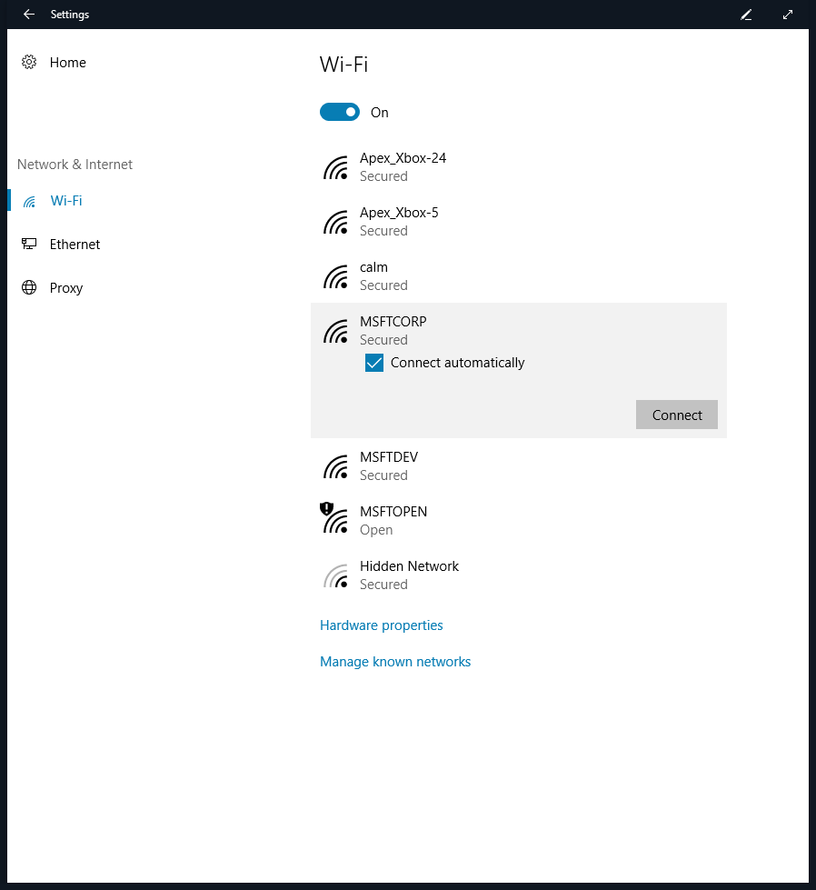
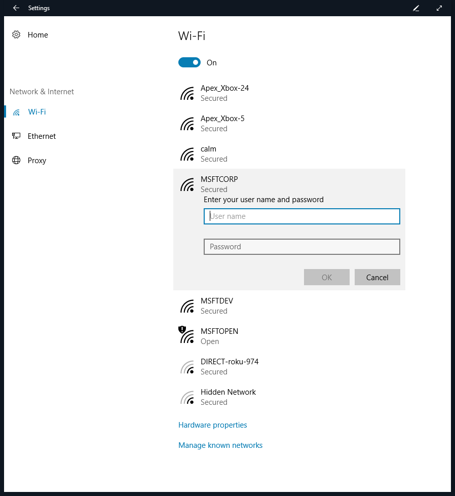
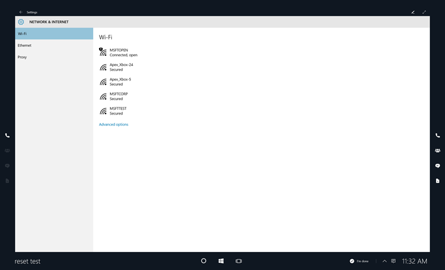
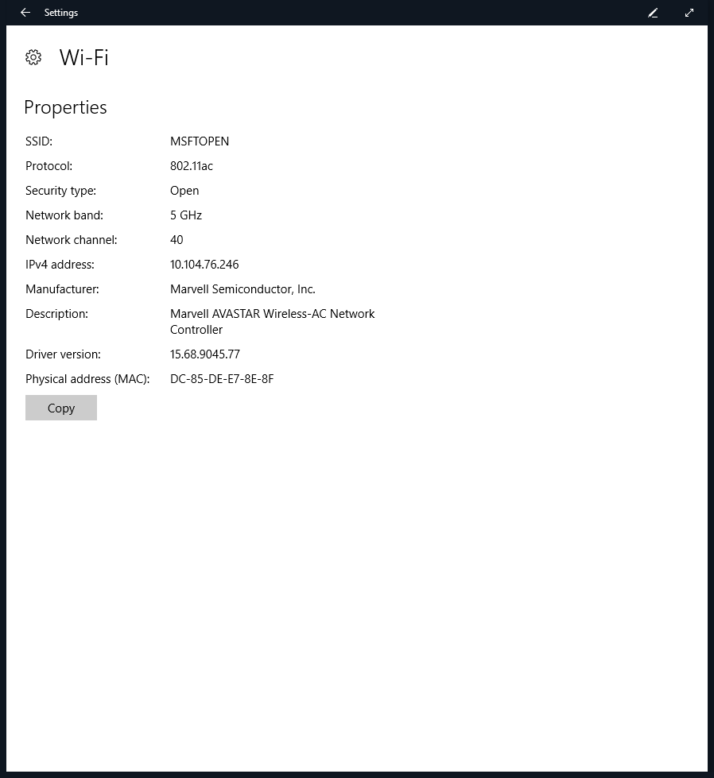
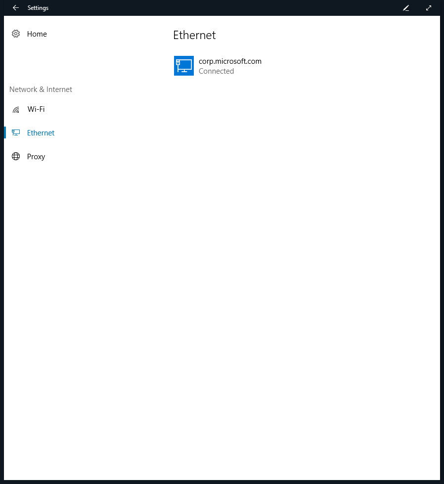
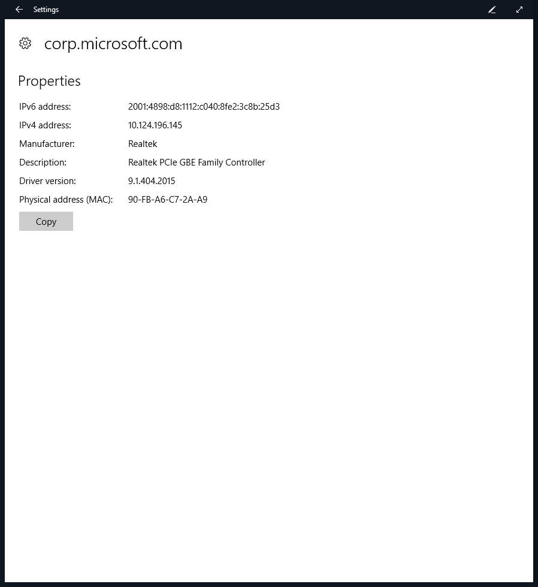

# Wireless network management - Microsoft Surface Hub

Microsoft Surface Hub offers two options for network connectivity to your corporate network and Internet: wireless, and wired. While both provide network access, we recommend you use a wired connection.

## Modifying, adding or reviewing a network connection

If a wired network connection is not available, the Surface Hub can use a wireless network for internet access. A properly connected and configured Wi-Fi access point must be available and within range of the Surface Hub.

### Choose a wireless access point

1.  On the Surface Hub, open **Settings** and enter your admin credentials.
2.  Click **System**, and then click **Network & Internet**. Under **Wi-Fi**, choose an access point. If you want Surface Hub to automatically connect to this access point, click **Connect automatically**. Click **Connect**.

    

3.  If the network is secured, you'll be asked to enter the security key. Click **Next** to connect.

    

### Review wireless settings

1.  On the Surface Hub, open **Settings** and enter your admin credentials.
2.  Click **System**, click **Network & Internet**, then **Wi-Fi**, and then click **Advanced options**.

    

3.  The system will show you the properties for the wireless network connection.

    

### Review wired settings

1.  On the Surface Hub, open **Settings** and enter your admin credentials.
2.  Click **System**, click **Network & Internet**, then click on the network under Ethernet.

    

3.  The system will show you the properties for the wired network connection.

    

## Related topics

[Manage Microsoft Surface Hub](manage-surface-hub.md)

[Microsoft Surface Hub administrator's guide](surface-hub-administrators-guide.md)

 

 

