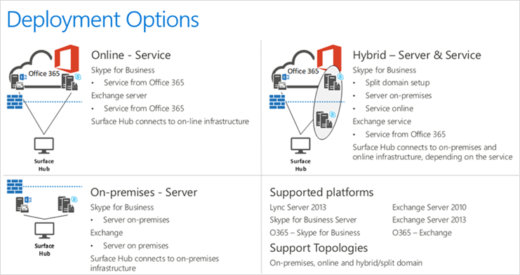

# Create and test a device account - Microsoft Surface Hub

This topic introduces how to create and test the device account that Microsoft Surface Hub uses to communicate with Microsoft Exchange and Skype.

A "device account" is an account that the Microsoft Surface Hub uses to:

-   sync its meeting calendar,
-   send mail,
-   and enable Skype for Business compatibility.

People can book this account by scheduling a meeting with it. The Surface Hub will be able to join that meeting and provide various features to the meeting attendees.

**Important**  Without a device account, none of these features will work.

 

Every device account is unique to a single Surface Hub, and requires some setup:

-   The device account must be configured correctly, as described in the folllowing sections.
-   Your infrastructure must be configured to allow the Surface Hub to validate the device account, and to reach the appropriate Microsoft services.

You can think of a device account as the resource account that people recognize as a conference room’s or meeting space’s account. When you want to schedule a meeting using that conference room, you invite the account to that meeting. In order to use the Surface Hub most effectively, you do the same with the device account that's assigned to each one.

If you already have a resource mailbox account set up for the meeting space where you’re putting a Surface Hub, you can change that resource account into a device account. Once that’s done, all you need to do is add the device account to a Surface Hub. See step 2 of either [On-premises deployment](prepare-your-environment-for-surface-hub-how-do-i-on-premises-deployment.md) or [Online deployment (Office 365)](prepare-your-environment-for-surface-hub-how-do-i-online-deployment.md).

The following sections will describe how to create and test a device account before configuring your Surface Hub.

### Basic configuration

These properties represent the minimum configuration for a device account to work on a Surface Hub. Your device account may require further setup, which is covered in [Advanced configuration](#advanced-config).

<table>
<colgroup>
<col width="50%" />
<col width="50%" />
</colgroup>
<thead>
<tr class="header">
<th align="left">Property</th>
<th align="left">Purpose</th>
</tr>
</thead>
<tbody>
<tr class="odd">
<td align="left">
Exchange mailbox (Exchange 2010 or later, or Exchange Online)
</td>
<td align="left">
Enabling the account with an Exchange mailbox gives the device account the capability to receive and send both mail and meeting requests, and to display a meetings calendar on the Surface Hub’s welcome screen. The Surface Hub mailbox must be a room mailbox.
</td>
</tr>
<tr class="even">
<td align="left">
Skype for Business-enabled (Lync/Skype for Business 2010 or later or Skype for Business Online)
</td>
<td align="left">
Skype for Business must be enabled in order to use various conferencing features, like video calls, IM, and screen-sharing.
</td>
</tr>
<tr class="odd">
<td align="left">
Password-enabled
</td>
<td align="left">
The device account must be enabled with a password, or it cannot authenticate with either Exchange or Skype for Business.
</td>
</tr>
<tr class="even">
<td align="left">
Compatible EAS policies
</td>
<td align="left">
The device account must use a compatible EAS policy in order for it to sync its mail and calendar. In order to implement this policy, the PasswordEnabled property must be set to False. If an incompatible EAS policy is used, the Surface Hub will not be able to use any services provided by Exchange and ActiveSync.
</td>
</tr>
</tbody>
</table>

 

### Advanced configuration

While the properties for the basic configuration will allow the device account to be set up in a simple environment, it is possible your environment has other restrictions on directory accounts that must be met in order for the Surface Hub to successfully use the device account.

<table>
<colgroup>
<col width="50%" />
<col width="50%" />
</colgroup>
<thead>
<tr class="header">
<th align="left">Property</th>
<th align="left">Purpose</th>
</tr>
</thead>
<tbody>
<tr class="odd">
<td align="left">
Certificate-based authentication
</td>
<td align="left">
Certificates may be required for both ActiveSync and Skype for Business. To deploy certificates, you need to use provisioning packages or an MDM solution.

See [Create provisioning packages](prepare-your-environment-for-surface-hub-create-provisioning-packages-for-certificates.md) for details.
</td>
</tr>
<tr class="even">
<td align="left">
Allowed device IDs (ActiveSync Device ID)
</td>
<td align="left">
Your Exchange ActiveSync setup may require that an account must whitelist device IDs so that ActiveSync can retrieve the device account’s mail and calendar. You must ensure that the Surface Hub’s device ID is added to this whitelist. This can either be configured using PowerShell (by setting the <code>ActiveSyncAllowedDeviceIDs</code> property) or the Exchange administrative portal.

You can find out how to find and whitelist a device ID with PowerShell in [Allowing device IDs for ActiveSync](appendix-a--powershell.md#whitelisting-device-ids-cmdlet).
</td>
</tr>
</tbody>
</table>

 

### How do I set up the account?

The best way to set up device accounts is to configure them using remote PowerShell. We provide several PowerShell scripts that will help create new device accounts, or validate existing resource accounts you have in order to help you turn them into compatible Surface Hub device accounts. These PowerShell scripts, and instructions for their use, are in [Appendix: PowerShell](appendix-a--powershell.md).

You can check online for updated versions at [Surface Hub device account scripts](http://aka.ms/surfacehubscripts).

### Device account configuration

Your infrastructure will likely fall into one of three configurations. Which configuration you have will affect how you prepare for device setup.

-   [Online deployment (Office 365)](prepare-your-environment-for-surface-hub-how-do-i-online-deployment.md): Your organization’s environment is deployed entirely on Office 365.
-   [On-premises deployment](prepare-your-environment-for-surface-hub-how-do-i-on-premises-deployment.md): Your organization has servers that it controls, where Active Directory, Exchange, and Skype for Business (or Lync) are hosted.
-   [Hybrid deployment](prepare-your-environment-for-surface-hub-how-do-i-hybrid-deployment.md): Your organization has a mix of services, with some hosted on-premises and some hosted online through Office 365.

If you prefer to use the Office 365 UI over PowerShell cmdlets, some steps can be performed manually. See [Creating a device account using Office 365](prepare-your-environment-for-surface-hub-how-do-i-creating-a-device-account-using-office-365.md).

### Device account resources

These sections describe resources used by the Surface Hub device account.

-   [Exchange properties](prepare-your-environment-for-surface-hub-how-do-i-exchange-properties.md): The Exchange properties of the device account must be set to particular values for the Surface Hub to work properly.
-   [Applying ActiveSync policies to device accounts](prepare-your-environment-for-surface-hub-how-do-i-applying-activesync-policies.md): The Surface Hub uses ActiveSync to sync both mail and its meeting calendar.
-   [Password management](prepare-your-environment-for-surface-hub-how-do-i-password-management.md): Every device account requires a password to authenticate. This section describes your options for managing this password.

## In this section

<table>
<colgroup>
<col width="50%" />
<col width="50%" />
</colgroup>
<thead>
<tr class="header">
<th align="left">Topic</th>
<th align="left">Description</th>
</tr>
</thead>
<tbody>
<tr class="odd">
<td align="left">
[Online deployment](prepare-your-environment-for-surface-hub-how-do-i-online-deployment.md)
</td>
<td align="left">
This topic has instructions for adding a device account for your Surface Hub when you have a pure, online deployment.
</td>
</tr>
<tr class="even">
<td align="left">
[On-premises deployment](prepare-your-environment-for-surface-hub-how-do-i-on-premises-deployment.md)
</td>
<td align="left">
This topic explains how you add a device account for your Surface Hub when you have a single-forest, on-premises deployment.
</td>
</tr>
<tr class="odd">
<td align="left">
[Hybrid deployment](prepare-your-environment-for-surface-hub-how-do-i-hybrid-deployment.md)
</td>
<td align="left">
A hybrid deployment requires special processing in order to set up a device account for your Surface Hub. If you’re using a hybrid deployment, in which your organization has a mix of services, with some hosted on-premises and some hosted online, then your configuration will depend on where each service is hosted. This topic covers hybrid deployments for [Exchange hosted on-prem](#hybrid-exchange-on-prem), and [Exchange hosted online](#hybrid-exchange-online). Because there are so many different variations in this type of deployment, it's not possible to provide detailed instructions for all of them. The following process will work for many configurations. If the process isn't right for your setup, we recommend that you use PowerShell (see [Appendix: PowerShell](appendix-a--powershell.md)) to achieve the same end result as documented here, and for other deployment options. You should then use the provided PowerShell script to verify your Surface Hub setup. (See [Account Verification Script](appendix-a--powershell.md#acct-verification-ps-scripts).)
</td>
</tr>
<tr class="even">
<td align="left">
[Create a device account using UI](prepare-your-environment-for-surface-hub-how-do-i-creating-a-device-account-using-office-365.md)
</td>
<td align="left">
If you prefer to use a graphical user interface, you can create a device account for your Surface Hub with either the [Office 365 UI](#create-device-acct-o365) or the [Exchange Admin Center](#create-device-acct-eac).
</td>
</tr>
<tr class="odd">
<td align="left">
[Microsoft Exchange properties](prepare-your-environment-for-surface-hub-how-do-i-exchange-properties.md)
</td>
<td align="left">
Some Exchange properties of the device account must be set to particular values to have the best meeting experience on Surface Hub. The following table lists various Exchange properties based on PowerShell cmdlet parameters, their purpose, and the values they should be set to.
</td>
</tr>
<tr class="even">
<td align="left">
[Applying ActiveSync policies to device accounts](prepare-your-environment-for-surface-hub-how-do-i-applying-activesync-policies.md)
</td>
<td align="left">
The Surface Hub's device account uses ActiveSync to sync mail and calendar. This allows people to join and start scheduled meetings from the Surface Hub, and allows them to email any whiteboards they have made during their meeting.
</td>
</tr>
<tr class="odd">
<td align="left">
[Password management](prepare-your-environment-for-surface-hub-how-do-i-password-management.md)
</td>
<td align="left">
Every Surface Hub device account requires a password to authenticate and enable features on the device.
</td>
</tr>
</tbody>
</table>

 

 

 

