# Create provisioning packages (Surface Hub)

For Windows 10, settings that use the registry or a content services platform (CSP) can be configured using provisioning packages. You can also add certificates during first run using provisioning.

In this topic, you'll find the following information:

-   [Introduction to provisioning packages](#intro-prov-pkg)
-   [What can provisioning packages configure for Microsoft Surface Hubs?](#what-can-prov-pkg)
-   [How do I create and deploy a provisioning package?](#how-do-i-prov-pkg)
-   [Requirements](#requirements-prov-pkg)
-   [Install the Windows Imaging and Configuration Designer](#installing-wicd-prov-pkg)
-   [Create a provisioning package for certificates](#creating-prov-pkg-certs)
-   [Create a provisioning package for apps](#creating-prov-pkg-apps)
-   [Deploy a provisioning package to a Surface Hub](#deploy-to-hub-prov-pkg)
    -   [Deploy a provisioning package using first run](#deploy-via-oobe-prov-pkg)
    -   [Deploy a provisioning package using Settings](#deploy-via-settings-prov-pkg)

### Introduction to provisioning packages

Provisioning packages are created using Windows Imaging and Configuration Designer (WICD), which is a part of the Windows Assessment and Deployment Kit (ADK). For Surface Hub, the provisioning packages can be placed on a USB drive.

### What can provisioning packages configure for Surface Hubs?

Currently, you can use provisioning packages to install certificates and to install Universal Windows Platform (UWP) apps on your Surface Hub. These are the only two supported scenarios.

You may use provisioning packages to install certificates that will allow the device to authenticate to Microsoft Exchange or Skype for Business, or to sideload apps that don't come from the Windows Store (for example, your own in-house apps).

>**Note**  Provisioning can only install certificates to the device (local machine) store, and not to the user store. If your organization requires that certificates must be installed to the user store, you must use Mobile Device Management (MDM) to deploy these certificates. See your MDM solution documentation for details.

 

### How do I create and deploy a provisioning package?

Provisioning packages must be created using the Windows Imaging and Configuration Designer (ICD).

### Requirements

In order to create and deploy provisioning packages, all of the following are required:

-   Access to the Settings app on Surface Hub (using admin credentials which were configured at initial setup of the Surface Hub).
-   Windows Imaging and Configuration Designer (ICD), which is installed as a part of the windows 10 Assessment and Deployment Kit (ADK).
-   A PC running Windows 10.
-   USB flash drive.

### Install the Windows Imaging and Configuration Designer

1.  The Windows Imaging and Configuration Designer (ICD) is installed as part of the Windows 10 ADK. The installer for the ADK can be downloaded from the [Microsoft Download Center](https://go.microsoft.com/fwlink/?LinkId=718147).
    >**Note**  The ADK must be installed on a separate PC, not on the Surface Hub.  

2.  Run the installer, and set your preferences for installation. When asked what features you want to install, you will see a checklist like the one in the following figure. Note that **Windows Performance Toolkit** and **Windows Assessment Toolkit** should be unchecked, as they are not needed to run the ICD.

    Before going to the next step, make sure you have the following checked:

    -   **Deployment Tools**
    -   **Windows Preinstallation Environment**
    -   **Imaging and Configuration Designer**
    -   **User State Migration Tool**

    All four of these features are required to run the ICD and create a package for the Surfact Hub.

    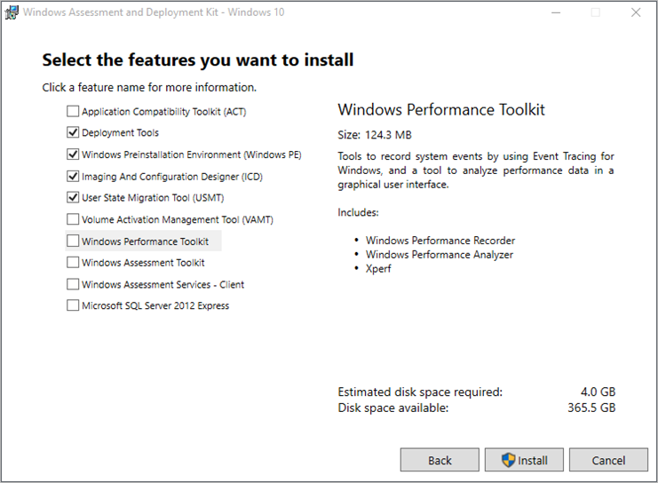

3.  Continue with the installer until the ADK is installed. This may take a while, because the installer downloads remote content.

### Create a provisioning package for certificates

This example will demonstrate how to create a provisioning package to install a certificate.

1.  On the PC that had the Windows 10 ADK installed, open ICD and choose the **New provisioning package** tile from the main menu.

    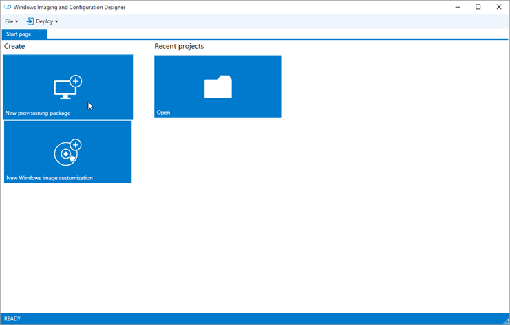

2.  When the **New project** dialog box opens, type whatever name you like in the **Name** box. The **Location** and **Description** boxes can also be filled at your discretion, though we recommend using the **Description** box to help you distinguish among multiple packages. Click **Next**.

    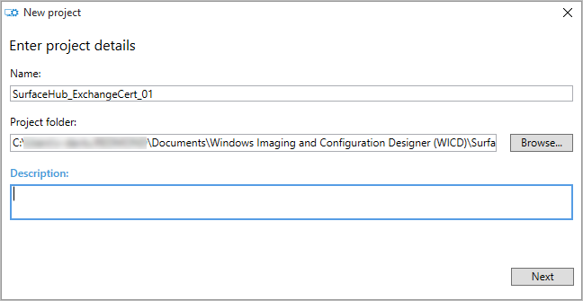

    Select the settings that are **Common to all Windows editions**, and click **Next**.

    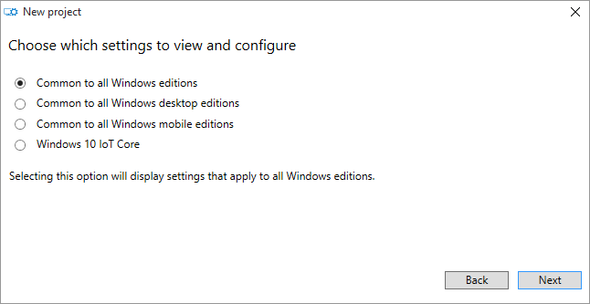

    When asked to import a provisioning package, just click **Finish.**

    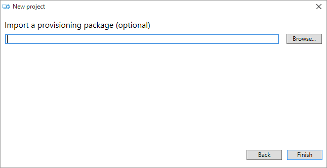

3.  ICD's main screen will be displayed. This is where you create the provisioning package. In the **Available customizations** pane, expand **Runtime settings** and then expand **Certificates**. Click **Root certificates**.

    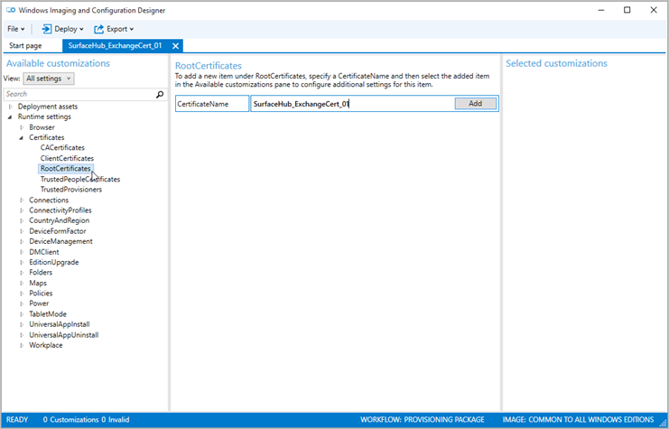

    In the center pane, you’ll be asked to specify a **CertificateName** for the Root certificate. You can set this to whatever you want. For the example, we've used the same name as the project. Click **Add**, and an entry will be added in the left pane.

4.  In the **Available customizations** pane on the left, a new category has appeared for **CertificatePath** underneath the **CertificateName** you provided. There’s also a red exclamation icon indicating that there is a required field that needs to be set. Click **CeritficatePath**.

    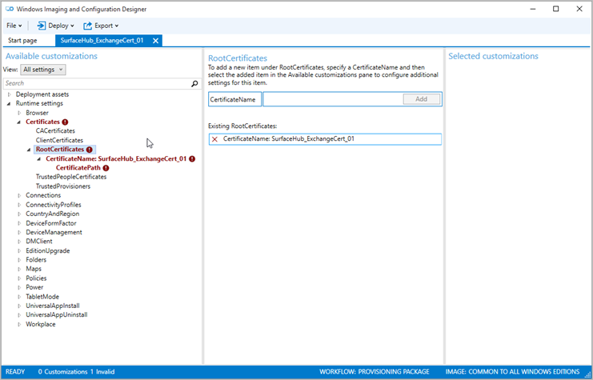

5.  In the center pane, you’ll be asked to specify the path for the certificate. Enter the name of the .cer file that you want to deploy, either by typing or clicking **Browse**. It must be a root certificate. The provisioning package created will copy the .cer file into the package it creates.

    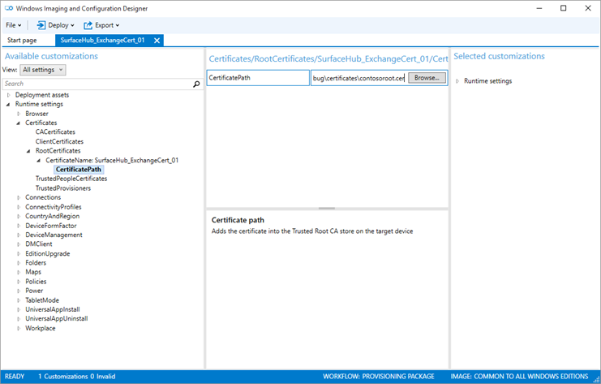

6.  Verify that the path is set, then click **Export** in the top menu and choose **Provisioning package**.

    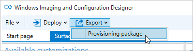

7.  You'll see a series of dialog boxes next. In the first one, either accept the defaults, or enter new values as needed, and click **Next**. You'll most likely want to accept the defaults.

    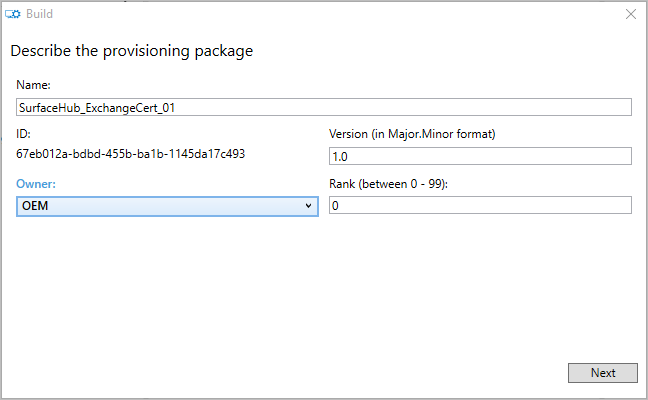

    Click **Next** again in the security options dialog box, because this package doesn't need to be encrypted or signed.

    

    Choose where to save the provisioning package, and click **Next**.

    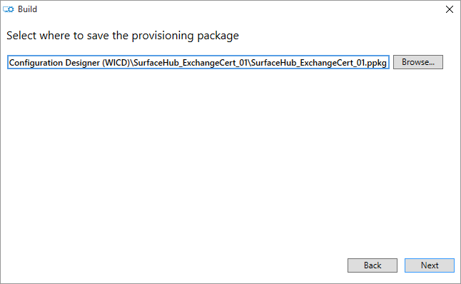

    Review the information shown, and if it looks good, click **Build**.

    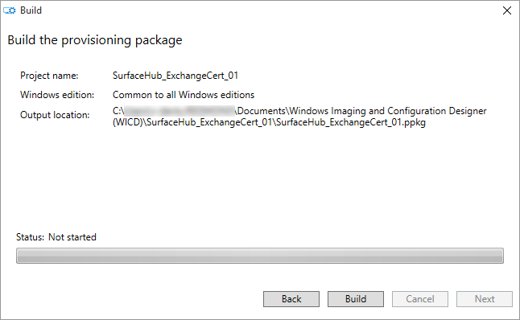

    You will see a confirmation dialog box similar to the one following. Click the link under **Output location** to open the directory containing the provisioning package.

    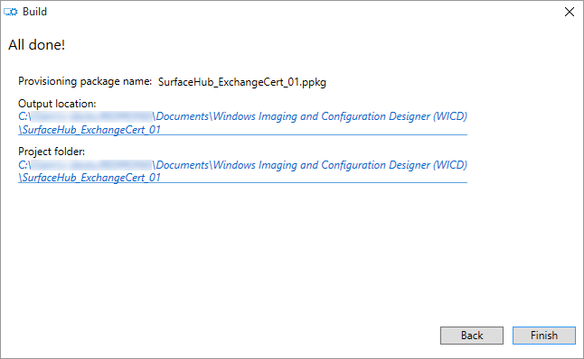

8.  Copy the .ppkg from the output directory into the root directory of a USB drive. If it’s not at the root, it won’t be recognized by the device. You’ve finished making the provisioning package—now you just need to deploy it to the Surface Hub.

### Create a provisioning package for apps

This example will demonstrate how to create a provisioning package to install offline-licensed apps purchased from the Windows Store for Business. For information on offline-licensed apps and what you need to download in order to install them, see [Distribute offline apps](https://go.microsoft.com/fwlink/?LinkId=718148).

For each app you want to install on Surface Hubs, you'll need to download:

-   App metadata
-   App package
-   App license

Depending on the app, you may or may not need to download a new app framework.

1.  On the PC that had the Windows 10 ADK installed, open ICD and choose the **New provisioning package** tile from the main menu.

    

2.  When the **New project** dialog box opens, type whatever name you like in the **Name** box. The **Location** and **Description** boxes can also be filled at your discretion, though we recommend using the **Description** box to help you distinguish among multiple packages. Click **Next**.

    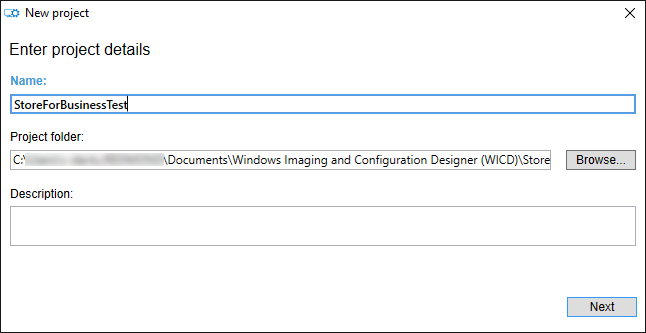

    Select the settings that are **Common to all Windows editions**, and click **Next**.

    

    When asked to import a provisioning package, just click **Finish.**

    

3.  ICD's main screen will be displayed. This is where you create the provisioning package. In the **Available customizations** pane, expand **UniversalAppInstall** and click **DeviceContextApp**.

    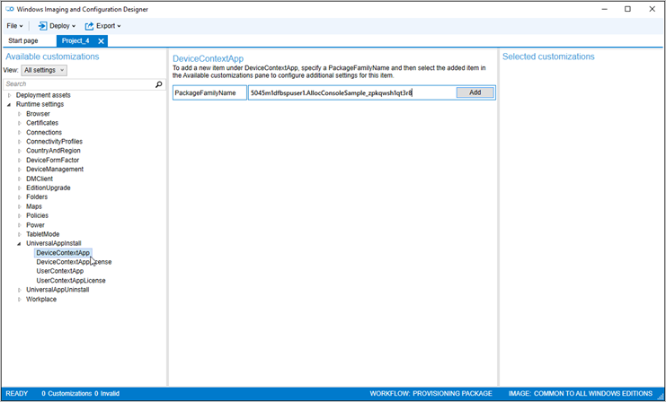

    In the center pane, you’ll be asked to specify a **PackageFamilyName** for the app. This is one of the things you downloaded from the Store for Business. Click **Add**, and an entry will be added in the left pane.

4.  In the **Available customizations** pane on the left, new categories will be displayed for **ApplicationFile** and **LaunchAppAtLogin** underneath the **PackageFamilyName** you just entered. Enter the appx filename in the **ApplicationFile** box in the center pane.

    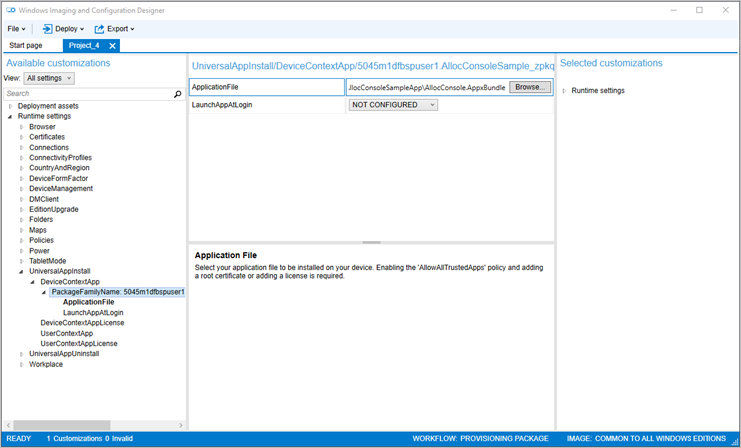

    Generally, **LaunchAppAtLogin** should be set to **Do not launch app** or **NOT CONFIGURED**.

5.  Next, click **DeviceContextAppLicense** in the left pane. In the center pane, you’ll be asked to specify the **LicenseProductId**. Click **Add**. Back in the left pane, click on the **LicenseProductId** that you just added. In the center pane, you'll need to specify **LicenseInstall**. Enter the name of the license file that you previously downloaded from the Store for Business, either by typing or clicking **Browse**. The file will have a extension of "ms-windows-store-license".

    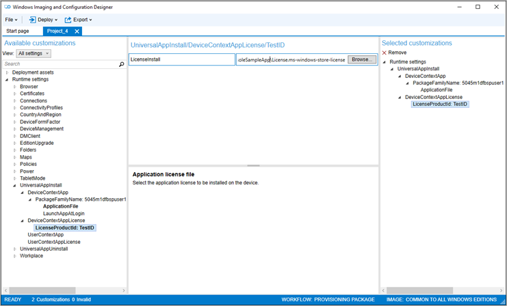

6.  Verify that the path is set, then click **Export** in the top menu and choose **Provisioning package**.

    

7.  You'll see a series of dialog boxes next. In the first one, either accept the defaults, or enter new values as needed, and click **Next**. You'll most likely want to accept the defaults.

    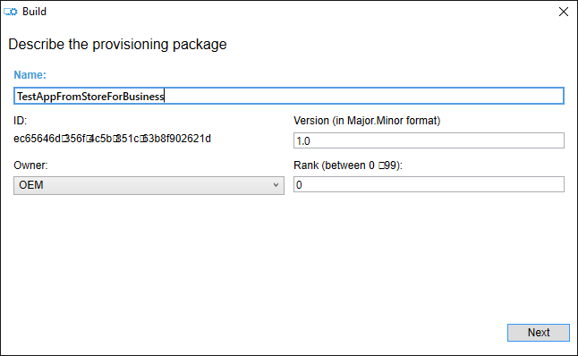

    Click **Next** again in the security options dialog box, because this package doesn't need to be encrypted or signed.

    

    Choose where to save the provisioning package, and click **Next**.

    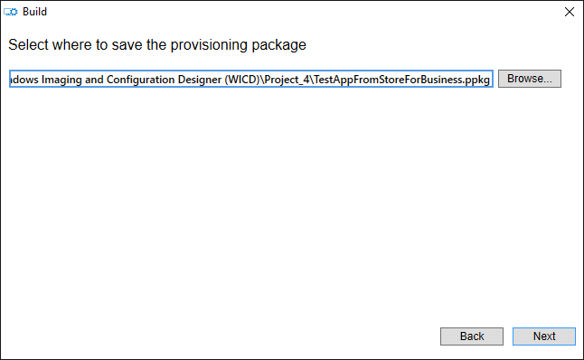

    Review the information shown, and if it looks good, click **Build**.

    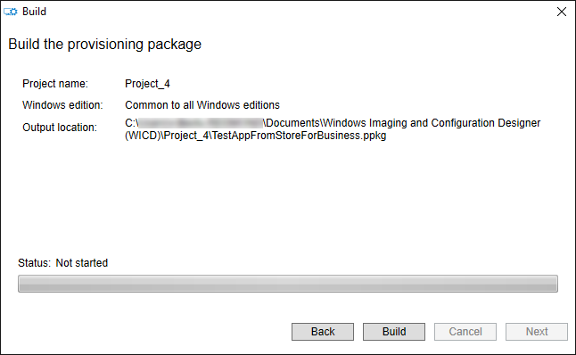

    You will see a confirmation dialog box similar to the one following. Click the link under **Output location** to open the directory containing the provisioning package.

    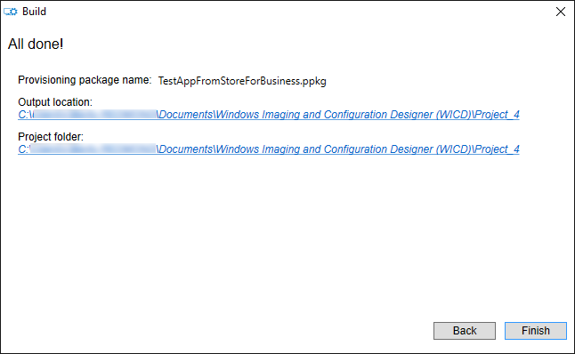

8.  Copy the .ppkg from the output directory into the root directory of a USB drive. If it’s not at the root, it won’t be recognized by the device. You’ve finished making the provisioning package—now you just need to deploy it to the Surface Hub.

### Deploy a provisioning package to a Surface Hub

The following two methods for deploying provisioning packages apply to any kind of provisioning package that is being deployed to a Surface Hub. There is no difference in the way cert provisioning packages and app provisioning packages are installed. You may see different description text in the UI depending on what the package is for, but the process is still the same.

### Deploy a provisioning package using first run

1.  When you turn on the Surface Hub for the first time, the first run process will display the page titled **Hi there**. Make sure the settings on this page are correct before you proceed. (See [Hi there page](first-run-program-surface-hub.md#first-page) for details.) Once you've deployed your provisioning package, the first run process will not return here. It will continue to the next screen.
2.  Insert the USB drive into the Surface Hub.
3.  Press the Windows key on the separate keyboard five times. You’ll see a dialog box asking whether you want to set up your device. Click **Set Up**.

    IMage

4.  Click on **Removable Media** in the **Provision From** dropdown list, then click **Next**.

    

5.  The available packages in the root directory of the USB drive will be listed. Note that you can only install one package during first run. Select the package you want to install and then click **Next**.

    

6.  You’ll then see a dialog asking if it’s from a source you trust. Click **Yes, add it**. The certificate will be installed, and you’ll be taken to the next page of first run.

    

### Deploy a provisioning package using Settings

1.  Insert the USB drive into the Surface Hub you want to deploy to.
2.  On the Surface Hub, open **Settings** and enter in the admin credentials.
3.  Navigate to **System &gt; Work Access**. Under the header **Related settings**, click on **Add or remove a management package**.
4.  Here, click the button for **Add a package**.

    

5.  Click **Removable media** from the dropdown list. You will see a list of available provisioning packages on the **Settings** page.

    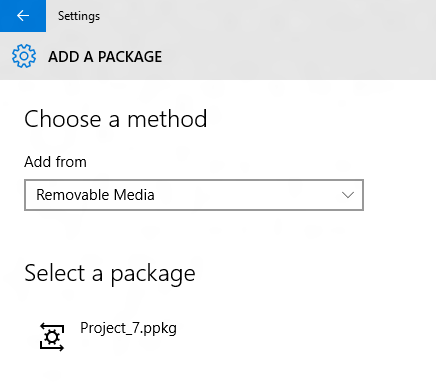

6.  Choose your package and click **Add**.

    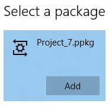

7.  You may have to re-enter the admin credentials if User Access Control (UAC) asks for them.
8.  You’ll see a confirmation dialog box. Click **Yes, add it**. The certificate will be installed.

 

 

