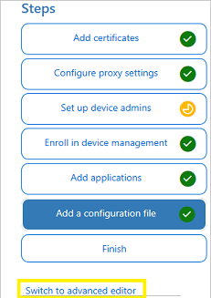
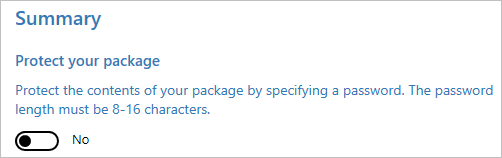
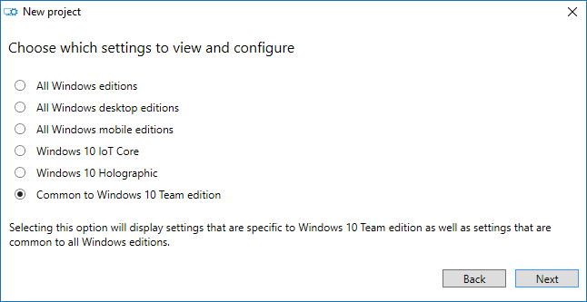
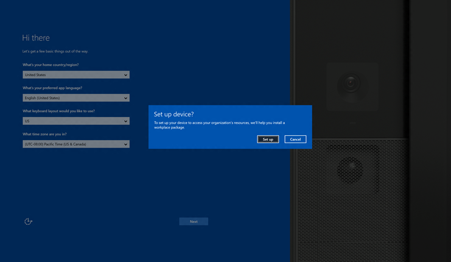
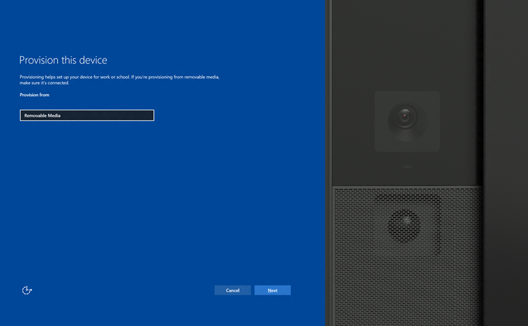
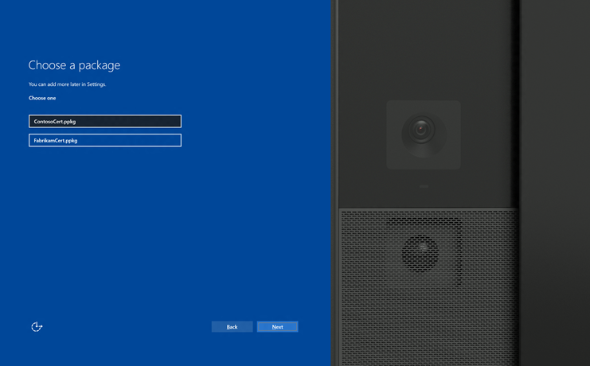
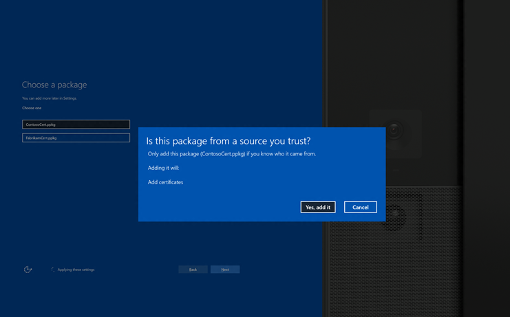
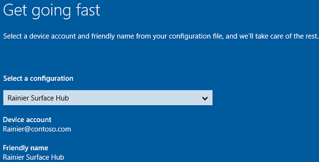
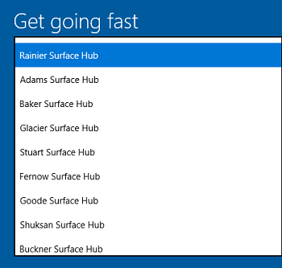

# Create provisioning packages (Surface Hub)

This topic explains how to create a provisioning package using the Windows Configuration Designer, and apply it to Surface Hub devices. For Surface Hub, you can use provisioning packages to add certificates, install Universal Windows Platform (UWP) apps, and customize policies and settings.

You can apply a provisioning package using a USB stick during first-run setup, or through the **Settings** app. 


## Advantages
-   Quickly configure devices without using a mobile device management (MDM) provider.

-   No network connectivity required.

-   Simple to apply.

[Learn more about the benefits and uses of provisioning packages.](https://technet.microsoft.com/itpro/windows/configure/provisioning-packages)


## Requirements 

To create and apply a provisioning package to a Surface Hub, you'll need the following:

-   Windows Configuration Designer, which can be installed from Microsoft Store or from the Windows 10 Assessment and Deployment Kit (ADK). [Learn how to install Windows Configuration Designer.](https://technet.microsoft.com/itpro/windows/configure/provisioning-install-icd)
-   A USB stick.
-   If you apply the package using the **Settings** app, you'll need device admin credentials.

You create the provisioning package on a PC running Windows 10, save the package to a USB drive, and then deploy it to your Surface Hub.


## Supported items for Surface Hub provisioning packages

Using the **Provision Surface Hub devices** wizard, you can:

- Enroll in Active Directory, Azure Active Directory, or MDM 
- Create an device administrator account 
- Add applications and certificates
- Configure proxy settings
- Add a Surface Hub configuration file

>[!WARNING]
>You must run Windows Configuration Designer on Windows 10 to configure Azure Active Directory enrollment using the wizard.

Using the advanced provisioning editor, you can add these items to provisioning packages for Surface Hub:

- **Policies** - Surface Hub supports a subset of the policies in the [Policy configuration service provider](https://msdn.microsoft.com/library/windows/hardware/dn904962.aspx#surfacehubpolicies). 
- **Settings** - You can configure any setting in the [SurfaceHub configuration service provider](https://msdn.microsoft.com/library/windows/hardware/mt608323.aspx).

>[!TIP]
> Use the wizard to create a package with the common settings, then switch to the advanced editor to add other settings.
>
>

## Use the Surface Hub provisioning wizard

After you [install Windows Configuration Designer](https://technet.microsoft.com/itpro/windows/configure/provisioning-install-icd), you can create a provisioning package.

### Create the provisioning package 

1. Open Windows Configuration Designer:
   - From either the Start screen or Start menu search, type 'Windows Configuration Designer' and click on the Windows Configuration Designer shortcut, 
    
     or
    
   - If you installed Windows Configuration Designer from the ADK, navigate to `C:\Program Files (x86)\Windows Kits\10\Assessment and Deployment Kit\Imaging and Configuration Designer\x86` (on an x64 computer) or `C:\Program Files\Windows Kits\10\Assessment and Deployment Kit\Imaging and Configuration Designer\x86\ICD.exe` (on an x86 computer), and then double-click **ICD.exe**.

2. Click **Provision Surface Hub devices**.

3. Name your project and click **Next**.

### Configure settings

<table>
<tr><td style="width:45%" valign="top"> </br></br>To provision the device with a certificate, click <strong>Add a certificate</strong>. Enter a name for the certificate, and then browse to and select the certificate to be used.</td><td></td></tr> 
<tr><td style="width:45%" valign="top">  </br></br>Toggle <strong>Yes</strong> or <strong>No</strong> for proxy settings. The default configuration for Surface Hub is to automatically detect proxy settings, so you can select <strong>No</strong> if that is the setting that you want. However, if your infrastructure previously required using a proxy server and has changed to not require a proxy server, you can use a provisioning package to revert your Surface Hub devices to the default settings by selecting <strong>Yes</strong> and <strong>Automatically detect settings</strong>. </br></br>If you toggle <strong>Yes</strong>, you can select to automatically detect proxy settings, or you can manually configure the settings by entering a URL to a setup script, or a static proxy server address. You can also identify whether to use the proxy server for local addresses, and enter exceptions (addresses that Surface Hub should connect to directly without using the proxy server).  </td><td></td></tr>
<tr><td style="width:45%" valign="top">  </br></br>You can enroll the device in Active Directory and specify a security group to use the Settings app, enroll in Azure Active Directory to allow global admins to use the Settings app, or create a local administrator account on the device.</br></br>To enroll the device in Active Directory, enter the credentials for a least-privileged user account to join the device to the domain, and specify the security group to have admin credentials on Surface Hub. If a provisioning package that enrolls a device in Active Directory is going to be applied to a Surface Hub that was reset, the same domain account can only be used if the account listed is a domain administrator or is the same account that set up the Surface Hub initially. Otherwise, a different domain account must be used in the provisioning package.</br></br>Before you use a Windows Configuration Designer wizard to configure bulk Azure AD enrollment, <a href="https://docs.microsoft.com/azure/active-directory/active-directory-azureadjoin-setup" data-raw-source="[set up Azure AD join in your organization](https://docs.microsoft.com/azure/active-directory/active-directory-azureadjoin-setup)">set up Azure AD join in your organization</a>. The <strong>maximum number of devices per user</strong> setting in your Azure AD tenant determines how many times the bulk token that you get in the wizard can be used. To enroll the device in Azure AD, select that option and enter a friendly name for the bulk token you will get using the wizard. Set an expiration date for the token (maximum is 30 days from the date you get the token). Click <strong>Get bulk token</strong>. In the <strong>Let&#39;s get you signed in</strong> window, enter an account that has permissions to join a device to Azure AD, and then the password. Click <strong>Accept</strong> to give Windows Configuration Designer the necessary permissions.</br></br>To create a local administrator account, select that option and enter a user name and password. </br></br><strong>Important:</strong> If you create a local account in the provisioning package, you must change the password using the <strong>Settings</strong> app every 42 days. If the password is not changed during that period, the account might be locked out and unable to sign in.  </td><td></td></tr>
<tr><td style="width:45%" valign="top"> </br></br>Toggle <strong>Yes</strong> or <strong>No</strong> for enrollment in MDM. </br></br>If you toggle <strong>Yes</strong>, you must provide a service account and password or certificate thumbprint that is authorized to enroll the device, and also specify the authentication type. If required by your MDM provider, also enter the URLs for the discovery service, enrollment service, and policy service. <a href="manage-settings-with-mdm-for-surface-hub.md" data-raw-source="[Learn more about managing Surface Hub with MDM.](manage-settings-with-mdm-for-surface-hub.md)">Learn more about managing Surface Hub with MDM.</a></td><td></td></tr>
<tr><td style="width:45%" valign="top"> </br></br>You can install multiple Universal Windows Platform (UWP) apps in a provisioning package. For help with the settings, see <a href="https://technet.microsoft.com/itpro/windows/configure/provision-pcs-with-apps" data-raw-source="[Provision PCs with apps](https://technet.microsoft.com/itpro/windows/configure/provision-pcs-with-apps)">Provision PCs with apps</a>. </br></br><strong>Important:</strong> Although the wizard interface allows you to select a Classic Win32 app, only include UWP apps in a provisioning package that will be applied to Surface Hub. If you include a Classic Win32 app, provisioning will fail. </td><td></td></tr>
<tr><td style="width:45%" valign="top">  </br></br>You don&#39;t configure any settings in this step. It provides instructions for including a configuration file that contains a list of device accounts. The configuration file must not contain column headers. When you apply the provisioning package to Surface Hub, if a Surface Hub configuration file is included on the USB drive, you can select the account and friendly name for the device from the file. See <a href="#sample-configuration-file" data-raw-source="[Sample configuration file](#sample-configuration-file)">Sample configuration file</a> for an example.</br></br><strong>Important:</strong> The configuration file can only be applied during the out-of-box setup experience (OOBE) and can only be used with provisioning packages created using the Windows Configuration Designer released with Windows 10, version 1703.  </td><td></td></tr>
<tr><td style="width:45%" valign="top">  </br></br>You can set a password to protect your provisioning package. You must enter this password when you apply the provisioning package to a device.</td><td></td></tr>
</table>

After you're done, click **Create**. It only takes a few seconds. When the package is built, the location where the package is stored is displayed as a hyperlink at the bottom of the page.

## Sample configuration file

A Surface Hub configuration file contains a list of device accounts that your device can use to connect to Exchange and Skype for Business. When you apply a provisioning package to Surface Hub, you can include a configuration file in the root directory of the USB flash drive, and then select the desired account to apply to that device. The configuration file can only be applied during the out-of-box setup experience (OOBE) and can only be used with provisioning packages created using the Windows Configuration Designer released with Windows 10, version 1703.

Use Microsoft Excel or other CSV editor to create a CSV file named `SurfaceHubConfiguration.csv`. In the file, enter a list of device accounts and friendly names in this format:

```
<DeviceAccountName>,<DeviceAccountPassword>,<FriendlyName>
```
>[!IMPORTANT]
>Because the configuration file stores the device account passwords in plaintext, we recommend that you update the passwords after you've applied the provisioning package to your devices. You can use the [DeviceAccount node](https://msdn.microsoft.com/windows/hardware/commercialize/customize/mdm/surfacehub-csp#deviceaccount) in the [Surface Hub configuration service provider (CSP)](https://msdn.microsoft.com/windows/hardware/commercialize/customize/mdm/surfacehub-csp) to update the passwords via MDM.


The following is an example of `SurfaceHubConfiguration.csv`. 

```
Rainier@contoso.com,password,Rainier Surface Hub
Adams@contoso.com,password,Adams Surface Hub
Baker@contoso.com,password,Baker Surface Hub
Glacier@constoso.com,password,Glacier Surface Hub
Stuart@contoso.com,password,Stuart Surface Hub
Fernow@contoso.com,password,Fernow Surface Hub
Goode@contoso.com,password,Goode Surface Hub
Shuksan@contoso.com,password,Shuksan Surface Hub
Buckner@contoso.com,password,Buckner Surface Hub
Logan@contoso.com,password,Logan Surface Hub
Maude@consoto.com,password,Maude Surface hub
Spickard@contoso.com,password,Spickard Surface Hub
Redoubt@contoso.com,password,Redoubt Surface Hub
Dome@contoso.com,password,Dome Surface Hub
Eldorado@contoso.com,password,Eldorado Surface Hub
Dragontail@contoso.com,password,Dragontail Surface Hub
Forbidden@contoso.com,password,Forbidden Surface Hub
Oval@contoso.com,password,Oval Surface Hub
StHelens@contoso.com,password,St Helens Surface Hub
Rushmore@contoso.com,password,Rushmore Surface Hub
```

## Use advanced provisioning

After you [install Windows Configuration Designer](https://technet.microsoft.com/itpro/windows/configure/provisioning-install-icd), you can create a provisioning package.

### Create the provisioning package (advanced)

1. Open Windows Configuration Designer:
   - From either the Start screen or Start menu search, type 'Windows Configuration Designer' and click on the Windows Configuration Designer shortcut, 
    
     or
    
   - If you installed Windows Configuration Designer from the ADK, navigate to `C:\Program Files (x86)\Windows Kits\10\Assessment and Deployment Kit\Imaging and Configuration Designer\x86` (on an x64 computer) or `C:\Program Files\Windows Kits\10\Assessment and Deployment Kit\Imaging and Configuration Designer\x86\ICD.exe` (on an x86 computer), and then double-click **ICD.exe**.

2. Click **Advanced provisioning**.
   
3. Name your project and click **Next**.

4. Select **Common to Windows 10 Team edition**, click **Next**, and then click **Finish**.

    

5. In the project, under **Available customizations**, select **Common Team edition settings**.

    


### Add a certificate to your package
You can use provisioning packages to install certificates that will allow the device to authenticate to Microsoft Exchange.

> [!NOTE]
> Provisioning packages can only install certificates to the device (local machine) store, and not to the user store. If your organization requires that certificates must be installed to the user store, use Mobile Device Management (MDM) to deploy these certificates. See your MDM solution documentation for details.

1. In the **Available customizations** pane, go to **Runtime settings** > **Certificates** > **ClientCertificates**. 

2. Enter a **CertificateName** and then click **Add**. 

2. Enter the **CertificatePassword**. 

3. For **CertificatePath**, browse and select the certificate. 

4. Set **ExportCertificate** to **False**.

5. For **KeyLocation**, select **Software only**.


### Add a Universal Windows Platform (UWP) app to your package
Before adding a UWP app to a provisioning package, you need the app package (either an .appx, or .appxbundle) and any dependency files. If you acquired the app from the Microsoft Store for Business, you will also need the *unencoded* app license. See [Distribute offline apps](https://technet.microsoft.com/itpro/windows/manage/distribute-offline-apps#download-an-offline-licensed-app) to learn how to download these items from the Microsoft Store for Business.

1. In the **Available customizations** pane, go to **Runtime settings** > **UniversalAppInstall** > **DeviceContextApp**.

2. Enter a **PackageFamilyName** for the app and then click **Add**. For consistency, use the app's package family name. If you acquired the app from the Microsoft Store for Business, you can find the package family name in the app license. Open the license file using a text editor, and use the value between the \<PFM\>...\</PFM\> tags.

3. For **ApplicationFile**, click **Browse** to find and select the target app (either an \*.appx or \*.appxbundle).

4. For **DependencyAppxFiles**, click **Browse** to find and add any dependencies for the app. For Surface Hub, you will only need the x64 versions of these dependencies.

If you acquired the app from the Microsoft Store for Business, you will also need to add the app license to your provisioning package.

1. Make a copy of the app license, and rename it to use a **.ms-windows-store-license** extension. For example, "example.xml" becomes "example.ms-windows-store-license".

2. In ICD, in the **Available customizations** pane, go to **Runtime settings** > **UniversalAppInstall** > **DeviceContextAppLicense**.

3. Enter a **LicenseProductId** and then click **Add**. For consistency, use the app's license ID from the app license. Open the license file using a text editor. Then, in the \<License\> tag, use the value in the **LicenseID** attribute.

4. Select the new **LicenseProductId** node. For **LicenseInstall**, click **Browse** to find and select the license file that you renamed in Step 1.


### Add a policy to your package
Surface Hub supports a subset of the policies in the [Policy configuration service provider](https://msdn.microsoft.com/library/windows/hardware/dn904962.aspx). Some of those policies can be configured with ICD.

1. In the **Available customizations** pane, go to **Runtime settings** > **Policies**.

2. Select one of the available policy areas.

3. Select and set the policy you want to add to your provisioning package.


### Add Surface Hub settings to your package 

You can add settings from the [SurfaceHub configuration service provider](https://msdn.microsoft.com/library/windows/hardware/mt608323.aspx) to your provisioning package. 

1. In the **Available customizations** pane, go to **Runtime settings** > **WindowsTeamSettings**.

2. Select one of the available setting areas.

3. Select and set the setting you want to add to your provisioning package. 


## Build your package

1. When you are done configuring the provisioning package, on the **File** menu, click **Save**.

2. Read the warning that project files may contain sensitive information, and click **OK**.

    > [!IMPORTANT]
    > When you build a provisioning package, you may include sensitive information in the project files and in the provisioning package (.ppkg) file. Although you have the option to encrypt the .ppkg file, project files are not encrypted. You should store the project files in a secure location and delete the project files when they are no longer needed.

3. On the **Export** menu, click **Provisioning package**.

4. Change **Owner** to **IT Admin**, which will set the precedence of this provisioning package higher than provisioning packages applied to this device from other sources.

5. Set a value for **Package Version**, and then select **Next.**

    > [!TIP]
    > You can make changes to existing packages and change the version number to update previously applied packages.

6. Optional: You can choose to encrypt the package and enable package signing.

    -   **Enable package encryption** - If you select this option, an auto-generated password will be shown on the screen.

    -   **Enable package signing** - If you select this option, you must select a valid certificate to use for signing the package. You can specify the certificate by clicking **Browse...** and choosing the certificate you want to use to sign the package.

        > [!IMPORTANT]
        > We recommend that you include a trusted provisioning certificate in your provisioning package. When the package is applied to a device, the certificate is added to the system store and any package signed with that certificate thereafter can be applied silently. 

7. Click **Next** to specify the output location where you want the provisioning package to go once it's built. By default, Windows ICD uses the project folder as the output location.<p>
Optionally, you can click **Browse** to change the default output location.

8. Click **Next**.

9. Click **Build** to start building the package. The project information is displayed in the build page and the progress bar indicates the build status.<p>
If you need to cancel the build, click **Cancel**. This cancels the current build process, closes the wizard, and takes you back to the **Customizations Page**.

10. If your build fails, an error message will show up that includes a link to the project folder. You can scan the logs to determine what caused the error. Once you fix the issue, try building the package again.<p>
If your build is successful, the name of the provisioning package, output directory, and project directory will be shown.

    -   If you choose, you can build the provisioning package again and pick a different path for the output package. To do this, click **Back** to change the output package name and path, and then click **Next** to start another build.
    
    -   If you are done, click **Finish** to close the wizard and go back to the **Customizations Page**.

11. Select the **output location** link to go to the location of the package. Copy the .ppkg to an empty USB flash drive.


## Apply a provisioning package to Surface Hub

There are two options for deploying provisioning packages to a Surface Hub. [During the first run wizard](#apply-a-provisioning-package-during-first-run), you can apply a provisioning package that installs certificates, or after the first-run program is complete, you can apply a provisioning package that configures settings, apps, and certificates by using [Settings](#apply-a-package-using-settings). 


### Apply a provisioning package during first run

> [!IMPORTANT]
> During the first-run program, you can only use provisioning packages to install certificates. Use the **Settings** app to install apps and apply other settings.

1. When you turn on the Surface Hub for the first time, the first-run program will display the [**Hi there page**](first-run-program-surface-hub.md#first-page). Make sure that the settings are properly configured before proceeding.

2. Insert the USB flash drive containing the .ppkg file into the Surface Hub. If the package is in the root directory of the drive, the first-run program will recognize it and ask if you want to set up the device. Select **Set up**.

    

3. The next screen asks you to select a provisioning source. Select **Removable Media** and tap **Next**.

    
    
4. Select the provisioning package (\*.ppkg) that you want to apply, and tap **Next**. Note that you can only install one package during first run.

    

5. The first-run program will show you a summary of the changes that the provisioning package will apply. Select **Yes, add it**.  

    
    
6. If a configuration file is included in the root directory of the USB flash drive, you will see **Select a configuration**. The first device account in the configuration file will be shown with a summary of the account information that will be applied to the Surface Hub.

        

7. In **Select a configuration**, select the device name to apply, and then click **Next**.

    
    
The settings from the provisioning package will be applied to the device and OOBE will be complete. After the device restarts, you can remove the USB flash drive.

### Apply a package using Settings

1. Insert the USB flash drive containing the .ppkg file into the Surface Hub.

2. From the Surface Hub, start **Settings** and enter the admin credentials when prompted.

3. Navigate to **Surface Hub** > **Device management**. Under **Provisioning packages**, select **Add or remove a provisioning package**.

4. Select **Add a package**.

5. Choose your provisioning package and select **Add**. You may have to re-enter the admin credentials if prompted.

6. You'll see a summary of the changes that the provisioning package will apply. Select **Yes, add it**.


