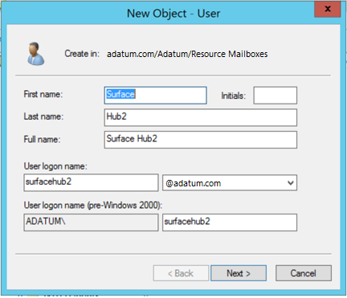
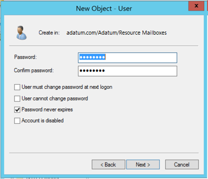
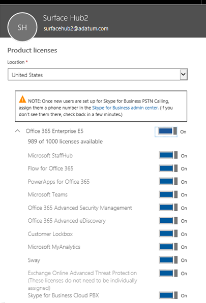
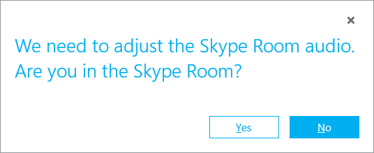
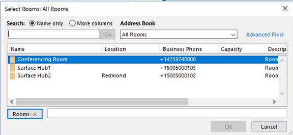

# Online or hybrid deployment using Skype Hybrid Voice environment  (Surface Hub)

This topic explains how to enable Skype for Business Cloud PBX with on-premises Public Switched Telephone Network (PSTN) connectivity via Cloud Connector Edition or Skype for Business 2015 pool. In this option. your Skype for Business home pools and Exchange servers are in the cloud, and are connected by PSTN via an on-premises pool running Skype for Business 2015 or Cloud Connector edition. [Learn more about different Cloud PBX options](https://technet.microsoft.com/library/mt612869.aspx).  

If you deployed Skype for Business Cloud PBX with one of the hybrid voice options, follow the steps below to enable the room account for Surface Hub. It is important to create a regular user account first, assign all hybrid voice options and phone numbers, and then convert the account to a room account. If you do not follow this order, you will not be able to assign a hybrid phone number.  

>[!WARNING]
>If you create an account before configuration of Hybrid voice (you run Enable-CSMeetingRoom command), you will not be able to configure required hybrid voice parameters. In order to configure hybrid voice parameters for a previously configured account or to reconfigure a phone number, delete the E5 or E3  + Cloud PBX add-on license, and then follow the steps below, starting at step 3.

1. Create a new user account for Surface Hub. This example uses <strong>surfacehub2@adatum.com</strong>. The account can be created in local Active Directory and synchronized to the cloud, or created directly in the cloud. 

    

2. Select **Password Never Expires**. This is important for a Surface Hub device.

   

3. In Office 365, add **E5** license or **E3 and Cloud PBX** add-on to the user account created for the room. This is required for Hybrid Voice to work.

   

4. Wait approximately 15 minutes until the user account for the room appears in Skype for Business Online.

5. After the user account for room is created in Skype for Business Online, enable it for Hybrid Voice in Skype for Business Remote PowerShell by running the following cmdlet:

   ```
   Set-csuser surfacehub2@adatum.com EnterpriseVoiceEnabled $true -HostedVoiceMail $true -onpremlineuri tel:+15005000102
   ```
    
6. Validate Hybrid Voice call flow by placing test calls from the Surface Hub.

7. Start a remote PowerShell session on a PC and connect to Exchange by running the following cmdlets.

   ```
   Set-ExecutionPolicy Unrestricted
   $cred=Get-Credential -Message "Please use your Office 365 admin credentials"
   $sess= New-PSSession -ConfigurationName Microsoft.Exchange -ConnectionUri https://outlook.office365.com/ps1-liveid/ -Credential $cred -Authentication Basic -AllowRedirection
   Import-PSSession $sess
   ```
    
8. After establishing a session, modify the user account for the room to enable it as a **RoomMailboxAccount** by running the following cmdlets. This allows the account to authenticate with Surface Hub.

   ```
   Set-Mailbox surfacehub2@adatum.com -Type Room
   Set-Mailbox surfacehub2@adatum.com -EnableRoomMailboxAccount $true -RoomMailboxPassword (ConvertTo-SecureString -String <password> -AsPlainText -Force)
   ```
    
9. After setting up the mailbox, you will need to either create a new Exchange ActiveSync policy, or use a compatible existing policy.

   Surface Hubs are only compatible with device accounts that have an ActiveSync policy where the **PasswordEnabled** property is set to **False**. If this isn’t set properly, then Exchange services on the Surface Hub (mail, calendar, and joining meetings), will not be enabled.
    
   If you haven’t created a compatible policy yet, use the following cmdlet (this one creates a policy called "Surface Hubs"). After it’s created, you can apply the same policy to other device accounts.

   ```
   $easPolicy = New-MobileDeviceMailboxPolicy -Name "SurfaceHubs" -PasswordEnabled $false
   ```
    
   After you have a compatible policy, then you will need to apply the policy to the device account. However, policies can only be applied to user accounts and not resource mailboxes. Run the following cmdlets to convert the mailbox into a user type, apply the policy, and then convert it back into a mailbox (you may need to re-enable the account and set the password again).
    
   ```
   Set-Mailbox surfacehub2@adatum.com -Type Regular
   Set-CASMailbox surfacehub2@adatum.com -ActiveSyncMailboxPolicy $easPolicy.id
   Set-Mailbox surfacehub2@adatum.com -Type Room
   $credNewAccount = Get-Credential -Message "Please provide the Surface Hub username and password"
   Set-Mailbox surfacehub2@adatum.com -RoomMailboxPassword $credNewAccount.Password -EnableRoomMailboxAccount $true
   ```
    
10.	Various Exchange properties must be set on the device account to improve the meeting experience. You can see which properties can be set in [Exchange properties](exchange-properties-for-surface-hub-device-accounts.md). The following cmdlets provide an example of setting Exchange properties.

    ```
    Set-CalendarProcessing surfacehub2@adatum.com -AutomateProcessing AutoAccept -AddOrganizerToSubject $false –AllowConflicts $false –DeleteComments $false -DeleteSubject $false -RemovePrivateProperty $false
    Set-CalendarProcessing surfacehub2@adatum.com -AddAdditionalResponse $true -AdditionalResponse "This is a Surface Hub room!"
    ```

11.	Enable the mailbox as a meeting device in Skype for Business Online. Run the following cmdlet which enables the account as a meeting device. 

    ```
    Get-CsTenant | select registrarpool
    Enable-CsMeetingRoom surfacehub2@adatum.com -RegistrarPool  'sippoolbl20a04.infra.lync.com' -SipAddressType UserPrincipalName
    ```
    
    As a result of running this cmdlet, users will be asked if they are in a meeting room, as shown in the following image. **Yes** will mute the microphone and speaker.

    


    
At this moment the room account is fully configured, including Hybrid Voice. If you use Skype on-premises, you can configure additional attributes, like description, location, etc., on-premises. If you create a room in Skype Online, these parameters can be set online. 

In the following image, you can see how the device appears to users.



