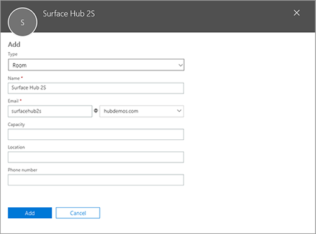
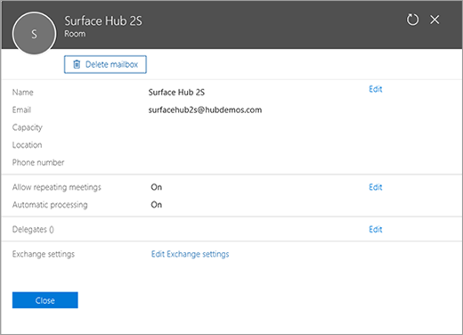
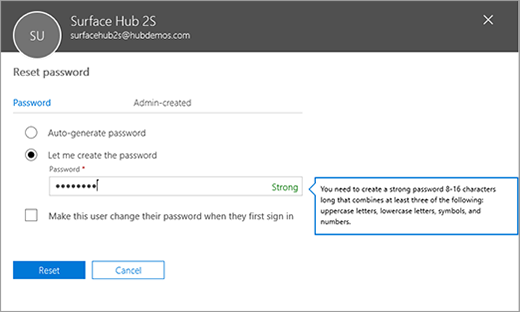
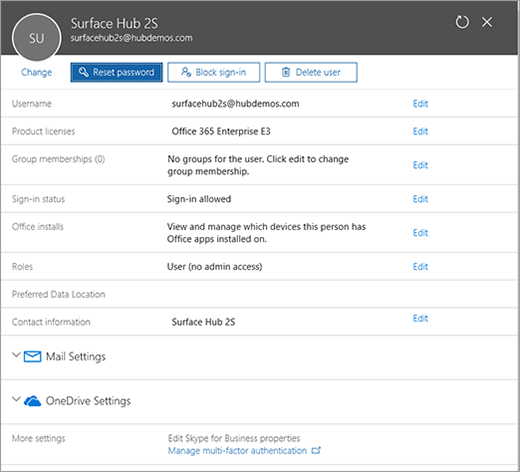

# Create Surface Hub 2S device account

Creating a Surface Hub device account (also known as a Room mailbox) allows Surface Hub 2S to receive, approve, or decline meeting requests and join meetings using Microsoft Teams or Skype for Business. Configure the device account during OOBE setup. If needed you can change it later (without going through OOBE setup).

Unlike standard Room mailboxes that remain disabled by default, you need to enable the Surface Hub 2S device account to sign on to Microsoft Teams and Skype for Business. Surface Hub 2S relies on Exchange ActiveSync, which requires an ActiveSync mailbox policy on the device account. Apply the default ActiveSync mailbox policy that comes with Exchange Online.

Create the account using the Microsoft 365 admin center or by using PowerShell. You can use Exchange Online PowerShell to configure specific features including: 

- Calendar processing for every Surface Hub device account.
- Custom auto replies to scheduling requests.
- If the default ActiveSync mailbox policy has already been modified by someone else or another process, you will likely have to create and assign a new ActiveSync mailbox policy 

## Create account using Microsoft 365 admin center

1. In the Microsoft 365 admin center, go to **Resources** and choose **Rooms & Equipment** and then select **+ Room**.

2. Provide a name and email address for the device account. Leave remaining settings unchanged in the default state.





3. Set the password for the device account. Ensure that you **do not** select the option **Make this user change their password when they first sign in.**



4. Assign the room with an Office 365 license. It’s recommended to assign the Office 365 **Meeting Room** license, a new option that automatically enables the account for Skype for Business Online and Microsoft Teams.



### Finalize setup via PowerShell

- **Skype for Business:** For Skype for Business only (on-premises or online), you can enable the Skype for Business object by running **Enable-CsMeetingRoom** to enable features such as Meeting room prompt for audio and Lobby hold.

- **Calendar:** Set **Calendar Auto processing** for this account.

## Create account using PowerShell
Instead of using the Microsoft Admin Center portal, you can create the account using PowerShell.

### Connect to Exchange Online PowerShell

```
$365Session = New-PSSession -ConfigurationName Microsoft.Exchange -ConnectionUri https://ps.outlook.com/powershell -Credential (Get-Credential) -Authentication Basic –AllowRedirection $ImportResults = Import-PSSession $365Session
```

### Create a new Room Mailbox

```
New-Mailbox -MicrosoftOnlineServicesID account@YourDomain.com -Alias SurfaceHub2S -Name SurfaceHub2S -Room -EnableRoomMailboxAccount $true -RoomMailboxPassword (ConvertTo-SecureString  -String "<Enter Strong Password>" -AsPlainText -Force)
```

### Set Calendar Auto processing

```
Set-CalendarProcessing -Identity "account@YourDomain.com" -AutomateProcessing AutoAccept -AddOrganizerToSubject $false –AllowConflicts   $false –DeleteComments $false -DeleteSubject $false -RemovePrivateProperty $false -AddAdditionalResponse $true -AdditionalResponse "This room is equipped with a Surface Hub"
```

### Assign a license

```
Connect-MsolService
Set-Msoluser -UserPrincipalName account@YourDomain.com -UsageLocation IE
Set-MsolUserLicense -UserPrincipalName "account@YourDomain.com" -AddLicenses "contoso:MEETING_ROOM"
```

## Connect to Skype for Business Online using PowerShell

### Install prerequisites

- [Visual C++ 2017 Redistributable](https://aka.ms/vs/15/release/vc_redist.x64.exe)
- [Skype for Business Online PowerShell Module](https://www.microsoft.com/en-us/download/confirmation.aspx?id=39366)

```
Import-Module LyncOnlineConnector
$SfBSession = New-CsOnlineSession -Credential (Get-Credential)
Import-PSSession $SfBSession -AllowClobber
Enable the Skype for Business meeting room
Enable-CsMeetingRoom -Identity account@YourDomain.com -RegistrarPoo(Get-CsTenant).Registrarpool -SipAddressType EmailAddress
```
