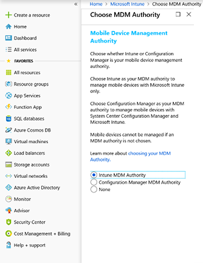
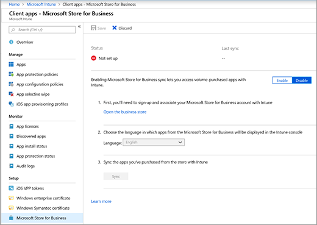
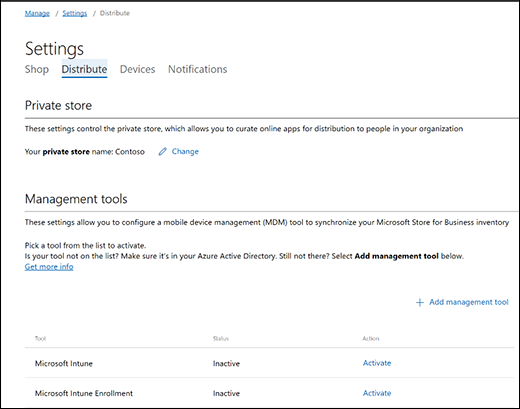

# Deploy apps to Surface Hub 2S using Intune

You can deploy Universal Windows Platform (UWP) apps to Surface Hub 2S using Intune, easing app deployment to devices.

1. To deploy apps, enable MDM for your organization. In the Intune portal, select **Intune** as your MDM Authority (recommended).

 

2. Enable the Microsoft Store for Business in Intune.

 

3. Open the store from the Intune portal and click **Settings** > **Distribute** > **Management tools**. Choose **Microsoft Intune** as your management tool.

 

4. In **Settings** > **Shop** > **Shopping Experience**, turn on **Show offline apps**.

Offline apps refer to apps that can be synced to Intune and centrally deployed to a device.

5. After enabling Offline shopping, acquire offline licenses for apps, which you can sync to Intune and deploy as Device licensing.
