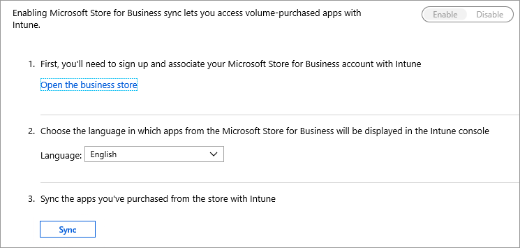
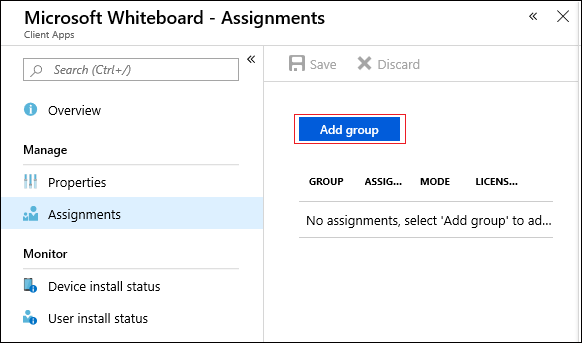

# Deploy apps to Surface Hub 2S using Intune

# Install
You can install additional apps to fit your team or organization's needs.

## Developer guidelines
- Surface Hub only runs [Universal Windows Platform (UWP) apps](https://msdn.microsoft.com/windows/uwp/get-started/whats-a-uwp). Apps created using the [Desktop App Converter](https://docs.microsoft.com/windows/uwp/porting/desktop-to-uwp-run-desktop-app-converter) will not run on Surface Hub. See a [list of apps that work with Surface Hub](https://support.microsoft.com/help/4040382/surface-Apps-that-work-with-Microsoft-Surface-Hub).
- Apps must be targeted for the [Universal device family](https://msdn.microsoft.com/library/windows/apps/dn894631) or Windows Team device family.
- Surface Hub only supports [offline-licensed apps](https://docs.microsoft.com/microsoft-store/distribute-offline-apps) from Microsoft Store for Business.
- By default, apps must be Store-signed to be installed. During testing and development, you can also choose to run developer-signed UWP apps by placing the device in developer mode.
- When developing and submitting apps to the Microsoft Store, set Device family availability and Organizational licensing options to ensure apps will be available to run on Surface Hub.
- You need admin credentials to install apps on Surface Hub. Designed to be used in meeting rooms and other shared spaces, Surface Hub prevents regular users from accessing the Microsoft Store to download and install apps.

## Deployment guidelines
You can deploy Universal Windows Platform (UWP) apps to Surface Hub 2S using Intune, easing app deployment to devices.

1. To deploy apps, enable MDM for your organization. In the Intune portal, select **Intune** as your MDM Authority (recommended).

    

2. Enable the Microsoft Store for Business in Intune. Open Intune, click **Client apps** > **Microsoft Store for Business.**

    

3. In Intune open **Microsoft Store for Business** and click **Settings** > **Distribute** > **Management tools**. Choose **Microsoft Intune** as your management tool.

    

4. In Microsoft Store for Business, click **Settings** > **Shop** > **Shopping Experience**, and then click **Show offline apps**. Offline apps refer to apps that can be synced to Intune and centrally deployed to a device.
5. After enabling Offline shopping, you can acquire offline licenses for apps that you can sync to Intune and deploy as Device licensing.
6. In Intune > Client apps > Microsoft Store for Business, click Sync.
7. In the Client apps page, search for the app in the apps list. Assign the apps to the desired device group or groups. Click **Assignments** > **Add group**.   
8. Under assignment type, choose **Required**. For the selected group(s), choose **Device licensing** and then  Click **OK** and save the assignment.