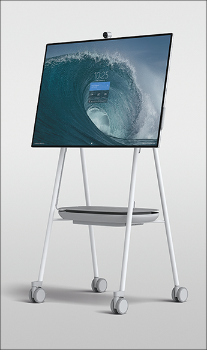

# Install and mount Surface Hub 2S

Surface Hub 2S is designed for ease of mobility with a form factor that enables you to quickly install and begin using the device. Microsoft has partnered with Steelcase on the following certified mounting solutions: Roam Mobile Stand and Roam Wall Mount. Both fully integrate with the design of Surface Hub 2S, enabling unimpeded access to the compute cartridge, power, USB-A, USB-C, and other ports.

You can mount Surface Hub 2S with the certified wall mount or the certified mobile stand, both developed in partnership with Steelcase. Both fully integrate with the design of Surface Hub 2S, enabling unimpeded access to the compute cartridge along with all I/O ports and power. 

For more information, see [Officially licensed third-party accessories](http://licensedhardware.azurewebsites.net/surface) and view installation demos from the Surface product team:

- [Unboxing and set up](https://youtu.be/fCrxdNXvru4)
- [Steelcase mobile stand and APC battery set up](https://youtu.be/VTzdu4Skpkg)

  

If you’re not using licensed accessories, see [Customizing installation of Surface Hub 2S](surface-hub-2s-connect.md).
