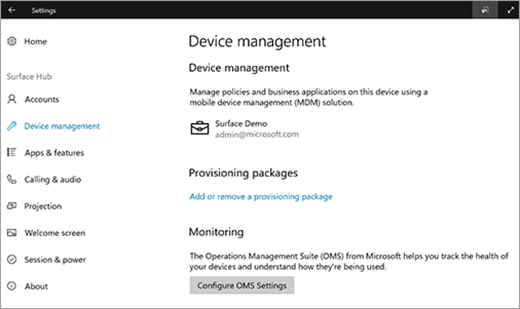
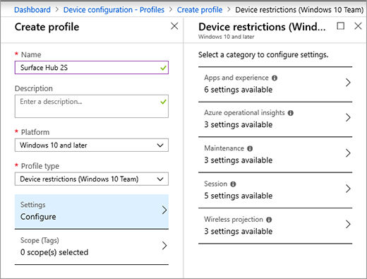

# Manage Surface Hub 2S with Intune

## Register Surface Hub 2S with Intune

Surface Hub 2S allows IT administrators to manage settings and policies using a mobile device management (MDM) provider. Surface Hub 2S has a built-in management component to communicate with the management server, so there is no need to install additional clients on the device.

### Manual registration

1. Sign in as a local administrator on Surface Hub 2S and open the **Settings** app. Select **Surface Hub** > **Device management** and then select **+** to add.
2. After authenticating, the device will automatically register with Intune.

  

### Auto registration — Azure Active Directory Affiliated

When affiliating Surface Hub 2S with a tenant that has Intune auto enrollment enabled, the device will automatically enroll with Intune.

## Windows 10 Team Edition settings

Select Windows 10 Team for preset device restriction settings for Surface Hub and Surface Hub 2S.

   

These settings include user experience and app behavior, Azure Log Analytics registration, Maintenance windows configuration, Session settings, and Miracast settings.

## Additional supported configuration service providers

For a list of all available configuration service providers (CSPs), see [SurfaceHub CSP](https://docs.microsoft.com/en-us/windows/client-management/mdm/surfacehub-csp).

## Quality of Service (QoS) settings

To ensure optimal video and audio quality on Surface Hub 2S, add the following QoS settings to the device. The settings are identical for Skype for Business and Teams.

|**Name**|**Description**|**OMA-URI**|**Type**|**Value**|
|:------ |:------------- |:--------- |:------ |:------- |
|**Audio Ports**| Audio Port range | ./Device/Vendor/MSFT/NetworkQoSPolicy/HubAudio/SourcePortMatchCondition | String  | 50000–50019 |
|**Audio DSCP**| Audio ports marking | ./Device/Vendor/MSFT/NetworkQoSPolicy/HubAudio/DSCPAction | Integer | 46 |
|**Video Ports**| Video Port range | ./Device/Vendor/MSFT/NetworkQoSPolicy/HubVideo/SourcePortMatchCondition | String  | 50020–50039 |
|**Video DSCP**| Video ports marking | ./Device/Vendor/MSFT/NetworkQoSPolicy/HubVideo/DSCPAction | Integer | 34 |

> [!NOTE]
> These are the default port ranges. Administrators may change the port ranges in the Skype for Business and Teams control panel.

## Microsoft Teams Mode settings

You can set the Microsoft Teams app mode using Intune. Surface Hub 2S comes installed with Microsoft Teams in mode 0, which supports both Microsoft Teams and Skype for Business. You can adjust the modes as shown below.

### Modes:

- Mode 0 — Skype for Business with Microsoft Teams functionality for scheduled meetings.
- Mode 1 — Microsoft Teams with Skype for Business functionality for scheduled meetings.
- Mode 2 — Microsoft Teams only.

To set modes, add the following settings to a custom Device Configuration Profile.

|**Name**|**Description**|**OMA-URI**|**Type**|**Value**|
|:------ |:------------- |:--------- |:------ |:------- |
|**Teams App ID**| App name | ./Vendor/MSFT/SurfaceHub/Properties/VtcAppPackageId | String  | Microsoft.MicrosoftTeamsforSurfaceHub_8wekyb3d8bbwe!Teams­­ |
|**Teams App Mode**| Teams mode | ./Vendor/MSFT/SurfaceHub/Properties/SurfaceHubMeetingMode | Integer | 0 or 1 or 2 |
