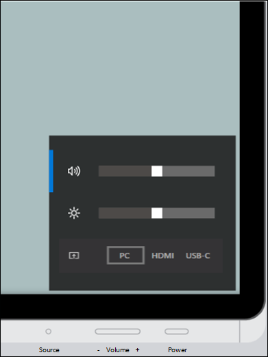

# Adjust Surface Hub 2S brightness, volume, and input
Surface Hub 2S provides an on-screen display for volume, brightness, and input control. The Source button functions as a toggle key to switch between the volume, brightness, and input control menus.

**To show the on-screen display:**

- Press and hold the **Source** button for 4 seconds.

   

 When the on-screen display is visible, use one or more buttons to reach desired settings.
 
**To adjust volume:**

- Use the **Volume up/down** button to increase or decrease volume.

**To adjust brightness:**

1. Press the **Source** button again to switch to the brightness menu.
2. Use the **Volume up/down** button to increase or decrease brightness.

**To adjust input:**

1. Press the **Source** button twice to switch to the Source menu.
2. Use the **Volume up/down** button to switch between PC, HDMI, and USB-C inputs.
