# How to pack and ship your Surface Hub 2S for service

If you replace your Surface Hub 2S, one of its components, or a related accessory, use the instructions in this article when you pack the device for shipment. 

>[!IMPORTANT]  
>When packing your device for shipment, make sure that you use the packaging in which your replacement device arrived.  

## How to pack your Surface Hub 2S 50”

Use the following steps to pack your Surface Hub 2S 50" for shipment.

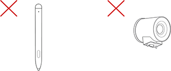

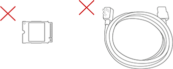

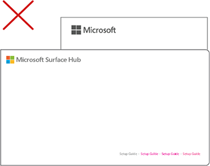

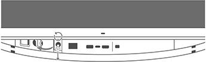

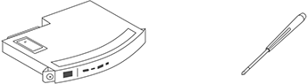

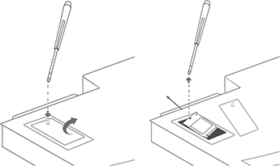

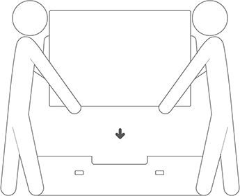

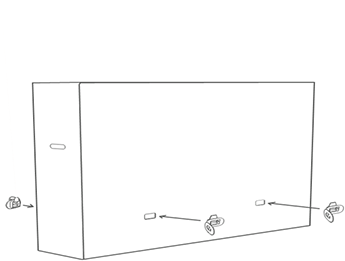

## How to replace and pack your Surface Hub 2S Compute Cartridge

Use the following steps to remove the Surface Hub 2S Compute Cartridge, pack it for shipment, and install the new Compute Cartridge.

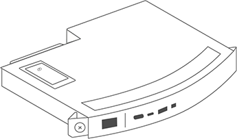

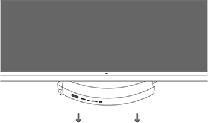

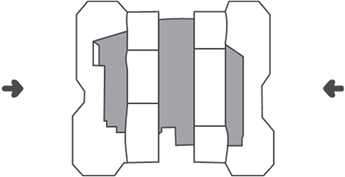

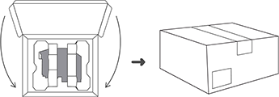

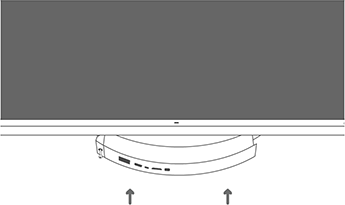

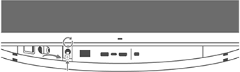

## How to replace your Surface Hub 2S Camera

Use the following steps to remove the Surface Hub 2S camera and install the new camera.

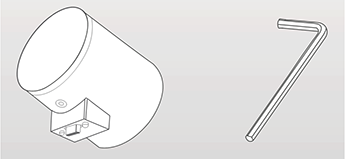

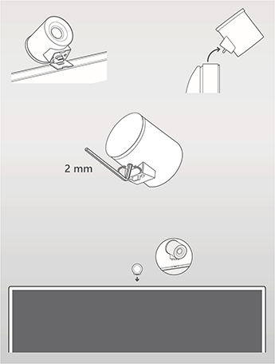
