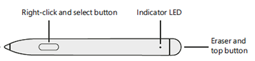

# Update pen firmware on Surface Hub 2S

You can update firmware on Surface Hub 2 pen from Windows Update for Business or by downloading the firmware update to a separate PC. Updated firmware is available from Windows Update beginning February 26, 2020. 

## Update pen firmware using Windows Update for Business

This section describes how to update pen firmware via the automated maintenance cycles for Windows Update, configured by default to occur nightly at 3 a.m. You will need to plan for two maintenance cycles to complete before applying the update to the Surface Hub 2 pen. Alternately, like any other update, you can use Windows Server Update Services (WSUS) to apply the pen firmware. For more information, see [Managing Windows updates on Surface Hub](manage-windows-updates-for-surface-hub.md).

1. Ensure the Surface Hub 2 pen is paired to Surface Hub 2S: Press and hold the **top** button until the white indicator LED light begins to blink.  
  
2. On Surface Hub, login as an Admin, open **Settings**, and then scan for new Bluetooth devices.
3. Select the pen to complete the pairing process.
4. Press the **top** button on the pen to apply the update. It may take up to two hours to complete.

## Update pen firmware by downloading to separate PC

You can update the firmware on Surface Hub 2 pen from a separate PC running Windows 10. This method also enables you to verify that the pen firmware has successfully updated to the latest version.

1. Pair the Surface Hub 2 pen to your Bluetooth-capable PC: Press and hold the **top** button until the white indicator LED light begins to blink.  
  
2. On the PC, scan for new Bluetooth devices.
3. Select the pen to complete the pairing process.
4. Disconnect all other Surface Hub 2s pens before starting a new update.
3. Download the [Surface Hub 2 Pen Firmware Update Tool](https://download.microsoft.com/download/8/3/F/83FD5089-D14E-42E3-AF7C-6FC36F80D347/Pen_Firmware_Tool.zip) to your PC.
4. Run **PenCfu.exe.** The install progress is displayed in the tool. It may take several minutes to finish updating. 

## Check firmware version of Surface Hub 2 pen

1. Run **get_version.bat** and press the **top** button on the pen.
2. The tool will report the firmware version of the pen. Example:
    - Old firmware is 468.2727.368
    - New firmware is 468.2863.369

## Command line options

You can run Surface Hub 2 Pen Firmware Update Tool (PenCfu.exe) from the command line.

1. Pair the pen to your PC and click the **top** button on the pen.
2. Double click **PenCfu.exe** to initiate the firmware update. Note that the configuration file and the firmware image files must be stored in the same folder as the tool.
3. For additional options, run **PenCfu.exe -h** to display the available parameters, as listed in the following table.  
    - Example: PenCfu.exe -h
4. Enter **Ctrl+C** to safely shut down the tool.

 

| **Command**    | **Description**                                                                                                                                                                                                                                                                                                                                                                                |
| -------------- | ---------------------------------------------------------------------------------------------------------------------------------------------------------------------------------------------------------------------------------------------------------------------------------------------------------------------------------------------------------------------------------------------- |
| -h help        | Display tool command line interface help and exit.                                                                                                                                                                                                                                                                                                                                             |
| -v version     | Display tool version and exit.                                                                                                                                                                                                                                                                                                                                                                 |
| -l log-filter  | Set a filter level for the log file. Log messages have 4 possible levels: DEBUG (lowest), INFO, WARNING and ERROR (highest). Setting a log filter level filters log messages to only message with the same level or higher. For example, if the filter level is set to WARNING, only WARNING and ERROR messages will be logged. By default, this option is set to OFF, which disables logging. |
| -g get-version | If specified, the tool will only get the FW version of the connected pen that matches the configuration file that is stored in the same folder as the tool.                                                                                                                                                                                                                                    