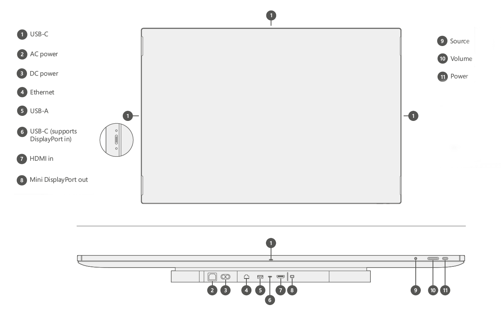
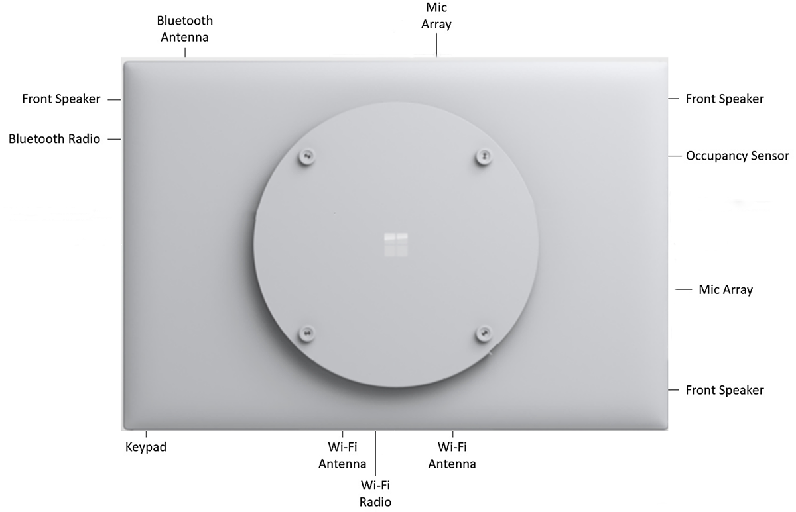

# Surface Hub 2S ports and keypad overview

This page describes the ports, physical buttons, and configuration information essential for connecting to Surface Hub 2S whether via wired, Wi-Fi, or Bluetooth methods. It also includes best practice recommendations for key connectivity scenarios.

> [!NOTE]
> You can find the serial number on the outside of the packaging, on the display by the power cord, or by using the Surface app. 

The figure below shows the location of ports and physical buttons on a keypad attached to the underside of the device. The table includes detailed descriptions of each element.

 

## Port and keypad component reference

|**Key**|**Component**|**Description**|**Key parameters**|
|:--- |:--------- |:----------- |:-------------- |
| 1 | **USB C** | **USB 3.1 Gen 1**   Use as a walk-up port for plugging in peripherals such as thumb-drives. Guest ports are on each side of the device (4).    *NOTE: This is the recommended port for connecting an external camera. Additional camera mount features are incorporated into the design to help support retention of attached cameras.*    NOTE: TouchBack and video ingest are not supported on these ports. | Type C     15 W Port (5V/3A)       |
| 2 | **AC power** | **100-240 V input**   Connect to standard AC power and Surface Hub 2S will auto switch to the local power standard such as110 volts in the US and Canada or 220 volts in the UK. | IEC 60320 C14 |
| 3 | **DC power** | **24V DC input port**   Use for connecting to mobile battery. | Xbox1 Dual barrel to Anderson connector |
| 4 | **Ethernet** | **1000/100/10 Base-T**   Use for providing a continuous connection in a corporate environment and related scenarios requiring maximum stability or capacity. | RJ45 |
| 5 | **USB-A** | **USB 3.1 Gen 1**   Use as a walk-up port for plugging in peripherals such as thumb-drives. | Type A 7.5 W Port (5V/1.5A) |
| 6 | **USB-C** | **USB 3.1 Gen 1**   Use as a walk-up port for connecting external PCs and related devices or plugging in peripherals such as thumb-drives.    *NOTE: This is the recommended  input port for video, TouchBack, and InkBack.* | Type C   18 W Port (5V/3A, 9V/2A) |
| 7 | **HDMI-in** | **HDMI 2.0, HDCP 2.2 /1.4**   Use for multiple scenarios including HDMI-to-HDMI guest input. | Standard HDMI |
| 8 | **Mini DP-out** | **Mini DP 1.2 output**   Use for video-out scenarios such as mirroring the Surface Hub 2S display to a larger projector.    *NOTE: This supports a maximum resolution of 3840 x 2160 (4K UHD) @60Hz.* | Mini DP |
| 9 | **Source**  | Use to toggle among connected ingest sources — external PC, HDMI, and Mini DP modes. | n/a |
| 10 | **Volume** | Use +/- to adjust audio locally on the device.     *NOTE: When navigating to the brightness control, use +/- on the volume slider to control display brightness.* | n/a |
| 11 | **Power** | Power device on/off.   Use also to navigate display menus and select items. | n/a |

 
