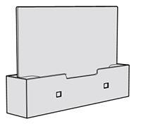
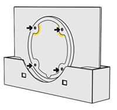
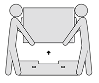
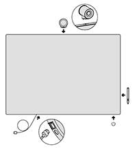

# Surface Hub 2S quick start 

## Unpack Surface Hub 2S

1. Use the handles on each side of the box to move it to the space where you'll set it up.
2. Before opening, remove the clips (4) located on the front and back, and then lift the top off the box using the handles.
3. In the base of the Surface Hub 2S, open the accessories box containing the setup guide, Surface Hub 2 pen, Surface Hub 2 camera and the power cable.
4. On the back of the Surface Hub there's an instructional label showing you where to attach the mounting hardware. Install them in place and remove the label.

| 1. **Set up your mount first** | |
| -------------------------------------------------------------------------------------------------------------- | ------------------------------------------------------------------------------------ |
| Leave your Surface Hub in the box until the mount is set up and mounting hardware is applied. Mount is not included. Your mount is sold separately.         |                         |
| 2. **Attach hardware to the Surface Hub**                                                                                                                   |                                                                                      |
| Mounting hardware and specific instructions are found in the box for your mount.                                                                            |                |
| 3. **Remove the instructional label before mounting.**                                                                                                      |                                                                                      |
| Get someone to help you lift and mount your Surface Hub. Make sure to hold and lift the Surface Hub from the bottom.                                        |    |
| 4. **Attach accessories and power on**                                                                                                                      |                                                                                      |
| Install accessories and attach power cable as shown. See guides on the screen cling. Remove cling wrap from the screen. Press the power button to power on. |                   |

 

## Install pen and camera
1. Attach Surface Hub 2 pen magnetically to your preferred side of the device.
2. Remove the lens cling from the camera and attach it to the USB-C port on the top of the Surface Hub 2S.

**Start Surface Hub 2S**

1. Insert the power cable into the back of the device and plug it into a power outlet. Run the cable through any cable guides on your mounting solution and remove the screen clang. 
2. To begin, press the power button on the bottom right. To learn more about running the out of the box (OOBE) setup of Surface Hub 2S, see [Out-of-box startup for Surface Hub 2S](surface-hub-2s-startup.md).

 

