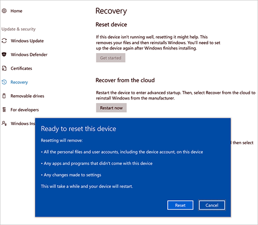

# Reset and recovery for Surface Hub 2S

If you encounter problems with Surface Hub 2S, you can reset the device to factory settings, recover from the cloud, or recover using a USB drive.

To begin, sign into Surface Hub 2S with admin credentials, open the **Settings** app, select **Update & security**, and then select **Recovery**.

## Reset device

1. To reset, select **Get Started**.
2. When the **Ready to reset this device** window appears, select **Reset**. Surface Hub 2S reinstalls the operating system from the recovery partition and may take up to one hour to complete.
3. Run **the first time Setup program** to reconfigure the device.
4. If you manage the device using Intune or other mobile device manager (MDM) solution, retire and delete the previous record and re-enroll the new device. For more information, see [Remove devices by using wipe, retire, or manually unenrolling the device](https://docs.microsoft.com/en-us/intune/devices-wipe).

 
*Figure 1. Reset and recovery for Surface Hub 2S.* 

## Recover from the cloud

1. To recover, select **Restart now**.
2. In advanced startup mode, select the option to recover the device from the cloud. Surface Hub 2S downloads the latest available customer image from the cloud and reinstalls the operating system.
3. Remain connected to the network during the recovery process.
4. Run **the first time Setup program** to reconfigure the device.
5. If you manage the device using Intune or other mobile device manager (MDM) solution, retire and delete the previous record and re-enroll the new device. For more information, see [Remove devices by using wipe, retire, or manually unenrolling the device](https://docs.microsoft.com/en-us/intune/devices-wipe).

## Recover Surface Hub 2S using USB recovery drive

New in Surface Hub 2S, you can now reinstall the device using a recovery image.

### Recover from USB drive

Surface Hub 2S lets you reinstall the device using a recovery image, which allows you to reinstall the device to factory settings if you lost the Bitlocker key or no longer have admin credentials to the Settings app.

1. Begin with a USB 3.0 drive with 8 GB or 16 GB of storage, formatted as FAT32.
2. Download recovery image from the Surface Recovery website onto the USB drive and connect it to any USB-C or USB A port on Surface Hub 2S.
3. Turn off the device, hold the Volume down button, and then press the Power. Keep holding the Volume down button until you see circling dots below the Windows logo.

  

4. In the language selection screen, select the display language for your Surface Hub 2S.
5. Choose **Recover from a drive** and **Fully clean the drive** and then select **Recover**. If prompted for a BitLocker key, select **Skip this drive**. Surface Hub 2S reboots several times and takes approximately 30 minutes to complete the recovery process.
Remove the USB drive when the first time setup screen appears.
