# First time Setup for Surface Hub 2S

When you first start Surface Hub 2S, the device automatically enters first time Setup mode to guide you through account configuration and related settings.

## Configuring Surface Hub 2S account

1. **Configure your locale.** Enter region, language, keyboard layout and time zone information. Select **Next**.

   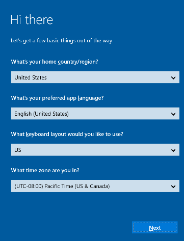  
1. **Connect  to a wireless network.** Choose your preferred wireless network and select **Next.**

- This option is not shown if connected using an Ethernet cable.
- You cannot connect to a wireless network in hotspots (captive portals) that redirect sign-in requests to a provider’s website.

3. **Enter device account info.** Use **domain\user** for on-premises and hybrid environments and **user@example.com** for online environments. Select **Next.**

   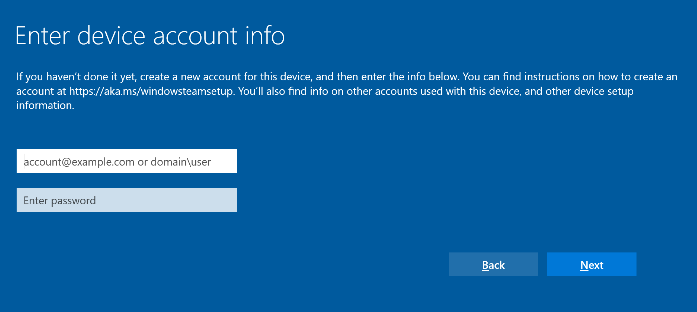  
1. **Enter additional info.** If requested, provide your Exchange server address and then select **Next.**

    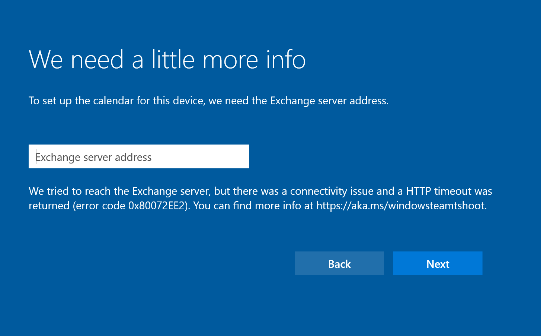  

1. **Name this device.** Enter a name for your device or use the suggested one based on your account’s display name and user principle name [UPN]. **Select Next**.

- The **Friendly name** is visible on the bottom left corner of Surface Hub 2S and is shown when projecting to the device.

- The **Device name** identifies the device when affiliated with Active Directory or Azure Active Directory, and when enrolling the device with Intune.

  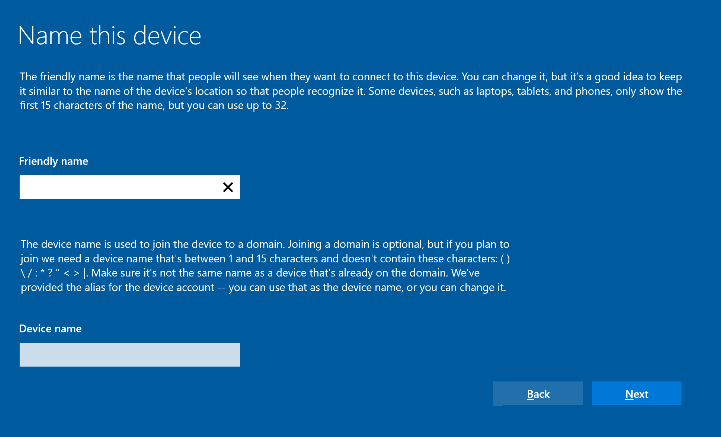  
 
## Configuring device admin accounts

You can only set up device admins during first time Setup. For more information, refer to [Surface Hub 2S device affiliation](https://docs.microsoft.com/surface-hub/surface-hub-2s-prepare-environment#device-affiliation).

 In the **Setup admins for this device** window, select one of the following options: Active Directory Domain Services, Azure Active Directory, or Local admin.

   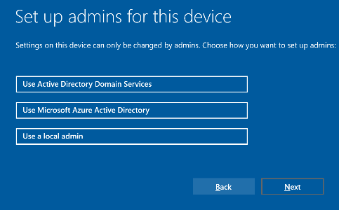  

### Active Directory Domain Services

1. Enter the credentials of a user who has permissions to join the device to Active Directory.

    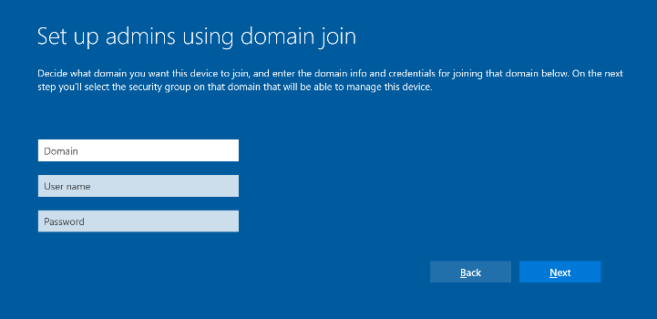  

2. Select the Active Directory Security Group containing members allowed to log on to the Settings app on Surface Hub 2S.

    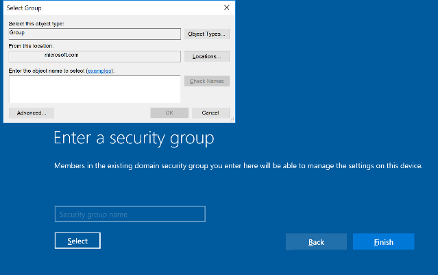  
1. Select **Finish**. The device will restart.

### Azure Active Directory

When choosing to affiliate your device with Azure Active Directory, the device will immediately restart and display the following page. Select **Next**.

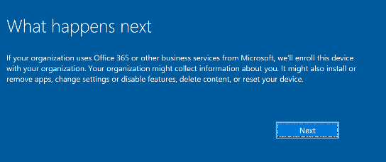  

1. Enter the email address or UPN of an account **with Intune Plan 1** or greater and then select **Next.**

    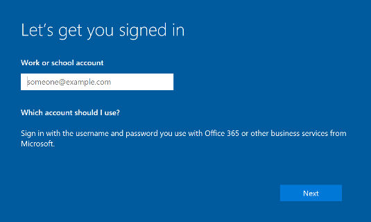  

2. If redirected, authenticate using your organization’s sign-in page and provide additional logon information if requested. The device will restart.

## Local Administrator account

- Enter a username and password for your local admin. The device will restart.

     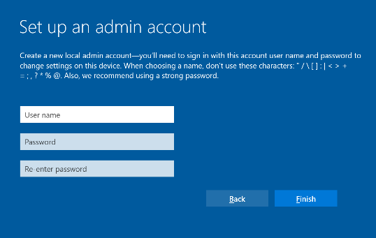  
 
## Using provisioning packages

If you insert a USB thumb drive with a provisioning package into one of the USB ports when you start Surface Hub 2S, the device displays the following page.

1. Enter the requested settings and select **Set up**.

    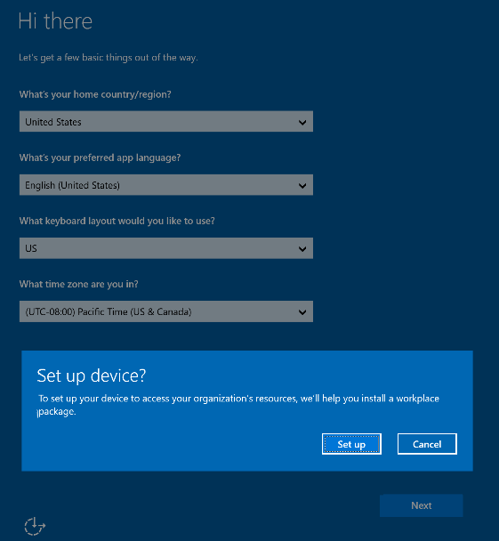  

    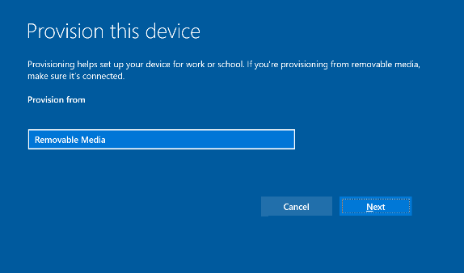  
2. Choose the provisioning package you’d like to use.

   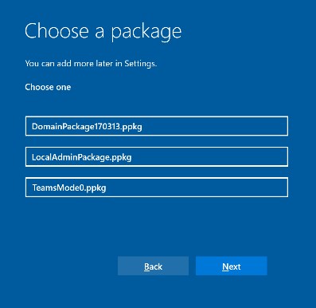  

3. If you created a multiple devices CSV file, you will be able to choose a device configuration. For more information, refer to [Create provisioning packages for Surface Hub 2S](https://docs.microsoft.com/surface-hub/surface-hub-2s-deploy#provisioning-multiple-devices-csv-file).

    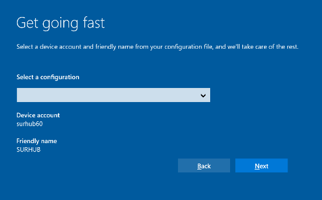  

4. Follow the instructions to complete first time Setup.
