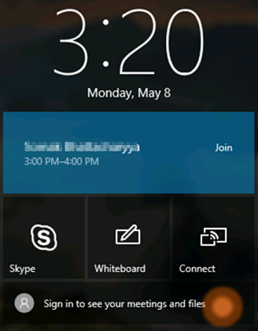
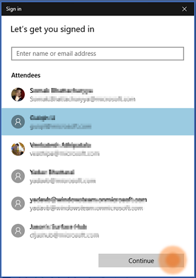
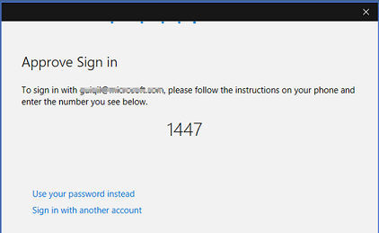
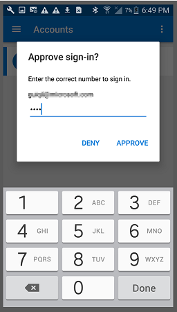

# Sign in to Surface Hub with Microsoft Authenticator

People in your organization can sign in to a Surface Hub  without a password using the Microsoft Authenticator app, available on Android and iOS.

## Organization prerequisites

To let people in your organization sign in to Surface Hub with their phones and other devices instead of a password, you’ll need to make sure that your organization meets these prerequisites: 

- Your organization must be a hybrid or cloud-only organization, backed by Azure Active Directory (Azure AD). For more information, see [What is Azure Active Directory?](https://docs.microsoft.com/azure/active-directory/active-directory-whatis)

- Make sure you have at minimum an Office 365 E3 subscription. 

- [Configure Multi-Factor Authentication](https://docs.microsoft.com/azure/active-directory/authentication/howto-mfa-mfasettings). Make sure **Notification through mobile app** is selected. 

    

- Enable content hosting on Azure AD services such as Office, SharePoint, etc. 

- Surface Hub must be running Windows 10, version 1703 or later.

- Surface Hub is set up with either a local or domain-joined account.

Currently, you cannot use Microsoft Authenticator to sign in to Surface Hubs that are joined to Azure AD.

## Individual prerequisites

- An Android phone running 6.0 or later, or an iPhone or iPad running iOS9 or later 

- The most recent version of the Microsoft Authenticator app from the appropriate app store

    >[!NOTE]
    >On iOS, the app version must be 5.4.0 or higher.
    >
    >The Microsoft Authenticator app on phones running a Windows operating system can't be used to sign in to Surface Hub.

- Passcode or screen lock on your device is enabled

- A standard SMTP email address (example: joe@contoso.com). Non-standard or vanity SMTP email addresses (example: firstname.lastname@contoso.com) currently don’t work.

## How to set up the Microsoft Authenticator app

>[!NOTE]
>If Company Portal is installed on your Android device, uninstall it before you set up Microsoft Authenticator. After you set up the app, you can reinstall Company Portal.
>
>If you have already set up Microsoft Authenticator on your phone and registered your device, go to the [sign-in instructions](#signin).

1. Add your work or school account to Microsoft Authenticator for Multi-Factor Authentication. You will need a QR code provided by your IT department. For help, see [Get started with the Microsoft Authenticator app](https://docs.microsoft.com/azure/multi-factor-authentication/end-user/microsoft-authenticator-app-how-to).
2. Go to **Settings** and register your device.
3. Return to the accounts page and choose **Enable phone sign-in** from the account dropdown menu.

## How to sign in to Surface Hub during a meeting

1. After you’ve set up a meeting, go to the Surface Hub and select **Sign in to see your meetings and files**.

    >[!NOTE]
    >If you’re not sure how to schedule a meeting on a Surface Hub, see [Schedule a meeting on Surface Hub](https://support.microsoft.com/help/17325/surfacehub-schedulemeeting).

    

2. You’ll see a list of the people invited to the meeting. Select yourself (or the person who wants to sign in – make sure this person has gone through the steps to set up their device before your meeting), and then select **Continue**.

    

    You'll see a code on the Surface Hub.

    

3. To approve the sign-in, open the Authenticator app, enter the four-digit code that’s displayed on the Surface Hub, and select **Approve**. You will then be asked to enter the PIN or use your fingerprint to complete the sign in. 

    

You can now access all files through the OneDrive app.