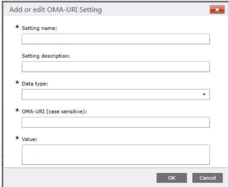

# Implement Quality of Service (QoS) on Surface Hub

Quality of Service (QoS) is a combination of network technologies that allows the administrators to optimize the experience of real time audio/video and application sharing communications.
 
Configuring [QoS for Skype for Business](https://docs.microsoft.com/windows/client-management/mdm/networkqospolicy-csp) on the Surface Hub can be done using your [mobile device management (MDM) provider](manage-settings-with-mdm-for-surface-hub.md) or through a [provisioning package](provisioning-packages-for-surface-hub.md). 
 
 
This procedure explains how to configure QoS for Surface Hub using Microsoft Intune. 

1. In Intune, [create a custom policy](https://docs.microsoft.com/intune/custom-settings-configure).

    

2. In **Custom OMA-URI Settings**, select **Add**. For each setting that you add, you will enter a name, description (optional), data type, OMA-URI, and value.

    

3. Add the following custom OMA-URI settings:

    Name | Data type | OMA-URI ./Device/Vendor/MSFT/NetworkQoSPolicy |  Value
    --- | --- | --- | ---
    Audio Source Port | String |  /HubAudio/SourcePortMatchCondition  |   Get the values from your Skype administrator
    Audio DSCP | Integer |  /HubAudio/DSCPAction  |   46
    Video Source Port | String |  /HubVideo/SourcePortMatchCondition   |  Get the values from your Skype administrator
    Video DSCP | Integer |  /HubVideo/DSCPAction   |   34
    Audio Process Name | String |  /HubAudio/AppPathNameMatchCondition  |   Microsoft.PPISkype.Windows.exe
    Video Process Name | String |  /HubVideo/AppPathNameMatchCondition  |   Microsoft.PPISkype.Windows.exe

    >[!IMPORTANT]
    >Each **OMA-URI** path begins with `./Device/Vendor/MSFT/NetworkQoSPolicy`. The full path for the audio source port setting, for example, will be `./Device/Vendor/MSFT/NetworkQoSPolicy/HubAudio/SourcePortMatchCondition`.

4. When the policy has been created, [deploy it to the Surface Hub.](manage-settings-with-mdm-for-surface-hub.md#manage-surface-hub-settings-with-mdm)

>[!WARNING]
>Currently, you cannot configure the setting **IPProtocolMatchCondition** in the [NetworkQoSPolicy CSP](https://docs.microsoft.com/windows/client-management/mdm/networkqospolicy-csp). If this setting is configured, the policy will fail to apply.
 
