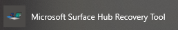
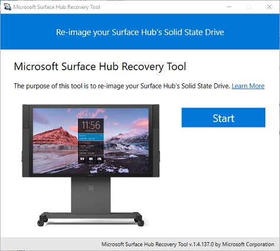
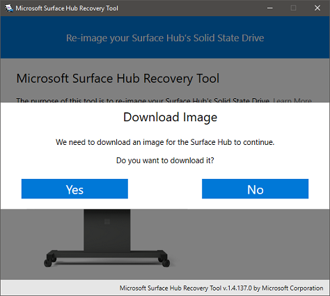
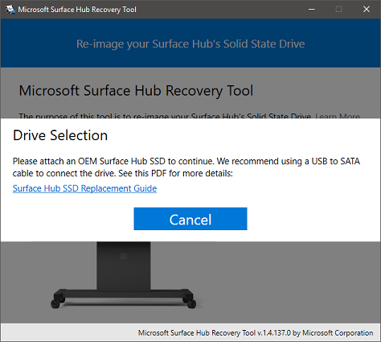
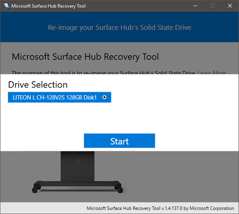
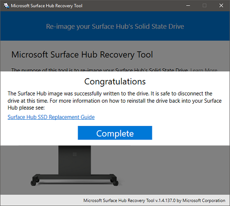

# Using the Surface Hub Recovery Tool

The [Microsoft Surface Hub Recovery Tool](https://www.microsoft.com/download/details.aspx?id=52210) helps you re-image your Surface Hub Solid State Drive (SSD) using a Windows 10 desktop device, without calling support or replacing the SSD. With this tool, you can reimage an SSD that has an unknown Administrator password, boot errors, was unable to complete a cloud recovery, or for a device that has an older version of the operating system. The tool will not fix physically damaged SSDs.

To re-image the Surface Hub SSD using the Recovery Tool, you'll need to remove the SSD from the Surface Hub, connect the drive to the USB-to-SATA cable, and then connect the cable to the desktop PC on which the Recovery Tool is installed. For more information on how to remove the existing drive from your Surface Hub, see [Surface Hub SSD replacement](surface-hub-ssd-replacement.md).

>[!IMPORTANT]
>Do not let the device go to sleep or interrupt the download of the image file.

If the tool is unsuccessful in reimaging your drive, please contact [Surface Hub Support](https://support.microsoft.com/help/4037644/surface-contact-surface-warranty-and-software-support).

## Prerequisites

### Mandatory

- Host PC running 64-bit version of Windows 10, version 1607 or higher.
- Internet access
- Open USB 2.0 or greater port
- USB-to-SATA cable
- 10 GB of free disk space on the host computer
- SSDs shipped with Surface Hub or a SSD provided by Support as a replacement. SSDs not supplied by Microsoft are not supported.

### Recommended

- High-speed Internet connection
- Open USB 3.0 port
- USB 3.0 or higher USB-to-SATA cable
- The imaging tool was tested with the following make and model of cables:
    - Startech USB312SAT3CB
    - Rosewill RCUC16001
    - Ugreen 20231

## Download Surface Hub Recovery Tool

Surface Hub Recovery Tool is available for download from [Surface Hub Tools for IT](https://www.microsoft.com/download/details.aspx?id=52210)  under the file name **SurfaceHub_Recovery_v1.14.137.0.msi**.

To start the download, click **Download**, choose **SurfaceHub_Recovery_v1.14.137.0.msi** from the list, and click **Next**. From the pop-up, choose one of the following:

- Click **Run** to start the installation immediately.
- Click **Save** to copy the download to your computer for later installation.

Install Surface Hub Recovery Tool on the host PC.

## Run Surface Hub Recovery Tool

1. On the host PC, select the **Start** button, scroll through the alphabetical list on the left, and select the recovery tool shortcut.

    

2. Click **Start**.

    

3. In the **Guidance** window, click **Next**.

    

4. click **Yes** to download the image. Time to download the recovery image is dependent on internet connection speeds. On an average corporate connection, it can take up to an hour to download the 8GB image file.

    

5. When the download is complete, the tool instructs you to connect an SSD drive. If the tool is unable to locate the attached drive, there is a good chance that the cable being used is not reporting the name of the SSD to Windows.  The imaging tool must find the name of the drive as "LITEON L CH-128V2S USB Device" before it can continue.  For more information on how to remove the existing drive from your Surface Hub, see [Surface Hub SSD replacement](surface-hub-ssd-replacement.md).

~~~

~~~

6. When the drive is recognized, click **Start** to begin the re-imaging process. On the warning that all data on the drive will be erased, click **OK**.

    

    Prior to applying the system image to the drive, the SSD is repartitioned and formatted. Copying the system binaries will take approximately 30 minutes, but can take longer depending on the speed of your USB bus, the cable being used, or antivirus software installed on your system.

    

    

## Troubleshooting and common problems

Issue | Notes
--- | ---
The tool fails to image the SSD | Make sure you are using a factory-supplied SSD and one of the tested cables.
The reimaging process appears halted/frozen | It is safe to close and restart the Surface Hub Recovery Tool with no ill effect to the SSD.
The drive isn’t recognized by the tool | Verify that the Surface Hub SSD is enumerated as a Lite-On drive, "LITEON L CH-128V2S USB Device".  If the drive is recognized as another named device, your current cable isn’t compatible. Try another cable or one of the tested cable listed above.
Error: -2147024809 | Open Disk Manager and remove the partitions on the Surface Hub drive.  Disconnect and reconnect the drive to the host machine. Restart the imaging tool again.

If the tool is unsuccessful in reimaging your drive, please contact [Surface Hub Support](https://support.microsoft.com/help/4037644/surface-contact-surface-warranty-and-software-support).
