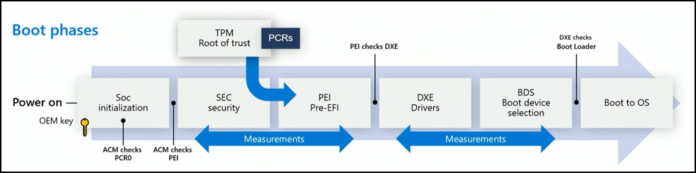
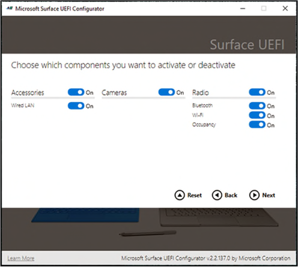

# Surface Hub security overview

Surface Hub provides a locked-down computing appliance with custom platform firmware running the Windows 10 Team Edition operating system. The resulting device takes the traditional, "single use" secure kiosk, "only run what you need" philosophy and delivers a modern take on it. Built to support a rich collaborative user experience, Surface Hub is protected against continually evolving security threats.

Built on Windows 10, Surface Hub delivers enterprise-grade modern security enabling IT admins to enforce data protection with BitLocker, Trusted Platform Module 2.0 (TPM), plus cloud-powered security with Windows Defender (also known as Microsoft Defender).

## Defense in Depth security

Security protocols begin as soon as Surface Hub is turned on. Starting at the firmware level, Surface Hub will only load the operating system and its components in response to multiple security checks. Surface Hub employs a strategy called Defense in Depth that involves layering independent defensive sub-components to protect the whole of the system in the event of partial failure. This industry practice has proven to be highly effective in mitigating against potential unilateral exploits and weakness in sub-components.

The modern Unified Extensible Firmware Interface (UEFI) is statically and securely configured by Microsoft to only boot an authenticated Windows 10 Team Edition operating system from internal storage.  Every line of code that runs on Surface Hub has its signature verified prior to execution. Only applications signed by Microsoft, either as part of the operating system or installed via the Microsoft Store, can run on the Surface Hub. Code or apps not meeting these requirements are blocked.

Surface Hub security systems include the following:

- **Boot-time defenses.** Loads only trusted Surface Hub operating system components.
- **Operating system defenses.** Protects against execution of unintended or malicious software or code.
- **User interface defenses.** Provides a user interface that's safe for end users, preventing access to potentially risky activities such as running executables from the command line.

### Boot-time defenses

The SoC has a security processor that's separate from every other core. When you first start Surface Hub, only the security processor starts before anything else can be loaded.

#### Secure Boot

Secure Boot is used to verify that the components of the boot process, including drivers and the operating system, are validated against a database of valid and known signatures. On Surface Hub, a platform-specific signature must first be validated before the authorized Windows Team operating system can be loaded. This helps prevent attacks from a cloned or modified system running malicious code hidden in what appears to be an otherwise normal user experience.  For more information, see [Secure Boot overview](https://docs.microsoft.com/windows-hardware/design/device-experiences/oem-secure-boot).

### Operating system defenses

Once the operating system is verified as originating from Microsoft and Surface Hub successfully completes the boot process, the device scrutinizes the executable code. Our approach to securing the operating system involves identifying the code signature of all executables, allowing only those that pass our restrictions to be loaded into the runtime. This code signing method enables the operating system to verify the author and confirm that code was not altered prior to running on the device.

Surface Hub uses a code signing feature known as User Mode Code Integrity (UMCI) in Windows Application Control (formerly known as Device Guard). Policy settings are configured to only allow apps that meet one of these requirements:

- Universal Windows Platform (Microsoft Store) apps that are [officially certified](https://docs.microsoft.com/windows/uwp/publish/the-app-certification-process).
- Apps signed with the unique Microsoft Production Root Certification Authority (CA), which can only be signed by Microsoft employees with authorized access to those certificates.
- Apps signed with the unique Surface Hub Production Root C.

The configuration file is signed using the Microsoft Production Root CA designed to prevent restrictions from being removed or modified by a third party. All other executables at this point are simply blocked at the operating system runtime level and prevented from accessing processing power. This attack surface reduction provides the following protections:

- No legacy document modes
- No legacy script engines
- No Vector Markup Language
- No Browser Helper Objects
- No ActiveX controls

In addition to blocking unsigned or incorrectly signed code via UMCI, Surface Hub uses Windows Application Control to block Windows components, such as the Command Prompt, PowerShell, and Task Manager. These safeguards reflect a key design feature of Surface Hub as a secure computing appliance. For more information, see the following:

- [Application Control overview](https://docs.microsoft.com/windows/security/threat-protection/windows-defender-application-control/windows-defender-application-control)

- [Windows Defender Application Control and virtualization-based protection of code integrity](https://docs.microsoft.com/windows/security/threat-protection/device-guard/introduction-to-device-guard-virtualization-based-security-and-windows-defender-application-control)

### User interface defenses

While boot-time defenses and operating system lockdown safeguards deliver foundational security, the user interface provides an additional layer designed to further reduce risk. To prevent malicious code from reaching the device through drivers, Surface Hub does not download advanced drivers for plug and play (PnP) devices. Devices that leverage basic drivers, such as USB flash drives or certified Surface Hub peripherals (speakers, microphones, cameras) work as expected, but advanced systems, such as printers, will not.

User interface defenses also simplify the UI, further preventing the execution of malicious software or code. The following Surface Hub UI elements layer the core security provided by code signing:

- **File Explorer.** Surface Hub has a custom File Explorer that enables quick access to Music, Videos, Documents, Pictures, and Downloads folders — without exposing users to system or program files. Other locations on the local hard drive are not available through File Explorer. In addition, many file types running such as .exe, and .msi installation files cannot run providing another layer of safety against potentially malicious executables.

- **Start & All Apps.** The Start and All Apps components of Surface Hub do not expose access to Command Prompt, PowerShell, or other Windows components blocked via Application Control. In addition, Windows run functionality typically accessed on PCs from the Search box is turned off for Surface Hub.

## Security enhancements in Surface Hub 2S

Although Surface Hub and Surface Hub 2S both run the same operating system software, some features unique to Surface Hub 2S provide additional management and security capabilities enabling IT admins to perform the following tasks:

- Manage UEFI settings with SEMM
- Recover Hub with bootable USB
- Harden device account with password rotation

### Manage UEFI settings with SEMM

UEFI is an interface between the underlying hardware platform pieces and the operating system. On Surface Hub, a custom UEFI implementation allows granular control over these settings and prevents any non-Microsoft entity from changing the UEFI settings of the device — or booting to a removable drive to modify or change the operating system.

At a high level, during the factory provisioning process, Surface Hub UEFI is preconfigured to enable Secure Boot and is set to only boot from the internal solid-state drive (SSD), with access to UEFI menus locked down and shortcuts removed. This seals UEFI access and ensures the device can only boot into the Windows Team operating system installed on Surface Hub.

When managed via Microsoft Surface Enterprise Management Mode (SEMM), IT admins can deploy UEFI settings on Hub devices across an organization. This includes the ability to enable or disable built-in hardware components, protect UEFI settings from being changed by unauthorized users, and adjust boot settings.

Admins can implement SEMM and enrolled Surface Hub 2S devices using the downloadable [Microsoft Surface UEFI Configurator](https://www.microsoft.com/download/details.aspx?id=46703). For more information, see [Secure and manage Surface Hub 2S with SEMM and UEFI](https://docs.microsoft.com/surface-hub/surface-hub-2s-secure-with-uefi-semm).
Secured using a certificate to protect the configuration from unauthorized tampering or removal, SEMM enables management of the following components:

- Wired LAN
- Camera
- Bluetooth
- Wi-Fi
- Occupancy sensor
- IPv6 for PXE Boot
- Alternate Boot
- Boot Order Lock
- USB Boot
- UEFI front page interface
    - Devices
    - Boot
    - Date/Time

    
### Recover Hub with bootable USB

Surface Hub 2S enables admins to reinstall the device to factory settings using a recovery image in as little as 20 minutes. Typically, you would only need to do this if your Surface Hub is no longer functioning. Recovery is also useful if you have lost the Bitlocker key or no longer have admin credentials to the Settings app.

### Harden device account with password rotation

Surface Hub uses a device account, also known as a "room account" to authenticate with Exchange, Microsoft Teams, and other services. When you enable password rotation, Hub 2S automatically generates a new password every 7 days, consisting of 15-32 characters with a combination of uppercase and lowercase letters, numbers, and special characters. Because no one knows the password, the device account password rotation effectively mitigates associated risk from human error and potential social engineering security attacks.

## Windows 10 enterprise-grade security

In addition to Surface Hub-specific configurations and features addressed in this document, Surface Hub also uses the standard security features of Windows 10. These include:

- **BitLocker**. The Surface Hub SSD is equipped with BitLocker to protect the data on the device. Its configuration follows industry standards. For more information, see [BitLocker overview](https://docs.microsoft.com/windows-hardware/design/device-experiences/oem-secure-boot).
- **Windows Defender.** The Windows Defender anti-malware engine runs continuously on Surface Hub and works to automatically remediate threats found on Surface Hub. The Windows Defender engine receives updates automatically and is manageable via remote management tools for IT admins. The Windows Defender engine is a perfect example of our Defense in Depth approach: If malware can find a way around our core code-signage-based security solution, it will be caught here. For more information, see [Windows Defender Application Control and virtualization-based protection of code integrity](https://docs.microsoft.com/windows/security/threat-protection/device-guard/introduction-to-device-guard-virtualization-based-security-and-windows-defender-application-control).
- **Plug and play drivers.** To prevent malicious code from reaching the device through drivers, Surface Hub does not download advanced drivers for PnP devices. This allows devices that leverage basic drivers such as USB flash drives to work as expected while blocking more advanced systems such as printers.
- **Trusted Platform Module 2.0.** Surface Hub has an industry standard discrete Trusted Platform Module (dTPM) for generating and storing cryptographic keys and hashes. The dTPM protects keys used for the verification of boot phases, the BitLocker master key, password-less sign-on key, and more. The dTPM meets [FIPS 140-2 Level 2](https://docs.microsoft.com/windows/security/threat-protection/fips-140-validation) certification, the U.S. government computer security standard, and is compliant with [Common Criteria](https://docs.microsoft.com/windows/security/threat-protection/windows-platform-common-criteria) certification used worldwide.

## Wireless security for Surface Hub

Surface Hub uses Wi-Fi Direct / Miracast technology and the associated 802.11, Wi-Fi Protected Access (WPA2), and Wireless Protected Setup (WPS) standards. Since the device only supports WPS (as opposed to WPA2 Pre-Shared Key (PSK) or WPA2 Enterprise), issues traditionally associated with 802.11 encryption are simplified by design.

Miracast is part of the Wi-Fi Display standard, which itself is supported by the Wi-Fi Direct protocol. These standards are supported in modern mobile devices for screen sharing and collaboration.

Wi-Fi Direct or Wi-Fi "peer to peer" (P2P) is a standard released by the Wi-Fi Alliance for "Ad-Hoc" networks. This allows supported devices to communicate directly and create groups of networks without requiring a traditional Wi-Fi Access Point or an Internet connection.

Security for Wi-Fi Direct is provided by WPA2 using the WPS standard. Devices can be authenticated using a numerical pin, a physical or virtual push button, or an out-of-band message using near-field communication. Surface Hub supports both push button by default as well PIN methods. For more information, see [How Surface Hub addresses Wi-Fi Direct security issues](https://docs.microsoft.com/surface-hub/surface-hub-wifi-direct).

## Learn more

- [Secure Boot overview](https://docs.microsoft.com/windows-hardware/design/device-experiences/oem-secure-boot)

- [BitLocker overview](https://docs.microsoft.com/windows/security/information-protection/bitlocker/bitlocker-overview)

- [Application Control overview](https://docs.microsoft.com/windows/security/threat-protection/windows-defender-application-control/windows-defender-application-control)

- [Secure and manage Surface Hub 2S with SEMM and UEFI](https://docs.microsoft.com/surface-hub/surface-hub-2s-secure-with-uefi-semm)

- [How Surface Hub addresses Wi-Fi Direct security issues](https://docs.microsoft.com/surface-hub/surface-hub-wifi-direct)

- [Windows Defender Application Control and virtualization-based protection of code integrity](https://docs.microsoft.com/windows/security/threat-protection/device-guard/introduction-to-device-guard-virtualization-based-security-and-windows-defender-application-control)

- [Surface Tools for IT](https://www.microsoft.com/download/details.aspx?id=46703)

- [FIPS 140-2 Level 2](https://docs.microsoft.com/windows/security/threat-protection/fips-140-validation)

- [Common Criteria certification](https://docs.microsoft.com/windows/security/threat-protection/windows-platform-common-criteria)
