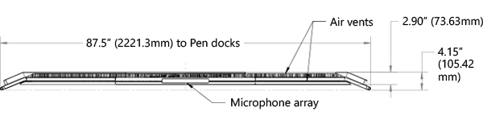
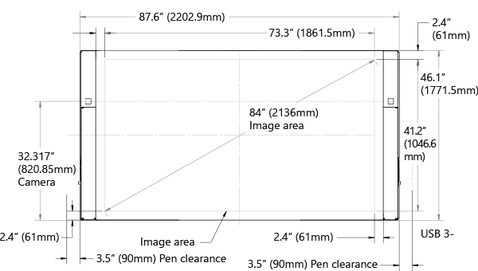
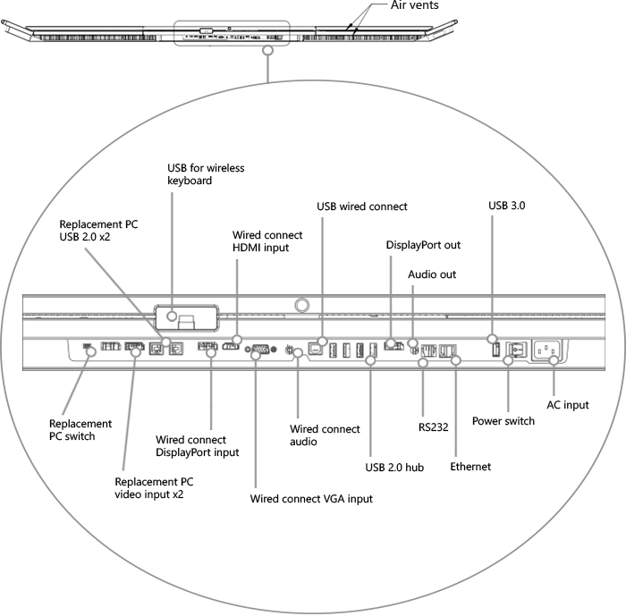
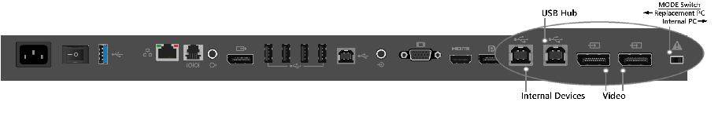
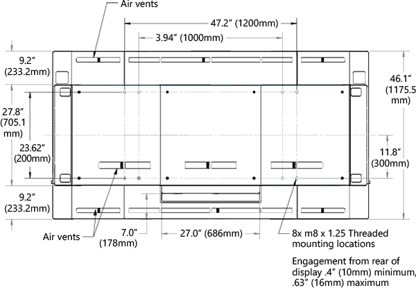
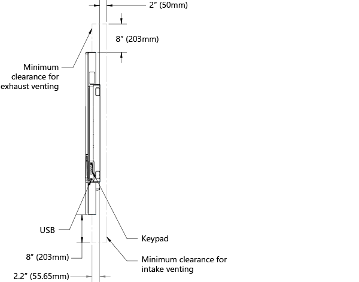
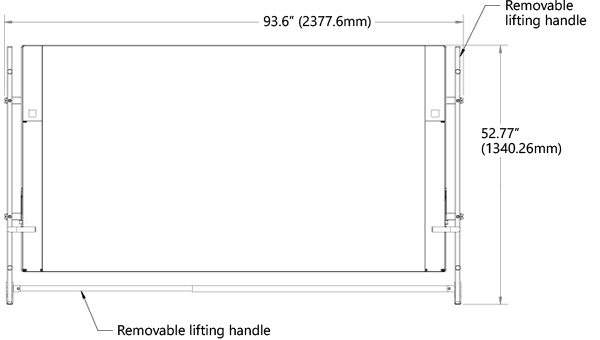
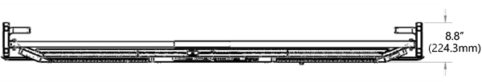

# Technical information for 84" Surface Hub

## Measurements 

|
--- | ---
Pricing	| Starting at $21,999 
Size |	46.12” x 86.7” x 4.15” (1171.5mm x 2202.9mm x 105.4mm)
Storage/RAM	| SSD 128GB with 8GB RAM
Processor	| 4th Generation Intel® Core™ i7 
Graphics |	NVIDIA Quadro K2200 
Ports |	**Internal PC** • (1) USB 3.0 (bottom) + (1) USB 3.0 (side access) • (4) USB 2.0 •  Ethernet 1000 Base-T • DisplayPort Video Output • 3.5mm Stereo Out • RJ11 Connector for system-level control **Alternate PC** • (2) USB 2.0 type B output •  connection for Camera, Sensors, Microphone, Speakers • (2) DisplayPort Video Input **Guest PC** • DisplayPort Video Input • HDMI Video Input • VGA Video Input • 3.5mm Stereo Input • (1) USB 2.0 type B Touchback™ Output
Sensors	 | (2) Passive Infrared Presence Sensors, Ambient Light Sensors 
Speakers |	(2) Front-facing stereo speakers 
Microphone |	High-Performance, 4-Element Array 
Camera |	(2) Wide angle HD cameras 1080p @ 30fps 
Pen |	(2) Powered, active, subpixel accuracy 
Physical side buttons |	Power, Input Select, Volume, Brightness 
Software |	Windows 10 + Office (Word, PowerPoint, Excel) 
What’s in the box |	• Surface Hub 84” • (2) Surface Hub Pens • Power Cable • Setup Guide • Safety and Warranty documents • Wireless All-in-One Keyboard
Mounting features	| 4X VESA standard, 1200mm x 600mm pattern, 8X M8 X 1.25 threaded mounting locations
Display height from floor	| Recommended height of 54 inches (139.7 cm) to center of screen
Product weight |	Approx. 280 lb. (127 kg.)
Product shipping weight	 | Approx. 580 lb. (263 kg.)
Product dimensions HxWxD | 	46 x 86.9 x 4.1 inches (116.8 x 220.6 x 10.4 cm)
Product shipping dimensions HxWxD |	66.14 x 88.19 x 24.4 inches (168 x 224 x 62 cm)
Product thickness	| Touch surface to mounting surface: ≤ 3.1 inches (7.8 cm)
Orientation	 | Landscape only. Display cannot be used in a portrait orientation.
BTU	 | 3070.8 BTU/h
Image resolution |	3840 x 2160
Frame rate |	120Hz
Contrast Ratio | 1400:1
EDID preferred timing, replacement PC |	3840 x 2140, 120Hz vertical refresh
EDID preferred timing, wired connect |	1920 x 1080, 60Hz vertical refresh
Input voltage | 110/230v nominal, 90-265v max
Input power, operating |	900W max
Input power, standby    |  	5W nominal, 1-10W max

## Replacement PC connections 

Connector and location | Label | Description
--- | --- | ---
Switch, bottom I/O |  | Switches the function between using internal PC or external PC.
Display port, bottom I/O |  | Provides input for replacement PC.
Display port, bottom I/O |  | Provides second input for replacement PC.
USB type B, bottom I/O |  | Provides USB connection for replacement PC to internal peripherals. 
USB type B, bottom I/O |  | Provides USB connection for integrated hub.

## Wired connect connections

Connector and location | Label | Description
--- | --- | ---
Display port, bottom I/O |  | Provides input for wired connect PC.
HDMI, bottom I/O |  | Provides HDMI input for wired connect PC.
VGA, bottom I/O |  | Provides VGA input for wired connect PC.
3.5mm, bottom I/O |  | Provides analog audio input.
USB type B, bottom I/O |  | Provides USB connection for video ingest touchback.

## Additional connections

Connector and location | Label | Description
--- | --- | ---
USB type A, side I/O |  | Provides 1 USB 3.0 connection for USB devices. Wake-on USB capable.
USB type A, bottom I/O with blue insulator |  | Provides USB 3.0 connection.
3.5mm, bottom I/O |  | Provides analog audio out.
Display port, bottom I/O |  | Provides mirrored video out function to another display.
IEC/EN60320-C13 receptacle with hard switch |  | Provides AC input and compliance with EU power requirements.
RJ45, bottom I/O |  | Connects to Ethernet.
RJ11, bottom I/O |  | Connects to room control systems.

## Diagrams of ports and clearances

***Top view of 84" Surface Hub***

---

***Front view of 84" Surface Hub***

---

***Bottom view of 84" Surface Hub***

---

***Replacement PC ports on 84" Surface Hub***

---

***Rear view of 84" Surface Hub***

---

***Clearances for 84" Surface Hub***

---

***Removable lifting handles on 84” Surface Hub ***

---

***Wall mount threads on back of 84” Surface Hub ***

---
***Lifting handles in top view of 84” Surface Hub***

---
***Side view of 84” Surface Hub***

