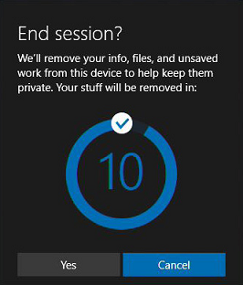

# What's new in Windows 10, version 1703 for Microsoft Surface Hub?

Watch Surface Hub engineer Jordan Marchese present updates to Microsoft Surface Hub with Windows 10, version 1703 (Creators Update). 

Windows 10, version 1703 (also called the Creators Update), introduces the following changes for Microsoft Surface Hub.

## New settings

Settings have been added to mobile device management (MDM) and configuration service providers (CSPs) to expand the Surface Hub management capabilities. [New settings include](manage-settings-with-mdm-for-surface-hub.md):

- InBoxApps/SkypeForBusiness/DomainName
- InBoxApps/Connect/AutoLaunch
- Properties/DefaultVolume
- Properties/ScreenTimeout
- Properties/SessionTimeout
- Properties/SleepTimeout
- Properties/AllowSessionResume
- Properties/AllowAutoProxyAuth
- Properties/DisableSigninSuggestions
- Properties/DoNotShowMyMeetingsAndFiles
- System/AllowStorageCard

Plus settings based on the new [NetworkQoSPolicy CSP](https://msdn.microsoft.com/windows/hardware/commercialize/customize/mdm/networkqospolicy-csp) and [NetworkProxy CSP](https://msdn.microsoft.com/windows/hardware/commercialize/customize/mdm/networkproxy-csp).
 

## Provisioning wizard

An easy-to-use wizard helps you quickly create provisioning packages that you can apply to multiple Surface Hub devices, and includes bulk join to Azure Active Directory. [Learn how to create a provisioning package for Surface Hub.](provisioning-packages-for-certificates-surface-hub.md)

    
## Miracast on your existing wireless network or LAN 

Microsoft has extended the ability to [send a Miracast stream over a local network](miracast-over-infrastructure.md) rather than over a direct wireless link. 
    
## Cloud recovery

When you reset a Surface Hub device, you now have the ability to download and install a factory build of the operating system from the cloud. [Learn more about cloud recovery.](device-reset-surface-hub.md#cloud-recovery)

>[!NOTE]
>Cloud recovery doesn't work if you use proxy servers.
    

    
## End session

**I'm done** is now **End session**. [Learn how to use End session.](i-am-done-finishing-your-surface-hub-meeting.md) 

 

 
