# Summary

This article describes how to use the cloud recovery function if you are unexpectedly prompted by BitLocker on a Surface Hub device.

> [!NOTE]
> You should follow these steps only if a BitLocker recovery key isn't available.

> [!WARNING]
> * This recovery process deletes the contents of the internal drive. If the process fails, the internal drive will become completely unusable. If this occurs, you will have to log a service request with Microsoft for a resolution.
> * After the recovery process is complete, the device will be reset to the factory settings and returned to its Out of Box Experience state.
> * After the recovery, the Surface Hub must be completely reconfigured.

> [!IMPORTANT]
> This process requires an open Internet connection that does not use a proxy or other authentication method.

## Cloud recovery process

To perform a cloud recovery, follow these steps:

1. Select **Press Esc for more recovery options**.

   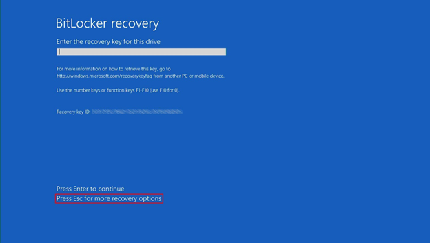

1. Select **Skip this drive**.

   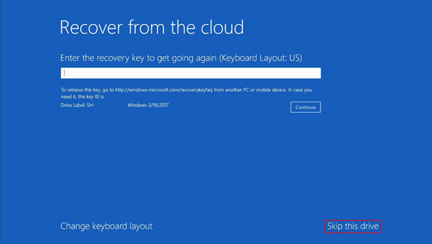

1. Select **Recover from the cloud**.

   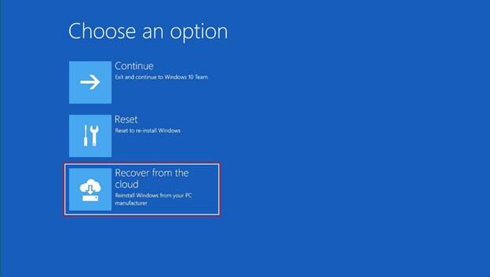

1. Select **Yes**.

   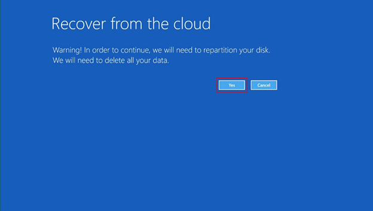

1. Select **Reinstall**.

   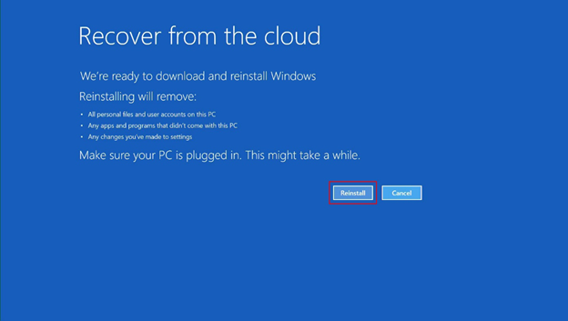

   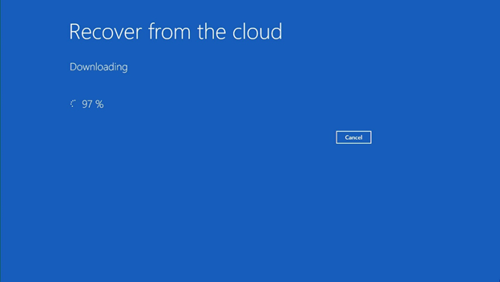

1. After the cloud recovery process is complete, start the reconfiguration by using the **Out of Box Experience**.

   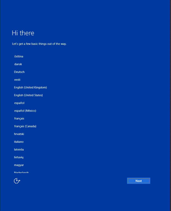

## "Something went Wrong" error message

This error is usually caused by network issues that occur during the recovery download. When this issue occurs, don't turn off the Hub because you won't be able to restart it. If you receive this error message, return to the "Recover from the cloud" step, and then restart the recovery process.

1. Select **Cancel**.

   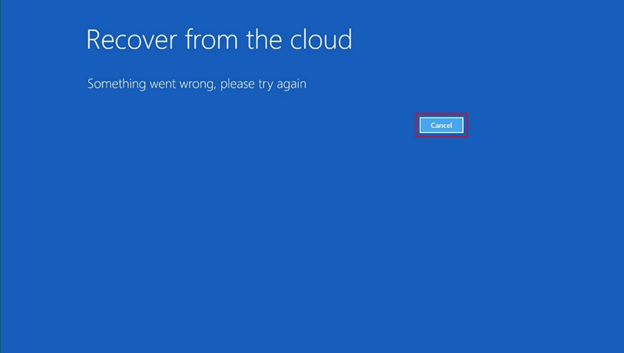

1. Select **Troubleshoot**.

   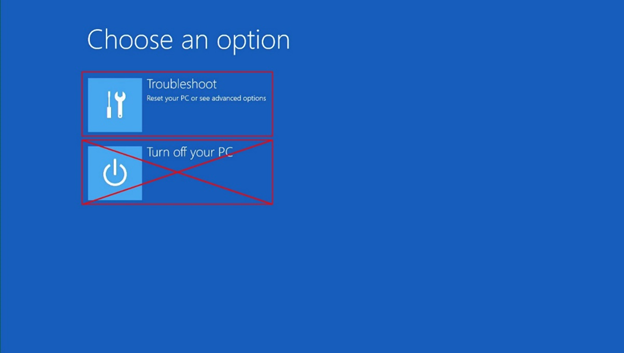

1. Select **Recover from the cloud**.

   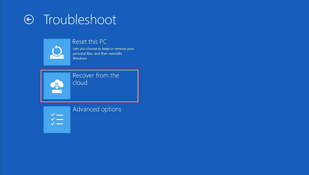

1. If the **Wired network isn't found** error occurs, select **Cancel**, and then let the Surface Hub rediscover the wired network.

   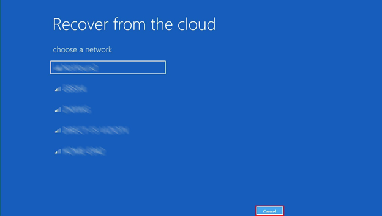