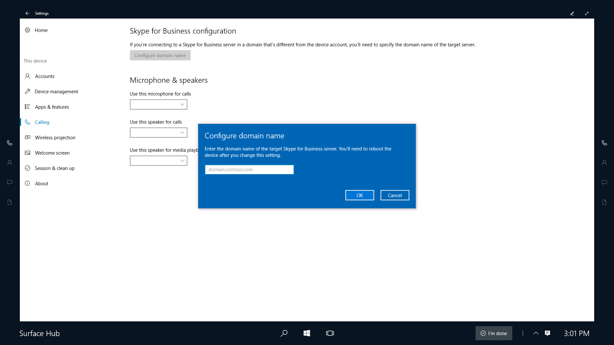

# Configure domain name for Skype for Business

There are a few scenarios where you need to specify the domain name of your Skype for Business server:
- **Multiple DNS suffixes** - When your Skype for Business infrastructure has disjointed namespaces such that one or more servers have a DNS suffix that doesn't match the suffix of the sign-in address (SIP) for Skype for Business.  
- **Skype for Business and Exchange suffixes are different** - When the suffix of the sign-in address for Skype for Business differs from the suffix of the Exchange address used for the device account.
- **Working with certificates** - Large organizations with on-premises Skype for Business servers commonly use certificates with their own root certificate authority (CA). It is common for the CA domain to be different than the domain of the Skype for Business server which causes the certificate to not be trusted, and sign-in fails.  Skype needs to know the domain name of the certificate in order to set up a trust relationship. Enterprises typically use Group Policy to push this out to Skype desktop, but Group Policy is not supported on Surface Hub.

**To configure the domain name for your Skype for Business server** 
1. On Surface Hub, open **Settings**.
2. Click **Surface Hub**, and then click **Calling & Audio**. 
3. Under **Skype for Business configuration**, click **Configure domain name**. 
4. Type the domain name for your Skype for Business server, and then click **Ok**. 
> [!TIP]
> You can type multiple domain names, separated by commas.   For example: lync.com, outlook.com, lync.glbdns.microsoft.com

    
