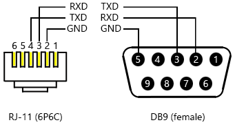

# Using a room control system (Surface Hub)

Room control systems can be used with your Microsoft Surface Hub.

Using a room control system with your Surface Hub involves connecting room control hardware to the Surface Hub, usually through the RJ11 serial port on the bottom of the Surface Hub.

## Terminal settings

To connect to a room control system control panel, you don't need to configure any terminal settings on the Surface Hub. If you want to connect a PC or laptop to your Surface Hub and send serial commands from the Surface Hub, you can use a terminal emulator program like Tera Term or PuTTY. 

| Setting | Value |
| --- | --- |
| Baud rate | 115200 |
| Data bits | 8 | 
| Stop bits | 1 |
| Parity | none |
| Flow control | none |
| Line feed | every carriage return |
 

## Wiring diagram

You can use a standard RJ-11 (6P6C) connector to connect the Surface Hub serial port to a room control system. This is the recommended method. You can also use an RJ-11 4-conductor cable, but we do not recommend this method.

This diagram shows the correct pinout used for an RJ-11 (6P6C) to DB9 cable.

## Command sets

Room control systems use common meeting-room scenarios for commands. Commands originate from the room control system, and are communicated over a serial connection to a Surface Hub. Commands are ASCII based, and the Surface Hub will acknowledge when state changes occur.

The following command modifiers are available. Commands terminate with a new line character (\n). Responses can come at any time in response to state changes not triggered directly by a management port command.

| Modifier | Result |
| --- | --- |
| + | Increment a value |
| - | Decrease a value |
| = | Set a discrete value |
| ? | Queries for a current value |
 

## Power

Surface Hub can be in one of these power states.

| State | Energy Star state| Description |
| --- | --- | --- |
| 0 | S5 | Off |
| 1 | - | Power up (indeterminate) |
| 2 | S3 | Sleep |
| 5 | S0 | Ready |

In Replacement PC mode, the power states are only Ready and Off and only change the display. The management port can't be used to power on the replacement PC. 

| State | Energy Star state| Description |
| --- | --- | --- |
| 0 | S5 | Off |
| 5 | S0 | Ready |

For a control device, anything other than 5 / Ready should be considered off. Each PowerOn command results in two state changes and reponses. 

| Command | State change| Response |
| --- | --- | --- |
| PowerOn | Device turns on (display + PC).  PC service notifies SMC that the PC is ready. |  Power=0  Power=5 |
| PowerOff | Device transitions to ambient state (PC on, display dim). |  Power=0 |
| Power? |  SMC reports the last-known power state. |  Power=<#> |

## Brightness

The current brightness level is a range from 0 to 100.

Changes to brightness levels can be sent by a room control system, or other system.

| Command | State change |Response |
| --- | --- | --- |
| Brightness+ | System management controller (SMC) sends the brightness up command.  PC service on the room control system notifies SMC of new brightness level. |  Brightness = 51 |
| Brightness- |  SMC sends the brightness down command.  PC service notifies SMC of new brightness level. | Brightness = 50 |

## Volume

The current volume level is a range from 0 to 100.

Changes to volume levels can be sent by a room control system, or other system.

>[!NOTE]
>The Volume command will only control the volume for embedded or Replacement PC mode, not from [Guest sources](connect-and-display-with-surface-hub.md).

| Command | State change | Response (On in [Replacement PC mode](connect-and-display-with-surface-hub.md#replacement-pc-mode)) |
| --- | --- | --- |
| Volume+ |  SMC sends the volume up command.  PC service notifies SMC of new volume level. |  Volume = 51 |
| Volume- |  SMC sends the volume down command.  PC service notifies SMC of new volume level. |  Volume = 50 |

 

## Mute for audio

Audio can be muted.

| Command | State change | Response |
| --- | --- | --- |
| AudioMute+ |  SMC sends the audio mute command.  PC service notifies SMC that audio is muted. |  none |

 

## Video source

Several display sources can be used.

| State | Description | 
| --- | --- |
| 0 |  Onboard PC |
| 1 |  DisplayPort |
| 2 |  HDMI |
| 3 |  VGA |

 

Changes to display source can be sent by a room control system, or other system.

| Command | State change | Response |
| --- | --- | --- |
| Source=# |  SMC changes to the desired source.  PC service notifies SMC that the display source has switched. |  Source=&lt;#&gt; |
| Source+ |  SMC cycles to the next active input source.  PC service notifies SMC of the current input source. |  Source=&lt;#&gt; |
| Source- | SMC cycles to the previous active input source.  PC service notifies SMC of the current input source. |  Source=&lt;#&gt; |
| Source? |  SMC queries PC service for the active input source.  PC service notifies SMC of the current in;put source. | Source=&lt;#&gt; |

## Errors

Errors are returned following the format in this table.

| Error | Notes |
| --- | --- |
| Error: Unknown command '&lt;input&gt;'. |  The instruction contains an unknown initial command. For example, &quot;VOL+&quot; would be invalid and return &quot; Error: Unknown command 'VOL'&quot;. |
| Error: Unknown operator '&lt;input&gt;'. |  The instruction contains an unknown operator. For example, &quot;Volume!&quot; would be invalid and return &quot; Error: Unknown operator '!'&quot;. |
| Error: Unknown parameter '&lt;input&gt;'. |  The instruction contains an unknown parameter. For example, &quot;Volume=abc&quot; would be invalid and return &quot; Error: Unknown parameter 'abc'&quot;. |
| Error: Command not available when off '&lt;input&gt;'. |  When the Surface Hub is off, commands other than Power return this error. For example, &quot;Volume+&quot; would be invalid and return &quot; Error: Command not available when off 'Volume'&quot;. |

 

## Related topics

[Manage Microsoft Surface Hub](manage-surface-hub.md)

[Microsoft Surface Hub administrator's guide](surface-hub-administrators-guide.md)

 

 

