# Using the Surface Hub Hardware Diagnostic Tool to test a device account

## Introduction

> [!NOTE]
> The "Account Settings" section of the Surface Hub Hardware Diagnostic tool doesn’t collect any information. The email and password that are entered as input are used only directly on your environment and not collected or transferred to anyone. The login information persists only until the application is closed or you end the current session on the Surface Hub.

> [!IMPORTANT]
> * Administrator privileges are not required to run this application.
> * The results of the diagnostic should be discussed with your local administrator before you open a service call with Microsoft.

### Surface Hub Hardware Diagnostic

By default, the [Surface Hub Hardware Diagnostic](https://www.microsoft.com/store/apps/9nblggh51f2g) application isn’t installed in earlier versions of the Surface Hub system. The application is available for free from the Microsoft Store. Administrator privileges are required to install the application.

   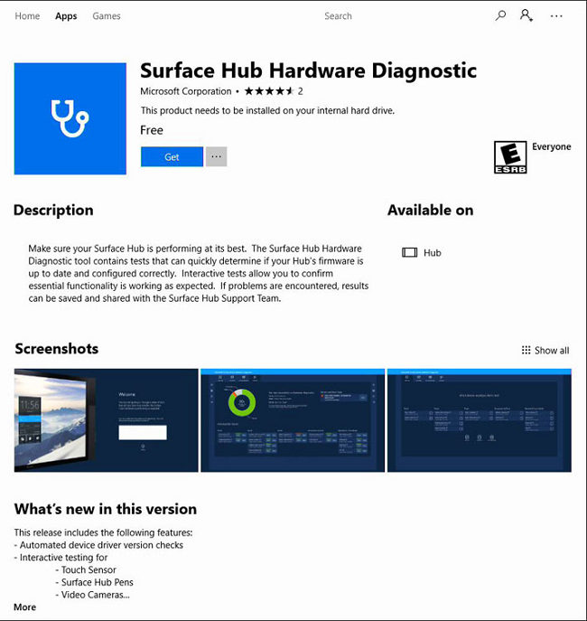

## About the Surface Hub Hardware Diagnostic Tool

The Surface Hub Hardware Diagnostic tool is an easy-to-navigate tool that lets the user test many of the hardware components within the Surface Hub device. This tool can also test and verify a Surface Hub device account. This article describes how to use the Account Settings test within the Surface Hub Hardware Diagnostic tool.

> [!NOTE]
> The device account for the Surface Hub should be created before any testing is done. The Surface Hub Administrator Guide provides instructions and PowerShell scripts to help you create on-premises, online (Office365), or hybrid device accounts. For more information, go to the [Create and test a device account (Surface Hub)](https://docs.microsoft.com/surface-hub/create-and-test-a-device-account-surface-hub) topic in the guide.

### Device account testing process

1. Navigate to **All Apps**, and then locate the Surface Hub Hardware Diagnostic application.

    

1. When the application starts, the **Welcome** page provides a text window to document the reason why you are testing the Hub. This note can be saved to USB together with the diagnostic results at the conclusion of testing. After you finish entering a note, select the **Continue** button.

    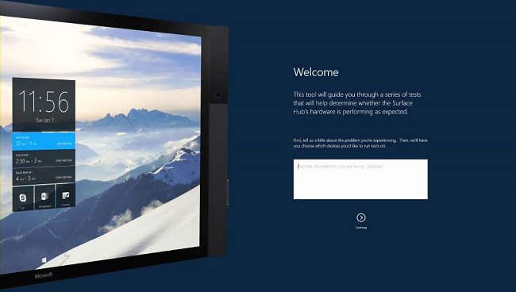

1. The next screen provides you the option to test all or some of the Surface Hub components. To begin testing the device account, select the **Test Results** icon.

    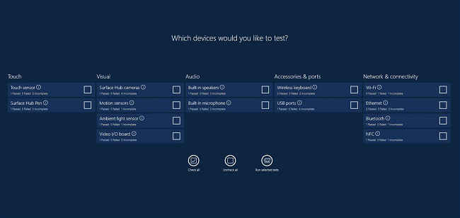

    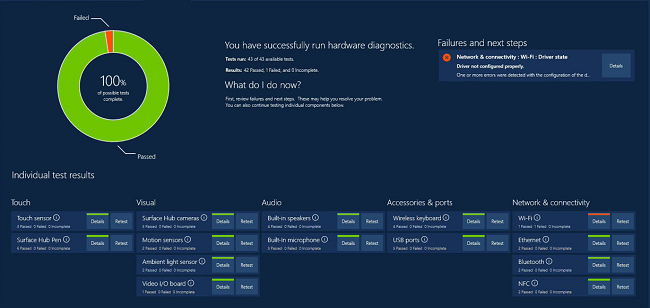

1. Select **Account Settings**.  

    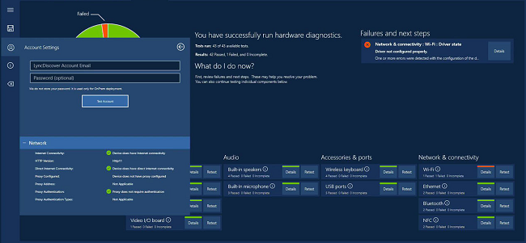

    The Account Settings screen is used to test your device account.

    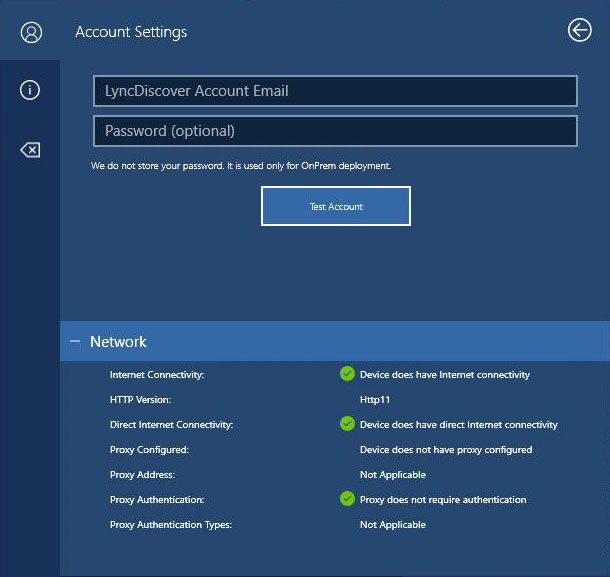

1. Enter the email address of your device account. The password is optional but is recommended. Select the **Test Account** button when you are ready to continue.

    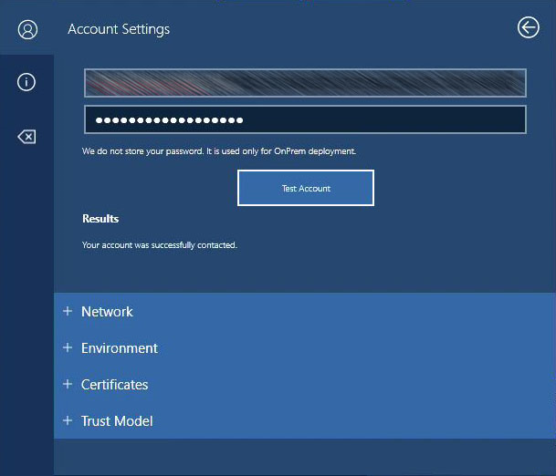

1. After testing is finished, review the results for the four areas of testing. Each section can be expanded or collapsed by selecting the Plus or Minus sign next to each topic.

    **Network**

    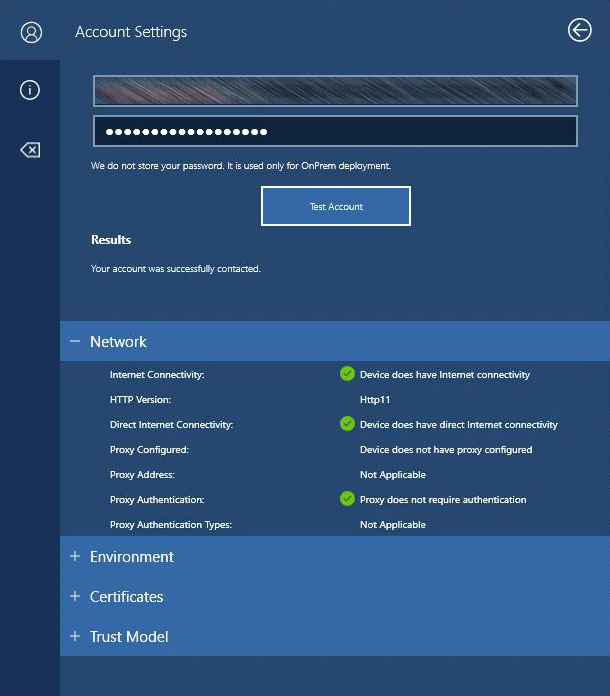

    **Environment**

    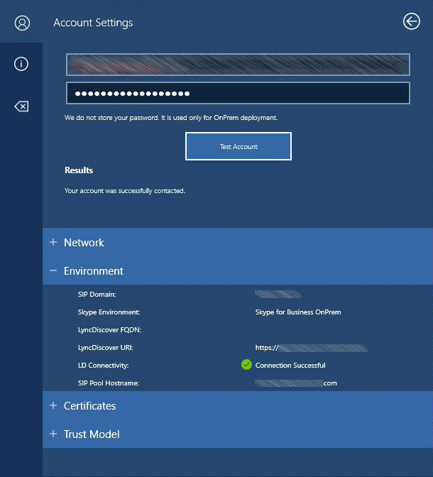

    **Certificates**

    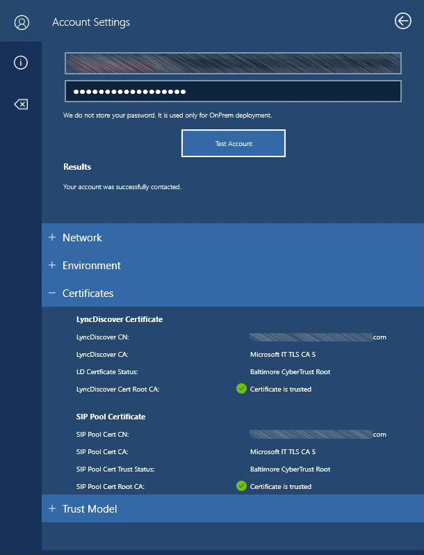

    **Trust Model**

    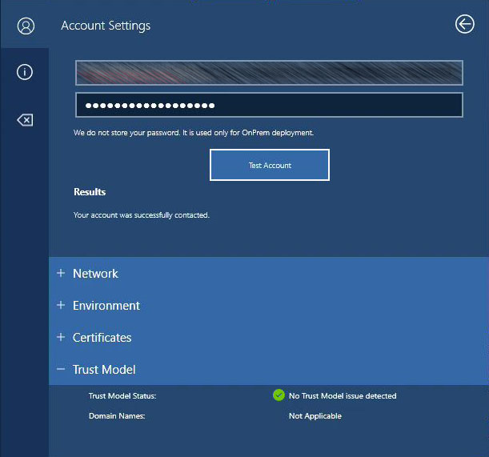

## Appendix

### Field messages and resolution

#### Network

Field |Success |Failure |Comment |Reference
|------|------|------|------|------|
Internet Connectivity |Device does have Internet connectivity |Device does not have Internet connectivity |Verifies internet connectivity, including proxy connection |[Configuring a proxy for your Surface Hub](https://blogs.technet.microsoft.com/y0av/2017/12/03/7/)
HTTP Version |1.1 |1.0 |If HTTP 1.0 found, it will cause issue with WU and Store |
Direct Internet Connectivity |Device has a Proxy configured Device has no Proxy configured |N/A |Informational. Is your device behind a proxy? |
Proxy Address | | |If configured, returns proxy address. |
Proxy Authentication |Proxy does not require Authentication |Proxy requires Proxy Auth |Result may be a false positive if a user already has an open session in Edge and has authenticated thru the proxy. |[Configuring a proxy for your Surface Hub](https://blogs.technet.microsoft.com/y0av/2017/12/03/7/)
Proxy Auth Types | | |If proxy authentication is used, return the Authentication methods advertised by the proxy.  |

#### Environment

Field |Success |Failure |Comment |Reference
|------|------|------|------|------|
SIP Domain | | |Informational.  |
Skype Environment |Skype for Business Online, Skype for Business OnPrem, Skype for Business Hybrid |Informational. |What type of environment was detected. Note: Hybrid can only be detected if the password is entered.
LyncDiscover FQDN | | |Informational. Displays the LyncDiscover DNS result |
LyncDiscover URI | | |Informational. Displays the URL used to perform a LyncDiscover on your environment.|
LyncDiscover |Connection Successful |Connection Failed |Response from LyncDiscover web service. |
SIP Pool Hostname | | |Informational. Display the SIP pool name discovered from LyncDiscover |

#### Certificates (in-premises hybrid only)

LyncDiscover Certificate

Field |Success |Failure |Comment |Reference
|------|------|------|------|------|
LyncDiscover Cert CN | | |Informational. Displays the LD cert Common name |
LyncDiscover Cert CA | | |Informational. Displays the LD Cert CA |
LyncDiscover Cert Root CA | | |Informational. Displays the LD Cert Root CA, if available. |
LD Trust Status |Certificate is Trusted. |Certificate is not trusted, please add the Root CA. |Verify the certificate against the local cert store. Returns positive if the machine trusts the certificate.|[Download and deploy Skype for Business certificates using PowerShell](https://blogs.msdn.microsoft.com/surfacehub/2016/06/07/download-and-deploy-skype-for-business-certificates-using-powershell/)/[Supported items for Surface Hub provisioning packages](https://docs.microsoft.com/surface-hub/provisioning-packages-for-surface-hub#supported-items-for-surface-hub-provisioning-packages)

SIP Pool Certification

Field |Success |Failure |Comment |Reference
|------|------|------|------|------|
SIP Pool Cert CN | | |(CONTENTS) |
SIP Pool Cert CA | | |(CONTENTS) |
SIP Pool Trust Status |Certificate is Trusted. |Certificate is not trusted, please add the Root CA. |Verify the certificate against the local cert store and return a positive if the devices trusts the certificate. |
SIP Pool Cert Root CA | | |Information. Display the SIP Pool Cert Root CA, if available. |

#### Trust Model (on-premises hybrid only)

Field |Success |Failure |Comment |Reference
|------|------|------|------|------|
Trust Model Status |No Trust Model Issue Detected. |SIP Domain and server domain are different please add the following domains. |Check the LD FQDN/ LD Server Name/ Pool Server name for Trust model issue. |[Surface Hub and the Skype for Business Trusted Domain List](https://blogs.technet.microsoft.com/y0av/2017/10/25/95/)
Domain Name(s) | | |Return the list of domains that should be added for SFB to connect. |
