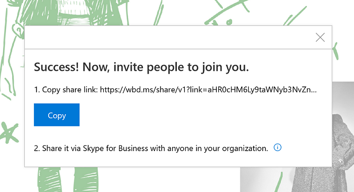

# Set up and use Microsoft Whiteboard 

>[!IMPORTANT]
>A new Microsoft Whiteboard app was released on July 12, 2018. The existing Whiteboard app that comes installed on Surface Hub and is pinned to the Welcome screen has been renamed **Microsoft Whiteboard 2016**. Microsoft Whiteboard 2016 will be automatically upgraded by May 21, 2019, and the collaboration service for the legacy app will stop functioning after June 7, 2019. For more details, see [Enable Microsoft Whiteboard on Surface Hub](https://support.office.com/article/enable-microsoft-whiteboard-on-surface-hub-b5df4539-f735-42ff-b22a-0f5e21be7627?ui=en-US&rs=en-US&ad=US).

The Microsoft Whiteboard app includes the capability for two Surface Hubs to collaborate in real time on the same board. 

By ensuring that your organization meets the prerequisites, users can then ink, collaborate, and ideate together. 

## Prerequisites for Whiteboard to Whiteboard collaboration (Microsoft Whiteboard 2016)

To get Whiteboard to Whiteboard collaboration up and running, you’ll need to make sure your organization meets the following requirements:

- Office 365 with cloud-based Azure Active Directory (Azure AD) for all users
- OneDrive for Business deployed for all users who intend to collaborate
- Currently not utilizing Office 365 Germany or Office 365 	operated by 21Vianet
- Surface Hub needs to be updated to Windows 10, version 1607 or newer
- Port 443 needs to be open since Whiteboard makes standard https requests
- Whiteboard.ms, wbd.ms, \*.onenote.com, and your company's SharePoint tenant domain URLs need to be whitelisted for proxies

 
>[!NOTE]
>Collaborative sessions can only take place between users within the same tenant, so users outside of your organization won’t be able to join even if they have a Surface Hub.

## Using Whiteboard to Whiteboard collaboration (Microsoft Whiteboard 2016)

To start a collaboration session:

1. In the Whiteboard app, tap the **Sign in** button.
2. Sign in with your organization ID.
3. Tap the **Invite** button next to your name at the top of the app.
4. Tap **Start session**. Whiteboard will generate a link that you can share.

    
    
5. Copy and paste this link into a Skype chat with another Surface Hub

When the other Surface Hub receives the link, the recipient can tap on the link, sign in to Whiteboard, and then begin collaborating. You can copy and paste other content, use smart ink features like Ink to Shape, and co-author together.

After you’re done, you can export a copy of the Whiteboard collaboration for yourself through the Share charm and leave the board for others to continue working. 

>[!TIP]
>When you start a collaboration session, Whiteboard creates a folder named **Whiteboard App Data** in your OneDrive for Business to store your shared whiteboards. After some collaboration sessions, this folder may continue to sync or process changes indefinitely. You can fix this by choosing to not sync the **Whiteboard App Data** folder to your device. Disabling sync for this folder won't limit your ability to use Whiteboard for collaboration sessions.

## Related topics

- [Windows 10 Creators Update for Surface Hub](https://www.microsoft.com/surface/support/surface-hub/windows-10-creators-update-surface-hub)
- [Support documentation for Microsoft Whiteboard](https://support.office.com/en-us/article/Whiteboard-Help-0c0f2aa0-b1bb-491c-b814-fd22de4d7c01)
