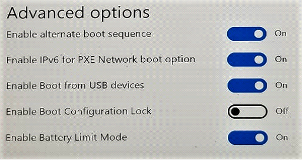
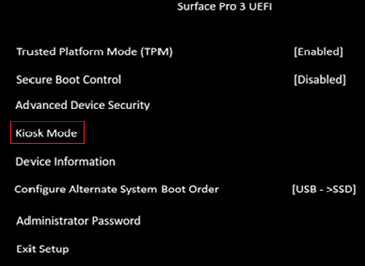
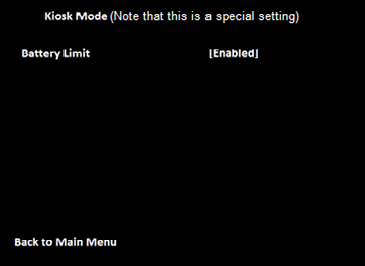
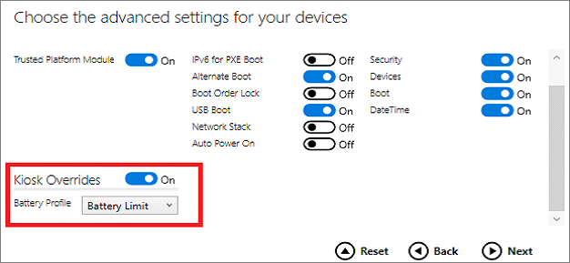

# Battery Limit setting

Battery Limit option is a UEFI setting that changes how the Surface device battery is charged and may prolong its longevity. This setting is recommended in  cases  in which the device is continuously connected to power, for example when devices are integrated into kiosk solutions.  

## How Battery Limit works

Setting the device on Battery Limit changes the protocol for charging the device battery. When Battery Limit is enabled, the battery charge will be limited to 50% of its maximum capacity. The charge level reported in Windows will reflect this limit. Therefore, it will show that the battery is charged up to 50% and will not charge beyond  this limit. If you enable Battery Limit while the device is above 50% charge, the Battery icon will show that the device is plugged in but discharging until the device reaches 50% of its maximum charge capacity.  

## Supported devices
The Battery Limit UEFI setting is built into the latest Surface devices including Surface Pro 7 and Surface Laptop 3. Earlier devices require a
 [Surface UEFI firmware update](manage-surface-driver-and-firmware-updates.md), available through Windows Update or via the MSI driver and firmware packages on the [Surface Support site](https://support.microsoft.com/help/4023482/surface-download-drivers-and-firmware-for-surface). Check [Enable "Battery Limit" for Surface devices that have to be plugged in for extended periods of time](https://support.microsoft.com/help/4464941) for the specific Surface UEFI version required for each supported device. 

## Enabling Battery Limit in Surface UEFI (Surface Pro 4 and later)

The Surface UEFI Battery Limit setting can be configured by booting into Surface UEFI (**Power + Vol Up** when turning on the device). Choose **boot configuration**, and then, under **Advanced Options**, toggle **Enable Battery Limit Mode** to **On**.  

 

## Enabling battery limit on Surface Go and Surface Go 2
The Surface Battery Limit setting can be configured by booting into Surface UEFI (**Power + Vol Up** when turning on the device). Choose **boot configuration**, and then, under **Kiosk Mode**, move the slider to the right to set Battery Limit to **Enabled**.  

 

## Enabling Battery Limit in Surface UEFI (Surface Pro 3)

The Surface UEFI Battery Limit setting can be configured by booting into Surface UEFI (**Power + Vol Up** when turning on the device). Choose **Kiosk Mode**, select **Battery Limit**, and then choose **Enabled**.

 

 

## Enabling Battery Limit using Surface Enterprise Management Mode (SEMM) or Surface Pro 3 firmware PowerShell scripts

The Surface UEFI battery limit is also available for configuration via the following methods:

- Surface Pro 4 and later 
    - [Microsoft Surface UEFI Configurator](https://docs.microsoft.com/surface/surface-enterprise-management-mode)  
    - Surface UEFI Manager Powershell scripts (SEMM_Powershell.zip) in the [Surface Tools for IT downloads](https://www.microsoft.com/download/details.aspx?id=46703)
- Surface Pro 3 
    - [SP3_Firmware_Powershell_Scripts.zip](https://www.microsoft.com/download/details.aspx?id=46703)

### Using Microsoft Surface UEFI Configurator

To configure Battery Limit mode, set the **Kiosk Overrides** setting on the **Advanced Settings** configuration page in SEMM (Surface Pro 4 and later).

### Using Surface UEFI Manager PowerShell scripts

The battery limit feature is controlled via the following setting:  

`407 = Battery Profile`

**Description**:  Active management scheme for battery usage pattern

**Default**:  `0` 

Set this to `1` to enable Battery Limit.

### Using Surface Pro 3 firmware tools

The battery limit feature is controlled via the following setting:  

**Name**: BatteryLimitEnable

**Description**:  BatteryLimit

**Current Value**:  `0` 

**Default Value**: `0`

**Proposed Value**: `0` 

Set this to `1` to enable Battery Limit.

>[!NOTE]
>To configure this setting, you must use [SP3_Firmware_Powershell_Scripts.zip](https://www.microsoft.com/download/details.aspx?id=46703). 

