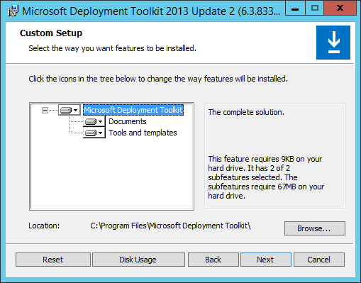

# Deploy Windows 10 to Surface devices with Microsoft Deployment Toolkit

**Applies to**
- Surface Studio
* Surface Pro 4
* Surface Book
* Surface 3
* Windows 10

This article walks you through the recommended process to deploy Windows 10 to Surface devices with Microsoft deployment technologies. The process described in this article yields a complete Windows 10 environment including updated firmware and drivers for your Surface device along with applications like Microsoft Office 365 and the Surface app. When the process is complete, the Surface device will be ready for use by the end user. You can customize this process to include your own applications and configuration to meet the needs of your organization. You can also follow the guidance provided in this article to integrate deployment to Surface devices into existing deployment strategies.

By following the procedures in this article, you can create an up-to-date reference image and deploy this image to your Surface devices, a process known as *reimaging*. Reimaging will erase and overwrite the existing environment on your Surface devices. This process allows you to rapidly configure your Surface devices with identical environments that can be configured to precisely fit your organization’s requirements. 

An alternative to the reimaging process is an upgrade process. The upgrade process is non-destructive and instead of erasing the existing environment on your Surface device, it allows you to install Windows 10 while retaining your user data, applications, and settings. You can read about how to manage and automate the upgrade process of Surface devices to Windows 10 at [Upgrade Surface devices to Windows 10 with MDT](upgrade-surface-devices-to-windows-10-with-mdt.md). 

The goal of the deployment process presented in this article is automation. By leveraging the many technologies and tools available from Microsoft, you can create a process that requires only a single touch on the devices being deployed. The automation can load the deployment environment; format the device; prepare an updated Windows image with the drivers required for the device; apply that image to the device; configure the Windows environment with licensing, membership in a domain, and user accounts; install applications; apply any Windows updates that were not included in the reference image; and log out.

By automating each aspect of the deployment process, you not only greatly decrease the effort involved, but you create a process that can be easily repeated and where human error becomes less of a factor. Take for example a scenario where you create a reference image for the device manually, but you accidentally install conflicting applications and cause the image to become unstable. In this scenario you have no choice but to begin again the manual process of creating your image. If in this same scenario you had automated the reference image creation process, you could repair the conflict by simply editing a step in the task sequence and then re-running the task sequence.

## Deployment tools

The deployment process described in this article leverages a number of Microsoft deployment tools and technologies. Some of these tools and technologies are included in Windows client and Windows Server, such as Hyper-V and Windows Deployment Services (WDS), while others are available as free downloads from the [Microsoft Download Center](https://www.microsoft.com/download/windows.aspx).

#### Microsoft Deployment Toolkit

The Microsoft Deployment Toolkit (MDT) is the primary component of a Windows deployment. It serves as a unified interface for most of the Microsoft deployment tools and technologies, such as the Windows Assessment and Deployment Kit (Windows ADK), Windows System Image Manager (Windows SIM), Deployment Image Servicing and Management (DISM), User State Migration Tool (USMT), and many other tools and technologies. Each of these is discussed throughout this article. The unified interface, called the *Deployment Workbench*, facilitates automation of the deployment process through a series of stored deployment procedures, known as a *task sequence*. Along with these task sequences and the many scripts and tools that MDT provides, the resources for a Windows deployment (driver files, application installation files, and image files) are stored in a network share known as the *deployment share*. 

You can download and find out more about MDT at [Microsoft Deployment Toolkit](https://technet.microsoft.com/windows/dn475741).

#### Windows Assessment and Deployment Kit

Although MDT is the tool you will interact with most during the deployment process, the deployment tools found in the Windows ADK perform most of the deployment tasks during the deployment process. The resources for deployment are held within the MDT deployment share, but it is the collection of tools included in Windows ADK that access the image files, stage drivers and Windows updates, run the deployment experience, provide instructions to Windows Setup, and back up and restore user data.

You can download and find out more about the Windows ADK at [Download the Windows ADK](https://developer.microsoft.com/windows/hardware/windows-assessment-deployment-kit#windowsadk).

#### Windows 10 installation media

Before you can perform a deployment with MDT, you must first supply a set of operating system installation files and an operating system image. These files and image can be found on the physical installation media (DVD) for Windows 10. You can also find these files in the disk image (ISO file) for Windows 10, which you can download from the [Volume Licensing Service Center (VLSC)](https://www.microsoft.com/Licensing/servicecenter/default.aspx).


>[!NOTE]
>The installation media generated from the [Get Windows 10](https://www.microsoft.com/en-us/software-download/windows10/) page differs from physical media or media downloaded from the VLSC, in that it contains an image file in Electronic Software Download (ESD) format rather than in the Windows Imaging (WIM) format. Installation media with an image file in WIM format is required for use with MDT. Installation media from the Get Windows 10 page cannot be used for Windows deployment with MDT.


#### Windows Server

Although MDT can be installed on a Windows client, to take full advantage of Windows Deployment Services’ ability to network boot, a full Windows Server environment is recommended. To provide network boot for UEFI devices like Surface with WDS, you will need Windows Server 2008 R2 or later.


>[!NOTE]
>To evaluate the deployment process for Surface devices or to test the deployment process described in this article with the upcoming release of Windows Server 2016, you can download evaluation and preview versions from the [TechNet Evaluation Center](https://www.microsoft.com/en-us/evalcenter).


#### Windows Deployment Services

Windows Deployment Services (WDS) is leveraged to facilitate network boot capabilities provided by the Preboot Execution Environment (PXE) server. The boot media generated by MDT is loaded onto the Surface device simply by pressing Enter at the prompt when the device attempts to boot from the attached network adapter or Surface Dock.

#### Hyper-V virtualization platform

The process of creating a reference image should always be performed in a virtual environment. When you use a virtual machine as the platform to build your reference image, you eliminate the need for installation of additional drivers. The drivers for a Hyper-V virtual machine are included by default in the factory Windows 10 image. When you avoid the installation of additional drivers – especially complex drivers that include application components like control panel applications – you ensure that the image created by your reference image process will be as universally compatible as possible.

>[!NOTE]
>A Generation 1 virtual machine is recommended for the preparation of a reference image in a Hyper-V virtual environment.

Because customizations are performed by MDT at the time of deployment, the goal of reference image creation is not to perform customization but to increase performance during deployment by reducing the number of actions that need to occur on each deployed device. The biggest action that can slow down an MDT deployment is the installation of Windows updates. When MDT performs this step during the deployment process, it downloads the updates on each deployed device and installs them. By installing Windows updates in your reference image, the updates are already installed when the image is deployed to the device and the MDT update process only needs to install updates that are new since the image was created or are applicable to products other than Windows (for example, Microsoft Office updates).


>[!NOTE]
>Hyper-V is available not only on Windows Server, but also on Windows clients, including Professional and Enterprise editions of Windows 8, Windows 8.1, and Windows 10. Find out more at [Client Hyper-V on Windows 10](https://msdn.microsoft.com/virtualization/hyperv_on_windows/windows_welcome) and [Client Hyper-V on Windows 8 and Windows 8.1](https://technet.microsoft.com/library/hh857623) in the TechNet Library.  Hyper-V is also available as a standalone product, Microsoft Hyper-V Server, at no cost. You can download [Microsoft Hyper-V Server 2012 R2](https://www.microsoft.com/en-us/evalcenter/evaluate-hyper-v-server-2012-r2) or [Microsoft Hyper-V Server 2016 Technical Preview](https://www.microsoft.com/en-us/evalcenter/evaluate-hyper-v-server-technical-preview) from the TechNet Evaluation Center.


#### Surface firmware and drivers

For your deployed Windows environment to function correctly on your Surface devices, you will need to install the drivers used by Windows to communicate with the components of your device. These drivers are available for download in the Microsoft Download Center for each Surface device. You can find the correct Microsoft Download Center page for your device at [Download the latest firmware and drivers for Surface devices](https://technet.microsoft.com/itpro/surface/deploy-the-latest-firmware-and-drivers-for-surface-devices).

When you browse to the specific Microsoft Download Center page for your device, you will notice that there are two files available for download. One file is a Windows Installer (.msi) file. This file is used to update drivers on devices that are already running Windows or that have device management solutions. The other file is an archive (.zip) file. This file contains the individual driver files that are used during deployment, or for manual installation with Device Manager. The file that you will need to download is the .zip archive file. You can read more about the difference between the firmware and driver pack file types at [Manage Surface driver and firmware updates](https://technet.microsoft.com/itpro/surface/manage-surface-pro-3-firmware-updates).


In addition to the driver files that help Windows communicate with the hardware components of the Surface device, the .zip file you download will also contain firmware updates. These firmware updates will update the instructions used by the device hardware to communicate between components and Windows. The firmware of Surface device components is updated by installation of specific driver files and thus is installed along with the other drivers during deployment. The firmware of an out-of-date Surface device is thus updated when the device reboots during and after the Windows deployment process.

>[!NOTE]
>Beginning in Windows 10, the drivers for Surface devices are included in the Windows Preinstallation Environment (WinPE). In earlier versions of Windows, specific drivers (like network drivers) had to be imported and configured in MDT for use in WinPE to successfully deploy to Surface devices.

#### Application installation files

In addition to the drivers that are used by Windows to communicate with the Surface device’s hardware and components, you will also need to provide the installation files for any applications that you want to install on your deployed Surface devices. To automate the deployment of an application, you will also need to determine the command-line instructions for that application to perform a silent installation. In this article, the Surface app and Microsoft Office 365 will be installed as examples of application installation. The application installation process can be used with any application with installation files that can be launched from command line.

>[!NOTE]
>If the application files for your application are stored on your organization’s network and will be accessible from your Surface devices during the deployment process, you can deploy that application directly from that network location. To use installation files from a network location, use the **Install Application Without Source Files or Elsewhere on the Network** option in the MDT New Application Wizard, which is described in the [Import applications](#import-applications) section later in this article.

#### Microsoft Surface Deployment Accelerator

If you want to deploy only to Surface devices or you want an accelerated method to perform deployment to Surface devices, you can use the Microsoft Surface Deployment Accelerator to generate an MDT deployment share complete with Surface device drivers, Surface apps, and pre-configured task sequences to create a reference image and perform deployment to Surface devices. Microsoft Surface Deployment Accelerator can automatically import boot images into WDS and prepare WDS for network boot (PXE). You can download the Microsoft Surface Deployment Accelerator from the [Surface Tools for IT](https://www.microsoft.com/download/details.aspx?id=46703) page in the Microsoft Download Center.

### Install the deployment tools

Before you can configure the deployment environment with Windows images, drivers, and applications, you must first install the deployment tools that will be used throughout the deployment process. The three main tools to be installed are WDS, Windows ADK, and MDT. WDS provides the capacity for network boot, Windows ADK provides several deployment tools that perform specific deployment tasks, and MDT provides automation and a central interface from which to manage and control the deployment process.

To boot from the network with either your reference virtual machines or your Surface devices, your deployment environment must include a Windows Server environment. The Windows Server environment is required to install WDS and the WDS PXE server. Without PXE support, you will be required to create physical boot media, such as a USB stick to perform your deployment – MDT and Windows ADK will still be required, but Windows Server is not required. Both MDT and Windows ADK can be installed on a Windows client and perform a Windows deployment.

>[!NOTE]
>To download deployment tools directly to Windows Server, you must disable [Internet Explorer Enhanced Security Configuration](https://technet.microsoft.com/library/dd883248). On Windows Server 2012 R2, this can be performed directly through the **Server Manager** option on the **Local Server** tab. In the **Properties** section, **IE Enhanced Security Configuration** can be found on the right side. You may also need to enable the **File Download** option for the **Internet** zone through the **Security** tab of **Internet Options**.

#### Install Windows Deployment Services

Windows Deployment Services (WDS) is a Windows Server role. To add the WDS role to a Windows Server 2012 R2 environment, use the Add Roles and Features Wizard, as shown in Figure 1. Start the Add Roles and Features Wizard from the **Manage** button of **Server Manager**. Install both the Deployment Server and Transport Server role services.


*Figure 1. Install the Windows Deployment Services server role*

After the WDS role is installed, you need to configure WDS. You can begin the configuration process from the WDS node of Server Manager by right-clicking your server’s name and then clicking **Windows Deployment Services Management Console**. In the **Windows Deployment Services** window, expand the **Servers** node to find your server, right-click your server, and then click **Configure** in the menu to start the Windows Deployment Services Configuration Wizard, as shown in Figure 2.


*Figure 2. Configure PXE response for Windows Deployment Services*

>[!NOTE]
>Before you configure WDS make sure you have a local NTFS volume that is not your system drive (C:) available for use with WDS. This volume is used to store WDS boot images, deployment images, and configuration.

Using the Windows Deployment Services Configuration Wizard, configure WDS to fit the needs of your organization. You can find detailed instructions for the installation and configuration of WDS at [Windows Deployment Services Getting Started Guide for Windows Server 2012](https://technet.microsoft.com/library/jj648426). On the **PXE Server Initial Settings** page, be sure to configure WDS so that it will respond to your Surface devices when they attempt to boot from the network. If you have already installed WDS or need to change your PXE server response settings, you can do so on the **PXE Response** tab of the **Properties** of your server in the Windows Deployment Services Management Console.

>[!NOTE]
>You will add boot images to WDS when you update your boot images in MDT. You do not need to add boot images or Windows images to WDS when you configure the role.

#### Install Windows Assessment and Deployment Kit

To install Windows ADK, run the Adksetup.exe file that you downloaded from [Download the Windows ADK](https://developer.microsoft.com/windows/hardware/windows-assessment-deployment-kit#adkwin10). Windows ADK must be installed before MDT. You should always download and use the most recent version of Windows ADK. A new version is usually released corresponding with each new version of Windows.

>[!NOTE]
>You can also use the Adksetup.exe file to download the Windows ADK installation files locally for use on other devices.

When you get to the **Select the features you want to install** page, you only need to select the **Deployment Tools** and **Windows Preinstallation Environment (Windows PE)** check boxes to deploy Windows 10 using MDT, as shown in Figure 3. 


*Figure 3. Only Deployment Tools and Windows PE options are required for deployment with MDT*

#### Install Microsoft Deployment Toolkit

After the Windows ADK installation completes successfully, you can install MDT. When you download MDT, ensure that you download the version that matches the architecture of your deployment server environment. For Windows Server the architecture is 64-bit. Download the MDT installation file that ends in **x64**. When MDT is installed you can use the default options during the installation wizard, as shown in Figure 4.



*Figure 4. Install the Microsoft Deployment Toolkit with default options*

Before you can open the MDT Deployment Workbench, you must enable execution of scripts in PowerShell. If you do not do this, the following error message may be displayed: *"Initialization Error PowerShell is required to use the Deployment Workbench.  Please install PowerShell then relaunch Deployment Workbench."*

To enable the execution of scripts, run the following cmdlet in PowerShell as an Administrator:

   `Set-ExecutionPolicy RemoteSigned -Scope CurrentUser`

## Create a reference image

Now that you have installed the required tools, you can begin the first step of customizing your deployment environment to your needs – create a reference image. Because the reference image should be created in a virtual machine where there is no need for drivers to be installed, and because the reference image will not include applications, you can use the MDT deployment environment almost entirely with default settings.

### Create a deployment share

Now that you have the tools installed, the next step is to configure MDT for the creation of a reference image. Before you can perform the process of creating a reference image, MDT needs to be set up with a repository for scripts, images, and other deployment resources. This repository is known as the *deployment share*. After the deployment share is created, you must supply MDT with a complete set of Windows 10 installation files, the last set of tools required before MDT can perform reference image creation.

To create the deployment share, follow these steps:

1. Open the Deployment Workbench from your Start menu or Start screen, as shown in Figure 5.

   

   *Figure 5. The MDT Deployment Workbench*

2. Right-click the **Deployment Shares** folder, and then click **New Deployment Share** to start the New Deployment Share Wizard, as shown in Figure 6.

   

   *Figure 6. The Summary page of the New Deployment Share Wizard*

3. Create a new deployment share with New Deployment Share Wizard with the following steps:

  * **Path** – Specify a local folder where the deployment share will reside, and then click **Next**.

      >[!NOTE]
      >Like the WDS remote installation folder, it is recommended that you put this folder on an NTFS volume that is not your system volume.

  * **Share** – Specify a name for the network share under which the local folder specified on the **Path** page will be shared, and then click **Next**.

      >[!NOTE]
      >The share name cannot contain spaces.

      >[!NOTE]
      >You can use a Dollar Sign (**$**) to hide your network share so that it will not be displayed when users browse the available network shares on the server in File Explorer.

  * **Descriptive Name** – Enter a descriptive name for the network share (this descriptive name can contain spaces), and then click **Next**. The descriptive name will be the name of the folder as it appears in the Deployment Workbench.
  * **Options** – You can accept the default options on this page. Click **Next**.
  * **Summary** – Review the specified configuration on this page before you click **Next** to begin creation of the deployment share.
  * **Progress** – While the deployment share is being created, a progress bar is displayed on this page to indicate the status of the deployment share creation process.
  * **Confirmation** – When the deployment share creation process completes, the success of the process is displayed on this page. Click **Finish** to complete the New Deployment Share Wizard.

4. When the New Deployment Share Wizard is complete, you can expand the Deployment Shares folder to find your newly created deployment share.
5. You can expand your deployment share, where you will find several folders for the resources, scripts, and components of your MDT deployment environment are stored.

To secure the deployment share and prevent unauthorized access to the deployment resources, you can create a local user on the deployment share host and configure permissions for that user to have read-only access to the deployment share only. It is especially important to secure access to the deployment share if you intend to automate the logon to the deployment share during the deployment boot process. By automating the logon to the deployment share during the boot of deployment media, the credentials for that logon are stored in plaintext in the bootstrap.ini file on the boot media.

>[!NOTE]
>If you intend to capture images (such as the reference image) with this user, the user must also have write permission on the Captures folder in the MDT deployment share.

You now have an empty deployment share that is ready for you to add the resources that will be required for reference image creation and deployment to Surface devices.

### Import Windows installation files

The first resources that are required to perform a deployment of Windows are the installation files from Windows 10 installation media. Even if you have an already prepared reference image, you still need to supply the unaltered installation files from your installation media. The source of these files can be a physical disk, or it can be an ISO file like the download from the Volume Licensing Service Center (VLSC).

>[!NOTE]
>A 64-bit operating system is required for compatibility with Surface Studio, Surface Pro 4, Surface Book, Surface Pro 3, and Surface 3.

To import Windows 10 installation files, follow these steps:

1. Right-click the **Operating Systems** folder under your deployment share in the Deployment Workbench, and then click **New Folder** to open the **New Folder** page, as shown in Figure 7.

   
   
   *Figure 7. Create a new folder on the New Folder page*

2. On the **New Folder** page a series of steps is displayed, as follows:
  * **General Settings** – Enter a name for the folder in the **Folder Name** field (for example, Windows 10 Enterprise), add any comments you want in the **Comments** field, and then click **Next**.
  * **Summary** – Review the specified configuration of the new folder on this page, and then click **Next**.
  * **Progress** – A progress bar will be displayed on this page while the folder is created. This page will likely pass very quickly.
  * **Confirmation** – When the new folder has been created, a **Confirmation** page displays the success of the operation. Click **Finish** to close the **New Folder** page.
3. Expand the Operating Systems folder to see the newly created folder.
4. Right-click the newly created folder, and then click **Import Operating System** to launch the Import Operating System Wizard, as shown in Figure 8.

   

   *Figure 8. Import source files with the Import Operating System Wizard*

5. The Import Operating System Wizard walks you through the import of your operating system files, as follows:
  * **OS Type** – Click **Full Set of Source Files** to specify that you are importing the Windows source files from installation media, and then click **Next**.
  * **Source** – Click **Browse**, move to and select the folder or drive where your installation files are found, and then click **Next**.
  * **Destination** – Enter a name for the new folder that will be created to hold the installation files, and then click **Next**.
  * **Summary** – Review the specified configuration on this page before you click **Next** to begin the import process.
  * **Progress** – While the installation files are imported, a progress bar is displayed on this page.
  * **Confirmation** – When the operating system import process completes, the success of the process is displayed on this page. Click **Finish** to complete Import Operating System Wizard.
6.	Expand the folder you created in Step 1 to see the entry for your newly imported installation files for Windows 10.

Now that you’ve imported the installation files from the installation media, you have the files that MDT needs to create the reference image and you are ready to instruct MDT how to create the reference image to your specifications.

### Create reference image task sequence

As described in the [Deployment tools](#deployment-tools) section of this article, the goal of creating a reference image is to keep the Windows environment as simple as possible while performing tasks that would be common to all devices being deployed. You should now have a basic MDT deployment share configured with default options and a set of unaltered, factory installation files for Windows 10. This simple configuration is perfect for reference image creation because the deployment share contains no applications or drivers to interfere with the process.

>[!NOTE]
>For some organizations keeping a simple deployment share without applications or drivers is the simplest solution for creation of reference images. You can easily connect to more than one deployment share from a single Deployment Workbench and copy images from a simple, reference-image-only deployment share to a production deployment share complete with drivers and applications.

To create the reference image task sequence, follow these steps:

1. Right-click the **Task Sequences** folder under your deployment share in the Deployment Workbench, and then click **New Task Sequence** to start the New Task Sequence Wizard, as shown in Figure 9.

   

   *Figure 9. Create a new task sequence to deploy and update a Windows 10 reference environment*

2. The New Task Sequence Wizard presents a series of steps, as follows:
  * **General Settings** – Enter an identifier for the reference image task sequence in the **Task Sequence ID** field, a name for the reference image task sequence in the **Task Sequence Name** field, and any comments for the reference image task sequence in the **Task Sequence Comments** field, and then click **Next**.
  >[!NOTE]
  >The **Task Sequence ID** field cannot contain spaces and can be a maximum of 16 characters.
  * **Select Template** – Select **Standard Client Task Sequence** from the drop-down menu, and then click **Next**.
  * **Select OS** – Navigate to and select the Windows 10 image you imported with the Windows 10 installation files, and then click **Next**.
  * **Specify Product Key** – Click **Do Not Specify a Product Key at This Time**, and then click **Next**.
  * **OS Settings** – Enter a name, organization, and home page URL in the **Full Name**, **Organization**, and **Internet Explorer Home Page** fields, and then click **Next**.
  * **Admin Password** – Click **Use the Specified Local Administrator Password**, enter a password in the provided field, and then click **Next**.
  >[!NOTE]
  >During creation of a reference image, any specified Administrator password will be automatically removed when the image is prepared for capture with Sysprep. During reference image creation, a password is not necessary, but is recommended to remain in line with best practices for production deployment environments.
  * **Summary** – Review the specified configuration on this page before you click **Next** to begin creation of the task sequence.
  * **Progress** – While the task sequence is created, a progress bar is displayed on this page.
  * **Confirmation** – When the task sequence creation completes, the success of the process is displayed on this page. Click **Finish** to complete the New Task Sequence Wizard.
2. Select the **Task Sequences** folder, right-click the new task sequence you created, and then click **Properties**.
3. Select the **Task Sequence** tab to view the steps that are included in the Standard Client Task Sequence template, as shown in Figure 10.

   

   *Figure 10. Enable Windows Update in the reference image task sequence*

4. Select the **Windows Update (Pre-Application Installation)** option, located under the **State Restore** folder.
5. Click the **Options** tab, and then clear the **Disable This Step** check box.
6. Repeat Step 4 and Step 5 for the **Windows Update (Post-Application Installation)** option.
7. Click **OK** to apply changes to the task sequence, and then close the task sequence properties window.

### Generate and import MDT boot media

To boot the reference virtual machine from the network, the MDT deployment share first must be updated to generate boot media with the resources that have been added in the previous sections.

To update the MDT boot media, follow these steps:

1. Right-click the deployment share in the Deployment Workbench, and then click **Update Deployment Share** to start the Update Deployment Share Wizard, as shown in Figure 11.

   

   *Figure 11. Generate boot images with the Update Deployment Share Wizard*

2. Use the Update Deployment Share Wizard to create boot images with the following process:
  * **Options** – Click **Completely Regenerate the Boot Images**, and then click **Next**.
  >[!NOTE]
  >Because this is the first time the newly created deployment share has been updated, new boot images will be generated regardless of which option you select on the **Options** page.
  * **Summary** – Review the specified options on this page before you click **Next** to begin generation of boot images.
  * **Progress** – While the boot images are being generated, a progress bar is displayed on this page.
  * **Confirmation** – When the boot images have been generated, the success of the process is displayed on this page. Click **Finish** to complete the Update Deployment Share Wizard.
3. Confirm that boot images have been generated by navigating to the deployment share in File Explorer and opening the Boot folder. The following files should be displayed, as shown in Figure 12:
  * **LiteTouchPE_x86.iso**
  * **LiteTouchPE_x86.wim**
  * **LiteTouchPE_x64.iso**
  * **LiteTouchPE_x64.wim**


   

   *Figure 12. Boot images displayed in the Boot folder after completion of the Update Deployment Share Wizard*

To import the MDT boot media into WDS for PXE boot, follow these steps:

1. Open Windows Deployment Services from the Start menu or Start screen.
2. Expand **Servers** and your deployment server.
3. Click the **Boot Images** folder, as shown in Figure 13.

   

   *Figure 13. Start the Add Image Wizard from the Boot Images folder*

4. Right-click the **Boot Images** folder, and then click **Add Boot Image** to open the Add Image Wizard, as shown in Figure 14.

   

   *Figure 14. Import the LiteTouchPE_x86.wim MDT boot image*

5. The Add Image Wizard displays a series of steps, as follows:
  * **Image File** – Click **Browse** and navigate to the **Boot** folder in your deployment share, click **LiteTouchPE_x86.wim**, click **Open**, and then click **Next**.
  * **Image Metadata** – Enter a name and description for the MDT boot media, or click **Next** to accept the default options.
  * **Summary** – Review your selections to import a boot image into WDS, and then click **Next**.
  * **Task Progress** – A progress bar is displayed as the selected image file is copied into the WDS remote installation folder. Click **Finish** when the task is complete to close the Add Image Wizard.

>[!NOTE]
>Only the 32-bit boot image, LiteTouchPE_x86.wim, is required to boot from BIOS devices, including Generation 1 Hyper-V virtual machines like the reference virtual machine.

If your WDS configuration is properly set up to respond to PXE clients, you should now be able to boot from the network with any device with a network adapter properly configured for network boot (PXE).

>[!NOTE]
>If your WDS server resides on the same server as DHCP or in a different subnet than the devices you are attempting to boot, additional configuration may be required. For more information, see [Managing Network Boot Programs](https://technet.microsoft.com/library/cc732351).

### Deploy and capture a reference image

Your deployment environment is now set up to create a reference image for Windows 10 complete with Windows Updates.

>[!NOTE]
>You cannot install version updates (such as Windows 10, Version 1511) in a reference image. To create a reference image with a new version of Windows, you must use installation files from that version of Windows. When  you install a version update in Windows, it effectively performs an upgrade to a new version of Windows, and upgraded installations of Windows cannot be prepared for deployment with Sysprep.<br/><br/>
By using a fully automated task sequence in an MDT deployment share dedicated to reference image creation, you can greatly reduce the time and effort required to create new reference images and it is the best way to ensure that your organization is ready for feature updates and new versions of Windows 10.

You can now boot from the network with a virtual machine to run the prepared task sequence and generate a reference image. When you prepare your virtual machine in Hyper-V for reference image creation, consider the following:

* Use a Generation 1 virtual machine for the simplicity of drivers and to ensure maximum compatibility with both BIOS and UEFI devices.
* Ensure your virtual machine has at least 1 GB of system memory at boot. You can ensure that the virtual machine has at least 1 GB of memory at boot but allow the memory to adjust after boot by using Dynamic Memory. You can read more about Dynamic Memory in the [Hyper-V Dynamic Memory Overview](https://technet.microsoft.com/library/hh831766).
* Ensure your virtual machine uses a legacy network adapter to support network boot (PXE); that network adapter should be connected to the same network as your deployment server, and that network adapter should receive an IP address automatically via DHCP.
* Configure your boot order such that PXE Boot is the first option.

When your virtual machine (VM) is properly configured and ready, start or boot the VM and be prepared to press the F12 key when prompted to boot via PXE from the WDS server.

Perform the reference image deployment and capture using the following steps:

1. Start your virtual machine and press the F12 key when prompted to boot to the WDS server via PXE, as shown in Figure 15.

   

   *Figure 15. Start network boot by pressing the F12 key*

2. Click **Run the Deployment Wizard to Install a New Operating System** to begin the MDT deployment process.
3. Enter your MDT username and password, a user with rights to access the MDT deployment share over the network and with rights to write to the Captures folder in the deployment share.
4. After your credentials are validated, the Windows Deployment Wizard will start and process the boot and deployment share rules.
5. The Windows Deployment Wizard displays a series of steps, as follows:
  * **Task Sequence** – Select the task sequence you created for reference image creation (it should be the only task sequence available), and then click **Next**.
  * **Computer Details** – Leave the default computer name, workgroup name, and the **Join a Workgroup** option selected, and then click **Next**. The computer name and workgroup will be reset when the image is prepared by Sysprep and captured.
  * **Move Data and Settings** – Leave the default option of **Do Not Move User Data and Settings** selected, and then click **Next**.
  * **User Data (Restore)** – Leave the default option of **Do Not Restore User Data and Settings** selected, and then click **Next**.
  * **Locale and Time** – Leave the default options for language and time settings selected. The locale and time settings will be specified during deployment of the image to other devices. Click **Next**.
  * **Capture Image** – Click the **Capture an Image of this Reference Computer** option, as shown in Figure 16. In the **Location** field, keep the default location of the Captures folder. You can keep or change the name of the image file in the **File Name** field. When you are finished, click **Next**.
  
  
    
  *Figure 16. Use the Capture Image page to capture an image of the reference machine after deployment*

  * **Ready** – You can review your selections by expanding **Details** on the **Ready** page. Click **Begin** when you are ready to perform the deployment and capture of your reference image.

6. Your reference task sequence will run with the specified options.

As the task sequence processes the deployment, it will automatically perform the following tasks:
* Install the Windows 10 image from the installation files you supplied
* Reboot into Windows 10
* Run Windows updates until all Windows updates have been installed and the Windows environment is fully up to date
* Run Sysprep and prepare the Windows 10 environment for deployment
* Reboot into WinPE
* Capture an image of the Windows 10 environment and store it in the Captures folder in the MDT deployment share

>[!NOTE]
>The Windows Update process can take some time to complete as it searches the Internet for updates, downloads those updates, and then installs them. By performing this process now, in the reference environment, you eliminate the need to perform these tasks on each deployed device and significantly reduce the amount of time and bandwidth required to perform your deployment. 

When the task sequence completes, your virtual machine will be off and a new reference image complete with updates will be ready in your MDT deployment share for you to import it and prepare your deployment environment for deployment to Surface devices.

## Deploy Windows 10 to Surface devices

With a freshly prepared reference image, you are now ready to configure the deployment process for deployment to the Surface devices. Use the steps detailed in this section to produce a deployment process that requires minimal effort on each Surface device to produce a complete and ready-to-use Windows 10 environment.

### Import reference image

After the reference image has been created and stored in the Captures folder, you need to add it to your MDT deployment share as an image for deployment. You perform this task by using the same process that you used to import the installation files for Windows 10.

To import the reference image for deployment, use the following steps:

1. Right-click the **Operating Systems** folder under your deployment share in the Deployment Workbench or the folder you created in when you imported Windows 10 installation files, and then click **Import Operating System** to start the Import Operating System Wizard. 
2. Import the custom image with the Import Operating System Wizard by using the following steps:
  * **OS Type** – Select Custom Image File to specify that you are importing the Windows source files from installation media, and then click **Next**.
  * **Image** – Click **Browse**, and then navigate to and select the image file in the **Captures** folder in your deployment share. Select the **Move the Files to the Deployment Share Instead of Copying Them** checkbox if desired. Click **Next**. 
  * **Setup** – Click **Setup Files are not Neededf**, and then click **Next**.
  * **Destination** – Enter a name for the new folder that will be created to hold the image file, and then click **Next**.
  * **Summary** – Review the specified configuration on this page before you click **Next** to begin the import process.
  * **Progress** – While the image is imported, a progress bar is displayed on this page.
  * **Confirmation** – When the import process completes, the success of the process is displayed on this page. Click **Finish** to complete the Import Operating System Wizard.
3.	Expand the folder in which you imported the image to verify that the import completed successfully.

>[!NOTE]
>You can import the reference image into the same deployment share that you used to create your reference image, or you could import the reference image into a new deployment share for deployment to your Surface devices. If you chose to create a new deployment share for deployment of your reference image, remember that you still need to import a full set of installation files from installation media.

Now that your updated reference image is imported, it is time to prepare your deployment environment for deployment to Surface devices complete with drivers, applications, and automation.

### Import Surface drivers

Before you can deploy your updated reference image to Surface devices, or any physical environment, you need to supply MDT with the drivers that Windows will use to communicate with that physical environment. For Surface devices you can download all of the drivers required by Windows in a single archive (.zip) file in a format that is ready for deployment. In addition to the drivers that are used by Windows to communicate with the hardware and components, Surface firmware and driver packs also include updates for the firmware of those components. By installing the Surface firmware and driver pack, you will also bring your device’s firmware up to date. If you have not done so already, download the drivers for your Surface device listed at [Download the latest firmware and drivers for Surface devices](https://technet.microsoft.com/itpro/surface/deploy-the-latest-firmware-and-drivers-for-surface-devices).

Many devices require that you import drivers specifically for WinPE in order for the MDT boot media to communicate with the deployment share and to boot properly on that device. Even Surface Pro 3 required that network drivers be imported specifically for WinPE for deployment of Windows 8.1. Fortunately, for Windows 10 deployments to Surface devices, all of the required drivers for operation of WinPE are contained within the out-of-box drivers that are built into Windows 10. It is still a good idea to prepare your environment with folder structure and selection profiles that allow you to specify drivers for use in WinPE. You can read more about that folder structure in **Step 5: Prepare the drivers repository** in [Deploy a Windows 10 image using MDT 2013 Update 2](https://technet.microsoft.com/itpro/windows/deploy/deploy-a-windows-10-image-using-mdt/#sec05).

To import the Surface drivers (in this example, Surface Pro 4) into MDT, follow these steps:

1. Extract the downloaded archive (.zip) file to a folder that you can easily locate. Keep the driver files separate from other drivers or files.
2. Open the Deployment Workbench and expand the Deployment Shares node and your deployment share. 
3. If you have not already created a folder structure by operating system version, you should do so now and create under the Windows 10 x64 folder a new folder for Surface Pro 4 drivers named Surface Pro 4. Your Out-of-Box Drivers folder should resemble the following structure, as shown in Figure 17:
   * WinPE x86
   * WinPE x64
   * Windows 10 x64
     * Microsoft Corporation
       * Surface Pro 4

   

   *Figure 17. The recommended folder structure for drivers*

4. Right-click the **Surface Pro 4** folder, and then click **Import Drivers** to start the Import Drivers Wizard, as shown in Figure 18.

   

   *Figure 18. The Progress page during drivers import*

5. The Import Driver Wizard displays a series of steps, as follows:
  * **Specify Directory** – Click **Browse** and navigate to the folder where you extracted the Surface Pro 4 firmware and drivers in Step 1.
  * **Summary** – Review the specified configuration on this page before you click **Next** to begin the import process.
  * **Progress** – While the drivers are imported, a progress bar is displayed on this page.
  * **Confirmation** – When the import process completes, the success of the process is displayed on this page. Click **Finish** to complete the Import Drivers Wizard.
6.	Click the **Surface Pro 4** folder and verify that the folder now contains the drivers that were imported, as shown in Figure 19.

   

   *Figure 19. Drivers for Surface Pro 4 imported and organized in the MDT deployment share*

### Import applications

You can import any number of applications into MDT for installation on your devices during the deployment process. You can configure your applications and task sequences to prompt you during deployment to pick and choose which applications are installed, or you can use your task sequence to explicitly define which applications are installed. For more information, see **Step 4: Add an application** in [Deploy a Windows 10 image using MDT 2013 Update 2](https://technet.microsoft.com/itpro/windows/deploy/deploy-a-windows-10-image-using-mdt/#sec04).

#### Import Microsoft Office 365 Installer

The Office Deployment Tool is a free download available in the Microsoft Download Center that allows IT professionals and system administrators to download and prepare Office installation packages for Office Click-to-Run. You can find the Office Deployment Tool and instructions to download Click-to-Run for Office 365 installation source files at [Download Click-to-Run for Office 365 products by using the Office Deployment Tool](https://technet.microsoft.com/library/jj219424).

Download and install the version of Office Deployment Tool (ODT), for Office 2013 or Office 2016, that fits your organization’s needs and use the steps provided by that page to download the Office installation files for use with MDT.

After you have downloaded the source files for your version of Office Click-to-Run, you need to edit the Configuration.xml file with instructions to install Office Click-to-Run silently. To configure the Office Deployment Tool for silent installation, follow these steps:

1. Right-click the existing **Configuration.xml** file, and then click **Edit**.
2. This action opens the file in Notepad. Replace the existing text with the following:
  ```
   <Configuration> 
   <Add OfficeClientEdition="32">  
    <Product ID="O365ProPlusRetail" >  
     <Language ID="en-us" />        
    </Product>  
   </Add> 
   <Display Level="None" AcceptEULA="TRUE" /> </Configuration>
```

3. Save the file.

The default behavior of Setup.exe is to look for the source files in the path that contains **Setup.exe**. If the installation files are not found in this folder, the Office Deployment Tool will default to online source files from an Internet connection.

For MDT to perform an automated installation of office, it is important to configure the **Display Level** option to a value of **None**. This setting is used to suppress the installation dialog box for silent installation. It is required that the **AcceptEULA** option is set to **True** to accept the license agreement when the **Display Level** option is set to **None**. With both of these options configured, the installation of Office will occur without the display of dialog boxes which could potentially cause the installation to pause until a user can address an open dialog box.

Now that the installation and configuration files are prepared, the application can be imported into the deployment share by following these steps:

1. Open the Deployment Workbench. 
2. Expand the deployment share, right-click the **Applications** folder, and then click **New Application** to start the New Application Wizard, as shown in Figure 20.

   

   *Figure 20. Enter the command and directory for Office 2016 Click-to-Run*

3. The New Application Wizard walks you through importing the Office 2016 Click-to-Run files, as follows:
  * **Application Type** – Click **Application with Source Files**, and then click **Next**.
  * **Details** – Enter a name for the application (for example, Office 2016 Click-to-Run) in the **Application Name** field. Enter publisher, version, and language information in the **Publisher**, **Version**, and **Language** fields if desired. Click **Next**.
  * **Source** – Click **Browse** to navigate to and select the folder where you downloaded the Office installation files with the Office Deployment Tool, and then click **Next**.
  * **Destination** – Enter a name for the folder where the application files will be stored in the **Specify the Name of the Directory that Should Be Created** field or click **Next** to accept the default name.
  * **Command Details** – Enter the Office Deployment Tool installation command line:

     `Setup.exe /configure configuration.xml`

  * **Summary** – Review the specified configuration on this page before you click **Next** to begin the import process.
  * **Progress** – While the installation files are imported, a progress bar is displayed on this page.
  * **Confirmation** – When the import process completes, the success of the process is displayed on this page. Click **Finish** to complete the New Application Wizard.

4. You should now see the **Office 2016 Click-to-Run** item under the **Applications** folder in the Deployment Workbench.

#### Import Surface app installer

The Surface app is a Microsoft Store app that provides the user with greater control over specific Surface device functions and capabilities (for example, control over the sensitivity of the Surface Pen). It is a highly recommended app for Surface devices to provide end users with the best experience and greatest control over their device. Find out more about the Surface app at [Install and use the Surface app](https://www.microsoft.com/surface/support/apps-and-windows-store/surface-app?os=windows-10).

To perform a deployment of the Surface app, you will need to download the app files through Microsoft Store for Business. You can find detailed instructions on how to download the Surface app through Microsoft Store for Business at [Deploy Surface app with Microsoft Store for Business](https://technet.microsoft.com/itpro/surface/deploy-surface-app-with-windows-store-for-business).

After you have downloaded the installation files for Surface app, including the AppxBundle and license files, you can import these files into the deployment share through the same process as a desktop application like Microsoft Office. Both the AppxBundle and license files must be together in the same folder for the import process to complete successfully. Use the following command on the **Command Details** page to install the Surface app:
   ```
DISM.exe /Online /Add-ProvisionedAppxPackage /PackagePath: Microsoft.SurfaceHub_10.0.342.0_neutral_~_8wekyb3d8bbwe.AppxBundle /LicensePath: Microsoft.SurfaceHub_8wekyb3d8bbwe_a53ef8ab-9dbd-dec1-46c5-7b664d4dd003.xml
   ```

### Create deployment task sequence

The next step in the process is to create the deployment task sequence. This task sequence will be configured to completely automate the deployment process and will work along with customized deployment share rules to reduce the need for user interaction down to a single touch. Before you can make  customizations to include all of this automation, the new task sequence has to be created from a template.

To create the deployment task sequence, follow these steps:
1. In the Deployment Workbench, under your Deployment Share, right-click the **Task Sequences** folder, and then click **New Task Sequence** to start the New Task Sequence Wizard.
2. Use these steps to create the deployment task sequence with the New Task Sequence Wizard:
  * **General Settings** – Enter an identifier for the deployment task sequence in the **Task Sequence ID** field, a name for the deployment task sequence in the **Task Sequence Name** field, and any comments for the deployment task sequence in the **Task Sequence Comments** field, then click **Next**.
  >[!NOTE]
  >The **Task Sequence ID** field cannot contain spaces and can be a maximum of 16 characters.
  * **Select Template** – Click **Standard Client Task Sequence** from the drop-down menu, and then click **Next**.
  * **Select OS** – Navigate to and select the reference image that you imported, and then click **Next**.
  * **Specify Product Key** – Select the product key entry that fits your organization's licensing system. The **Do Not Specify a Product Key at This Time** option can be used for systems that will be activated via Key Management Services (KMS) or Active Directory Based Activation (ADBA). A product key can be specified specifically if your organization uses Multiple Activation Keys (MAK). Click **Next**.
  * **OS Settings** – Enter a name and organization for registration of Windows, and a home page URL for users when they browse the Internet in the **Full Name**, **Organization**, and **Internet Explorer Home Page** fields, and then click **Next**.
  * **Admin Password** – Click **Use the Specified Local Administrator Password**, enter a password in the provided field, and then click **Next**.
  * **Summary** – Review the specified configuration on this page before you click **Next** to begin creation of the task sequence.
  * **Progress** – While the task sequence is being created, a progress bar is displayed on this page.
  * **Confirmation** – When the task sequence creation completes, the success of the process is displayed on this page. Click **Finish** to complete the New Task Sequence Wizard.

After the task sequence is created it can be modified for increased automation, such as the installation of applications without user interaction, the selection of drivers, and the installation of Windows updates.

1. Click the **Task Sequences** folder, right-click the new task sequence you created, and then click **Properties**.
2. Click the **Task Sequence** tab to view the steps that are included in the new task sequence.
3. Click the **Windows Update (Pre-Application Installation)** step, located under the **State Restore** folder.
4. Click the **Options** tab, and then clear the **Disable This Step** check box.
5. Repeat Step 4 and Step 5 for the **Windows Update (Post-Application Installation)** option.
6. Between the two **Windows Update** steps is the **Install Applications** step. Click the **Install Applications** step, and then click **Add**.
7. Hover the mouse over **General** under the **Add** menu, and then click **Install Application**. This will add a new step after the selected step for the installation of a specific application as shown in Figure 21.

   

   *Figure 21. A new Install Application step in the deployment task sequence*

8. On the **Properties** tab of the new **Install Application** step, enter **Install Microsoft Office 2016 Click-to-Run** in the **Name** field.
9. Click **Install a Single Application**, and then click **Browse** to view available applications that have been imported into the deployment share.
10.	Select Office 2016 Click-to-Run from the list of applications, and then click **OK**.
11.	Repeat Steps 6 through 10 for the Surface app.
12.	Expand the **Preinstall** folder, and then click the **Enable BitLocker (Offline)** step.
13.	Open the **Add** menu again and choose **Set Task Sequence Variable** from under the **General** menu.
14. On the **Properties** tab of the new **Set Task Sequence Variable** step (as shown in Figure 22), configure the following options:
  * **Name** – Set DriverGroup001
  * **Task Sequence Variable** – DriverGroup001
  * **Value** – Windows 10 x64\%Make%\%Model%

   

   *Figure 22. Configure a new Set Task Sequence Variable step in the deployment task sequence*

15.	Select the **Inject Drivers** step, the next step in the task sequence.
16.	On the **Properties** tab of the **Inject Drivers** step (as shown in Figure 23), configure the following options:
  * In the **Choose a selection profile** drop-down menu, select **Nothing**.
  * Click the **Install all drivers from the selection profile** button.

   

   *Figure 23. Configure the deployment task sequence not to choose the drivers to inject into Windows*

17.	Click **OK** to apply changes to the task sequence and close the task sequence properties window.

### Configure deployment share rules

The experience of users during a Windows deployment is largely governed by a set of rules that control how the MDT and Windows Deployment Wizard experience should proceed. These rules are stored in two configuration files. Boot media rules are stored in the Bootstrap.ini file that is processed when the MDT boot media is first run. Deployment share rules are stored in the Customsettings.ini file and tell the Windows Deployment Wizard how to operate (for example, what screens to show and what questions to ask). By using these the rules stored in these two files, you can completely automate the process of deployment to where you will not be asked to supply the answer to any questions during deployment and the deployment will perform all tasks completely on its own.

#### Configure Bootstrap.ini

Bootstrap.ini is the simpler of the two rule files. The purpose it serves is to provide instructions from when the MDT boot media starts on a device until the Windows Deployment Wizard is started. The primary use of this file is to provide the credentials that will be used to log on to the deployment share and start the Windows Deployment Wizard.

To automate the boot media rules, follow these steps:

1. Right-click your deployment share in the Deployment Workbench, and then click **Properties**.
2. Click the **Rules** tab, and then click **Edit Bootstrap.ini** to open Bootstrap.ini in Notepad.
3. Replace the text of the Bootstrap.ini file with the following text:

  ```
  [Settings]
  Priority=Model,Default

  [Surface Pro 4]
  DeployRoot=\\STNDeployServer\DeploymentShare$
  UserDomain=STNDeployServer
  UserID=MDTUser
  UserPassword=P@ssw0rd
  SkipBDDWelcome=YES

  [Surface Pro 4]
  DeployRoot=\\STNDeployServer\DeploymentShare$
  ```

4. Press Ctrl+S to save Bootstrap.ini, and then close Notepad.

You can use a number of variables in both boot media and deployment share rules to apply rules only when certain conditions are met. For example, you can use MAC addresses to identify specific machines where MDT will run fully automated, but will run with required user interaction on all other devices. You can also use the model of the device to instruct the MDT boot media to perform different actions based on computer model, much as the way **[Surface Pro 4]** is listed in Step 3. You can use the following cmdlet in a PowerShell session to see what the Model variable would be on a device:
   
```wmic csproduct get name```

Rules used in the text shown in Step 3 include:

* **DeployRoot** – Used to specify the deployment share that the MDT boot media will connect to.
* **UserDomain** – Used to specify the domain or computer where the MDT user account is located.
* **UserID** – Used to specify the MDT user account for automatic logon to the deployment share.
* **UserPassword** – Used to specify the MDT user password for automatic logon to the deployment share.
* **SkipBDDWelcome** – Used to skip the Welcome page and to start the Windows Deployment Wizard immediately using the specified credentials and deployment share.

#### Configure CustomSettings.ini

The bulk of the rules used to automate the MDT deployment process are stored in the deployment share rules, or the Customsettings.ini file. In this file you can answer and hide all of the prompts from the Windows Deployment Wizard, which yields a deployment experience that mostly consists of a progress bar that displays the automated actions occurring on the device. The deployment share rules are shown directly in the **Rules** tab of the deployment share properties, as shown in Figure 24.


*Figure 24. Deployment share rules configured for automation of the Windows Deployment Wizard*

To configure automation for the production deployment, copy and paste the following text into the text box on the **Rules** tab of your deployment share properties:

   ```
[Settings]
Priority=Model,Default
Properties=MyCustomProperty

[Surface Pro 4]
SkipTaskSequence=YES
TaskSequenceID=Win10SP4

[Default]
OSInstall=Y
SkipCapture=YES
SkipAdminPassword=YES
SkipProductKey=YES
SkipComputerBackup=YES
SkipBitLocker=YES
SkipBDDWelcome=YES
SkipUserData=YES
UserDataLocation=AUTO
SkipApplications=YES
SkipPackageDisplay=YES
SkipComputerName=YES
SkipDomainMembership=YES
JoinDomain=contoso.com
DomainAdmin=MDT
DomainAdminDomain=contoso
DomainAdminPassword=P@ssw0rd
SkipLocaleSelection=YES
KeyboardLocale=en-US
UserLocale=en-US
UILanguage=en-US
SkipTimeZone=YES
TimeZoneName=Pacific Standard Time
UserID=MDTUser
UserDomain=STNDeployServer
UserPassword=P@ssw0rd
SkipSummary=YES
SkipFinalSummary=YES
FinishAction=LOGOFF
   ```
Rules used in this example include:

* **SkipTaskSequence** – This rule is used to skip the **Task Sequence** page where the user would have to select between available task sequences.
* **TaskSequenceID** – This rule is used to instruct the Windows Deployment Wizard to run a specific task sequence. In this scenario the task sequence ID should match the deployment task sequence you created in the previous section.
* **OSInstall** – This rule indicates that the Windows Deployment Wizard will be performing an operating system deployment.
* **SkipCapture** – This rule prevents the **Capture Image** page from being displayed, prompting the user to create an image of this device after deployment.
* **SkipAdminPassword** – This rule prevents the **Admin Password** page from being displayed. The Administrator password specified in the task sequence will still be applied.
* **SkipProductKey** – This rule prevents the **Specify Product Key** page from being displayed. The product key specified in the task sequence will still be applied.
* **SkipComputerBackup** – This rule prevents the **Move Data and Settings** page from being displayed, where the user is asked if they would like to make a backup of the computer before performing deployment.
* **SkipBitLocker** – This rule prevents the **BitLocker** page from being displayed, where the user is asked if BitLocker Drive Encryption should be used to encrypt the device.
* **SkipBDDWelcome** – This rule prevents the **Welcome** page from being displayed, where the user is prompted to begin Windows deployment.
* **SkipUserData** – This rule prevents the **User Data (Restore)** page from being displayed, where the user is asked to restore previously backed up user data in the new environment.
* **UserDataLocation** – This rule prevents the user from being prompted to supply a location on the User Data (Restore) page.
* **SkipApplications** – This rule prevents the **Applications** page from being displayed, where the user is prompted to select from available applications to be installed in the new environment.
* **SkipPackageDisplay** – This rule prevents the **Packages** page from being displayed, where the user is prompted to select from available packages to be installed in the new environment.
* **SkipComputerName** – This rule, when combined with the **SkipDomainMembership** rule, prevents the **Computer Details** page from being displayed, where the user is asked to supply computer name and join a domain or workgroup.
* **SkipDomainMembership** – This rule, when combined with the **SkipComputerName** rule, prevents the **Computer Details** page from being displayed, where the user is asked to supply computer name and join a domain or workgroup.
* **JoinDomain** – This rule instructs the Windows Deployment Wizard to have the computer join the specified domain using the specified credentials. 
* **DomainAdmin** – This rule specifies the username for the domain join operation.
* **DomainAdminDomain** – This rule specifies the domain for the username for the domain join operation.
* **DomainAdminPassword** – This rule specifies the password for the username for the domain join operation.
* **SkipLocaleSelection** –  This rule, along with the **SkipTimeZone** rule, prevents the **Locale and Time** page from being displayed.
* **KeyboardLocale** – This rule is used to specify the keyboard layout for the deployed Windows environment.
* **UserLocale** – This rule is used to specify the geographical locale for the deployed Windows environment.
* **UILanguage** – This rule is used to specify the language to be used in the deployed Windows environment.
* **SkipTimeZone** –  This rule, along with the **SkipLocaleSelection** rule, prevents the **Locale and Time** page from being displayed.
* **TimeZoneName** – This rule is used to specify the time zone for the deployed Windows environment.
* **UserID** – This rule is used to supply the username under which the MDT actions and task sequence steps are performed.
* **UserDomain** – This rule is used to supply the domain for the username under which the MDT actions and task sequence steps are performed.
* **UserPassword** – This rule is used to supply the password for the username under which the MDT actions and task sequence steps are performed.
* **SkipSummary** – This rule prevents the **Summary** page from being displayed before the task sequence is run, where the user is prompted to confirm the selections before beginning the task sequence.
* **SkipFinalSummary** – This rule prevents the **Summary** page from being displayed when the task sequence has completed.
* **FinishAction** – This rule specifies whether to log out, reboot, or shut down the device after the task sequence has completed.

You can read about all of the possible deployment share and boot media rules in the [Microsoft Deployment Toolkit Reference](https://technet.microsoft.com/library/dn781091).

### Update and import updated MDT boot media

The process to update MDT boot media with these new rules and changes to the deployment share is very similar to the process to generate boot media from scratch.

To update the MDT boot media, follow these steps:

1. Right-click the deployment share in the Deployment Workbench, and then click **Update Deployment Share** to start the Update Deployment Share Wizard.
2. The Update Deployment Share Wizard displays a series of steps, as follows:
  * **Options** – Choose between the **Completely Regenerate the Boot Images** or **Optimize the Boot Image Updating Process** options. Completely regenerating the boot images will take more time, but produces boot media that is not fragmented and does not contain out of date components. Optimizing the boot image updating process will proceed more quickly, but may result in longer load times when booting via PXE. Click **Next**.
  * **Summary** – Review the specified options on this page before you click **Next** to begin the update of boot images.
  * **Progress** – While the boot images are being updated a progress bar is displayed on this page.
  * **Confirmation** – When the boot images have been updated, the success of the process is displayed on this page. Click **Finish** to complete the Update Deployment Share Wizard.

To import the updated MDT boot media into WDS for PXE boot, follow these steps:

1. Open Windows Deployment Services from the Start menu or Start screen.
2. Expand **Servers** and your deployment server.
3. Click the **Boot Images** folder.
4. Right-click the existing MDT boot image, and then click **Replace Image** to open the Replace Boot Image Wizard.
5. Replace the previously imported MDT boot image with the updated version by using these steps in the Replace Boot Image Wizard:
  * **Image File** – Click **Browse** and navigate to the **Boot** folder in your deployment share, click **LiteTouchPE_x86.wim**, and then click **Open**. Click **Next**.
  * **Available Images** – Only one image should be listed and selected **LiteTouch Windows PE (x86)**, click **Next**.
  * **Image Metadata** – Enter a name and description for the MDT boot media, or click **Next** to accept the default options.
  * **Summary** – Review your selections for importing a boot image into WDS, and then click **Next**.
  * **Task Progress** – A progress bar is displayed as the selected image file is copied into the WDS remote installation folder. Click **Finish** when the task is complete to close the Replace Boot Image Wizard.
6. Right-click the **Boot Images** folder, and then click **Add Image** to open the Add Image Wizard.
7. Add the new 64-bit boot image for 64-bit UEFI device compatibility with the Add Image Wizard , as follows:
  * **Image File** – Click **Browse** and navigate to the **Boot** folder in your deployment share, select **LiteTouchPE_x64.wim**, and then click **Open**. Click **Next**.
  * **Image Metadata** – Enter a name and description for the MDT boot media, or click **Next** to accept the default options.
  * **Summary** – Review your selections to import a boot image into WDS, and then click **Next**.
  * **Task Progress** – A progress bar is displayed as the selected image file is copied into the WDS remote installation folder. Click **Finish** when the task is complete to close the Add Image Wizard.

>[!NOTE]
>Although it is a best practice to replace and update the boot images in WDS whenever the MDT deployment share is updated, for deployment to Surface devices the 32-bit boot image, LiteTouchPE_x86.wim, is not required. Only the 64-bit boot image is required for 64-bit UEFI devices.

### Deploy Windows to Surface

With all of the automation provided by the deployment share rules and task sequence, performing the deployment on each Surface device becomes as easy as a single touch.

>[!NOTE]
>For the deployment to require only a single touch, the Surface devices must be connected to a keyboard, connected to the network with a Microsoft Surface USB Ethernet Adapter or Surface Dock, and configured with PXE boot as the first boot option, as shown in Figure 25.


*Figure 25. Setting boot priority for PXE boot*

On a properly configured Surface device, simply turn on the device and press Enter when you are prompted to boot from the network. The fully automated MDT deployment process will then take over and perform the following tasks:

* The MDT boot media will be loaded to your Surface device via the network
* The MDT boot media will use the provided credentials and rules to connect to the MDT deployment share
* The task sequence and drivers will be automatically selected for your device via make and model information
* The task sequence will deploy your updated Windows 10 image to the device complete with the selected drivers
* The task sequence will join your device to the domain
* The task sequence will install the applications you specified, Microsoft Office and Surface app
* Windows Update will run, installing any new Windows Updates or updates for installed applications, like Microsoft Office
* The task sequence will complete silently and log out of the device

>[!NOTE]
>For Surface devices not configured to boot to the network as the first boot option, you can hold Volume Down and press Power to boot the system immediately to a USB or network device.

The resulting configuration is a Surface device that is logged out and ready for an end user to enter their credentials, log on, and get right to work. The applications and drivers they need are already installed and up to date.


