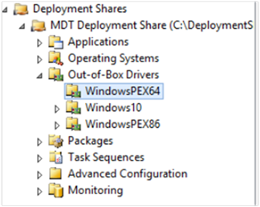
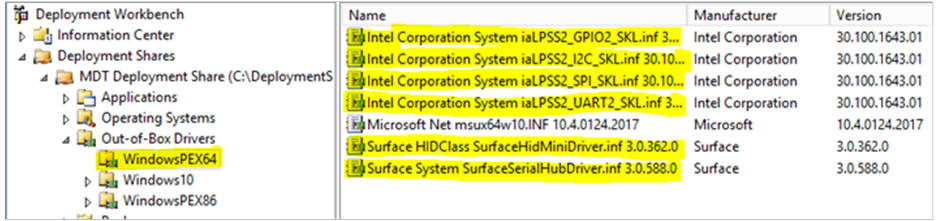
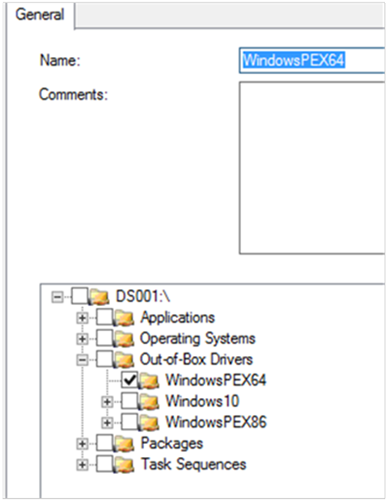
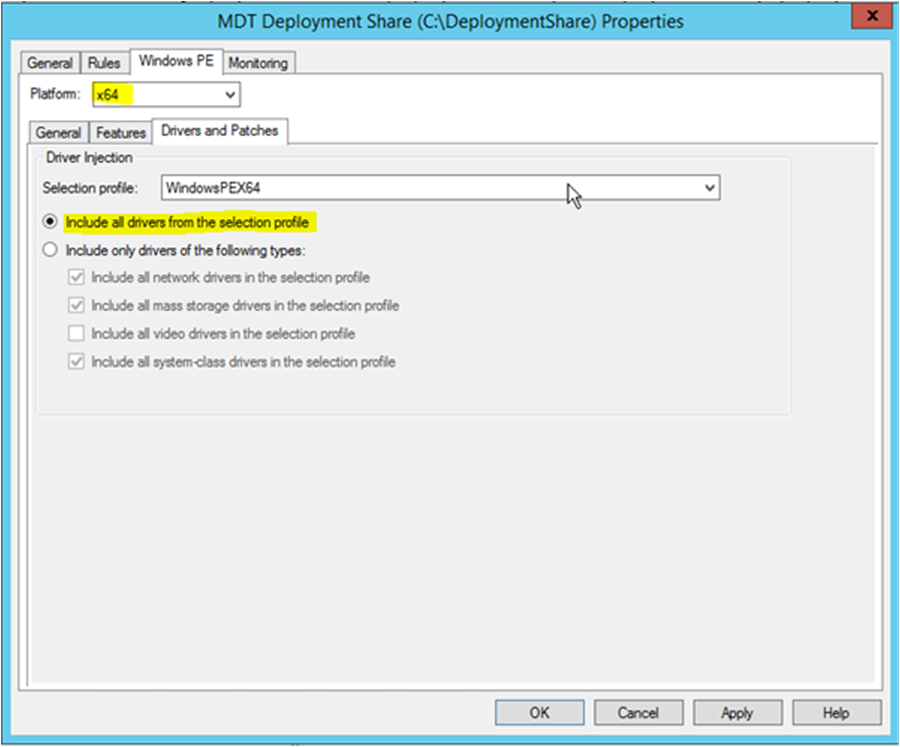
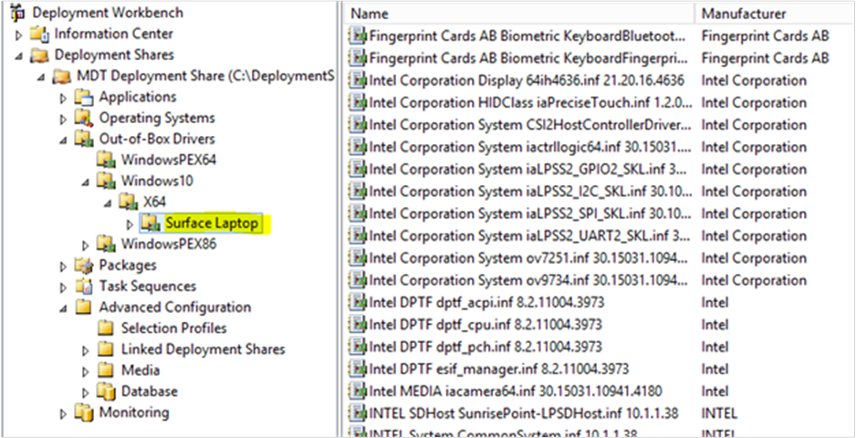

# How to enable the Surface Laptop keyboard during MDT deployment

This article addresses a deployment approach that uses Microsoft Deployment Toolkit (MDT). You can also apply this information to other deployment methodologies. On most types of Surface devices, the keyboard should work during Lite Touch Installation (LTI). However, Surface Laptop requires some additional drivers to enable the keyboard. For Surface Laptop (1st Gen) and Surface Laptop 2 devices, you must prepare the folder structure and selection profiles that allow you to specify keyboard drivers for use during the Windows Preinstallation Environment (Windows PE) phase of LTI. For more information about this folder structure, see [Deploy a Windows 10 image using MDT: Step 5: Prepare the drivers repository](https://docs.microsoft.com/windows/deployment/deploy-windows-mdt/deploy-a-windows-10-image-using-mdt?redirectedfrom=MSDN#step-5-prepare-the-drivers-repository).

> [!NOTE]
> It is currently not supported to add Surface Laptop 2 and Surface Laptop 3 keyboard drivers in the same Windows PE boot instance due to a driver conflict; use separate instances instead.

> [!IMPORTANT]
> If you are deploying a Windows 10 image to a Surface Laptop that has Windows 10 in S mode preinstalled, see KB [4032347, Problems when deploying Windows to Surface devices with preinstalled Windows 10 in S mode](https://support.microsoft.com/help/4032347/surface-preinstall-windows10-s-mode-issues).

To add the keyboard drivers to the selection profile, follow these steps:

1. Download the latest Surface Laptop MSI file from the appropriate locations:
    - [Surface Laptop (1st Gen) Drivers and Firmware](https://www.microsoft.com/download/details.aspx?id=55489)
    - [Surface Laptop 2 Drivers and Firmware](https://www.microsoft.com/download/details.aspx?id=57515)
    - [Surface Laptop 3 with Intel Processor Drivers and Firmware](https://www.microsoft.com/download/details.aspx?id=100429)

2. Extract the contents of the Surface Laptop MSI file to a folder that you can easily locate (for example, c:\surface_laptop_drivers). To extract the contents, open an elevated Command Prompt window and run the command from the following example:

   ```cmd
   Msiexec.exe /a SurfaceLaptop_Win10_15063_1703008_1.msi targetdir=c:\surface_laptop_drivers /qn
   ```

3. Open the Deployment Workbench and expand the **Deployment Shares** node and your deployment share, then navigate to the **WindowsPEX64** folder.

   

4. Right-click the **WindowsPEX64** folder and select **Import Drivers**.
5. Follow the instructions in the Import Driver Wizard to import the driver folders into the WindowsPEX64 folder.  

> [!NOTE]
>  Check the downloaded MSI package to determine the format and directory structure.  The directory structure will start with either SurfacePlatformInstaller (older MSI files) or SurfaceUpdate (Newer MSI files) depending on when the MSI was released. 

To support Surface Laptop (1st Gen), import the following folders:

 - SurfacePlatformInstaller\Drivers\System\GPIO
 - SurfacePlatformInstaller\Drivers\System\SurfaceHidMiniDriver
 - SurfacePlatformInstaller\Drivers\System\SurfaceSerialHubDriver
 - SurfacePlatformInstaller\Drivers\System\PreciseTouch

Or for newer MSI files beginning with "SurfaceUpdate", use:

- SurfaceUpdate\SerialIOGPIO
- SurfaceUpdate\SurfaceHidMiniDriver
- SurfaceUpdate\SurfaceSerialHubDriver
- SurfaceUpdate\Itouch

To support Surface Laptop 2, import the following folders:

 - SurfacePlatformInstaller\Drivers\System\GPIO
 - SurfacePlatformInstaller\Drivers\System\SurfaceHIDMiniDriver
 - SurfacePlatformInstaller\Drivers\System\SurfaceSerialHubDriver
 - SurfacePlatformInstaller\Drivers\System\I2C
 - SurfacePlatformInstaller\Drivers\System\SPI
 - SurfacePlatformInstaller\Drivers\System\UART
 - SurfacePlatformInstaller\Drivers\System\PreciseTouch

Or for newer MSI files beginning with "SurfaceUpdate", use:

- SurfaceUpdate\SerialIOGPIO
- SurfaceUpdate\IclSerialIOI2C
- SurfaceUpdate\IclSerialIOSPI
- SurfaceUpdate\IclSerialIOUART
- SurfaceUpdate\SurfaceHidMini
- SurfaceUpdate\SurfaceSerialHub
- SurfaceUpdate\Itouch

 
To support Surface Laptop 3 with Intel Processor, import the following folders:

- SurfaceUpdate\IclSerialIOGPIO
- SurfaceUpdate\IclSerialIOI2C
- SurfaceUpdate\IclSerialIOSPI
- SurfaceUpdate\IclSerialIOUART
- SurfaceUpdate\SurfaceHidMini
- SurfaceUpdate\SurfaceSerialHub
- SurfaceUpdate\SurfaceHotPlug
- SurfaceUpdate\Itouch

Importing the following folders will enable full keyboard, trackpad, and touch functionality in PE for Surface Laptop 3.

- IclSerialIOGPIO
- IclSerialIOI2C
- IclSerialIOSPI
- IclSerialIOUART
- itouch
- IclChipset
- IclChipsetLPSS
- IclChipsetNorthpeak
- ManagementEngine
- SurfaceAcpiNotify
- SurfaceBattery
- SurfaceDockIntegration
- SurfaceHidMini
- SurfaceHotPlug
- SurfaceIntegration
- SurfaceSerialHub
- SurfaceService
- SurfaceStorageFwUpdate


    > [!NOTE]
    >  Check the downloaded MSI package to determine the format and directory structure.  The directory structure will start with either SurfacePlatformInstaller (older MSI files) or SurfaceUpdate (Newer MSI files) depending on when the MSI was released. 

    To support Surface Laptop (1st Gen), import the following folders:

     - SurfacePlatformInstaller\Drivers\System\GPIO
     - SurfacePlatformInstaller\Drivers\System\SurfaceHidMiniDriver
     - SurfacePlatformInstaller\Drivers\System\SurfaceSerialHubDriver
     - SurfacePlatformInstaller\Drivers\System\PreciseTouch

    Or for newer MSI files beginning with "SurfaceUpdate", use:

    - SurfaceUpdate\SerialIOGPIO
    - SurfaceUpdate\SurfaceHidMiniDriver
    - SurfaceUpdate\SurfaceSerialHubDriver
    - SurfaceUpdate\Itouch

    To support Surface Laptop 2, import the following folders:

     - SurfacePlatformInstaller\Drivers\System\GPIO
     - SurfacePlatformInstaller\Drivers\System\SurfaceHIDMiniDriver
     - SurfacePlatformInstaller\Drivers\System\SurfaceSerialHubDriver
     - SurfacePlatformInstaller\Drivers\System\I2C
     - SurfacePlatformInstaller\Drivers\System\SPI
     - SurfacePlatformInstaller\Drivers\System\UART
     - SurfacePlatformInstaller\Drivers\System\PreciseTouch

    Or for newer MSI files beginning with "SurfaceUpdate", use:

    - SurfaceUpdate\SerialIOGPIO
    - SurfaceUpdate\IclSerialIOI2C
    - SurfaceUpdate\IclSerialIOSPI
    - SurfaceUpdate\IclSerialIOUART
    - SurfaceUpdate\SurfaceHidMini
    - SurfaceUpdate\SurfaceSerialHub
    - SurfaceUpdate\Itouch

    To support Surface Laptop 3 with Intel Processor, import the following folders:

    - SurfaceUpdate\IclSerialIOGPIO
    - SurfaceUpdate\IclSerialIOI2C
    - SurfaceUpdate\IclSerialIOSPI
    - SurfaceUpdate\IclSerialIOUART
    - SurfaceUpdate\SurfaceHidMini
    - SurfaceUpdate\SurfaceSerialHub
    - SurfaceUpdate\SurfaceHotPlug
    - SurfaceUpdate\Itouch

    > [!NOTE]
    > For Surface Laptop 3 with Intel processor, the model is Surface Laptop 3. The remaining Surface Laptop drivers are located in the \MDT Deployment Share\Out-of-Box Drivers\Windows10\X64\Surface Laptop 3 folder.

6. Verify that the WindowsPEX64 folder now contains the imported drivers. The folder should resemble the following:  

   

7. Configure a selection profile that uses the WindowsPEX64 folder. The selection profile should resemble the following:  

   

8. Configure the Windows PE properties of the MDT deployment share to use the new selection profile, as follows:  

   - For **Platform**, select **x64**.
   - For **Selection profile**, select the new profile.
   - Select **Include all drivers from the selection profile**.
   
   

9. Verify that you have configured the remaining Surface Laptop drivers by using either a selection profile or a **DriverGroup001** variable.  
   - For Surface Laptop (1st Gen), the model is **Surface Laptop**. The remaining Surface Laptop drivers should reside in the \MDT Deployment Share\Out-of-Box Drivers\Windows10\X64\Surface Laptop folder as shown in the figure that follows this list.
   - For Surface Laptop 2, the model is **Surface Laptop 2**. The remaining Surface Laptop drivers should reside in the \MDT Deployment Share\Out-of-Box Drivers\Windows10\X64\Surface Laptop 2 folder. 
   - For Surface Laptop 3 with Intel processor, the model is Surface Laptop 3. The remaining Surface Laptop drivers are located in the \MDT Deployment Share\Out-of-Box Drivers\Windows10\X64\Surface Laptop 3 folder.

   

After configuring the MDT Deployment Share to use the new selection profile and related settings, continue the deployment process as described in [Deploy a Windows 10 image using MDT: Step 6: Create the deployment task sequence](https://docs.microsoft.com/windows/deployment/deploy-windows-mdt/deploy-a-windows-10-image-using-mdt#step-6-create-the-deployment-task-sequence).
