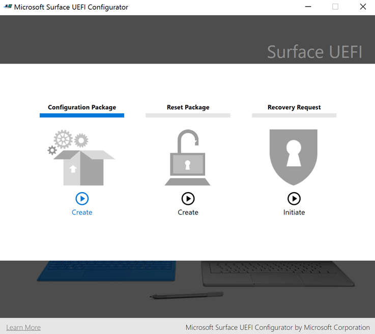
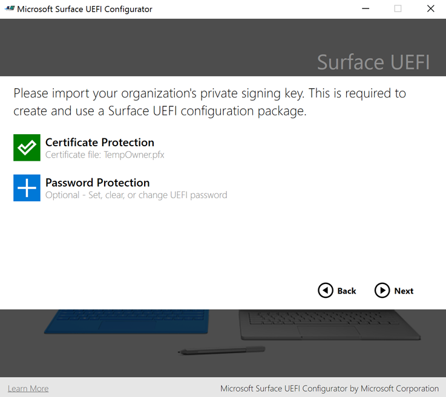
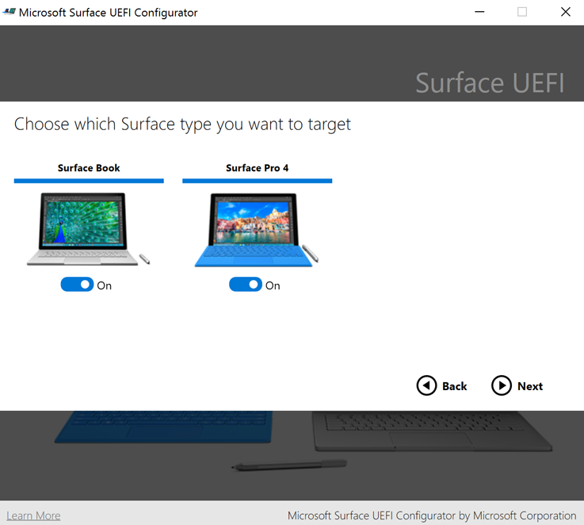
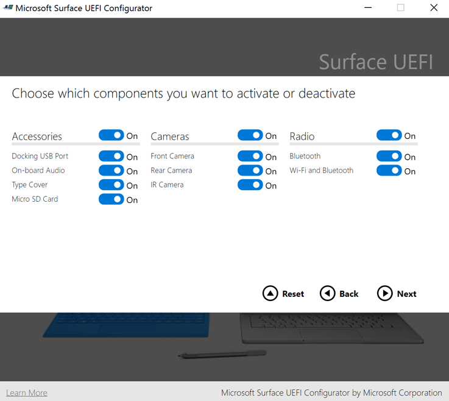
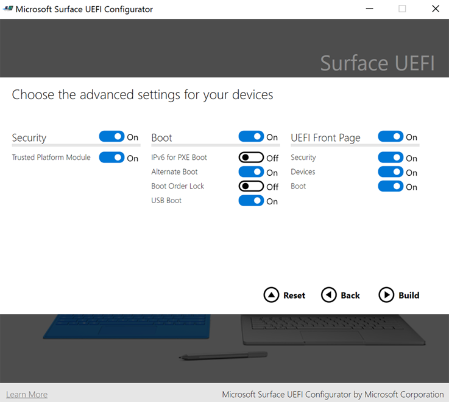
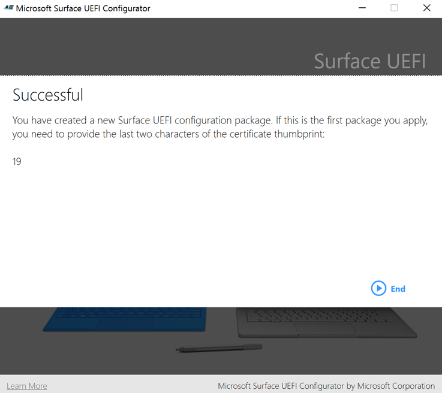
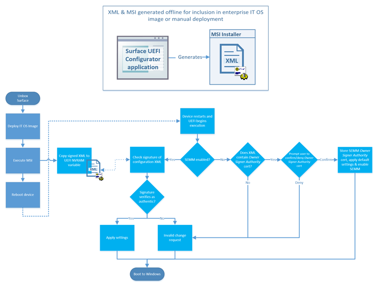
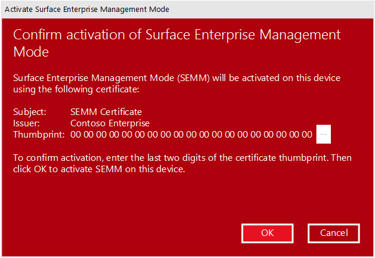
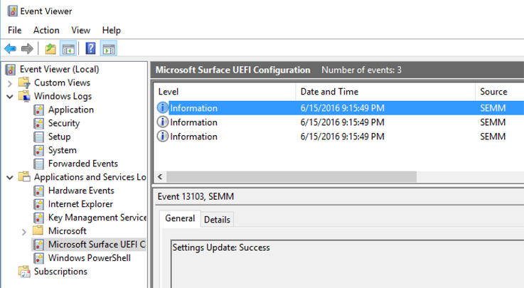
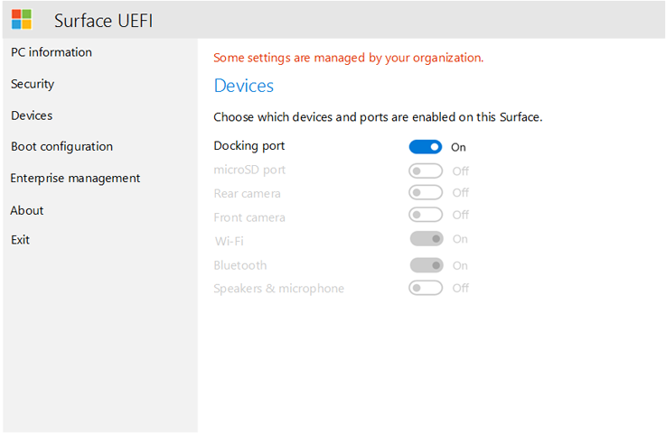

# Enroll and configure Surface devices with SEMM

With Microsoft Surface Enterprise Management Mode (SEMM), you can securely configure the settings of Surface UEFI on a Surface device and manage those settings on Surface devices in your organization. When a Surface device is managed by SEMM, that device is considered to be *enrolled* (sometimes referred to as activated). This article shows you how to create a Surface UEFI configuration package that will not only control the settings of Surface UEFI, but will also enroll a Surface device in SEMM.

For a more high-level overview of SEMM, see [Microsoft Surface Enterprise Management Mode](https://technet.microsoft.com/itpro/surface/surface-enterprise-management-mode).

#### Download and install Microsoft Surface UEFI Configurator
The tool used to create SEMM packages is Microsoft Surface UEFI Configurator. You can download Microsoft Surface UEFI Configurator from the [Surface Tools for IT](https://www.microsoft.com/download/details.aspx?id=46703) page in the Microsoft Download Center.
Run the Microsoft Surface UEFI Configurator Windows Installer (.msi) file to start the installation of the tool. When the installer completes, find Microsoft Surface UEFI Configurator in the All Apps section of your Start menu.

>[!NOTE]
>Microsoft Surface UEFI Configurator is supported only on Windows 10.

## Create a Surface UEFI configuration package

The Surface UEFI configuration package performs both the role of applying a new configuration of Surface UEFI settings to a Surface device managed with SEMM and the role of enrolling Surface devices in SEMM. The creation of a configuration package requires you to have a signing certificate to be used with SEMM to secure the configuration of UEFI settings on each Surface device. For more information about the requirements for the SEMM certificate, see [Microsoft Surface Enterprise Management Mode](https://technet.microsoft.com/itpro/surface/surface-enterprise-management-mode).

To create a Surface UEFI configuration package, follow these steps:

1. Open Microsoft Surface UEFI Configurator from the Start menu.
2. Click **Start**.
3. Click **Configuration Package**, as shown in Figure 1.

   

   *Figure 1. Select Configuration Package to create a package for SEMM enrollment and configuration*

4. Click **Certificate Protection** to add your exported certificate file with private key (.pfx), as shown in Figure 2. Browse to the location of your certificate file, select the file, and then click **OK**.

   

   *Figure 2. Add the SEMM certificate and Surface UEFI password to a Surface UEFI configuration package*

5. When you are prompted to confirm the certificate password, enter and confirm the password for your certificate file, and then click **OK**.
6. Click **Password Protection** to add a password to Surface UEFI. This password will be required whenever you boot to UEFI. If this password is not entered, only the **PC information**, **About**, **Enterprise management**, and **Exit** pages will be displayed. This step is optional.
7. When you are prompted, enter and confirm your chosen password for Surface UEFI, and then click **OK**. If you want to clear an existing Surface UEFI password, leave the password field blank.
8. If you do not want the Surface UEFI package to apply to a particular device, on the **Choose which Surface type you want to target** page, click the slider beneath the corresponding Surface Book or Surface Pro 4 image so that it is in the **Off** position. (As shown in Figure 3.)

   

   *Figure 3. Choose the devices for package compatibility*

9. Click **Next**.
10. If you want to deactivate a component on managed Surface devices, on the **Choose which components you want to activate or deactivate** page, click the slider next to any device or group of devices you want to deactivate so that the slider is in the **Off** position. (Shown in Figure 4.) The default configuration for each device is **On**. Click the **Reset** button if you want to return all sliders to the default position.

    

    *Figure 4. Disable or enable individual Surface components*

11.	Click **Next**.
12.	To enable or disable advanced options in Surface UEFI or the display of Surface UEFI pages, on the **Choose the advanced settings for your devices** page, click the slider beside the desired setting to configure that option to **On** or **Off** (shown in Figure 5). In the **UEFI Front Page** section, you can use the sliders for **Security**, **Devices**, and **Boot** to control what pages are available to users who boot into Surface UEFI. (For more information about Surface UEFI settings, see [Manage Surface UEFI settings](https://technet.microsoft.com/itpro/surface/manage-surface-uefi-settings).) Click **Build** when you have finished selecting options to generate and save the package.

    

    *Figure 5. Control advanced Surface UEFI settings and Surface UEFI pages with SEMM*

13.	In the **Save As** dialog box, specify a name for the Surface UEFI configuration package, browse to the location where you would like to save the file, and then click **Save**.
14.	When the package is created and saved, the **Successful** page is displayed.

>[!NOTE]
>Record the certificate thumbprint characters that are displayed on this page, as shown in Figure 6. You will need these characters to confirm enrollment of new Surface devices in SEMM. Click **End** to complete package creation and close Microsoft Surface UEFI Configurator.

*Figure 6. The last two characters of the certificate thumbprint are displayed on the Successful page*

Now that you have created your Surface UEFI configuration package, you can enroll or configure Surface devices.

>[!NOTE]
>When a Surface UEFI configuration package is created, a log file is created on the desktop with details of the configuration package settings and options.

## Enroll a Surface device in SEMM
When the Surface UEFI configuration package is executed, the SEMM certificate and Surface UEFI configuration files are staged in the firmware storage of the Surface device. When the Surface device reboots, Surface UEFI processes these files and begins the process of applying the Surface UEFI configuration or enrolling the Surface device in SEMM, as shown in Figure 7.

*Figure 7. The SEMM process for configuration of Surface UEFI or enrollment of a Surface device*

Before you begin the process to enroll a Surface device in SEMM, ensure that you have the last two characters of the certificate thumbprint on hand. You will need these characters to confirm the device’s enrollment (see Figure 6).

To enroll a Surface device in SEMM with a Surface UEFI configuration package, follow these steps:

1. Run the Surface UEFI configuration package .msi file on the Surface device you want to enroll in SEMM. This will provision the Surface UEFI configuration file in the device’s firmware.
2. Select the **I accept the terms in the License Agreement** check box to accept the End User License Agreement (EULA), and then click **Install** to begin the installation process.
3. Click **Finish** to complete the Surface UEFI configuration package installation and restart the Surface device when you are prompted to do so.
4. Surface UEFI will load the configuration file and determine that SEMM is not enabled on the device. Surface UEFI will then begin the SEMM enrollment process, as follows:
   * Surface UEFI will verify that the SEMM configuration file contains a SEMM certificate.
   * Surface UEFI will prompt you to enter to enter the last two characters of the certificate thumbprint to confirm enrollment of the Surface device in SEMM, as shown in Figure 8.

   
  
   *Figure 8. Enrollment in SEMM requires the last two characters of the certificate thumbprint*

   * Surface UEFI will store the SEMM certificate in firmware and apply the configuration settings that are specified in the Surface UEFI configuration file.
   
5. The Surface device is now enrolled in SEMM and will boot to Windows.

You can verify that a Surface device has been successfully enrolled in SEMM by looking for **Microsoft Surface Configuration Package** in **Programs and Features** (as shown in Figure 9), or in the events stored in the **Microsoft Surface UEFI Configurator** log, found under **Applications and Services Logs** in Event Viewer (as shown in Figure 10).

*Figure 9. Verify the enrollment of a Surface device in SEMM in Programs and Features*

*Figure 10. Verify the enrollment of a Surface device in SEMM in Event Viewer*

You can also verify that the device is enrolled in SEMM in Surface UEFI – while the device is enrolled, Surface UEFI will contain the **Enterprise management** page (as shown in Figure 11).

*Figure 11. The Surface UEFI Enterprise management page*

## Configure Surface UEFI settings with SEMM

After a device is enrolled in SEMM, you can run Surface UEFI configuration packages signed with the same SEMM certificate to apply new Surface UEFI settings. These settings are applied automatically the next time the device boots, without any interaction from the user. You can use application deployment solutions like System Center Configuration Manager to deploy Surface UEFI configuration packages to Surface devices to change or manage the settings in Surface UEFI.

For more information about how to deploy Windows Installer (.msi) files with Configuration Manager, see [Deploy and manage applications with System Center Configuration Manager](https://technet.microsoft.com/library/mt627959).

If you have secured Surface UEFI with a password, users without the password who attempt to boot to Surface UEFI will only have the **PC information**, **About**, **Enterprise management**, and **Exit** pages displayed to them.

If you have not secured Surface UEFI with a password or a user enters the password correctly, settings that are configured with SEMM will be dimmed (unavailable) and the text Some settings are managed by your organization will be displayed at the top of the page, as shown in Figure 12.

*Figure 12. Settings managed by SEMM will be disabled in Surface UEFI*
