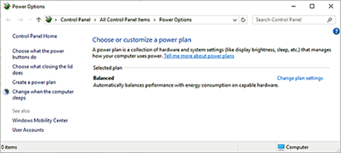
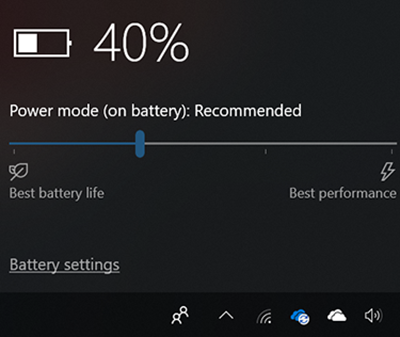

# Maintain optimal power settings on Surface devices

Surface devices are designed to take advantage of the latest advances in
mobile device energy consumption to deliver a streamlined experience
optimized across workloads. Depending on what you’re doing, Surface
dynamically fine tunes how power flows to individual hardware
components, momentarily waking up system components to handle background
tasks -- such as an incoming email or network traffic -- before returning to a
low power idle state (S0ix).

The way Surface implements power management differs significantly from
the earlier OS standard that gradually reduces and turns off power via a
series of sleep states (S1, S2, S3).

Instead, Surface is imaged with a custom power profile that replaces
legacy sleep and energy consumption functionality with modern standby
features and dynamic fine tuning. This custom power profile is
implemented via the Surface Serial Hub Driver and the system aggregator
module (SAM). The SAM chip functions as the Surface device power-policy
owner, using algorithms to calculate optimal power requirements. It
works in conjunction with Windows power manager to allocate or throttle
only the exact amount of power required for hardware components to
function.

## Modern Standby

The algorithmically embedded custom power profile enables modern standby
connectivity for Surface by maintaining a low power state for
instant on/instant off functionality typical of smartphones. S0ix, also
known as Deepest Runtime Idle Platform State (DRIPS), is the default
power mode for Surface devices. Modern standby has two modes:

  - **Connected standby.** The default mode for up-to-the minute
    delivery of emails, messaging, and cloud-synced data, connected
    standby keeps Wi-Fi on and maintains network connectivity.

  - **Disconnected standby.** An optional mode for extended battery
    life, disconnected standby delivers the same instant-on experience
    and saves power by turning off Wi-Fi, Bluetooth, and related network
    connectivity.

To learn more about modern standby, refer to the [Microsoft Hardware Dev
Center](https://docs.microsoft.com/windows-hardware/design/device-experiences/modern-standby-wake-sources).

## How Surface streamlines the power management experience 

Surface integrates the following features designed to help users
optimize the power management experience:

  - [Singular power plan](#singular-power-plan)

  - [Simplified power settings user
    interface](#simplified-power-settings-user-interface)

  - [Windows performance power
    slider](#windows-performance-power-slider)

### Singular power plan

Surface is designed for a streamlined power management experience that
eliminates the need to create custom power plans or manually configure
power settings. Microsoft streamlines the user
experience by delivering a single power plan (balanced) that replaces
the multiple power plans from standard Windows builds.

### Simplified power settings user interface
Surface provides a simplified UI in accord with best practice power
setting recommendations. In general, it's recommended to only adjust settings visible in the default user interface and avoid configuring advanced power settings or Group Policy settings. Using the default screen and sleep timeouts while avoiding maximum
brightness levels are the most effective ways for users to maintain
extended battery life.

Figure 1. Simplified power and sleep settings

### Windows performance power slider

Surface devices running Windows 10 build 1709 and later include a power
slider allowing you to prioritize battery life when needed or favor performance if desired. You
can access the power slider from the taskbar by clicking on the battery
icon. Slide left for longer battery life (battery saver mode) or slide
right for faster performance.

Figure 2. Power slider

Power slider enables four states as described in the following table:

| Slider mode| Description |
|---|---|
| Battery saver| Helps conserve power and prolong battery life when the system is disconnected from a power source. When battery saver is on, some Windows features are disabled, throttled, or behave differently. Screen brightness is also reduced. Battery saver is only available when using battery power (DC). To learn more, see [Battery Saver](https://docs.microsoft.com/en-us/windows-hardware/design/component-guidelines/battery-saver).|
| Recommended | Delivers longer battery life than the default settings in earlier versions of Windows. |
| Better Performance | Slightly favors performance over battery life, functioning as the default slider mode. |
| Best Performance | Favors performance over power for workloads requiring maximum performance and responsiveness, regardless of battery power consumption.|

Power slider modes directly control specific hardware components shown
in the following table.

| Component | Slider functionality |
|---|---|
| Intel Speed Shift (CPU energy registers) and Energy Performance Preference hint. | Selects the best operating frequency and voltage for optimal performance and power. The Energy Performance Preference (PERFEPP) is a global power efficiency hint to the CPU. |
| Fan speed (RPM)| Where applicable, adjusts for changing conditions such as keeping fan silent in battery saver slider mode.|
| Processor package power limits (PL1/PL2).| Requires the CPU to manage its frequency choices to accommodate a running average power limit for both steady state (PL1) and turbo (PL2) workloads.|
| Processor turbo frequency limits (IA turbo limitations). | Adjusts processor and graphics performance allowing processor cores to run faster or slower than the rated operating frequency.                                                |

>[!NOTE]
>The power slider is entirely independent of operating system power settings whether configured from Control Panel/ Power Options, Group Policy, or related methods.

To learn more, see:

-   [Customize the Windows performance power
    slider](https://docs.microsoft.com/windows-hardware/customize/desktop/customize-power-slider)

-   [Battery
    saver.](https://docs.microsoft.com/windows-hardware/design/component-guidelines/battery-saver)

## Best practices for extended battery life

| Best practice | Go to | Next steps |
|---|---|---|                                                                                                                                    
| Ensure your Surface device is up to date| Windows Update | In the taskbar search box, type **Windows Update** and select **Check for updates**. |
| Choose the best power setting for what you’re doing | Power slider | In the taskbar, select the battery icon, then choose **Best performance**, **Best battery life**, or somewhere in between.|
| Conserve battery when it’s low | Battery saver | In the taskbar, select the battery icon and click **Battery settings**. Select **Turn battery saver on automatically if my battery falls below** and then move the slider further to the right for longer battery life. |
| Configure optimal screen brightness | Battery saver | In the taskbar, select the battery icon and click **Battery settings**, select **Lower screen brightness while in battery saver**. |
| Conserve power whenever you’re not plugged in | Battery saver| Select **Turn on battery saver status until next charge**.|
| Investigate problems with your power settings. | Power troubleshooter | In the Taskbar search for troubleshoot, select **Troubleshoot**, and then select **Power** and follow the instructions.|
| Check app usage | Your apps | Close apps.|
| Check your power cord for any damage.| Your power cord | Replace power cord if worn or damaged.|

# Learn more 

-   [Modern
    standby](https://docs.microsoft.com/windows-hardware/design/device-experiences/modern-standby-wake-sources)

<!-- -->

-   [Customize the Windows performance power
    slider](https://docs.microsoft.com/windows-hardware/customize/desktop/customize-power-slider)

-   [Battery
    saver](https://docs.microsoft.com/windows-hardware/design/component-guidelines/battery-saver)
