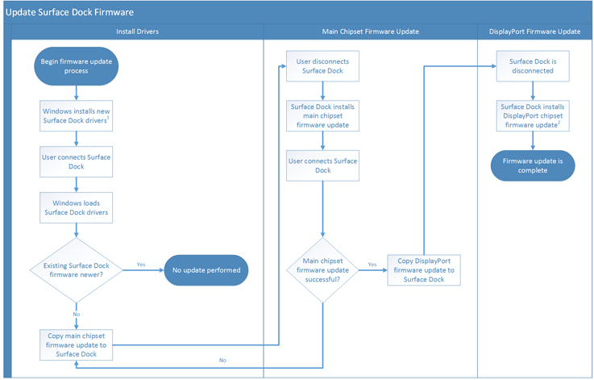

# Manage Surface Dock firmware updates

Read about the different methods you can use to manage the process of Surface Dock firmware updates.

The Surface Dock provides external connectivity to Surface devices through a single cable connection that includes Power, Ethernet, Audio, USB 3.0, and DisplayPort. The numerous connections provided by the Surface Dock are enabled by a smart chipset within the Surface Dock device. Like a Surface device’s chipset, the chipset that is built into the Surface Dock is controlled by firmware. For more information about the Surface Dock, see the [Surface Dock demonstration](https://technet.microsoft.com/en-us/mt697552) video.

Like the firmware for Surface devices, firmware for Surface Dock is also contained within a downloaded driver that is visible in Device Manager. This driver stages the firmware update files on the Surface device. When a Surface Dock is connected and the driver is loaded, the newer version of the firmware staged by the driver is detected and firmware files are copied to the Surface Dock. The Surface Dock then begins a two-phase process to apply the firmware internally. Each phase requires the Surface Dock to be disconnected from the Surface device before the firmware is applied. The driver copies the firmware into the dock, but only applies it when the user disconnects the Surface device from the Surface Dock. This ensures that there are no disruptions because the firmware is only applied when the user leaves their desk with the device.

>**Note:**&nbsp;&nbsp;You can learn more about the firmware update process for Surface devices and how firmware is updated through driver installation at the following links: 
- [How to manage and update Surface drivers and firmware](https://technet.microsoft.com/en-us/mt697551) from Microsoft Mechanics
- [Windows Update Makes Surface Better](http://go.microsoft.com/fwlink/p/?LinkId=785354) on the Microsoft Devices Blog

 

The Surface Dock firmware update process shown in Figure 1 follows these steps:

1.  Drivers for Surface Dock are installed on Surface devices that are connected, or have been previously connected, to a Surface Dock.

2.  The drivers for Surface Dock are loaded when a Surface Dock is connected to the Surface device.

3.  The firmware version installed in the Surface Dock is compared with the firmware version staged by the Surface Dock driver.

4.  If the firmware version on the Surface Dock is older than the firmware version contained in the Surface Dock driver, the main chipset firmware update files are copied from the driver to the Surface Dock.

5.  When the Surface Dock is disconnected, the Surface Dock installs the firmware update to the main chipset.

6.  When the Surface Dock is connected again, the main chipset firmware is verified against the firmware present in the Surface Dock driver.

7.  If the firmware update for the main chipset is installed successfully, the Surface Dock driver copies the firmware update for the DisplayPort.

8.  When the Surface Dock is disconnected for a second time, the Surface dock installs the firmware update to the DisplayPort chipset. This process takes up to 3 minutes to apply.

*1- Driver installation can be performed by Windows Update, manual installation, or automatically downloaded with Microsoft Surface Dock Updater*

*2 - The Surface Dock firmware installation process takes approximately 3 minutes*

Figure 1. The Surface Dock firmware update process

If the firmware installation process is interrupted (for example, if power is disconnected from the Surface Dock during firmware installation), the Surface Dock will automatically revert to the prior firmware without disruption to the user, and the update process will restart the next time the Surface Dock is disconnected. For most users this update process should be entirely transparent.

## Methods for updating Surface Dock firmware

There are three methods you can use to update the firmware of the Surface Dock:

-   [Automatic installation of drivers with Windows Update](#automatic-installation)

-   [Deployment of drivers downloaded from the Microsoft Download Center](#deployment-dlc)

-   [Manually update with Microsoft Surface Dock Updater](#manual-updater)

## Automatic installation with Windows Update

Windows Update is the method that most users will use. The drivers for the Surface Dock are downloaded automatically from Windows Update and the dock update process is initiated without additional user interaction. The two-phase dock update process described earlier occurs in the background as the user connects and disconnects the Surface Dock during normal use.

>**Note:**&nbsp;&nbsp;The driver version that is displayed in Device Manager may be different from the firmware version that the Surface Dock is using.

 

## Deployment of drivers downloaded from the Microsoft Download Center

This method is used mostly in environments where Surface device drivers and firmware are managed separately from Windows Update. See [Manage Surface driver and firmware updates](manage-surface-pro-3-firmware-updates.md) for more information about the different methods to manage Surface device driver and firmware updates. Updating the Surface Dock firmware through this method involves downloading and deploying an MSI package to the Surface device that contains the updated Surface Dock drivers and firmware. This is the same method recommended for updating all other Surface drivers and firmware. The two-phase firmware update process occurs in the background each time the Surface Dock is disconnected, just like it does with the Windows Update method.

For more information about how to deploy MSI packages see [Create and deploy an application with System Center Configuration Manager](http://go.microsoft.com/fwlink/p/?LinkId=785355).

>**Note:**&nbsp;&nbsp;When drivers are installed through Windows Update or the MSI package, registry keys are added that indicate the version of firmware installed on the Surface Dock and contained within the Surface Dock driver. These registry keys can be found in:  
  **HLKM\\Software\\Microsoft\\Windows NT\\CurrentVersion\\WUDF\\Services\\SurfaceDockFwUpdate\\Parameters**

Firmware status is displayed for both the main chipset (displayed as **Component10**) and the DisplayPort chipset (displayed as **Component20**). For each chipset there are four keys, where *xx* is **10** or **20** corresponding to each chipset:

-   **Component*xx*CurrentFwVersion** – This key displays the version of firmware that is installed on the currently connected or most recently connected Surface Dock.

-   **Component*xx*OfferFwVersion** – This key displays the version of firmware staged by the Surface Dock driver.

-   **Component*xx*FirmwareUpdateStatus** – This key displays the stage of the Surface Dock firmware update process.

-   **Component*xx*FirmwareUpdateStatusRejectReason** – This key changes as the firmware update is processed. It should result in 0 after the successful installation of Surface Dock firmware.

>**Note:**&nbsp;&nbsp;These registry keys are not present unless you have installed updated Surface Dock drivers through Windows Update or MSI deployment.

 

## Manually update with Microsoft Surface Dock Updater

The manual method using the Microsoft Surface Dock Updater tool to update the Surface Dock is used mostly in environments where IT prepares Surface Docks prior to delivery to the end user, or for troubleshooting of a Surface Dock. Microsoft Surface Dock Updater is a tool that you can run from any Surface device that is compatible with the Surface Dock, and will walk you through the process of performing the Surface Dock firmware update in the least possible amount of time. You can also use this tool to verify the firmware status of a connected Surface Dock.

For more information about how to use the Microsoft Surface Dock Updater tool, please see [Microsoft Surface Dock Updater](surface-dock-updater.md). You can download the Microsoft Surface Dock Updater tool from the [Surface Tools for IT page](http://go.microsoft.com/fwlink/p/?LinkId=618121) on the Microsoft Download Center.

 

 

