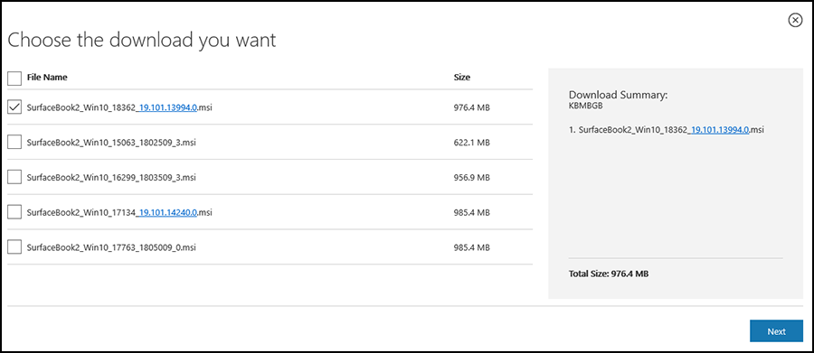

# Manage and deploy Surface driver and firmware updates

How you manage Surface driver and firmware updates varies depending on your environment and organizational requirements. On Surface devices, firmware is exposed to the operating system as a driver and is visible in Device Manager, enabling device firmware and drivers to be automatically updated using Windows Update or Windows Update for Business. Although this simplified approach may be feasible for startups and small or medium-sized businesses, larger organizations typically need IT admins to distribute updates internally. This may involve comprehensive planning, application compatibility testing, piloting and validating updates, before final approval and distribution across the network.

> [!NOTE]
> This article is intended for technical support agents and IT professionals and applies to Surface devices only. If you're looking for help to install Surface updates or firmware on a home device, see [Update Surface firmware and Windows 10](https://support.microsoft.com/help/4023505).

While enterprise-grade software distribution solutions continue to evolve, the business rationale for centrally managing  updates remains the same: Maintain the security of Surface devices and keep them updated with the latest operating system and feature improvements. This is essential for sustaining a stable production environment and ensuring users aren't blocked from being productive. This article provides an overview of recommended tools and processes for larger organizations to accomplish these goals.

## Central update management in commercial environments

Microsoft has streamlined tools for managing devices – including driver and firmware updates -- into a single unified experience called [Microsoft Endpoint Manager admin center](https://devicemanagement.microsoft.com/) accessed from devicemanagement.microsoft.com.

### Manage updates with Configuration Manager and Intune

Microsoft Endpoint Configuration Manager allows you to synchronize and deploy Surface firmware and driver updates with the Configuration Manager client. Integration with Microsoft Intune lets you see all your managed, co-managed, and partner-managed devices in one place. This is the recommended solution for large organizations to manage Surface updates.

For detailed steps, see the following resources:

- [How to manage Surface driver updates in Configuration Manager](https://docs.microsoft.com/surface/manage-surface-driver-updates-configuration-manager.md)
- [Deploy applications with Configuration Manager](https://docs.microsoft.com/configmgr/apps/deploy-use/deploy-applications)
- [Endpoint Configuration Manager documentation](https://docs.microsoft.com/configmgr/)

### Manage updates with Microsoft Deployment Toolkit

Included in Endpoint Configuration Manager, the Microsoft Deployment Toolkit (MDT) contains optional deployment tools that you may wish to use depending on your environment. These include the Windows Assessment and Deployment Kit (Windows ADK), Windows System Image Manager (Windows SIM), Deployment Image Servicing and Management (DISM), and User State Migration Tool (USMT). You can download the latest version of MDT from the [Microsoft Deployment Toolkit download page](https://www.microsoft.com/download/details.aspx?id=54259).

For detailed steps, see the following resources:

- [Microsoft Deployment Toolkit documentation](https://docs.microsoft.com/configmgr/mdt/)
- [Deploy Windows 10 with the Microsoft Deployment Toolkit](https://docs.microsoft.com/windows/deployment/deploy-windows-mdt/deploy-windows-10-with-the-microsoft-deployment-toolkit)
- [Deploy Windows 10 to Surface devices with Microsoft Deployment Toolkit](https://docs.microsoft.com/surface/deploy-windows-10-to-surface-devices-with-mdt)

Surface driver and firmware updates are packaged as Windows Installer (*.msi) files. To deploy these Windows Installer packages, you can use Endpoint Configuration Manager or MDT. For information about selecting the correct .msi file for a device and operating system, refer to the guidance below about downloading .msi files.

For instructions on how to deploy updates by using Endpoint Configuration Manager refer to [Deploy applications with Configuration Manager](https://docs.microsoft.com/configmgr/apps/deploy-use/deploy-applications). For instructions on how to deploy updates by using MDT, see [Deploy a Windows 10 image using MDT](https://docs.microsoft.com/windows/deployment/deploy-windows-mdt/deploy-a-windows-10-image-using-mdt).

**WindowsPE and Surface firmware and drivers**

Endpoint Configuration Manager and MDT both use the Windows Preinstallation Environment (WindowsPE) during the deployment process. WindowsPE only supports a limited set of basic drivers such as those for network adapters and storage controllers. Drivers for Windows components that are not part of WindowsPE might produce errors. As a best practice, you can prevent such errors by configuring the deployment process to use only the required drivers during the WindowsPE phase.

### Endpoint Configuration Manager

Starting in Endpoint Configuration Manager, you can synchronize and deploy Microsoft Surface firmware and driver updates by using the Configuration Manager client. For additional information, see KB 4098906, [How to manage Surface driver updates in Configuration Manager](https://support.microsoft.com/help/4098906/manage-surface-driver-updates-in-configuration-manager).

## Supported devices

Downloadable .msi files are available for Surface devices from Surface Pro 2 and later. Information about .msi files for the newest Surface devices such as Surface Pro 7, Surface Pro X, and Surface Laptop 3 will be available from this page upon release.

## Managing firmware with DFCI

With Device Firmware Configuration Interface (DFCI) profiles built into Intune (now available in [public preview](https://docs.microsoft.com/intune/configuration/device-firmware-configuration-interface-windows)), Surface UEFI management extends the modern management stack down to the UEFI hardware level. DFCI supports zero-touch provisioning, eliminates BIOS passwords, provides control of security settings including boot options and built-in peripherals, and lays the groundwork for advanced security scenarios in the future. For more information, see:

- [Intune management of Surface UEFI settings](https://docs.microsoft.com/surface/surface-manage-dfci-guide)
- [Ignite 2019: Announcing remote management of Surface UEFI settings from Intune](https://techcommunity.microsoft.com/t5/Surface-IT-Pro-Blog/Ignite-2019-Announcing-remote-management-of-Surface-UEFI/ba-p/978333).

## Best practices for update deployment processes

To maintain a stable environment, it's strongly recommended to maintain parity with the most recent version of Windows 10.  For best practice recommendations, see [Build deployment rings for Windows 10 updates](https://docs.microsoft.com/windows/deployment/update/waas-deployment-rings-windows-10-updates).

## Downloadable Surface update packages

Specific versions of Windows 10 have separate .msi files, each containing all required cumulative driver and firmware updates for Surface devices. Update packages may include some or all of the following components:

- Wi-Fi and LTE
- Video
- Solid state drive
- System aggregator module (SAM)
- Battery
- Keyboard controller
- Embedded controller (EC)
- Management engine (ME)
- Unified extensible firmware interface (UEFI)

### Downloading .msi files

1. Browse to [Download drivers and firmware for Surface](https://support.microsoft.com/help/4023482/surface-download-drivers-and-firmware) on the Microsoft Download Center.
2. Select the .msi file name that matches the Surface model and version of Windows. The .msi file name includes the minimum supported Windows build number required to install the drivers and firmware. For example, as shown in the following figure, to update a Surface Book 2 with build 18362 of Windows 10, choose **SurfaceBook2_Win10_18362_19.101.13994.msi.** For a Surface Book 2 with build 16299 of Windows 10, choose **SurfaceBook2_Win10_16299_1803509_3.msi**.

    

    *Figure 1. Downloading Surface updates*

### Surface .msi naming convention

Since August 2019, .msi files have used the following naming convention:

- *Product*_*Windows release*_*Windows build number*_*Version number*_*Revision of version number (typically zero)*.

**Example**

- SurfacePro6_Win10_18362_19.073.44195_0.msi

This file name provides the following information:

- **Product:** SurfacePro6
- **Windows release:** Win10
- **Build:** 18362
- **Version:** 19.073.44195 – This shows the date and time that the file was created, as follows:
  - **Year:** 19 (2019)
  - **Month and week:** 073 (third week of July)
  - **Minute of the month:** 44195
- **Revision of version:** 0 (first release of this version)

### Legacy Surface .msi naming convention

Legacy .msi files (files built before August 2019) followed the same overall naming formula but used a different method to derive the version number.

**Example**

- SurfacePro6_Win10_16299_1900307_0.msi

This file name provides the following information:

- **Product:** SurfacePro6
- **Windows release:** Win10
- **Build:** 16299
- **Version:** 1900307 – This shows the date that the file was created and its position in the release sequence, as follows:
  - **Year:** 19 (2019)
  - **Number of release:** 003 (third release of the year)
  - **Product version number:** 07 (Surface Pro 6 is officially the seventh version of Surface Pro)
- **Revision of version:** 0 (first release of this version)

## Learn more

- [Download drivers and firmware for Surface](https://support.microsoft.com/help/4023482/surface-download-drivers-and-firmware)
- [How to manage Surface driver updates in Configuration Manager.](https://support.microsoft.com/help/4098906/manage-surface-driver-updates-in-configuration-manager)
- [Deploy applications with Configuration Manager](https://docs.microsoft.com/configmgr/apps/deploy-use/deploy-applications).
- [Endpoint Configuration Manager documentation](https://docs.microsoft.com/configmgr/)
- [Microsoft Deployment Toolkit documentation](https://docs.microsoft.com/configmgr/mdt/)
- [Deploy Windows 10 with the Microsoft Deployment Toolkit](https://docs.microsoft.com/windows/deployment/deploy-windows-mdt/deploy-windows-10-with-the-microsoft-deployment-toolkit)
- [Deploy Windows 10 to Surface devices with Microsoft Deployment Toolkit](https://docs.microsoft.com/surface/deploy-windows-10-to-surface-devices-with-mdt)  
- [Intune management of Surface UEFI settings](https://docs.microsoft.com/surface/surface-manage-dfci-guide)
- [Ignite 2019: Announcing remote management of Surface UEFI settings from Intune](https://techcommunity.microsoft.com/t5/Surface-IT-Pro-Blog/Ignite-2019-Announcing-remote-management-of-Surface-UEFI/ba-p/978333).
- [Build deployment rings for Windows 10 updates](https://docs.microsoft.com/windows/deployment/update/waas-deployment-rings-windows-10-updates)
