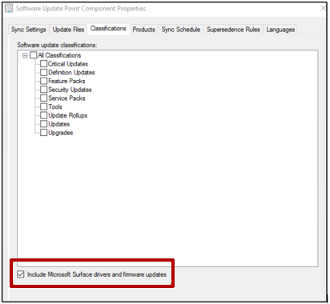
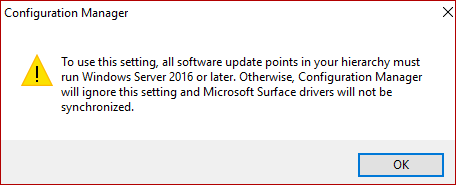
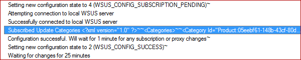
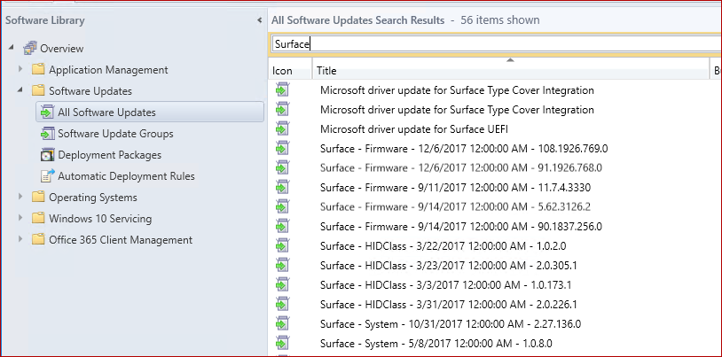

# Manage Surface driver updates in Configuration Manager

## Summary

Starting in [Microsoft System Center Configuration Manager version 1710](https://docs.microsoft.com/sccm/core/plan-design/changes/whats-new-in-version-1710#software-updates), you can synchronize and deploy Microsoft Surface firmware and driver updates directly through the Configuration Manager client. The process resembles deploying regular updates. However, some additional configurations are required to get the Surface driver updates into your catalog.

## Prerequisites

To manage Surface driver updates, the following prerequisites must be met:

- You must use Configuration Manager version 1710 or a later version.
- All Software Update Points (SUPs) must run Windows Server 2016 or a later version. Otherwise, Configuration Manager ignores this setting and Surface drivers won't be synchronized.

> [!NOTE]
> If your environment doesn’t meet the prerequisites, refer to the [alternative methods](https://support.microsoft.com/help/4098906/manage-surface-driver-updates-in-configuration-manager#1) to deploy Surface driver and firmware updates in the [FAQ](#frequently-asked-questions-faq) section.

## Useful log files

The following logs are especially useful when you manage Surface driver updates.

|Log name|Description|
|---|---|
|WCM.log|Records details about the software update point configuration and connections to the WSUS server for subscribed update categories, classifications, and languages.|
|WsyncMgr.log|Records details about the software updates sync process.|

These logs are located on the site server that manages the SUP, or on the SUP itself if it's installed directly on a site server.
For a complete list of Configuration Manager logs, see [Log files in System Center Configuration Manager](https://docs.microsoft.com/sccm/core/plan-design/hierarchy/log-files).

## Enabling Surface driver updates management

To enable Surface driver updates management in Configuration Manager, follow these steps:

1. In the Configuration Manager console, go to **Administration** > **Overview** > **Site Configuration** > **Sites**.
1. Select the site that contains the top-level SUP server for your environment.
1. On the ribbon, select **Configure Site Components**, and then select **Software Update Point**. Or, right-click the site, and then select **Configure Site Components** > **Software Update Point**.
1. On the **Classifications** tab, select the **Include Microsoft Surface drivers and firmware updates** check box.

   

1. When you're prompted by the following warning message, select **OK**.

   

1. On the Products tab, select the products that you want to update, and then select **OK**.

   Most drivers belong to the following product groups:

   - Windows 10 and later version drivers
   - Windows 10 and later Upgrade & Servicing Drivers
   - Windows 10 Anniversary Update and Later Servicing Drivers
   - Windows 10 Anniversary Update and Later Upgrade & Servicing Drivers
   - Windows 10 Creators Update and Later Servicing Drivers
   - Windows 10 Creators Update and Later Upgrade & Servicing Drivers
   - Windows 10 Fall Creators Update and Later Servicing Drivers
   - Windows 10 Fall Creators Update and Later Upgrade & Servicing Drivers
   - Windows 10 S and Later Servicing Drivers
   - Windows 10 S Version 1709 and Later Servicing Drivers for testing
   - Windows 10 S Version 1709 and Later Upgrade & Servicing Drivers for testing

   > [!NOTE]
   > Most Surface drivers belong to multiple Windows 10 product groups. You may not have to select all the products that are listed here. To help reduce the number of products that populate your Update Catalog, we recommend that you select only the products that are required by your environment for synchronization.

## Verifying the configuration

To verify that the SUP is configured correctly, follow these steps:

1. Open WsyncMgr.log, and then look for the following entry:

   ```console
   Surface Drivers can be supported in this hierarchy since all SUPs are on Windows Server 2016, WCM SCF property Sync Catalog Drivers is set.

   Sync Catalog Drivers SCF value is set to : 1
   ```

   If either of the following entries is logged in WsyncMgr.log, recheck step 4 in the previous section:

   ```console
   Sync Surface Drivers option is not set

   Sync Catalog Drivers SCF value is set to : 0
   ```

1. Open WCM.log, and then look for an entry that resembles the following:

   

   This entry is an XML element that lists every product group and classification that's currently synchronized by your SUP server. For example, you might see an entry that resembles the following:

   ```xml
   <Categories>
       <Category Id="Product:05eebf61-148b-43cf-80da-1c99ab0b8699"><![CDATA[Windows 10 and later drivers]]></Category>
       <Category Id="Product:06da2f0c-7937-4e28-b46c-a37317eade73"><![CDATA[Windows 10 Creators Update and Later Upgrade & Servicing Drivers]]></Category>
       <Category Id="Product:c1006636-eab4-4b0b-b1b0-d50282c0377e"><![CDATA[Windows 10 S and Later Servicing Drivers]]></Category>
   </Categories>
   ```

   If you can't find the products that you selected in step 6 in the previous section, double-check whether the SUP settings are saved.

   You can also wait until the next synchronization finishes, and then check whether the Surface driver and firmware updates are listed in Software Updates in the Configuration Manager console. For example, the console might display the following information:

   

## Manual synchronization

If you don't want to wait until the next synchronization, follow these steps to start a synchronization:

1. In the Configuration Manager console, go to **Software Library** > **Overview** > **Software Updates** > **All Software Updates**.
1. On the ribbon, select **Synchronize Software Updates**. Or, right-click **All Software Update**, and then select **Synchronize Software Update**.
1. Monitor the synchronization progress by looking for the following entries in WsyncMgr.log:

   ```console
   Surface Drivers can be supported in this hierarchy since all SUPs are on Windows Server 2016, WCM SCF property Sync Catalog Drivers is set.

   sync: SMS synchronizing categories 
   sync: SMS synchronizing categories, processed 0 out of 311 items (0%)
   sync: SMS synchronizing categories, processed 311 out of 311 items (100%)
   sync: SMS synchronizing categories, processed 311 out of 311 items (100%)
   sync: SMS synchronizing updates

   Synchronizing update 7eaa0148-c42b-45fd-a1ab-012c82972de6 - Microsoft driver update for Surface Type Cover Integration
   Synchronizing update 2dcb07f8-37ec-41ef-8cd5-030bf24dc1d8 - Surface driver update for Surface Pen Pairing
   Synchronizing update 63067414-ae52-422b-b3d1-0382a4d6519a - Surface driver update for Surface UEFI
   Synchronizing update 8e4e3a41-a784-4dd7-9a42-041f43ddb775 - Surface driver update for Surface Integration
   Synchronizing update 7f8baee8-419f-47e2-918a-045a15a188e7 - Microsoft driver update for Surface DTX
   Synchronizing update aed66e05-719b-48cd-a0e7-059e50f67fdc - Microsoft driver update for Surface Base Firmware Update
   Synchronizing update 8ffe1526-6e66-43cc-86e3-05ad92a24e3a - Surface driver update for Surface UEFI
   Synchronizing update 74102899-0a49-48cf-97e6-05bde18a27ff - Microsoft driver update for Surface UEFI
   ```

## Deploying Surface firmware and driver updates

You can deploy Surface firmware and driver updates in the same manner as you deploy other updates.

For more information about deployment, see [System Center 2012 Configuration Manager–Part7: Software Updates (Deploy)](https://blogs.technet.microsoft.com/elie/2012/05/25/system-center-2012-configuration-managerpart7-software-updates-deploy/).

## Frequently asked questions (FAQ)

**After I follow the steps in this article, my Surface drivers are still not synchronized. Why?**

If you synchronize from an upstream Windows Server Update Services (WSUS) server, instead of Microsoft Update, make sure that the upstream WSUS server is configured to support and synchronize Surface driver updates. All downstream servers are limited to updates that are present in the upstream WSUS server database.

There are more than 68,000 updates that are classified as drivers in WSUS. To prevent non-Surface related drivers from synchronizing to Configuration Manager, Microsoft filters driver synchronization against an allow list. After the new allow list is published and incorporated into Configuration Manager, the new drivers are added to the console following the next synchronization. Microsoft aims to get the Surface drivers added to the allow list each month in line with Patch Tuesday to make them available for synchronization to Configuration Manager.

If your Configuration Manager environment is offline, a new allow list is imported every time you import [servicing updates](https://docs.microsoft.com/mem/configmgr/core/servers/manage/use-the-service-connection-tool) to Configuration Manager. You will also have to import a [new WSUS catalog](https://docs.microsoft.com/mem/configmgr/sum/get-started/synchronize-software-updates-disconnected) that contains the drivers before the updates are displayed in the Configuration Manager console. Because a stand-alone WSUS environment contains more drivers than a Configuration Manager SUP, we recommend that you establish a Configuration Manager environment that has online capabilities, and that you configure it to synchronize Surface drivers. This provides a smaller WSUS export that closely resembles the offline environment.

If your Configuration Manager environment is online and able to detect new updates, you will receive updates to the list automatically. If you don’t see the expected drivers, please review the WCM.log and WsyncMgr.log for any synchronization failures.

**My Configuration Manager environment is offline, can I manually import Surface drivers into WSUS?**

No. Even if the update is imported into WSUS, the update won't be imported into the Configuration Manager console for deployment if it isn't listed in the allow list. You must use the [Service Connection Tool](https://docs.microsoft.com/mem/configmgr/core/servers/manage/use-the-service-connection-tool) to import servicing updates to Configuration Manager to update the allow list.

**What alternative methods do I have to deploy Surface driver and firmware updates?**

For information about how to deploy Surface driver and firmware updates through alternative channels, see [Manage Surface driver and firmware updates](https://docs.microsoft.com/surface/manage-surface-driver-and-firmware-updates). If you want to download the .msi or .exe file, and then deploy through traditional software deployment channels, see [Keeping Surface Firmware Updated with Configuration Manager](https://docs.microsoft.com/archive/blogs/thejoncallahan/keeping-surface-firmware-updated-with-configuration-manager).

## Additional Information

For more information about Surface driver and firmware updates, see the following articles:

- [Download the latest firmware and drivers for Surface devices](https://docs.microsoft.com/surface/deploy-the-latest-firmware-and-drivers-for-surface-devices)
- [Manage Surface driver and firmware updates](https://docs.microsoft.com/surface/manage-surface-pro-3-firmware-updates)
- [Considerations for Surface and System Center Configuration Manager](https://docs.microsoft.com/surface/considerations-for-surface-and-system-center-configuration-manager)
