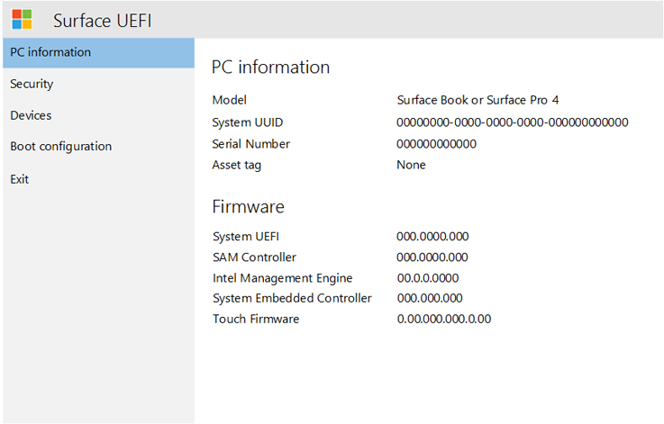
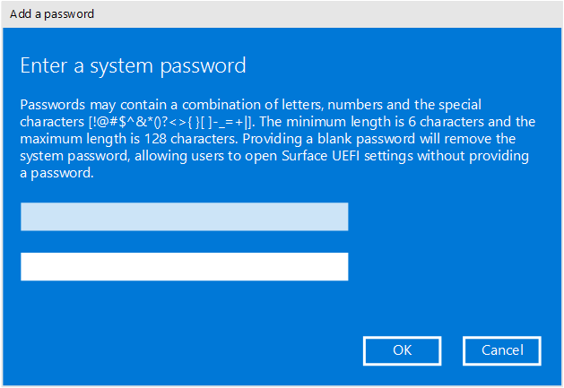
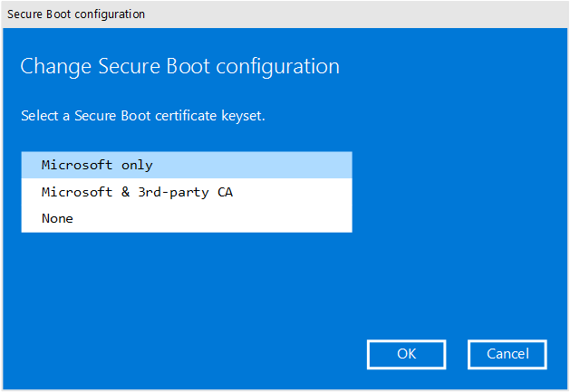
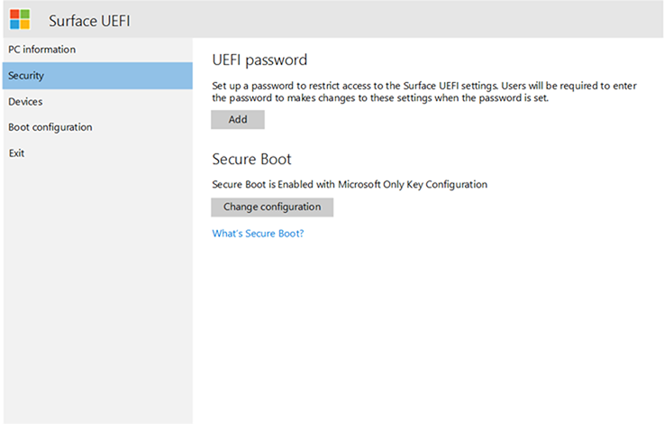
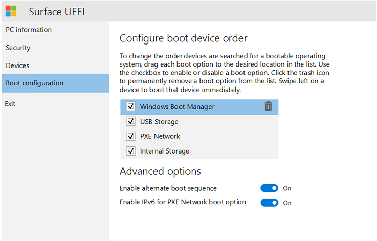
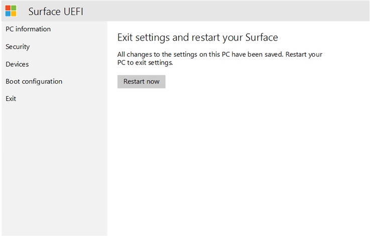
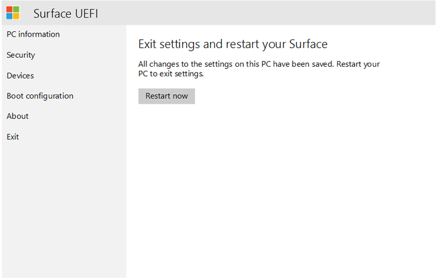

# Manage Surface UEFI settings

Current and future generations of Surface devices, including Surface Pro 4, Surface Book, and Surface Studio, use a unique UEFI firmware engineered by Microsoft specifically for these devices. This firmware allows for significantly greater control of the device’s operation over firmware versions in earlier generation Surface devices, including the support for touch, mouse, and keyboard operation. By using the Surface UEFI settings you can easily enable or disable internal devices or components, configure security to protect UEFI settings from being changed, and adjust the Surface device boot settings. 

>[!NOTE]
>Surface Pro 3, Surface 3, Surface Pro 2, Surface 2, Surface Pro, and Surface do not use the Surface UEFI and instead use firmware provided by third-party manufacturers, such as AMI.

You can enter the Surface UEFI settings on your Surface device by pressing the **Volume Up** button and the **Power** button simultaneously. Hold the **Volume Up** button until the Surface logo is displayed, which indicates that the device has begun to boot. 

## PC information 

On the **PC information** page, detailed information about your Surface device is provided: 

- **Model** – Your Surface device’s model will be displayed here, such as Surface Book or Surface Pro 4. The exact configuration of your device is not shown, (such as processor, disk size, or memory size). 
- **UUID** – This Universally Unique Identification number is specific to your device and is used to identify the device during deployment or management. 

- **Serial Number** – This number is used to identify this specific Surface device for asset tagging and support scenarios.
- **Asset Tag** – The asset tag is assigned to the Surface device with the [Asset Tag Tool](https://www.microsoft.com/download/details.aspx?id=44076). 

You will also find detailed information about the firmware of your Surface device. Surface devices have several internal components that each run different versions of firmware. The firmware version of each of the following devices is displayed on the **PC information** page (as shown in Figure 1): 

- System UEFI 

- SAM Controller 

- Intel Management Engine 

- System Embedded Controller 

- Touch Firmware 

*Figure 1. System information and firmware version information*

You can find up-to-date information about the latest firmware version for your Surface device in the [Surface Update History](https://www.microsoft.com/surface/support/install-update-activate/surface-update-history) for your device. 

## Security 

On the **Security** page of Surface UEFI settings, you can set a password to protect UEFI settings. This password must be entered when you boot the Surface device to UEFI. The password can contain the following characters (as shown in Figure 2): 

- Uppercase letters: A-Z 

- Lowercase letters: a-z 

- Numbers: 1-0 

- Special characters: !@#$%^&*()?<>{}[]-_=+|.,;:’`” 

The password must be at least 6 characters and is case sensitive. 

*Figure 2. Add a password to protect Surface UEFI settings*

On the **Security** page you can also change the configuration of Secure Boot on your Surface device. Secure Boot technology prevents unauthorized boot code from booting on your Surface device, which protects against bootkit and rootkit-type malware infections. You can disable Secure Boot to allow your Surface device to boot third-party operating systems or bootable media. You can also configure Secure Boot to work with third-party certificates, as shown in Figure 3. Read more about [Secure Boot](https://msdn.microsoft.com/windows/hardware/commercialize/manufacture/desktop/secure-boot-overview) in the TechNet Library.

*Figure 3. Configure Secure Boot*

You can also enable or disable the Trusted Platform Module (TPM) device on the **Security** page, as shown in Figure 4. The TPM is used to authenticate encryption for your device’s data with BitLocker. Read more about [BitLocker](https://technet.microsoft.com/itpro/windows/keep-secure/bitlocker-overview) in the TechNet Library. 

*Figure 4. Configure Surface UEFI security settings*

## Devices 

On the **Devices** page you can enable or disable specific devices and components of your Surface device. Devices that you can enable or disable on this page include: 

- Docking and USB Ports 

- MicroSD or SD Card Slot 

- Rear Camera 

- Front Camera 

- Infrared (IR) Camera 

- Wi-Fi and Bluetooth 

- Onboard Audio (Speakers and Microphone) 

Each device is listed with a slider button that you can move to **On** (enabled) or **Off** (disabled) position, as shown in Figure 5. 

*Figure 5. Enable and disable specific devices*

## Boot configuration 

On the **Boot Configuration** page, you can change the order of your boot devices and/or enable or disable boot of the following devices: 

- Windows Boot Manager 

- USB Storage 

- PXE Network 

- Internal Storage 

You can boot from a specific device immediately, or you can swipe left on that device’s entry in the list using the touchscreen. You can also boot immediately to a USB device or USB Ethernet adapter when the Surface device is powered off by pressing the **Volume Down** button and the **Power** button simultaneously. 

For the specified boot order to take effect, you must set the **Enable Alternate Boot Sequence** option to **On**, as shown in Figure 6. 

*Figure 6. Configure the boot order for your Surface device* 

You can also turn on and off IPv6 support for PXE with the **Enable IPv6 for PXE Network Boot** option, for example when performing a Windows deployment using PXE where the PXE server is configured for IPv4 only.  

## About 

The **About** page displays regulatory information, such as compliance with FCC rules, as shown in Figure 7. 

*Figure 7. Regulatory information displayed on the About page*

## Exit 

Use the **Restart Now** button on the **Exit** page to exit UEFI settings, as shown in Figure 8. 

*Figure 8. Click Restart Now to exit Surface UEFI and restart the device*

## Surface UEFI boot screens

When you update Surface device firmware, by using either Windows Update or manual installation, the updates are not applied immediately to the device, but instead during the next reboot cycle. You can find out more about the Surface firmware update process in [Manage Surface driver and firmware updates](https://docs.microsoft.com/surface/manage-surface-pro-3-firmware-updates). The progress of the firmware update is displayed on a screen with progress bars of differing colors to indicate the firmware for each component. Each component’s progress bar is shown in Figures 9 through 13.

*Figure 9. The Surface UEFI firmware update displays a blue progress bar*

*Figure 10. The System Embedded Controller firmware update displays a green progress bar*

*Figure 11. The SAM Controller firmware update displays an orange progress bar*

*Figure 12. The Intel Management Engine firmware update displays a red progress bar*

*Figure 13. The Surface touch firmware update displays a gray progress bar*
>[!NOTE]
>An additional warning message that indicates Secure Boot is disabled is displayed, as shown in Figure 14.

*Figure 14. Surface boot screen that indicates Secure Boot has been disabled in Surface UEFI settings*

## Related topics

[Advanced UEFI security features for Surface Pro 3](advanced-uefi-security-features-for-surface-pro-3.md)
