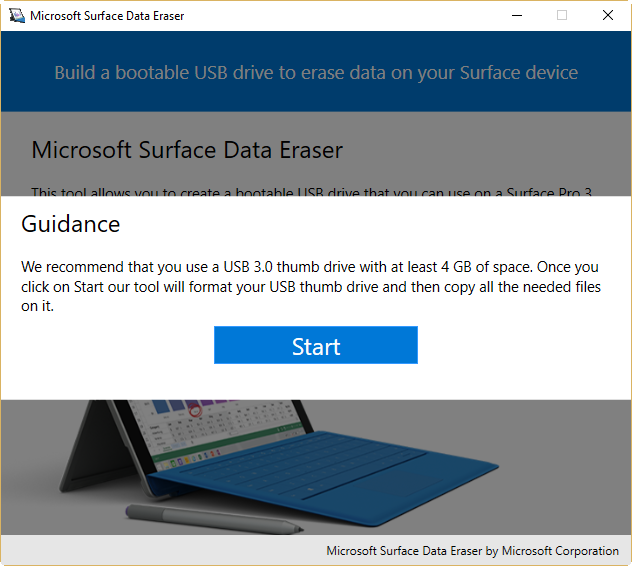
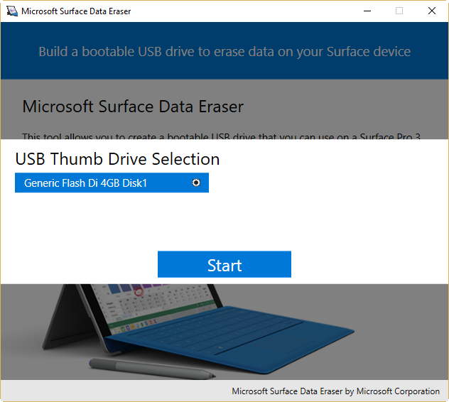
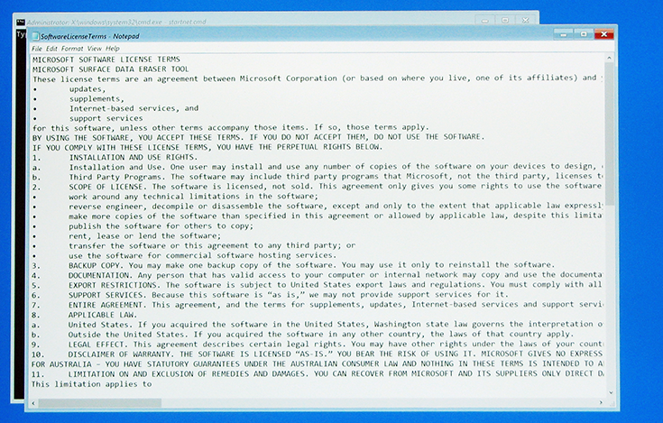
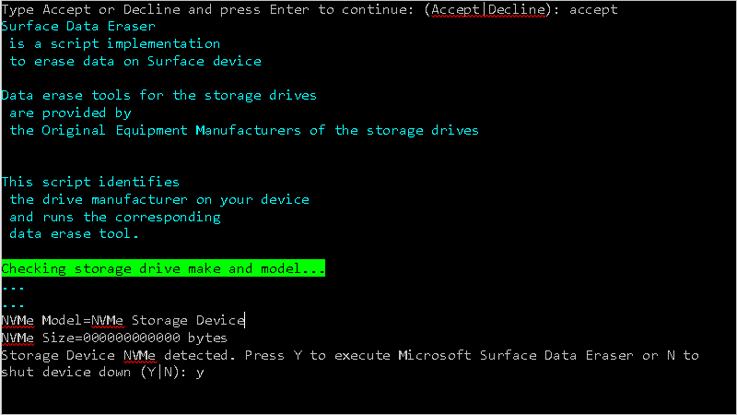

# Microsoft Surface Data Eraser

Find out how the Microsoft Surface Data Eraser tool can help you securely wipe data from your Surface devices.

[Microsoft Surface Data Eraser](https://www.microsoft.com/download/details.aspx?id=46703) is a tool that boots from a USB stick and allows you to perform a secure wipe of all data from a compatible Surface device. A Microsoft Surface Data Eraser USB stick requires only the ability to boot from USB. The USB stick is easy to create by using the provided wizard, the Microsoft Surface Data Eraser wrapper, and is easy to use with a simple graphic interface, no command line needed. To learn more about the data wiping capabilities and practices Microsoft uses during the service process for Surface, see [Protecting your data if you send your Surface in for service](https://www.microsoft.com/surface/support/security-sign-in-and-accounts/data-wiping-policy).

>[!IMPORTANT]
>Microsoft Surface Data Eraser uses the NVM Express (NVMe) format command to erase data as authorized in [NIST Special Publication 800-88 Revision 1](http://nvlpubs.nist.gov/nistpubs/SpecialPublications/NIST.SP.800-88r1.pdf). 

Compatible Surface devices include:

* Surface Pro 6
* Surface Laptop 2
* Surface Go
* Surface Book 2
* Surface Pro with LTE Advanced (Model 1807)
* Surface Pro (Model 1796)
* Surface Laptop
* Surface Studio
* Surface Book
* Surface Pro 4
* Surface 3 LTE
* Surface 3
* Surface Pro 3
* Surface Pro 2

Some scenarios where Microsoft Surface Data Eraser can be helpful include:

-   Prepare a Surface device to be sent for repair

-   Decommission a Surface device to be removed from corporate or organizational use

-   Repurpose a Surface device for use in a new department or for use by a new user

-   Standard practice when performing reimaging for devices used with sensitive data

>[!NOTE]
>Third-party devices, Surface devices running Windows RT (including Surface and Surface 2), and Surface Pro are not compatible with Microsoft Surface Data Eraser.

>[!NOTE]
>Because the ability to boot to USB is required to run Microsoft Surface Data Eraser, if the device is not configured to boot from USB or if the device is unable to boot or POST successfully, the Microsoft Surface Data Eraser tool will not function.

>[!NOTE]
>Surface Data Eraser on Surface Studio and Surface Studio 2 can take up to 6 minutes to boot into WinPE before disk erasure can occur.

## How to create a Microsoft Surface Data Eraser USB stick

To create a Microsoft Surface Data Eraser USB stick, first install the Microsoft Surface Data Eraser setup tool from the Microsoft Download Center using the link provided at the beginning of this article. You do not need a Surface device to *create* the USB stick. After you have downloaded the installation file to your computer, follow these steps to install the Microsoft Surface Data Eraser creation tool:

1.  Run the DataEraserSetup.msi installation file that you downloaded from the [Microsoft Download Center](https://www.microsoft.com/en-us/download/details.aspx?id=46703).

2.  Select the check box to accept the terms of the license agreement, and then click **Install**.

3.  Click **Finish** to close the Microsoft Surface Data Eraser setup window.

After the creation tool is installed, follow these steps to create a Microsoft Surface Data Eraser USB stick. Before you begin these steps, ensure that you have a USB 3.0 stick that is 4 GB or larger connected to the computer.

1. Start Microsoft Surface Data Eraser from the Start menu or Start screen.

2. Click **Build** to begin the Microsoft Surface Data Eraser USB creation process.

3. Click **Start** to acknowledge that you have a USB stick of at least 4 GB connected, as shown in Figure 1.

   

   *Figure 1. Start the Microsoft Surface Data Eraser tool*

4. Select the USB drive of your choice from the **USB Thumb Drive Selection** page as shown in Figure 2, and then click **Start** to begin the USB creation process. The drive you select will be formatted and any existing data on this drive will be lost.

   >[!NOTE]
   >If the Start button is disabled, check that your removable drive has a total capacity of at least 4 GB.
  
   

   *Figure 2. USB thumb drive selection*

5. After the creation process is finished, the USB drive has been formatted and all binaries are copied to the USB drive. Click **Success**.

6. When the **Congratulations** screen is displayed, you can eject and remove the thumb drive. This thumb drive is now ready to be inserted into a Surface device, booted from, and wipe any data on the device. Click **Complete** to finish the USB creation process, as shown in Figure 3.

   

   *Figure 3. Complete the Microsoft Surface Data Eraser USB creation process*

7. Click **X** to close Microsoft Surface Data Eraser.

## How to use a Microsoft Surface Data Eraser USB stick

After you create a Microsoft Surface Data Eraser USB stick, you can boot a supported Surface device from the USB stick by following this procedure:

1. Insert the bootable Microsoft Surface Data Eraser USB stick into the supported Surface device.

2. Boot your Surface device from the Microsoft Surface Data Eraser USB stick. To boot your device from the USB stick follow these steps:

   a. Turn off your Surface device.

   b. Press and hold the **Volume Down** button.

   c. Press and release the **Power** button.

   d. Release the **Volume Down** button.
    
   >[!NOTE]
   >If your device does not boot to USB using these steps, you may need to turn on the **Enable Alternate Boot Sequence** option in Surface UEFI. You can read more about Surface UEFI boot configuration in [Manage Surface UEFI Settings](https://technet.microsoft.com/itpro/surface/manage-surface-uefi-settings).

3. When the Surface device boots, a **SoftwareLicenseTerms** text file is displayed, as shown in Figure 4.

   

   *Figure 4. Booting the Microsoft Surface Data Eraser USB stick*

4. Read the software license terms, and then close the Notepad file.

5. Accept or decline the software license terms by typing **Accept** or **Decline**. You must accept the license terms to continue.

6. The Microsoft Surface Data Eraser script detects the storage devices that are present in your Surface device and displays the details of the native storage device. To continue, press **Y** (this action runs Microsoft Surface Data Eraser and removes all data from the storage device) or press **N** (this action shuts down the device without removing data).

   >[!NOTE]
   >The Microsoft Surface Data Eraser tool will delete all data, including Windows operating system files required to boot the device, in a secure and unrecoverable way. To boot a Surface device that has been wiped with Microsoft Surface Data Eraser, you will first need to reinstall the Windows operating system. To remove data from a Surface device without removing the Windows operating system, you can use the **Reset your PC** function. However, this does not prevent your data from being recovered with forensic or data recovery capabilities. See [Recovery options in Windows 10](https://support.microsoft.com/help/12415/windows-10-recovery-options) for more information.

   
  
   *Figure 5. Partition to be erased is displayed in Microsoft Surface Data Eraser*

7. If you pressed **Y** in step 6, due to the destructive nature of the data erasure process, an additional dialog box is displayed to confirm your choice.

8. Click the **Yes** button to continue erasing data on the Surface device.

>[!NOTE]
>When you run Surface Data Eraser on the Surface Data Eraser USB drive, a log file is generated in the **SurfaceDataEraserLogs** folder.

## Changes and updates

Microsoft Surface Data Eraser is periodically updated by Microsoft. For information about the changes provided in each new version, see the following:

### Version 3.2.78.0
*Release Date: 4 Dec 2018*

This version of Surface Data Eraser:

- Includes bug fixes

### Version 3.2.75.0
*Release Date: 12 November 2018*

This version of Surface Data Eraser:

- Adds support to Surface Studio 2
- Fixes issues with SD card

### Version 3.2.69.0
*Release Date: 12 October 2018*

This version of Surface Data Eraser adds support for the following:

- Surface Pro 6
- Surface Laptop 2

### Version 3.2.68.0
This version of Microsoft Surface Data Eraser adds support for the following:

- Surface Go

### Version 3.2.58.0
This version of Microsoft Surface Data Eraser adds support for the following:

- Additional storage devices (drives) for Surface Pro and Surface Laptop devices

### Version 3.2.46.0
This version of Microsoft Surface Data Eraser adds support for the following:

- Surface Pro with LTE Advanced

### Version 3.2.45.0

This version of Microsoft Surface Data Eraser adds support for the following:

- Surface Book 2

- Surface Pro 1TB

>[!NOTE]
>Surface Data Eraser v3.2.45.0 and above can be used to restore Surface Pro or Surface Laptop devices with the 1TB storage option in the scenario that the device shows two separate 512GB volumes or encounters errors when attempting to deploy or install Windows 10. See [Surface Pro Model 1796 and Surface Laptop 1TB display two drives](https://support.microsoft.com/help/4046105/surface-pro-model-1796-and-surface-laptop-1tb-display-two-drives) for more information.

### Version 3.2.36.0

This version of Microsoft Surface Data Eraser adds support for the following:

- Surface Pro

- Surface Laptop

>[!NOTE]
>The Microsoft Surface Data Eraser USB drive creation tool is unable to run on Windows 10 S. To wipe a Surface Laptop running Windows 10 S, you must first create the Microsoft Surface Data Eraser USB drive on another computer with Windows 10 Pro or Windows 10 Enterprise.
