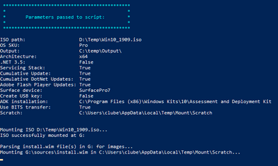

# Microsoft Surface Deployment Accelerator

Microsoft Surface Deployment Accelerator (SDA) automates the creation and configuration of a Microsoft recommended deployment experience by using free Microsoft deployment tools.

Redesigned in April 2020 to simplify and automate deployment of Surface images in a corporate environment, the 
SDA tool allows you to build a “factory-like” Windows image that you can customize to your organizational requirements.

The open source, script-driven SDA tool leverages the Windows Assessment and Deployment Kit (ADK) for Windows 10, facilitating the creation of Windows images (WIM) in test or production environments. If the latest ADK is not already installed, it will be downloaded and installed when running the SDA tool.

The resulting image closely matches the configuration of Bare Metal Recovery (BMR) images, without any pre-installed applications such as Microsoft Office or the Surface UWP application.

**To run SDA:**

1. Go to [SurfaceDeploymentAccelerator](https://github.com/microsoft/SurfaceDeploymentAccelerator) on GitHub. 
2. Select **Clone or Download** and review the Readme file.
3. Edit the script with the appropriate variables for your environment, as documented in the Readme, and review before running it in your test environment. 

   

## Related links

 - [Open source image deployment tool released on GitHub](https://techcommunity.microsoft.com/t5/surface-it-pro-blog/open-source-image-deployment-tool-released-on-github/ba-p/1314115)

 - [Download and install the Windows ADK](https://docs.microsoft.com/windows-hardware/get-started/adk-install)
