# Step by step: Surface Deployment Accelerator

This article shows you how to install Microsoft Surface Deployment Accelerator (SDA), configure a deployment share for the deployment of Windows to Surface devices, and perform a deployment to Surface devices. This article also contains instructions on how to perform these tasks without an Internet connection or without support for Windows Deployment Services network boot (PXE).

## How to install Surface Deployment Accelerator

For information about prerequisites and instructions for how to download and install SDA, see [Microsoft Surface Deployment Accelerator](microsoft-surface-deployment-accelerator.md).

1.  Download SDA, which is included in [Surface Tools for IT](https://www.microsoft.com/download/details.aspx?id=46703) on the Microsoft Download Center.

2.  Run the SDA installation file, named **Surface\_Deployment\_Accelerator\_*xxxx*.msi**, where *xxxx* is the current version number.

3.  Accept the End User License Agreement (EULA) by selecting the check box, and then click **Install**, as shown in Figure 1.

    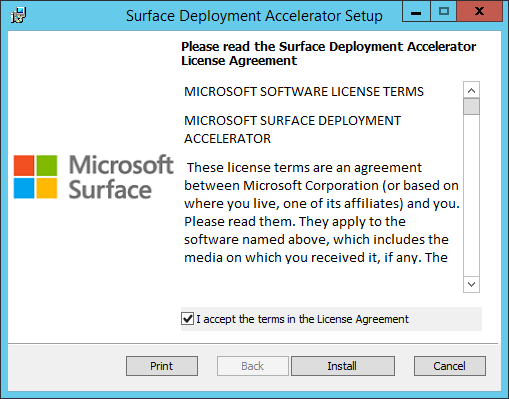

    *Figure 1. SDA setup*

4.  Click **Finish** to complete the installation of SDA.

The tool installs in the SDA program group, as shown in Figure 2.

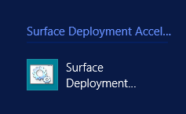

*Figure 2. The SDA program group and icon*

>[!NOTE]
>At this point, the tool has not yet prepared any deployment environment or downloaded any materials from the Internet.

## Create a deployment share

The following steps show you how to create a deployment share for Windows 10 that supports Surface 3, Surface Pro 3, Surface Pro 4, Surface Book, the Surface Firmware Tool, the Surface Asset Tag Tool, and Office 365. As you follow the steps below, make the selections that are applicable for your organization. For example, you could choose to deploy Windows 10 to Surface Book only, without any of the Surface apps.

>[!NOTE]
>SDA lets you create deployment shares for both Windows 8.1 and Windows 10 deployments, but you can only create a single deployment share at a time. Therefore, to create both Windows 8.1 and Windows 10 deployment shares, you will need to run the tool twice.

1.  Open the SDA wizard by double-clicking the icon in the **Surface Deployment Accelerator** program group on the Start screen.

2.  On the **Welcome** page, click **Next** to continue.

3.  On the **Verify System** page, the SDA wizard verifies the prerequisites required for an SDA deployment share. This process also checks for the presence of the Windows Assessment and Deployment Kit (Windows ADK) for Windows 10 and the Microsoft Deployment Toolkit (MDT) 2013 Update 2. If these tools are not detected, they are downloaded and installed automatically. Click **Next** to continue.

  >[!NOTE]
  >As of SDA version 1.96.0405, SDA will install only the components of the Windows ADK that are required for deployment, as follows:
  > * Deployment tools
  >  * User State Migration Tool (USMT)
  >  * Windows Preinstallation Environment (WinPE)

  >[!NOTE]
  >As of SDA version 1.96.0405, SDA will install and use MDT 2013 Update 2. Earlier versions of SDA are compatible only with MDT 2013 Update 1.

4.  On the **Windows 8.1** page, to create a Windows 10 deployment share, do not select the **Would you like to support Windows 8.1** check box. Click **Next** to continue.

5.  On the **Windows 10** page, to create a Windows 10 deployment share, select the **Would you like to support Windows 10** check box. Supply the following information before you click **Next** to continue:

    -   **Configure Deployment Share for Windows 10**

        -   **Local Path** – Specify or browse to a location on the local storage device where you would like to store the deployment share files for the Windows 10 SDA deployment share. For example, **E:\\SDAWin10\\** is the location specified in Figure 3.

        -   **Share Name** – Specify a name for the file share that will be used to access the deployment share on this server from the network. For example, **SDAWin10** is the deployment share name shown in Figure 3. The local path folder is automatically shared by the SDA scripts under this name to the group **Everyone** with a permission level of **Full Control**.

    -   **Windows 10 Deployment Services**

        -   Select the **Import boot media into the local Windows Deployment Service** check box if you would like to boot your Surface devices from the network to perform the Windows deployment. Windows Deployment Services must be installed and configured to respond to PXE boot requests. See [Windows Deployment Services Getting Started Guide for Windows Server 2012](https://technet.microsoft.com/library/jj648426.aspx) for more information about how to configure Windows Deployment Services for PXE boot.

    -   **Windows 10 Source Files**

        -   **Local Path** – Specify or browse to the root directory of Windows 10 installation files. If you have an ISO file, mount it and browse to the root of the mounted drive. You must have a full set of source files, not just **Install.wim**.

    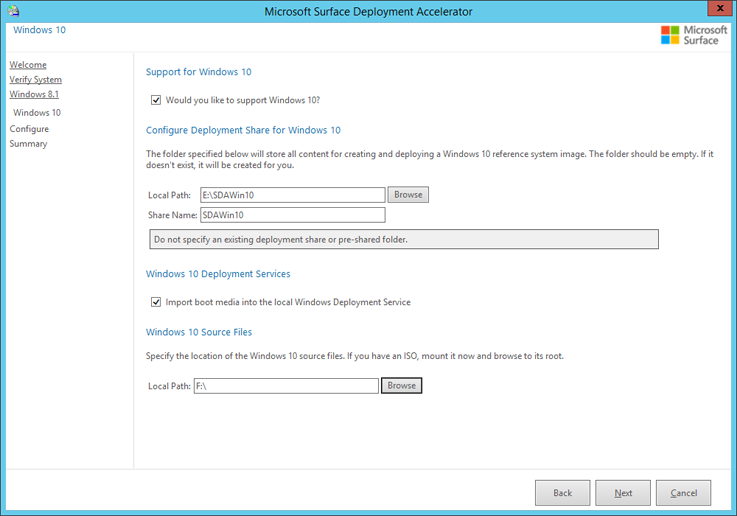

    *Figure 3. Specify Windows 10 deployment share options*

6.  On the **Configure** page, select the check box next to each device or app that you want to include in your deployment share. Note that Surface Pro 4 and Surface Book only support Windows 10 and are not available for the deployment of Windows 8.1. The Surface Firmware Tool is only applicable to Surface 3 and Surface Pro 3 and cannot be selected unless Surface 3 or Surface Pro 3 drivers are selected, as shown in Figure 4. Click **Next** to continue.

    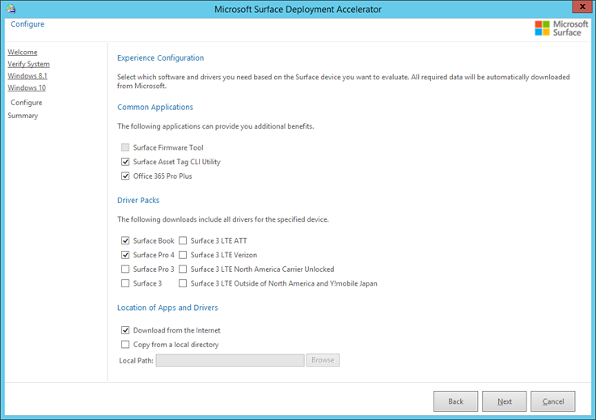

    *Figure 4. Selecting Surface Firmware Tool requires Surface Pro 3 drivers*

    >[!NOTE]
    >You cannot select both Surface 3 and Surface 3 LTE models at the same time.

7.  On the **Summary** page confirm your selections and click **Finish** to begin the creation of your deployment share. The process can take several minutes as files are downloaded, the tools are installed, and the deployment share is created. While the SDA scripts are creating your deployment share, an **Installation Progress** window will be displayed, as shown in Figure 5. A typical SDA process includes:

    -   Download of Windows ADK

    -   Installation of Windows ADK

    -   Download of MDT

    -   Installation of MDT

    -   Download of Surface apps and drivers

    -   Creation of the deployment share

    -   Import of Windows installation files into the deployment share

    -   Import of the apps and drivers into the deployment share

    -   Creation of rules and task sequences for Windows deployment

    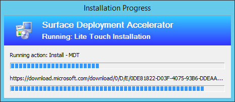

    *Figure 5. The Installation Progress window*
    >[!NOTE]
    >The following error message may be hit while Installing the latest ADK or MDT: "An exception occurred during a WebClient request.". This is due to incompatibility between SDA and BITS. Here is the workaround for this:

    In the following two PowerShell scripts:

    ```powershell
    %ProgramFiles%\Microsoft\Surface\Deployment Accelerator\Data\PowerShell\Install-MDT.ps1
    %ProgramFiles%\Microsoft\Surface\Deployment Accelerator\Data\PowerShell\INSTALL-WindowsADK.ps1
    ```

    Edit the $BITSTransfer variable in the input parameters to $False as shown below:

    ```powershell
    Param(
        [Parameter(
            Position=0,
            Mandatory=$False,
            HelpMessage="Download via BITS bool true/false"
        )]
        [string]$BITSTransfer = $False
    )
    ```

8. When the SDA process completes the creation of your deployment share, a **Success** window is displayed. Click **Finish** to close the window. At this point your deployment share is now ready to perform a Windows deployment to Surface devices.

    ### Optional: Create a deployment share without an Internet connection

    If you are unable to connect to the Internet with your deployment server, or if you want to download the Surface drivers and apps separately, you can specify a local source for the driver an app files at the time of deployment share creation. On the **Configure** page of the SDA wizard, select the **Copy from a Local Directory** check box, as shown in Figure 6. The **Download from the Internet** check box will be automatically deselected. Enter the folder location where you have placed the driver and app files in the **Local Path** field, as shown in Figure 6.

    >[!NOTE]
    >All of the downloaded driver and applications files must be located in the same folder. If a required driver or application file is missing from the selected folder when you click **Next**, a warning is displayed and the wizard will not proceed to the next step.

    >[!NOTE]
    >The driver and app files do not need to be extracted from the downloaded .zip files.

    >[!NOTE]
    >Including Office 365 in your deployment share requires an Internet connection and cannot be performed if you use local files.

    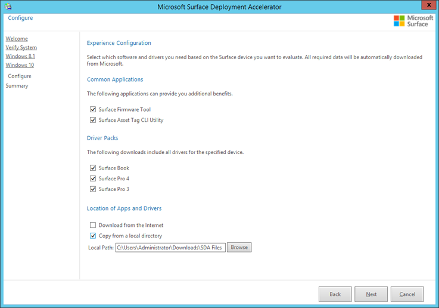

    *Figure 6. Specify the Surface driver and app files from a local path*

    >[!NOTE]
    >The **Copy from a Local Directory** check box is only available in SDA version 1.90.0221 or later.

    ### <a href="" id="optional"></a>Optional: Prepare offline USB media

    You can use USB media to perform an SDA deployment if your Surface device is unable to boot from the network. For example, if you do not have a Microsoft Surface Ethernet Adapter or Microsoft Surface dock to facilitate network boot (PXE boot). The USB drive produced by following these steps includes a complete copy of the SDA deployment share and can be run on a Surface device without a network connection.

    >[!NOTE]
    >The offline media files for the complete SDA deployment share are approximately 9 GB in size. Your USB drive must be at least 9 GB in size. A 16 GB USB drive is recommended.

    Before you can create bootable media files within the MDT Deployment Workbench or copy those files to a USB drive, you must first configure that USB drive to be bootable. Using [DiskPart](https://go.microsoft.com/fwlink/p/?LinkId=761073), create a partition, format the partition as FAT32, and set the partition to be active. To run DiskPart, open an administrative PowerShell or Command Prompt window, and then run the following sequence of commands, as shown in Figure 7:

    1.  **diskpart** – Opens DiskPart to manage disks and partitions.

    2.  **list disk** – Displays a list of the disks available in your system; use this list to identify the disk number that corresponds with your USB drive.

    3.  **sel disk 2** – Selects your USB drive; use the number that corresponds with the disk in your system.

    4.  **clean** – Removes all configuration from your USB drive.

    >[!WARNING]
    >This step will remove all information from your drive. Verify that your USB drive does not contain any needed data before you perform the **clean** command.

    5.  **create part pri** – Creates a primary partition on the USB drive.

    6.  **format fs=fat32 quick** – Formats the partition with the FAT32 file system, performing a quick format. FAT32 is required to boot the device from UEFI systems like Surface devices.

    7.  **assign** – Assigns the next available drive letter to the newly created FAT32 volume.

    8.  **active** – Sets the partition to be active, which is required to boot the volume.

    9.  **exit** – Exits DiskPart, after which you can close the PowerShell or Command Prompt window.

    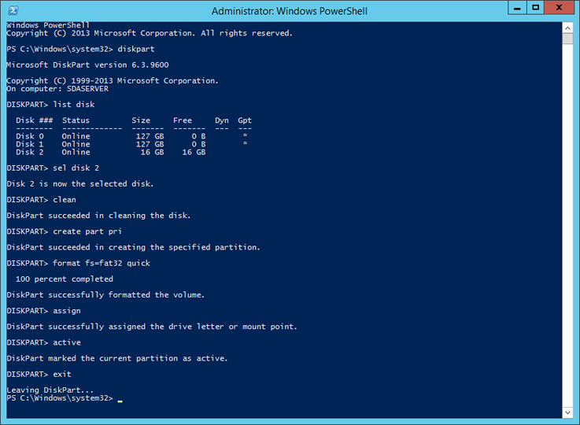

    *Figure 7. Use DiskPart to prepare a USB drive for boot*

    >[!NOTE]
    >You can format your USB drive with FAT32 from Disk Management, but you must still use DiskPart to set the partition as active for the drive to boot properly.

    After you have prepared the USB drive for boot, the next step is to generate offline media from the SDA deployment share. To create this media, follow these steps:

    1.  Open the **Deployment Workbench** from the **Microsoft Deployment Toolkit** group on your Start screen.

    2.  Expand the **Deployment Shares** node and the **Microsoft Surface Deployment Accelerator** deployment share.

    3.  Expand the folder **Advanced Configuration** and select the **Media** folder.

    4.  Right-click the **Media** folder and click **New Media** as shown in Figure 8 to start the New Media Wizard.

    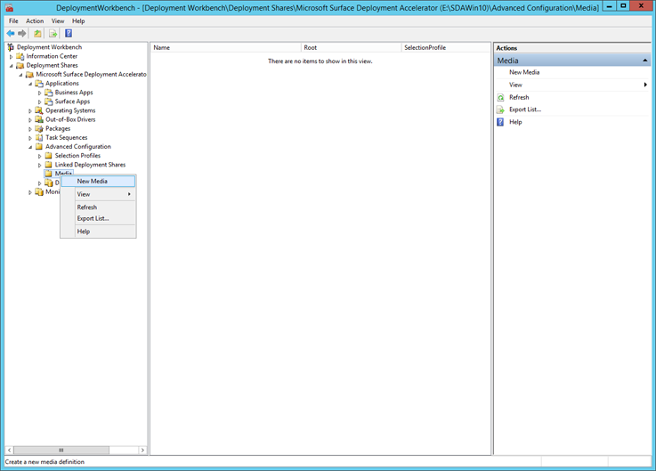

    *Figure 8. The Media folder of the SDA deployment share*

    5.  On the **General Settings** page in the **Media path** field, enter or browse to a folder where you will create the files for the new offline media. See the example **E:\\SDAMedia** in Figure 9. Leave the default profile **Everything** selected in the **Selection profile** drop-down menu, and then click **Next**.

    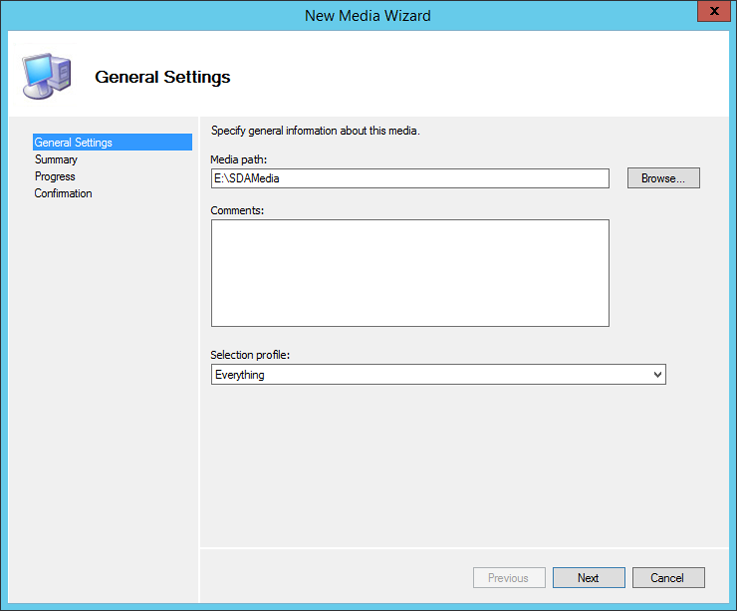

    *Figure 9. Specify a location and selection profile for your offline media*

    6.  On the **Summary** page verify your selections, and then click **Next** to begin creation of the media.

    7.  A **Progress** page is displayed while the media is created.

    8.  On the **Confirmation** page, click **Finish** to complete creation of the media.

    9.  Right-click the **Microsoft Surface Deployment Accelerator** deployment share folder, click **Properties**, and then click the **Rules** tab as shown in Figure 10.

    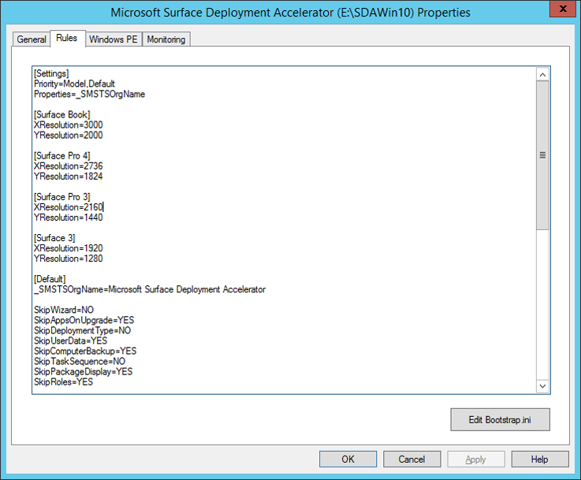

    *Figure 10. Rules of the SDA deployment share*

    10. Use your mouse to highlight all of the text displayed in the text box of the **Rules** tab, and then press **Ctrl+C** to copy the text.

    11. Click **OK** to close the **Microsoft Surface Deployment Accelerator** deployment share properties.

    12. Right-click the newly created **MEDIA001** item in the **Media** folder, click **Properties**, and then click the **Rules** tab.

    13. Use your mouse to highlight all of the text displayed in the text box of the **Rules** tab, and then press **Ctrl+V** to paste the text you copied from the **Microsoft Surface Deployment Accelerator** deployment share rules.

    14. Right-click the **Microsoft Surface Deployment Accelerator** deployment share folder, click **Properties**, and then click the **Rules** tab again. Click the **Bootstrap.ini** button to open Bootstrap.ini in Notepad.

    15. Press **Ctrl+A** to select all of the text in the window, and then press **Ctrl+C** to copy the text.

    16. Close Bootstrap.ini and click **OK** in **Microsoft Surface Deployment Accelerator** deployment share properties to close the window.

    17. Right-click the newly created **MEDIA001** item in the **Media** folder, click **Properties**, and then click the **Rules** tab again. Click the **Bootstrap.ini** button to open Bootstrap.ini in Notepad.

    18. Press **Ctrl+A** to select all of the text in the window, then press **Ctrl+V** to paste the text from the SDA deployment share Bootstrap.ini file.

    19. Delete the following lines from the Bootstrap.ini as shown in Figure 11, and then save the file:

        ```powershell
        UserID=
        UserDomain=
        UserPassword=
        DeployRoot=\\SDASERVER\SDAWin10
        UserID=
        UserDomain=
        UserPassword=
        ```

    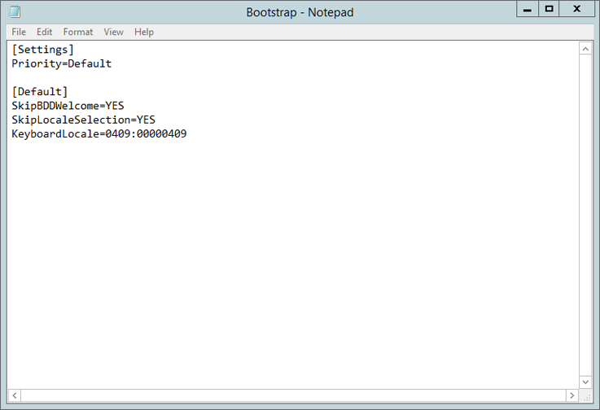

    *Figure 11. The Bootstrap.ini file of MEDIA001*

    20. Close Bootstrap.ini and click **OK** in **MEDIA001** deployment share properties to close the window.

    21. In the **Deployment Workbench** under the **Media** folder, right-click the newly created **MEDIA001** and click **Update Media Content**, as shown in Figure 12. This will update the media files with the content of the **Microsoft Surface Deployment Accelerator** deployment share.

    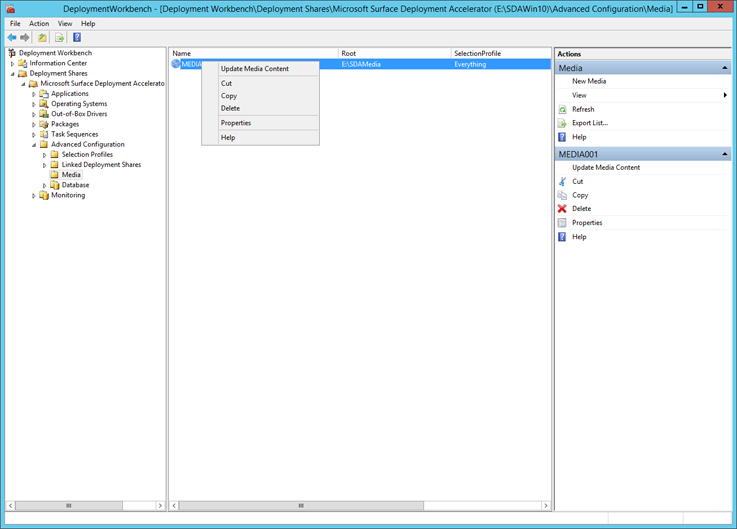

    *Figure 12. Select the Update Media Content option*

    22. The **Update Media Content** window is displayed and shows the progress as the media files are created. When the process completes, click **Finish.**

    The final step is to copy the offline media files to your USB drive.

    1.  In File Explorer, open the path you specified in Step 5, for example **E:\\SDAMedia**.

    2.  Copy all of the files from the Content folder to the root of the USB drive.

    Your USB drive is now configured as bootable offline media that contains all of the resources required to perform a deployment to a Surface device.

## SDA task sequences

The SDA deployment share is configured with all of the resources required to perform a Windows deployment to a Surface device. These resources include Windows source files, image, Surface drivers, and Surface apps. The deployment share also contains two pre-configured task sequences, as shown in Figure 13. These task sequences contain the steps required to perform a deployment to a Surface device using the default Windows image from the installation media or to create a reference image complete with Windows updates and applications. To learn more about task sequences, see [MDT 2013 Update 2 Lite Touch components](https://technet.microsoft.com/itpro/windows/deploy/mdt-2013-lite-touch-components).

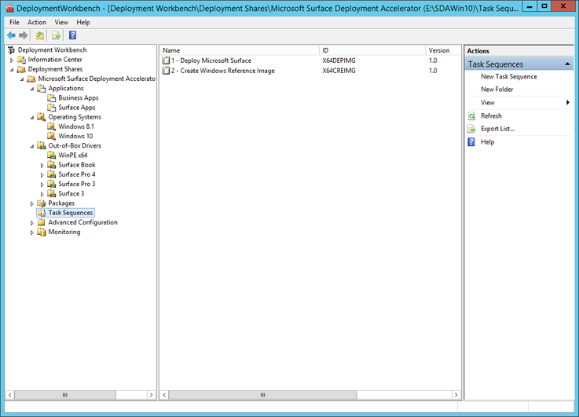

*Figure 13. Task sequences in the Deployment Workbench*

### Deploy Microsoft Surface

The **1 – Deploy Microsoft Surface** task sequence is used to perform a complete deployment of Windows to a Surface device. This task sequence is pre-configured by the SDA wizard and is ready to perform a deployment as soon as the wizard completes. Running this task sequence on a Surface device deploys the unaltered Windows image copied directly from the Windows installation media you specified in the SDA wizard, along with the Surface drivers for your device. The drivers for your Surface device will be automatically selected through the pre-configured deployment share rules.

When you run the task sequence, you will be prompted to provide the following information:

-   A computer name

-   Your domain information and the credentials required to join the domain

-   A product key, if one is required

    >[!NOTE]
    >If you are deploying the same version of Windows as the version that came on your device, no product key is required.

-   A time zone

-   An Administrator password

The Surface apps you specified on the **Configure** page of the SDA wizard are automatically installed when you run this task sequence on a Surface device.

### Create Windows reference image

The **2 – Create Windows Reference Image** task sequence is used to perform a deployment to a virtual machine for the purpose of capturing an image complete with Windows Updates for use in a deployment to Surface devices. By installing Windows Updates in your reference image, you eliminate the need to download and install those updates on each deployed Surface device. The deployment process with an up-to-date image is significantly faster and more efficient than performing a deployment first and then installing Windows Updates on each device.

Like the **1 – Deploy Microsoft Surface** task sequence, the **2 – Create Windows Reference Image** task sequence performs a deployment of the unaltered Windows image directly from the installation media. Creation of a reference image should always be performed on a virtual machine. Using a virtual machine as your reference system helps to ensure that the resulting image is compatible with different hardware configurations.

>[!NOTE]
>Using a virtual machine when you create a reference image for Windows deployment is a recommended practice for performing Windows deployments with Microsoft deployment tools including the Microsoft Deployment Toolkit and System Center Configuration Manager. These Microsoft deployment technologies use the hardware agnostic images produced from a virtual machine and a collection of managed drivers to deploy to different configurations of hardware. For more information, see [Deploy a Windows 10 image using MDT 2013 Update 2](https://technet.microsoft.com/itpro/windows/deploy/deploy-a-windows-10-image-using-mdt).

In addition to the information required by the **1 – Deploy Microsoft Surface** task sequence, you will also be prompted to capture an image when you run this task sequence on your reference virtual machine. The **Location** and **File name** fields are automatically populated with the proper information for your deployment share. All that you need to do is select the **Capture an image of this reference computer** option when you are prompted on the **Capture Image** page of the Windows Deployment Wizard.

## Deployment to Surface devices


To perform a deployment from the SDA deployment share, follow this process on the Surface device:

1.  Boot the Surface device to MDT boot media for the SDA deployment share. You can do this over the network by using PXE boot, or from a USB drive as described in the [Optional: Prepare offline USB media](#optional) section of this article.

2.  Select the deployment share for the version of Windows you intend to deploy and enter your credentials when you are prompted.

3.  Select the task sequence you want to run, usually the **1 – Deploy Microsoft Surface** task sequence.

4.  Address the task sequence prompts to pick applications, supply a password, and so on.

5.  The task sequence performs the automated deployment using the options specified.

### Boot the Surface device from the network

To boot the Surface device from the network, the Microsoft Surface Deployment Accelerator wizard must have been run on a Windows Server 2012 R2 or later environment that was configured with the Windows Deployment Services (WDS). WDS must have been configured to respond to network boot (PXE boot) requests and the boot files must have been imported into WDS. The SDA wizard will import these file automatically if the **Import boot media into the local Windows Deployment Service** check box was selected on the page for the version of Windows you intend to deploy.

To boot the Surface device from the network, you must also use a Microsoft Surface Ethernet Adapter or the Ethernet port on a Microsoft Surface Dock. Third-party Ethernet adapters are not supported for network boot (PXE boot). A keyboard is also required. Both the Microsoft Surface Type Cover and keyboards connected via USB to the device or dock are supported.

To instruct your Surface device to boot from the network, start with the device powered off and follow these steps:

1.  Press and hold the **Volume Down** button, press and release the **Power** button. Continue holding the **Volume Down** button until the device has begun to boot from the network.

2.  Press **Enter** when prompted by the dialog on the screen. This prompt indicates that your device has found the WDS PXE server over the network.

3.  If you have configured more than one deployment share on this device, you will be prompted to select between the boot images for each deployment share. For example, if you created both a Windows 10 and a Windows 8.1 deployment share, you will be prompted to choose between these two options.

4.  Enter the domain credentials that you use to log on to the server where SDA is installed when you are prompted, as shown in Figure 14.

    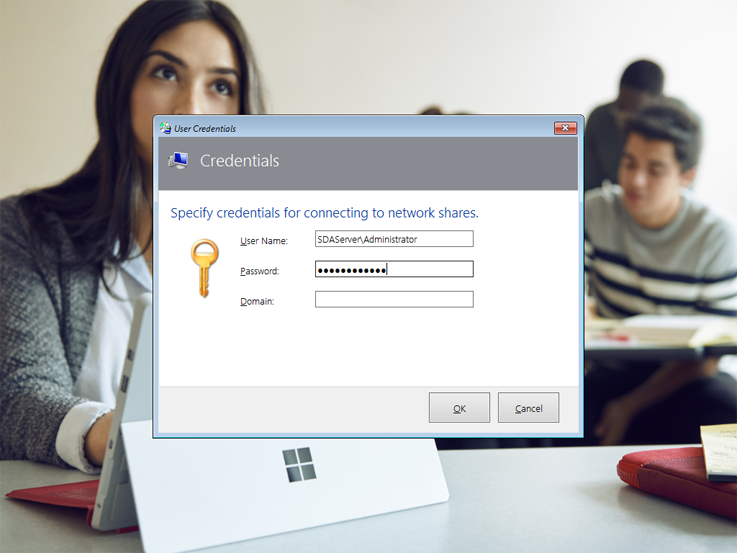

    *Figure 14. The prompt for credentials to the deployment share*

5.  The Windows Deployment Wizard will start from the deployment share to walk you through the deployment process.

### Alternatively boot the devices from the USB stick

To boot a device from the USB stick:

1.  Press and hold the **Volume Down** button, press and release the **Power** button. Continue holding the **Volume Down** button until the device has begun to boot from the USB drive.

2.  The Windows Deployment Wizard will start from the deployment share to walk you through the deployment process.

### Run the Deploy Microsoft Surface task sequence

To run the Deploy Microsoft Surface task sequence:

1.  On the **Task Sequence** page, select the **1 – Deploy Microsoft Surface** task sequence as shown in Figure 15, and then click **Next.**

    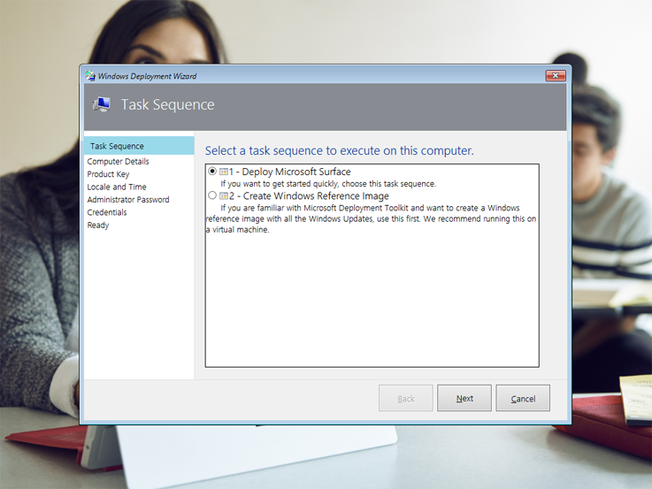

    *Figure 15. Select the 1 – Deploy Microsoft Surface task sequence*

2.  On the **Computer Details** page, type a name for the Surface device in the **Computer Name** box. In the **Join a domain** section, type your domain name and credentials as shown in Figure 16, and then click **Next**.

    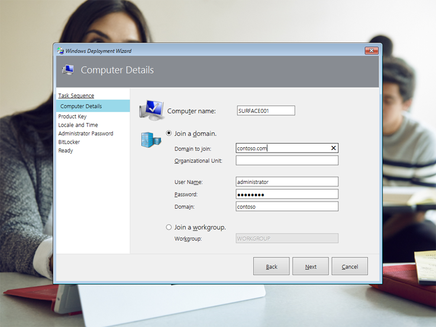

    *Figure 16. Enter the computer name and domain information*

3.  On the **Product Key** page, keep the **No product key is required** check box selected if you are deploying the same version and edition of Windows to your Surface devices as they came with from the factory. If you are deploying a different version or edition of Windows to the device, such as Windows Enterprise, select the licensing option that is applicable to your scenario.

4.  On the **Locale and Time** page, select your desired **Language Settings** and **Time Zone**, and then click **Next.**

5.  On the **Administrator Password** page, type a password for the local Administrator account on the Surface device, and then click **Next.**

6.  On the **BitLocker** page, select the **Enable BitLocker** option along with your desired configuration of BitLocker protectors if you want to encrypt the device. Otherwise, keep the **Do not enable BitLocker for this computer** check box selected, and then click **Next.**

7.  On the **Ready** page, verify your selections and then click **Begin** to start the automated deployment to this device. The deployment will not require user interaction again. The Windows Deployment Wizard will close and an **Installation Progress** window is displayed to show progress of the task sequence as the image is applied and applications are installed (Figure 17).

    

    *Figure 17. The Installation Progress window*

8.  When the deployment task sequence completes, a **Success** window is displayed. Click **Finish** to complete the deployment and begin using your Surface device.
