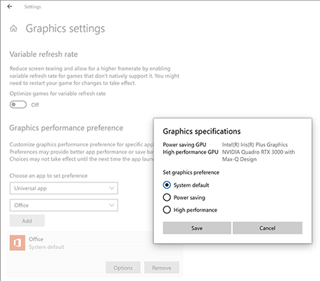

# Surface Book 3 GPU technical overview

## Introduction

Surface Book 3, the most powerful Surface laptop yet released, integrates fully modernized compute and graphics capabilities into its famous detachable form factor.  Led by the quad-core 10th Gen Intel® Core™ i7 and NVIDIA® Quadro RTX™ 3000 graphical processing unit (GPU) on the 15-inch model, Surface Book 3 comes in a wide range of configurations for consumers, creative professionals, architects, engineers, and data scientists. This article explains the major differences between the GPU configurations across 13-inch and 15-inch models of Surface Book 3.
 
A significant differentiator across Surface Book 3 models is the GPU configuration. In addition to the integrated Intel GPU built into all models, all but the entry-level, 13.5-inch core i5 device also feature a discrete NVIDIA GPU with Max-Q Design, which incorporates features that optimize energy efficiency for mobile form factors.
 
Built into the keyboard base, the additional NVIDIA GPU provides advanced graphics rendering capabilities and comes in two primary configurations: GeForce® GTX® 1650/1660 Ti for consumers or creative professionals and Quadro RTX 3000 for creative professionals, engineers, and other business professionals who need advanced graphics or deep learning capabilities. This article also describes how to optimize app utilization of GPUs by specifying which apps should use the integrated iGPU versus the discrete NVIDIA GPU.

## Surface Book 3 GPUs

This section describes the integrated and discrete GPUs across Surface Book 3 models. For configuration details of all models, refer to [Appendix A: Surface Book 3 SKUs](#).

### Intel Iris™ Plus Graphics

The integrated GPU (iGPU) included on all Surface Book 3 models incorporates a wider graphics engine and a redesigned memory controller with support for LPDDR4X. Installed as the secondary GPU on most Surface Book 3 models, Intel Iris Plus Graphics functions as the singular GPU in the core i5, 13.5-inch model. Although nominally the entry level device in the Surface Book 3 line, it delivers advanced graphics capabilities enabling consumers, hobbyists, and online creators to run the latest productivity software like Adobe Creative Cloud or enjoy gaming titles in 1080p.  

### NVIDIA GeForce GTX 1650

NVIDIA GeForce GTX 1650 with Max-Q design delivers a major upgrade of the core streaming multiprocessor to more efficiently handle the complex graphics of modern games. Its
concurrent execution of floating point and integer operations boosts performance in compute-heavy workloads of modern games. A new unified memory architecture with twice the cache of its predecessor allows for better performance on complex modern games. New shading advancements improve performance, enhance image quality, and deliver new levels of geometric complexity.

### NVIDIA GeForce GTX 1660 Ti

Compared with the GeForce GTX 1650, the faster GeForce GTX 1660 Ti provides Surface Book 3 with additional performance improvements and includes the new and upgraded NVIDIA Encoder, making it better for consumers, gamers, live streamers, and creative professionals.
 
Thanks to 6 GB of GDDR6 graphics memory, Surface Book 3 models equipped with NVIDIA GeForce GTX 1660 TI provide superior speeds on advanced business productivity software and popular games especially when running the most modern titles or livestreaming. With an optional 2 TB SSD (available in U.S. only), the 15-inch model with GeForce GTX 1660 Ti delivers the most storage of any Surface Book 3 device.

### NVIDIA Quadro RTX 3000

NVIDIA Quadro RTX 3000 unlocks several key features for professional users:  ray tracing rendering and AI acceleration, and advanced graphics and compute performance. A combination of 30 RT cores, 240 tensor cores, and 6 GB of GDDR6 graphics memory enables multiple advanced workloads including Al-powered workflows, 3D content creation, advanced video editing, professional broadcasting, and multi-app workflows. Enterprise level hardware and software support integrate deployment tools to maximize uptime and minimize IT support requirements. Certified for the world’s most advanced software, Quadro drivers are optimized for professional applications, and are tuned, tested, and validated to provide app certification, enterprise level stability, reliability, availability, and support with extended product availability.
 

## Comparing GPUs across Surface Book 3

NVIDIA GPUs provide users with great performance for gaming, live streaming, and content creation. GeForce GTX products are great for gamers and content creators. Quadro RTX products are targeted at professional users, provide great performance in gaming and content creation, and also add the following features:

- RTX acceleration for ray tracing and AI. This makes it possible to render film-quality, photorealistic objects and environments with physically accurate shadows, reflections and refractions.  And its hardware accelerated AI capabilities means the advanced AI-based features in popular applications can run faster than ever before.
- Enterprise-level hardware, drivers and support, as well as ISV app certifications.
- IT management features including an additional layer of dedicated enterprise tools for remote management that help maximize uptime and minimize IT support requirements. 

 Unless you count yourself among the ranks of advanced engineering, design, architecture, or data science professionals, Surface Book 3 equipped with NVIDIA GeForce graphics capabilities will likely meet your needs. Conversely, if you’re already in -- or aspiring to join -- a profession that requires highly advanced graphics capabilities in a portable form factor that lets you work from anywhere, Surface Book 3 with Quadro RTX 3000 deserves serious consideration. To learn more, refer to the Surface Book 3 Quadro RTX 3000 technical overview.
 
**Table 1. Discrete GPUs on Surface Book 3**

|                      | **GeForce GTX 1650**                   | **GeForce GTX 1660 Ti**                            | **Quadro RTX 3000**                                                                                       |
| -------------------- | -------------------------------------- | -------------------------------------------------- | --------------------------------------------------------------------------------------------------------- |
| **Target users**     | Gamers, hobbyists and online creators  | Gamers, creative professionals and online creators | Creative professionals, architects, engineers, developers, data scientists                                |
| **Workflows**        | Graphic design Photography Video | Graphic design Photography Video             | Al-powered Workflows   App certifications High-res video Pro broadcasting Multi-app workflows |
| **Key apps**         | Adobe Creative Suite                   | Adobe Creative Suite                               | Adobe Creative Suite Autodesk AutoCAD Dassault Systemes SolidWorks                                  |
| **GPU acceleration** | Video and image processing             | Video and image processing                         | Ray tracing + AI + 6K video Pro broadcasting features Enterprise support                            |

 
 
**Table 2. GPU tech specs on Surface Book 3**

|                                                          | **GeForce GTX 1650** | **GeForce GTX 1660 Ti** | **Quadro RTX 3000** |
| -------------------------------------------------------- | -------------------- | ----------------------- | ------------------- |
| **NVIDIA CUDA processing cores**                         | 1024                 | 1536                    | 1920                |
| **NVIDIA Tensor Cores**                                  | No                   | No                      | 240                 |
| **NVIDIA RT Cores**                                      | No                   | No                      | 30                  |
| **GPU memory**                                           | 4 GB                 | 6 GB                    | 6 GB                |
| **Memory Bandwidth (GB/sec)**                            | Up to 112            | Up to 288               | Up to 288           |
| **Memory type**                                          | GDDR5                | GDDR6                   | GDDR6               |
| **Memory interface**                                     | 128-bit              | 192-bit                 | 192-bit             |
| **Boost clock MHz**                                      | 1245                 | 1425                    | 1305                |
| **Base clock (MHz)**                                     | 1020                 | 1245                    | 765                 |
| **Real-time ray tracing**                                | No                   | No                      | Yes                 |
| **AI hardware acceleration**                             | No                   | No                      | Yes                 |
| **Hardware Encoder**                                     | Yes                  | Yes                     | Yes                 |
| **Game Ready Driver (GRD)**                              | Yes 1                                   | Yes  1          |Yes 2 
| **Studio Driver (SD)**                                   | Yes  1            | Yes1                 | Yes  1           |
| **Optimal Driver for Enterprise (ODE)**                  | No                   | No                      | Yes            |
| **Quadro New Feature Driver (QNF)**                      | No                   | No                      | Yes            |
| **Microsoft DirectX 12 API, Vulkan API, Open GL 4.6**    | Yes                  | Yes                     | Yes                 |
| **High-bandwidth Digital Content Protection (HDCP) 2.2** | Yes                  | Yes                     | Yes                 |
| **NVIDIA GPU Boost**                                     | Yes                  | Yes                     | Yes                 |

 
 1. *Recommended*
 2.  *Supported*

## Optimizing power and performance on Surface Book 3 

Windows 10 includes a Battery Saver mode with a performance slider that lets you maximize app performance (by sliding it to the right) or preserve battery life (by sliding it to the left). Surface Book 3 implements this functionality algorithmically to optimize power and performance across the following components:

- CPU Energy Efficiency Registers (Intel Speed Shift technology) and other SoC tuning parameters to maximize efficiency.
- Fan Maximum RPM with four modes: quiet, nominal, performance, and max.
- Processor Power Caps (PL1/PL2).
- Processor IA Turbo limitations.

By default, when the battery drops below 20 percent, the Battery Saver adjusts settings to extend battery life. When connected to power, Surface Book 3 defaults to “Best Performance” settings to ensure apps run in high performance mode on the secondary NVIDIA GPU present on all i7 Surface Book 3 systems.
 
Using default settings is recommended for optimal performance when used as a laptop or detached in tablet or studio mode. You can access Battery Saver by selecting the battery icon on the far right of the taskbar.

### Game mode

Surface Book 3 includes a new game mode that automatically selects maximum performance settings when launched.

### Safe Detach

New in Surface Book 3, apps enabled for Safe Detach let you disconnect while the app is using the GPU. For supported apps like *World of Warcraft*, your work is moved to the iGPU. 

### Modifying app settings to always use a specific GPU

You can switch between the power-saving but still capable built-in Intel graphics and the more powerful discrete NVIDIA GPU and associate a GPU with a specific app. By default, Windows 10 automatically chooses the appropriate GPU, assigning graphically demanding apps to the discrete NVIDIA GPU. In most instances there is no need to manually adjust these settings. However, if you frequently detach and reattach the display from the keyboard base while using a graphically demanding app, you’ll typically need to close the app prior to detaching. To enable continuous use of the app without having to close it every time you detach or reattach the display, you can assign it to the integrated GPU, albeit with some loss of graphics performance.  
 
In some instances, Windows 10 may assign a graphically demanding app to be iGPU; for example, if the app is not fully optimized for hybrid graphics. To remedy this, you can manually assign the app to the discrete NVIDIA GPU.
 
**To configure apps using custom per-GPU options:**  

1. Go to **Settings** > **System** > **Display** and select **Graphics Settings**.

    1. For a Windows desktop program, choose **Classic App** > **Browse** and then locate the program.
    2. For a UWP app, choose **Universal App** and then select the app from the drop-down list.

2. Select **Add** to create a new entry on the list for your selected program, select Options to open Graphics Specifications, and then select your desired option.

   

3. To verify which GPU are used for each app, open **Task Manager,** select **Performance,** and view the **GPU Engine** column.

## Appendix A: Surface Book 3 SKUs

| **Display**   | **Processor**                     | **GPU**                                                                                              | **RAM**    | **Storage** |
| ------------- | --------------------------------- | ---------------------------------------------------------------------------------------------------- | ---------- | ----------- |
| **13.5-inch** | Quad-core 10th Gen Core i5-1035G7 | Intel Iris™ Plus Graphics                                                                            | 16 LPDDR4x | 256 GB      |
| **13.5-inch** | Quad-core 10th Gen Core i7-1065G7 | Intel Iris Plus Graphics NVIDIA GeForce GTX 1650. Max-Q Design with 4GB GDDR5 graphics memory    | 16 LPDDR4x | 256 GB      |
| **13.5-inch** | Quad-core 10th Gen Core i7-1065G7 | Intel Iris Plus Graphics NVIDIA GeForce GTX 1650. Max-Q Design with 4GB GDDR5 graphics memory    | 32 LPDDR4x | 512 GB      |
| **13.5-inch** | Quad-core 10th Gen Core i7-1065G7 | Intel Iris Plus Graphics NVIDIA GeForce GTX 1650. Max-Q Design with 4GB GDDR5 graphics memory    | 32 LPDDR4x | 1 TB        |
| **15-inch**   | Quad-core 10th Gen Core i7-1065G7 | Intel Iris Plus Graphics NVIDIA GeForce GTX 1660 Ti. Max-Q Design with 6GB GDDR6 graphics memory | 16 LPDDR4x | 256 GB      |
| **15-inch**   | Quad-core 10th Gen Core i7-1065G7 | Intel Iris Plus Graphics NVIDIA GeForce GTX 1660 Ti. Max-Q Design with 6GB GDDR6 graphics memory | 32 LPDDR4x | 512 GB      |
| **15-inch**   | Quad-core 10th Gen Core i7-1065G7 | Intel Iris Plus Graphics NVIDIA GeForce GTX 1660 Ti. Max-Q Design with 6GB GDDR6 graphics memory | 32 LPDDR4x | 1 TB        |
| **15-inch**   | Quad-core 10th Gen Core i7-1065G7 | Intel Iris Plus Graphics NVIDIA GeForce GTX 1660 Ti. Max-Q Design with 6GB GDDR6 graphics memory | 32 LPDDR4x | 2 TB        |
| **15-inch**   | Quad-core 10th Gen Core i7-1065G7 | Intel Iris Plus Graphics NVIDIA Quadro RTX 3000. Max-Q Design with 6GB GDDR6 graphics memory     | 32 LPDDR4x | 512 GB      |
| **15-inch**   | Quad-core 10th Gen Core i7-1065G7 | Intel Iris Plus Graphics NVIDIA Quadro RTX 3000. Max-Q Design with 6GB GDDR6 graphics memory     | 32 LPDDR4x | 1 TB        |

> [!NOTE]
> 2TB SSD available in U.S. only: Surface Book 3 15” with NVIDIA GTX 1660Ti

## Summary

Built for performance, Surface Book 3 includes different GPU configurations optimized to meet specific workload and use requirements. An integrated Intel Iris graphics GPU functions as the sole GPU on the entry-level core i5 device and as a secondary GPU on all other models. GeForce GTX 1650 features a major upgrade of the core streaming multiprocessor to run complex graphics more efficiently. The faster GeForce GTX 1660 Ti provides Surface Book 3 with additional performance improvements making it better for consumers, gamers, live streamers, and creative professionals. Quadro RTX 3000 unlocks several key features for professional users:  ray tracing rendering and AI acceleration, and advanced graphics and compute performance.

## Learn more

- [Surface Book 3 Quadro RTX 3000 technical overview](surface-book-quadro.md)
- [Surface for Business](https://www.microsoft.com/surface/business)
