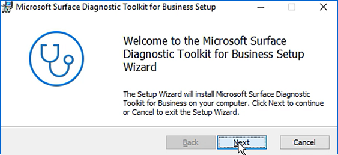
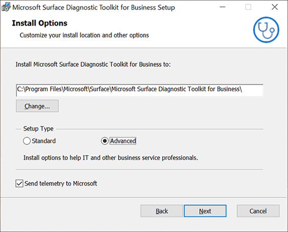
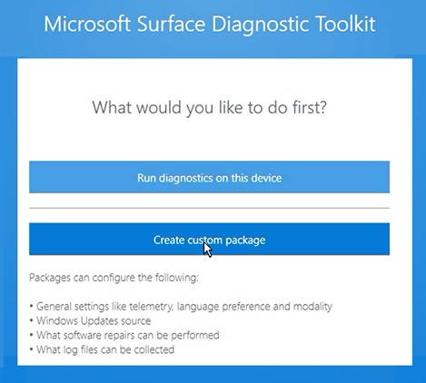
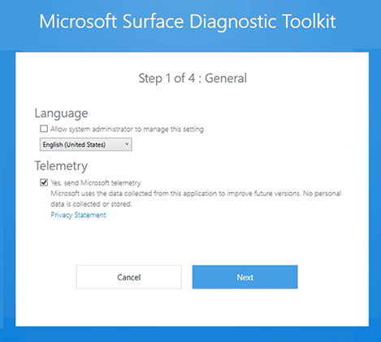
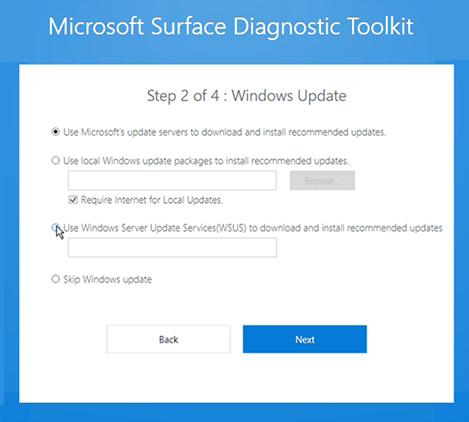
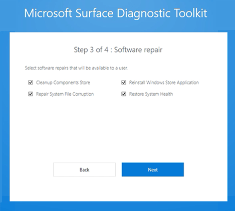
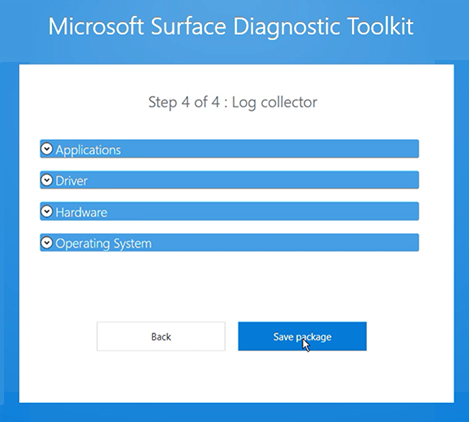

# Surface Diagnostic Toolkit for Business

The Microsoft Surface Diagnostic Toolkit for Business (SDT) enables IT administrators to quickly investigate, troubleshoot, and resolve hardware, software, and firmware issues with Surface devices. You can run a range of diagnostic tests and software repairs in addition to obtaining device health insights and guidance for resolving issues. 

Specifically, SDT for Business enables you to:

- [Customize the package.](#create-custom-sdt)
- [Run the app using commands.](surface-diagnostic-toolkit-command-line.md)
- [Run multiple hardware tests to troubleshoot issues.](surface-diagnostic-toolkit-desktop-mode.md#multiple)
- [Generate logs for analyzing issues.](surface-diagnostic-toolkit-desktop-mode.md#logs)
- [Obtain detailed report comparing device vs optimal configuration.](surface-diagnostic-toolkit-desktop-mode.md#detailed-report)


## Primary scenarios and download resources 

To run SDT for Business, download the components listed in the following table.


Mode |	Primary scenarios | Download | Learn more
--- | --- | --- | ---
Desktop mode |	Assist users in running SDT on their Surface devices to troubleshoot issues.<br>Create a custom package to deploy on one or more Surface devices allowing users to select specific logs to collect and analyze. | SDT distributable MSI package:<br>Microsoft Surface Diagnostic Toolkit for Business Installer<br>[Surface Tools for IT](https://www.microsoft.com/download/details.aspx?id=46703) | [Use Surface Diagnostic Toolkit in desktop mode](surface-diagnostic-toolkit-desktop-mode.md)
Command line |	Directly troubleshoot Surface devices remotely without user interaction, using standard tools such as Configuration Manager. It includes the following commands:<br>`-DataCollector` collects all log files<br>`-bpa` runs health diagnostics using Best Practice Analyzer.<br>`-windowsupdate` checks Windows update for missing firmware or driver updates.<br>`-warranty` checks warranty information. <br><br>| SDT console app:<br>Microsoft Surface Diagnostics App Console<br>[Surface Tools for IT](https://www.microsoft.com/download/details.aspx?id=46703) | [Run Surface Diagnostic Toolkit using commands](surface-diagnostic-toolkit-command-line.md)

## Supported devices 

SDT for Business is supported on Surface 3 and later devices, including:

- Surface Pro 6
- Surface Laptop 2
- Surface Go
- Surface Go with LTE
- Surface Book 2
- Surface Pro with LTE Advanced (Model 1807)
- Surface Pro (Model 1796)
- Surface Laptop
- Surface Studio
- Surface Studio 2
- Surface Book
- Surface Pro 4
- Surface 3 LTE
- Surface 3
- Surface Pro 3

## Installing Surface Diagnostic Toolkit for Business

To create an SDT package that you can distribute to users in your organization:

1.	Sign in to your Surface device using the Administrator account.
2.	Download SDT Windows Installer Package (.msi) from the [Surface Tools for IT download page](https://www.microsoft.com/download/details.aspx?id=46703) and copy it to a preferred location on your Surface device, such as Desktop.
3.	The SDT setup wizard appears, as shown in figure 1. Click **Next**. 

    >[!NOTE]
    >If the setup wizard does not appear, ensure that you are signed into the Administrator account on your computer. 

    

    *Figure 1. Surface Diagnostic Toolkit setup wizard*

4. When the SDT setup wizard appears, click **Next**, accept the End User License Agreement (EULA)

5.	On the Install Options screen, change the default install location if desired. 
6.	Under Setup Type, select **Advanced**. 

    >[!NOTE]
    >The standard option allows users to run the diagnostic tool directly on their Surface device provided they are signed into their device using an Administrator account. 
    
     

7.	Click **Next** and then click **Install**. 

## Installing using the command line
If desired, you can install SDT at a command prompt and set a custom flag to install the tool in admin mode. SDT contains the following install option flags:

- `SENDTELEMETRY` sends telemetry data to Microsoft. The flag accepts `0` for disabled or `1` for enabled. The default value is `1` to send telemetry.
- `ADMINMODE` configures the tool to be installed in admin mode. The flag accepts `0` for client mode or `1` for IT Administrator mode. The default value is `0`.

### To install SDT from the command line:

1.	Open a command prompt and enter:

    ```
    msiexec.exe /i <the path of installer> ADMINMODE=1. 
    ```
    **Example:**

    ```
    C:\Users\Administrator> msiexec.exe/I"C:\Users\Administrator\Desktop\Microsoft_Surface_Diagnostic_Toolkit_for_Business_Installer.msi" ADMINMODE=1
    ```

## Locating SDT on your Surface device

Both SDT and the SDT app console are installed at `C:\Program Files\Microsoft\Surface\Microsoft Surface Diagnostic Toolkit for Business`.

In addition to the .exe file, SDT installs a JSON file and an admin.dll file (modules\admin.dll), as shown in figure 2.


*Figure 2. Files installed by SDT*

<span id="create-custom-sdt" />
## Preparing the SDT package for distribution

Creating a custom package allows you to target the tool to specific known issues.

1.	Click **Start > Run**, enter **Surface** and then click **Surface Diagnostic Toolkit for Business**. 
2.	When the tool opens, click **Create Custom Package**, as shown in figure 3.

    

    *Figure 3. Create custom package*

### Language and telemetry page

  
When you start creating the custom package, you’re asked whether you agree to send data to Microsoft to help improve the application. For more information,see the [Microsoft Privacy Statement](https://privacy.microsoft.com/privacystatement). Sharing is on by default, so uncheck the box if you wish to decline.

>[!NOTE]
>This setting is limited to only sharing data generated while running packages. 



*Figure 4. Select language and telemetry settings*

### Windows Update page

Select the option appropriate for your organization. Most organizations with multiple users will typically select to receive updates via Windows Server Update Services (WSUS), as shown in figure 5. If using local Windows update packages or WSUS, enter the path as appropriate. 



*Figure 5. Windows Update option*

### Software repair page

This allows you to select or remove the option to run software repair updates. 



*Figure 6. Software repair option*

### Collecting logs and saving package page

You can select to run a wide range of logs across applications, drivers, hardware, and the operating system. Click the appropriate area and select from the menu of available logs. You can then save the package to a software distribution point or equivalent location that users can access. 



*Figure 7. Log option and save package*

## Next steps

- [Use Surface Diagnostic Toolkit for Business in desktop mode](surface-diagnostic-toolkit-desktop-mode.md)
- [Use Surface Diagnostic Toolkit for Business using commands](surface-diagnostic-toolkit-command-line.md)


## Changes and updates
### Version 2.36.139.0
*Release date: April 26, 2019*<br>
This version of Surface Diagnostic Toolkit for Business adds support for the following: 
- Advanced Setup option to unlock admin capabilities through the installer UI, without requiring command line configuration.
- Accessibility improvements.
- Surface brightness control settings included in logs.
- External monitor compatibility support link in report generator.


