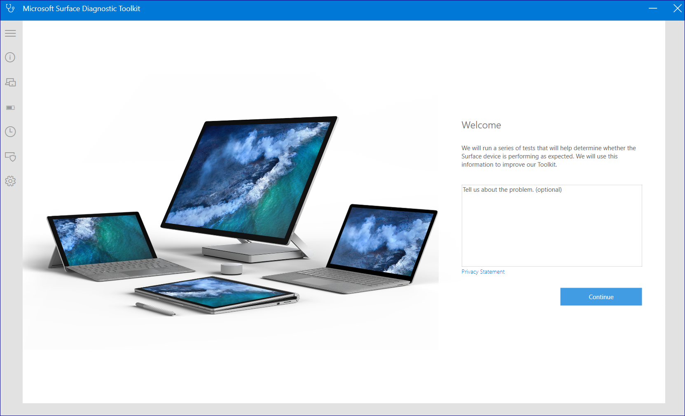
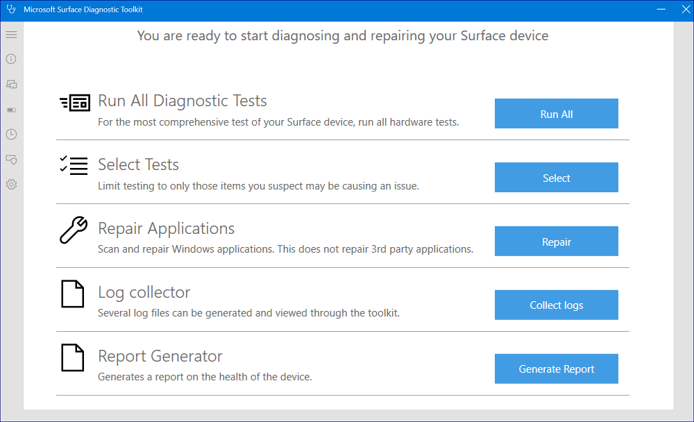
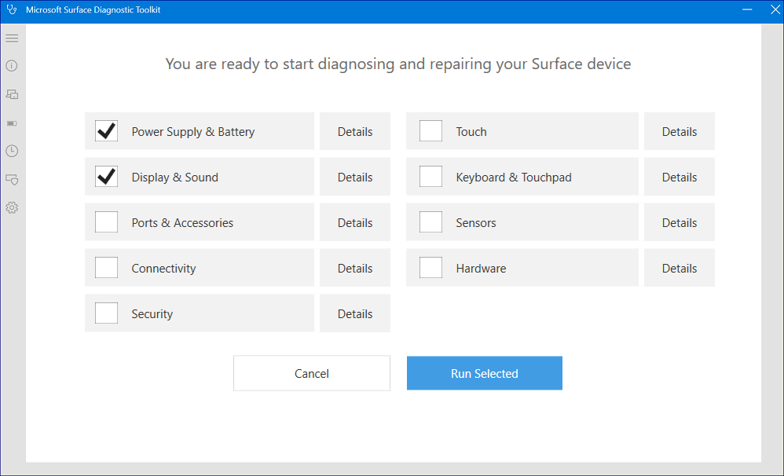
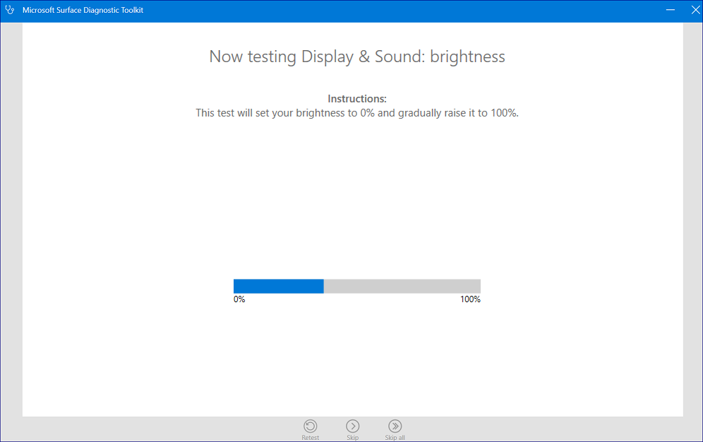
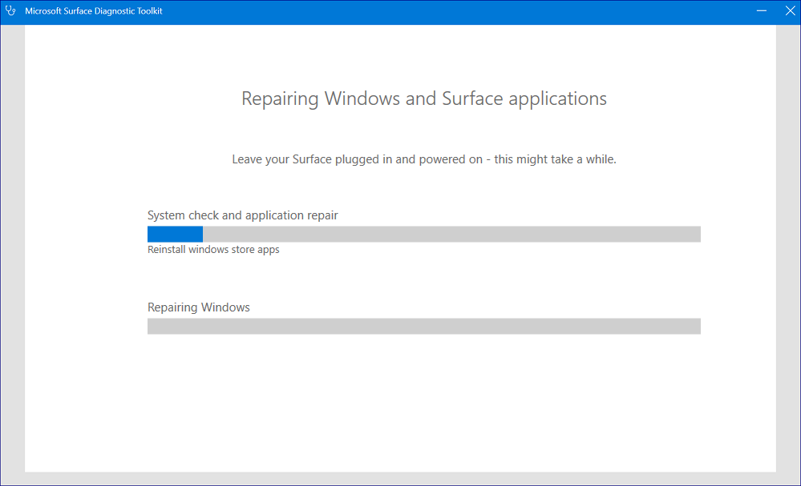
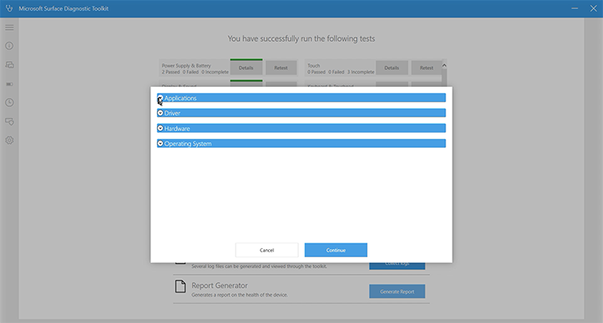

# Use Surface Diagnostic Toolkit for Business in desktop mode

This topic explains how to use the Surface Diagnostic Toolkit (SDT) to help users in your organization run the tool to identify and diagnose issues with the Surface device. Successfully running SDT can quickly determine if a reported issue is caused by failed hardware or user error.

1. Direct the user to install [the SDT package](surface-diagnostic-toolkit-business.md#create-custom-sdt) from a software distribution point or network share. After it is installed, you’re ready to guide the user through a series of tests. 

2. Begin at the home page, which allows users to enter a description of the issue, and click **Continue**, as shown in figure 1.

    

    *Figure 1. SDT in desktop mode*

3. When SDT indicates the device has the latest updates, click **Continue** to advance to the catalog of available tests, as shown in figure 2.

    

    *Figure 2. Select from SDT options*

4. You can choose to run all the diagnostic tests. Or, if you already suspect a particular issue such as a faulty display or a power supply problem, click **Select** to choose from the available tests and click **Run Selected**, as shown in figure 3. See the following table for details of each test. 

    

    *Figure 3. Select hardware tests*

    Hardware test | Description
    --- | ---
    Power Supply and Battery |	Checks Power supply is functioning optimally
    Display and Sound	| Checks brightness, stuck or dead pixels, speaker and microphone functioning
    Ports and Accessories	| Checks accessories, screen attach and USB functioning
    Connectivity |	Checks Bluetooth, wireless and LTE connectivity
    Security	| Checks security related issues
    Touch	| Checks touch related issues
    Keyboard and touch |	Checks integrated keyboard connection and type cover
    Sensors	| Checks functioning of different sensors in the device
    Hardware |	Checks issues with different hardware components such as graphics card and camera

## Running multiple hardware tests to troubleshoot issues

SDT is designed as an interactive tool that runs a series of tests. For each test, SDT provides instructions summarizing  the nature of the test and what users should expect or look for in order for the test to be successful. For example, to diagnose if the display brightness is working properly, SDT starts at zero and increases the brightness to 100 percent, asking users to confirm – by answering **Yes** or **No** -- that brightness is functioning as expected, as shown in figure 4. 

For each test, if functionality does not work as expected and the user clicks **No**, SDT generates a report of the possible causes and ways to troubleshoot it. 

*Figure 4. Running hardware diagnostics*

1. If the brightness successfully adjusts from 0-100 percent as expected, direct the user to click **Yes** and then click **Continue**. 
2. If the brightness fails to adjust from 0-100 percent as expected, direct the user to click **No** and then click **Continue**. 
3. Guide users through remaining tests as appropriate. When finished, SDT automatically provides a high-level summary of the report, including the possible causes of any hardware issues along with guidance for resolution.

### Repairing applications

SDT enables you to diagnose and repair applications that may be causing issues, as shown in figure 5.

*Figure 5. Running repairs*

### Generating logs for analyzing issues 

SDT provides extensive log-enabled diagnosis support across applications, drivers, hardware, and operating system issues, as shown in figure 6.

*Figure 6. Generating logs*

### Generating detailed report comparing device vs. optimal configuration

Based on the logs, SDT generates a report for software- and firmware-based issues that you can save to a preferred location.

## Related topics

- [Run Surface Diagnostic Toolkit for Business using commands](surface-diagnostic-toolkit-command-line.md)

