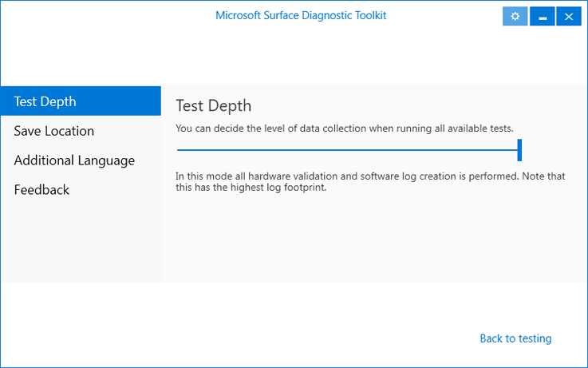
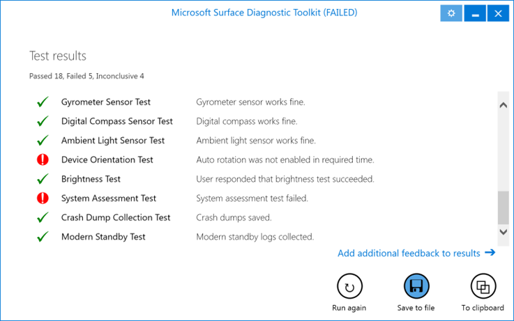
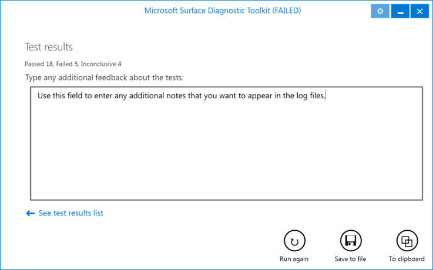

# Microsoft Surface Diagnostic Toolkit


Find out how you can use the Microsoft Surface Diagnostic Toolkit to test the hardware of your Surface device.

The [Microsoft Surface Diagnostic Toolkit](http://go.microsoft.com/fwlink/p/?LinkId=618121) is a small, portable diagnostic tool that runs through a suite of tests to diagnose the hardware of Surface devices. The Microsoft Surface Diagnostic Toolkit executable file is less than 3 MB, which allows it to be distributed through email. It does not require installation, so it can be run directly from a USB stick or over the network. The Microsoft Surface Diagnostic Toolkit walks you through several tests of individual components including the touchscreen, cameras, and sensors.

>**Note:**&nbsp;&nbsp;A Surface device must boot into Windows to run the Microsoft Surface Diagnostic Toolkit. The Microsoft Surface Diagnostic Toolkit will run only on the following Surface devices:

- Surface Book

- Surface Pro 4

- Surface 3 LTE

- Surface 3

- Surface Pro 3

- Surface Pro 2

- Surface Pro

>**Note:**&nbsp;&nbsp;Security software and built-in security measures in many email applications and services will block executable files that are transferred through email. To email the Surface Diagnostic Toolkit, attach the archive file (.zip) as downloaded from the Surface Tools for IT page without extracting it first. You can also create a custom .zip archive that contains the .exe file. (For example, if you want to localize the text as described in the [Localization](#localization) section of this article.)

Running the Microsoft Surface Diagnostic Toolkit is a hands-on activity. The test sequence includes several tests that require you to perform actions or observe the outcome of the test, and then click the applicable **Pass** or **Fail** button. Some tests require connectivity to external devices, like an external display. Other tests use the built in Windows troubleshooters. At the end of testing, a visual report of the test results is displayed and you are given the option to save a log file or copy the results to the clipboard.

To run a full set of tests with the Microsoft Surface Diagnostic Toolkit, you should be prepared with the following items:

- An external display with the appropriate HDMI or DisplayPort connection

- A Bluetooth device that can be put into pairing mode

- A MicroSD or SD card that is compatible with your Surface device

- A Surface Pen

- Room to move the Surface device around

- External speakers or headphones with a 3.5mm stereo plug

- A power adapter for your Surface device

>**Note:**&nbsp;&nbsp;The Microsoft Surface Diagnostic Toolkit tests verify only the hardware of a Surface device and do not resolve issues with the operating system or software.

## Configure test options

Before you select the tests you want to run, you can click the Tools  button in the upper right corner of the window (as shown in Figure 1) to access the Options section of the Microsoft Surface Diagnostic Toolkit. In the Options section, you can configure the depth of testing and logs, as well as the save location for log files. You can also create and use additional language files for the dialog of each test.


*Figure 1. The Tools button highlighted in upper right corner of window*  

>**Note:**&nbsp;&nbsp;Any options you want to select must be specified before you run the tests. You cannot change the test options after the testing sequence has started.

####Test depth
You can quickly select among three modes for testing and diagnostics by using the **Test Depth** page. The **Test Depth** page displays a slider with three possible positions, as shown in Figure 2. These positions determine which tests are run and what information is recorded without requiring you to select specific tests with the **Run Specific Tests** button. The three modes allow you to focus the tests of the Microsoft Surface Diagnostic Toolkit on hardware, software, or both hardware and software.
 


*Figure 2. The Test Depth slider to select the depth of data collection*

When you select a mode by using the Test Depth slider, a configuration file (.ini) with the same name as the Microsoft Surface Diagnostic Toolkit executable (.exe) file is created in the same folder. For example, if the Microsoft Surface Diagnostic Toolkit executable file is SurfaceDiagnosticToolkit.exe, the configuration file will be SurfaceDiagnosticToolkit.ini. When the executable file is run, the options will be automatically set by the configuration file. To run the Microsoft Surface Diagnostic Toolkit in a specific mode on multiple devices, ensure that the .ini file remains in the same folder with the .exe file used on each device.

When you run the Microsoft Surface Diagnostic Toolkit, you can still use the **Run Specific Tests** button to enable or disable specific tests. The tests selected on the **Please Select Tests to Run** page take priority over the tests enabled or disabled by the mode specified on the **Test Depth** page. When a mode is selected the tests that are applicable to that mode will be enabled by default and the tests that are not required for that mode will be disabled.

Each mode has a specific focus and records a different level of information in the log files, as follows:

* **Hardware and Software Focus.** This is the default mode for the Microsoft Surface Diagnostic Toolkit. In this mode all tests that are applicable to the device are run. This mode logs the most information and takes the most time.
* **Software Experience Focus.** This mode collects information about the device and records it in the log file. No hardware tests are performed in this mode. The following tests are run in this mode:
  * Windows Update Check Test
  * Device Information Test
  * System Assessment Test
  * Crash Dump Collection Test
  * Modern Standby Test
* **Hardware Validation Focus.** This mode tests the hardware of the device but does not collect system log files or device information. All diagnostic tests relevant to the device hardware are run in this mode. The exact tests that are run will vary from device to device depending on the hardware configuration. This mode logs the least information and requires the least amount of time.


####Save location
Use the **Browse** button on the **Save Location** page to select a default location for the Microsoft Surface Diagnostic Toolkit log files to be saved. When the tests complete the user will still be prompted to save a log file and a log file will not be saved automatically. The user must still click the **Save to File** button to save the log files. As with the Test Depth mode, this save location is stored in the Microsoft Surface Diagnostic Toolkit configuration (.ini) file and if the file does not exist, configuring this option will generate the file.

####Additional language
Refer to the [Localization](#localization) section of this article for information about how to customize the dialog displayed during each test. On the **Additional Language** page, you can generate a localization file that you can use to customize the dialog during each test. You can also specify a specific localization file to be used with the Microsoft Surface Diagnostic Toolkit with the **Browse** button.

####Feedback
You can use the form on the **Feedback** page to inform the product team of any problems that you encounter with the Microsoft Surface Diagnostic Toolkit or to provide any suggestions for how the Microsoft Surface Diagnostic Toolkit could be improved.


## The tests

The Microsoft Surface Diagnostic Toolkit runs several individual tests on a Surface device. Not all tests are applicable to every device. For example, the Home button test is not applicable to Surface Pro 4 where there is no Home button. You can specify which tests to run, or you can choose to run all tests. For tests that require external devices (such as testing output to an external display) but you do not have the required external device at the time of the test, you are given the option to skip the test. If a test fails, you are prompted to continue or stop testing at that time.

When the testing completes, the **Test Results** page is displayed (as shown in Figure 3) and shows the status of each test: passed, failed, or inconclusive (skipped). You can choose to run the tests again; to save a log file, including any additional log files gathered by tests; or to copy the log file text to the clipboard.



*Figure 3. View of the results of the tests*

When the tests have completed, you can also add additional notes to the log files by clicking **Add additional feedback to results ->** on the **Test Results** page. Use the **Type any additional feedback about these tests** field on the **Test Results** page to add your notes, as shown in Figure 4.



*Figure 4. Add notes to the log file*

Notes that you type on this page are displayed in the log files after the results of the selected tests and before the **Files** section. The section header in the log files for these notes is named **User Feedback**.

#### Windows Update

This test checks for any outstanding Windows updates and will prompt you to install those updates before you proceed to other tests. It is important to keep a Surface device up to date with the latest Windows updates, including drivers and firmware for the Surface device. The success of some of the tests that are performed later in the task sequence depend on these updated drivers and firmware. You will be prompted to restart the device if required by Windows Update. If you must restart the device, you will need to start the Microsoft Surface Diagnostic Toolkit again.

#### Device information

This test reads the Device ID and serial number in addition to basic system information such as device model, operating system version, processor, memory, and storage. The Device ID is recorded in the name of the log file and can be used to identify a log file for a specific device. Several system log files are also collected, including update and rollback logs, and output from several Windows built-in tools, such as [DirectX Diagnostics](http://go.microsoft.com/fwlink/p/?LinkId=746476) and [System Information](http://go.microsoft.com/fwlink/p/?LinkId=746477), power configuration, disk health, and event logs. See the following list for a full set of collected log files:

- Output of **Get-WindowsUpdateLog** if the operating system is Windows 10

- **%windir%\\Logs**

- **%windir%\\Panther**

- **%windir%\\System32\\sysprep\\Panther**

- **%windir%\\System32\\WinEvt\\Logs**

- **$windows.~bt\\Sources\\Panther**

- **$windows.~bt\\Sources\\Rollback**

- **%windir%\\System32\\WinEvt\\Logs**

- Output of **dxdiag.exe /t**

- Output of **msinfo32.exe /report**

- Output of **powercfg.exe /batteryreport**

- Output of **powercfg.exe /sleepstudy**

- Output of **wevtutil.exe epl System**

- Events from:

    - **Chkdsk**

    - **Microsoft-Windows-Ntfs**

    - **Microsoft-Windows-WER-SystemErrorReporting**

    - **Microsoft-Windows-Startuprepair**

    - **Microsoft-Windows-kernel-Power**

- Output of **powercfg.exe /q**

- Output of **powercfg.exe /qh**

- **%windir%\\Inf\\SetupApi\*.log**

These files and logs are stored in a .zip file saved by the Microsoft Surface Diagnostic Toolkit when all selected tests have completed alongside the Microsoft Surface Diagnostic Toolkit log file.

#### Type Cover test

>**Note:**&nbsp;&nbsp;A Surface Type Cover is required for this test.


If a Surface Type Cover is not detected, the test prompts you to connect the Type Cover. When a Type Cover is detected the test prompts you to use the keyboard and touchpad. The cursor should move while you swipe the touchpad, and the keyboard Windows key should bring up the Start menu or Start screen to successfully pass this test. You can skip this test if a Type Cover is not used with the Surface device.

#### Integrated keyboard test

>**Note:**&nbsp;&nbsp;This test is only applicable to Surface Book and requires that the Surface Book be docked to the keyboard.

This test is essentially the same as the Type Cover test, except the integrated keyboard in the Surface Book base is tested rather than the Type Cover. During the first stage of this test a diagram of the keyboard is displayed. When you press a key, the corresponding key will be marked on the diagram. The test will proceed when every key in the diagram is marked. In the second stage of this test, you are prompted to make several gestures on the keypad. As you perform each gesture (for example, a three finger tap), the gesture will be marked on the screen. When you have performed all gestures, the test will automatically complete.

>**Note:**&nbsp;&nbsp;The F-keys on the diagram require that you press the Function (FN) key simultaneously to activate them. By default, these keys perform other actions. For the Home and End keys, you must press the same keys as F8 and F9, but without the Function (FN) key pressed.

#### Canvas mode battery test

>**Note:**&nbsp;&nbsp;This test is only applicable to Surface Book.

Depending on which mode Surface Book is in, different batteries are used to power the device. When Surface Book is in clipboard mode (detached form the keyboard) it uses an internal battery, and when it is connected in either laptop mode or canvas mode it uses different connections to the battery in the keyboard. In canvas mode, the screen is connected to the keyboard so that when the device is closed, the screen remains face-up and visible. Connect the Surface Book to the keyboard in this manner for the test to automatically proceed.

#### Clipboard mode battery test

>**Note:**&nbsp;&nbsp;This test is only applicable to Surface Book.

Disconnect the Surface Book from the keyboard to work in clipboard mode. In clipboard mode the Surface Book operates from an internal battery that is tested when the Surface Book is disconnected from the keyboard. Disconnecting the Surface Book from the keyboard will also disconnect the Surface Book from power and will automatically begin this test.

#### Laptop mode battery test

>**Note:**&nbsp;&nbsp;This test is only applicable to Surface Book.

Connect the Surface Book to the keyboard in the opposite fashion to canvas mode in laptop mode. In laptop mode the screen will face you when the device is open and the device can be used in the same way as any other laptop. Disconnect AC Power from the laptop base when prompted for this test to check the battery status.

#### Battery test

In this test the battery is discharged for a few seconds and tested for health and estimated runtime. You are prompted to disconnect the power adapter and then to reconnect the power adapter when the test is complete.

#### Discrete graphics (dGPU) test

>**Note:**&nbsp;&nbsp;This test is only applicable to Surface Book models with a discrete graphics processor.

This test will query the device information of current hardware to check for the presence of both the Intel integrated graphics processor in the Surface Book and the NVIDIA discrete graphics processor in the Surface Book keyboard. The keyboard must be attached for this test to function.

#### Discrete graphics (dGPU) fan test

>**Note:**&nbsp;&nbsp;This test is only applicable to Surface Book models with a discrete graphics processor.

The discrete graphics processor in the Surface Book includes a separate cooling fan. The fan is turned on automatically by the test for 5 seconds. Listen for the sound of the fan in the keyboard and report if the fan is working correctly when prompted.

#### Muscle wire test

>**Note:**&nbsp;&nbsp;This test is only applicable to Surface Book.

To disconnect the Surface Book from the keyboard, software must instruct the muscle wire latch mechanism to open. This is typically accomplished by pressing and holding the undock key on the keyboard. This test sends the same signal to the latch, which unlocks the Surface Book from the Surface Book keyboard. Remove the Surface Book from the keyboard when you are prompted to do so.

#### Dead pixel and display artifacts tests

>**Note:**&nbsp;&nbsp;Before you run this test, be sure to clean the screen of dust or smudges.

This test prompts you to view the display in search of malfunctioning pixels. The test displays full-screen, single-color images including black, white, red, green, and blue. Pixels that remain bright or dark when the screen displays an image of a different color indicate a failed test. You should also look for distortion or variance in the color of the screen.

#### Digitizer edges

The touchscreen of a Surface device should detect when a user swipes in from the left or right side of the screen. This test prompts you to swipe in from the edges of the screen to bring up the Action Center and Task View. Both Action Center and Task View should launch to pass this test.

#### Digitizer pinch

The pinch gesture (when you bring two fingers closer together or farther apart) is used to manipulate zoom and to position content through the touchscreen. This test displays an image in Windows Picture Viewer and prompts you to zoom in, move, and zoom out of the picture. The picture should zoom in, move, and zoom out as the gestures are performed.

#### Digitizer touch

The Surface touchscreen should detect input across the entire screen of the device equally. To perform this test a series of lines are displayed on the screen for you to trace with a finger in search of unresponsive areas. The lines traced across the screen should appear continuous for the length of the line as drawn with your finger.

#### Digitizer pen test

>**Note:**&nbsp;&nbsp;A Microsoft Surface Pen is required for this test.

This test displays the same lines as those that are displayed during the Digitizer Touch test, but your input is performed with a Surface Pen instead of your finger. The lines should remain unbroken for as long as the Pen is pressed to the screen. Trace all of the lines in the image to look for unresponsive areas across the entire screen of the Surface device.

#### Digitizer multi touch

The Surface touchscreen is capable of detecting 10 fingers simultaneously. Place all of your fingers on the screen simultaneously to perform this test. The screen will show the number of points detected, which should match the number of fingers you have on the screen.

#### Home button test

The Home button or Windows button on your Surface device is used to bring up the Start screen or Start menu. This test is successful if the Start screen or Start menu is displayed when the Windows button is pressed. This test is not displayed on Surface Pro 4 because no Windows button exists.

#### Volume rocker test

This test prompts you to use the volume rocker to turn the volume all the way up, all the way down, and then all the way up again. To pass this test, the volume slider should move up and down as the rocker is pressed.

#### Micro SD or SD slot test

>**Note:**&nbsp;&nbsp;This test requires a micro SD or SD card that is compatible with the slot in your Surface device.

Insert a micro SD or SD card when you are prompted. When the SD card is detected, the test prompts you to remove the SD card to ensure that the card is not left in the device. During this test a small file is written to the SD card and then verified. Detection and verification of the SD card automatically passes this test without additional input.

#### Microphone test

This test displays a meter that shows the microphone sound level and records audio for a short period of time. Say a few words or make noise and make note that the meter displays the sound level accordingly. A countdown timer is displayed to indicate how much time is remaining for you to record sound. When the countdown timer expires, the recorded audio is played back. Verify that the words or noises sound clear and accurate, and then mark the test as passed or failed depending on the results.

#### Video out test

>**Note:**&nbsp;&nbsp;This test requires an external display with the applicable connection for your Surface device.

Surface devices provide a Mini DisplayPort connection for connecting to an external display. Connect your display through the Mini DisplayPort on the device when prompted. The display should be detected automatically and an image should appear on the external display.

#### Bluetooth test

>**Note:**&nbsp;&nbsp;This test requires a Bluetooth device. The device must be set to pairing mode or made discoverable to perform this test.

After you receive a prompt to put the device in pairing mode, the test opens the **Add a device** window and begins to search for discoverable Bluetooth devices. Watch the **Add a device** window to verify that your Bluetooth device is detected. Select your Bluetooth device from the list and connect to the device to complete the test.

#### Camera test

Use this test to verify that the cameras on your Surface device are operating properly. Images will be displayed from both the front and rear cameras, and the infrared camera on a Surface Pro 4. Continuous autofocus can be enabled on the rear camera. Move the device closer and farther away from an object to verify the operation of continuous autofocus.

>**Note:**&nbsp;&nbsp;You can also use the **Snapshot to Logs** option to save a snapshot of the video output to the log files.

#### Speaker test

>**Note:**&nbsp;&nbsp;Headphones or external speakers are required to test the headphone jack in this test.

This test plays audio over left and right channels respectively, both for the internal speakers and for speakers or headphones connected through the headphone jack. Plug in your headphones or speakers to the 3.5mm stereo jack when prompted. The test will automatically detect that a sound playback device has been connected. Mark each channel as a pass or fail as you hear the audio play through the speakers or headphones.

#### Network test

>**Note:**&nbsp;&nbsp;Connect the Surface device to a Wi-Fi network before you run this test. Connections that are made during the test are removed when the test is completed.

This test uses the Windows Network Diagnostics built in troubleshooter to diagnose potential issues with network connectivity, including proxy configuration, DNS problems, and IP address conflicts. An event log is saved by this test in Windows logs and is visible in the Windows Event Viewer. The Event ID is 6100.

#### Power test

Settings such as display brightness, the elapsed time until the screen sleeps, and the elapsed time until device sleeps, are checked against default values with the Power built-in troubleshooter. The troubleshooter will automatically correct settings that may prevent the device from conserving power or entering sleep mode.

#### Mobile broadband test

This test prompts you to enable mobile broadband and attempts to browse to http://www.bing.com. This test is only applicable to Surface devices that come equipped with mobile broadband, such as Surface 3 LTE.

#### Accelerometer test

The accelerometer detects lateral, longitudinal, and vertical movements of the Surface device. This test prompts you to pick up and move the Surface device forward and backward, to the left and to the right, and up and down, to test the sensor for directional movement. The test automatically passes when movement is detected.

#### Gyrometer test

The gyrometer detects pitch, roll, and yaw movements. This test prompts you to pick up and rotate the Surface device to test the sensors for angular movement. The test automatically passes when movement is detected.

#### Compass test

The compass detects which direction the Surface device is facing relative to north, south, east, and west. Turn the Surface device to face in different directions to test the sensor. The test automatically passes when a change in direction is detected.

#### Ambient light test

The ambient light sensor is used to automatically adjust screen brightness relative to the ambient lighting in the environment. Turn the device toward or away from a light source to cause the screen to dim or brighten in response increased or decreased light. The test automatically passes when the screen brightness automatically changes.

>**Note:**&nbsp;&nbsp;You can also block the ambient light from the sensor by holding your hand slightly in front of the light sensor, which is located directly next to the camera. Use the provided meter to determine if you are blocking light from the sensor.

#### Device orientation test

>**Note:**&nbsp;&nbsp;Before you run this test, disable rotation lock from the Action Center if enabled.

The device orientation sensor determines what the angle of the Surface device is, relative to the ground. Rotate the display 90 degrees or 180 degrees to cause the screen orientation to switch between portrait and landscape mode. If you have a Surface Type Cover or the Surface Book keyboard connected, you will be prompted to disconnect the Surface from the keyboard to allow screen rotation. The test automatically passes when the screen orientation switches.

#### Brightness test

This test cycles the screen through brightness levels from 0 percent to 100 percent, and then a message is displayed to confirm if the brightness level changed accordingly. You are then prompted to test for brightness reaction. To test the reaction of brightness when running on battery, disconnect the power adapter. The screen should automatically dim when power is disconnected.

#### Surface Dock test
The Microsoft Surface Diagnostic Toolkit uses this test only if a Surface Dock is connected to the device. If a Surface Dock is detected, this test verifies that the Surface Dock driver firmware is updated. For more detailed analysis of Surface Dock firmware status and how to manually initiate the firmware update process, see the [Microsoft Surface Dock Updater](https://technet.microsoft.com/en-us/itpro/surface/surface-dock-updater) article.


#### System assessment

>**Note:**&nbsp;&nbsp;The Surface device must be connected to AC power before you can run this test.

The Windows System Assessment Tool (WinSAT) runs a series of benchmarks against the processor, memory, video adapter, and storage devices. The results include the processing speed of various algorithms, read and write performance of memory and storage, and performance in several Direct3D graphical tests.

#### Performance Monitor test

Performance and diagnostic trace logs are recorded from Performance Monitor for 30 seconds and collected in the .zip file output of the Microsoft Surface Diagnostic Toolkit by this test. You can analyze these trace logs with the [Windows Performance Analyzer](http://go.microsoft.com/fwlink/p/?LinkId=746486) to identify causes of application crashes, performance issues, or other undesirable behavior in Windows.

#### Crash dump collection

If your Surface device has encountered an error that caused the device to fail or produce a blue screen error, this stage of the Microsoft Surface Diagnostic Toolkit records the information from the automatically recorded crash dump files in the diagnostic log. You can use these crash dump files to identify a faulty driver, hardware component, or application through analysis. Use the [Windows Debugging Tool](http://go.microsoft.com/fwlink/p/?LinkId=746488) to analyze these files. If you are not familiar with the analysis of crash dump files, you can describe your issue and post a link to your crash dump files (uploaded to OneDrive or another file sharing service) in the [Windows TechNet Forums](http://go.microsoft.com/fwlink/p/?LinkId=746489).

#### Connected standby text

>**Note:**&nbsp;&nbsp;This test is only available on Surface devices running Windows 8 or Windows 8.1.

If connected standby is enabled on the Surface device, this test passes automatically. If connected standby is not enabled, a failure is recorded for this test. Find out more about Connected Standby and Modern Standby at [Modern Standby](https://msdn.microsoft.com/library/windows/hardware/mt282515) on MSDN.

#### Modern standby test

>**Note:**&nbsp;&nbsp;This test is only available on Surface devices running Windows 10.

This test records log files of the power configuration for the Surface device using the **powercfg.exe /a** command. The test completes automatically and a failure is only recorded if the command does not run.


## Command line

You can run the Microsoft Surface Diagnostic Toolkit from the command line or as part of a script. The tool supports the following arguments:

>**Note:**&nbsp;&nbsp;Many of the tests performed by the Microsoft Surface Diagnostic Toolkit require technician interaction. The Microsoft Surface Diagnostic Toolkit cannot run unattended.

#### exclude

Use this argument to exclude specific tests.

Example:

```
Surface_Diagnostic_Toolkit_1.0.60.0.exe “exclude=BatteryTest,CameraTest”
```

See the following list for test names:

-   AccelerometerTest

-   AmbientLightSensorTest

-   BatteryTest

-   BluetoothTest

-   BrightnessTest

-   CameraTest

-   CanvasModeBatteryTest

-   ChargingTest

-   ClipboardModeBatteryTest

-   CrashDumpCollectionTest

-   DeadPixelDetectionTest

-   DeviceInformationTest

-   DeviceOrientationTest

-   DigitalCompassSensorTest

-   DigitizerEdgeTest

-   DigitizerMultiTouchTest

-   DigitizerPenCoverageTest

-   DigitizerPinchTest

-   DigitizerTouchCoverageTest

-   DisplayArtifactsTest

-   DualGraphicsTest

-   FanTest

-   GyrometerSensorTest

-   HomeButtonTest

-   IntegratedKeyboardTest

-   LaptopModeBatteryTest

-   MicrophoneTest

-   MicroSdCardTest

-   MobileBroadbandTest

-   MuscleWireTest

-   NetworkTest

-   PenTest

-   PerformanceMonitorTest

-   PowerTest

-   SdCardTest

-   SpeakerTest

-   SystemAssessmentTest

-   TypeCoverTest

-   VideoOutTest

-   VolumeRockerTest

-   WindowsUpdateCheckTest

#### forceplatformsupport

Use this argument to force tests to run when the make and model of the device is not properly detected by Windows. Surface Diagnostic Toolkit is intended to run only on Surface devices.

Example:

```
Surface_Diagnostic_Toolkit_1.0.60.0.exe forceplatformsupport
```

#### include

Use this argument to include tests when you run Microsoft Surface Diagnostic Toolkit from the command line. Tests specified by the **Include** command will be run even if the test is not supported on the model of Surface device. In the following example, the Surface Book specific tests for the latch mechanism and discrete graphics will be run, even if the command is run on a Surface Pro 4 or other Surface model.

Example:

```
Surface_Diagnostic_Toolkit_1.0.60.0.exe “include=DualGraphicsTest,FanTest,MuscleWireTest”
```

#### logpath

Use this argument to specify the path for the log file.

Example 1:

```
Surface_Diagnostic_Toolkit_1.0.60.0.exe logpath=C:\Folder
```

Example 2:

```
Surface_Diagnostic_Toolkit_1.0.60.0.exe “logpath=C:\Folder with spaces”
```

## Localization


By default, the Microsoft Surface Diagnostic Toolkit is available in English only. If you want to localize the text of the Microsoft Surface Diagnostic Toolkit prompts into another language, you can do so by creating a custom localization file. To create a new localization file (.locale), follow these steps:

1. Click the Tools  button.
2. Click the **Additional Language** page.
3. Click the **Generate** button and the new .locale file is created.

The locale file that is created when you use these steps will have the same name as your executable file, even if it has been changed from the default. For example, if the Microsoft Surface Diagnostic Toolkit executable file is SurfaceDiagnosticToolkit.exe, the localization file would be SurfaceDiagnosticToolkit.locale. The locale file will be created in the same folder as the executable file. If a localization file with this name already exists, you will be prompted to overwrite the existing file. The file that is created when you click the **Generate** button is always generated in the default language, English.

To customize the localization file, open the file in a text or XML editor such as Notepad. To edit the dialog for each test, replace the text for each phrase tag. (For example, `<phrase key="testdialog">text</phrase>`.) To use the file automatically when you start the Microsoft Surface Diagnostic Toolkit, simply save the file with the same name it had when it was created. To save the file for use with other instances of Microsoft Surface Diagnostic Toolkit, copy the file to another location or save the file with another name.

If a localization file with the same name and in the same folder as the executable file is detected when Microsoft Surface Diagnostic Toolkit started, the alternate text specified in that localization file replaces the default dialog and prompts. If a custom localization file is not present or the file name is not the same as the executable file, the tool will default to English text. At any point you can also explicitly specify a localization file to be used by the Microsoft Surface Diagnostic Toolkit. To specify a localization file, follow these steps:
1.	Click the Tools  button.
2.	Click the **Additional Language** page.
3.	Click **Browse**.
4.	Browse to and select your custom localization file.

A custom localization file selected through this process does not need a specific name. After you select the custom localization file, the Microsoft Surface Diagnostic Toolkit will import the contents and write them to a .locale file with the same name as the .exe file, just like if you click the **Generate** button to create a new .locale file.

>**Note:**&nbsp;&nbsp;If you import a localization file by clicking the **Browse** button, an existing localization file will be overwritten without prompting if that file has the same name as the Microsoft Surface Diagnostic Toolkit executable file.


 

 

 


