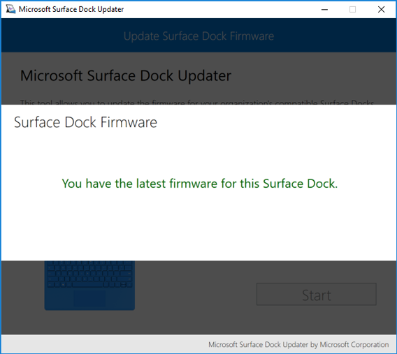
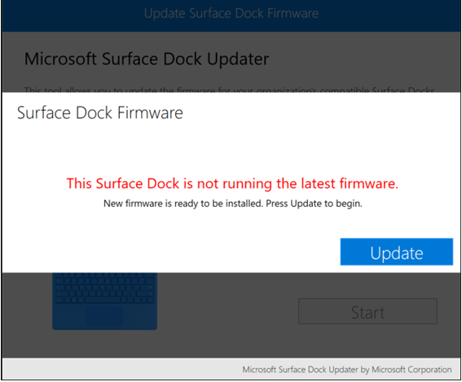
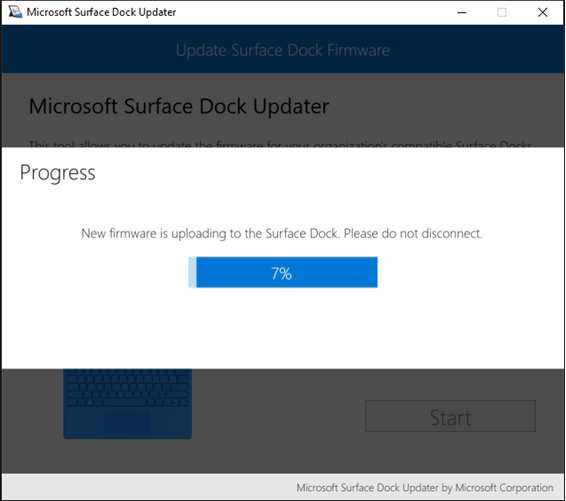
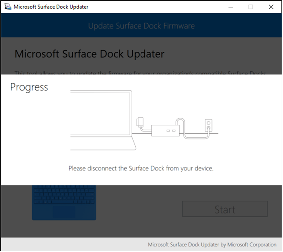
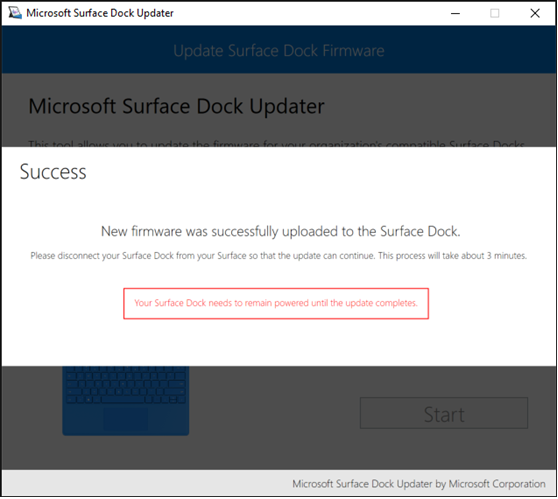
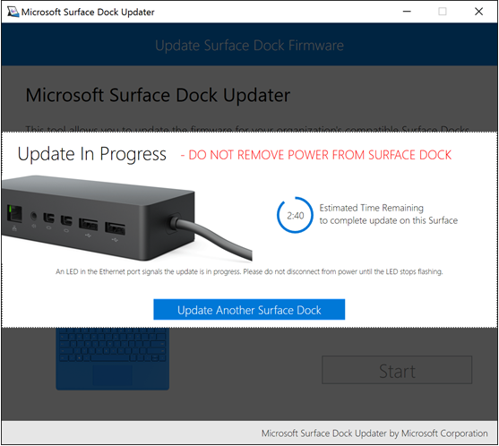
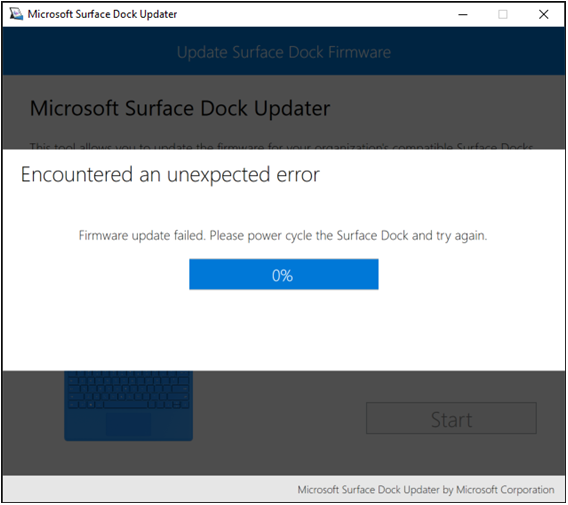
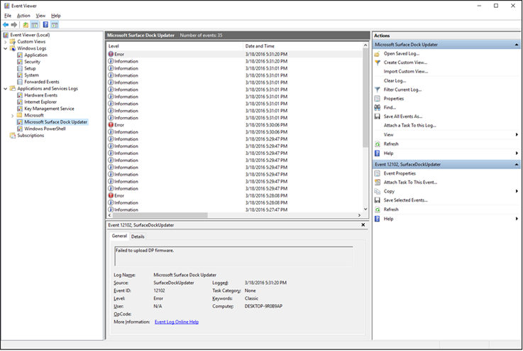

# Microsoft Surface Dock Updater

This article provides a detailed walkthrough of Microsoft Surface Dock Updater.

The [Microsoft Surface Dock Updater](https://www.microsoft.com/download/details.aspx?id=46703) tool allows you to check the firmware status of a Surface Dock and to manually update the firmware of Surface Dock devices. It is most often used to update Surface Docks prior to deployment of those Surface Docks to end users or as a troubleshooting tool. Microsoft Surface Dock Updater walks you through the process of updating the firmware on one or more Surface Docks, including the required connect and disconnect steps to perform the complete firmware installation.

When you run the Microsoft Surface Dock Updater installer you will be prompted to accept an End User License Agreement (EULA).

>[!NOTE]
>Updating Surface Dock firmware requires connectivity to the Surface Dock via the Surface Connect™ port. Installation of the Microsoft Surface Dock Updater is only supported on devices that feature the Surface Connect™ port.

>[!NOTE]
>The Surface Dock Updater tool is unable to run on Windows 10 S. To manually update a Surface Dock for use with Surface Laptop and Windows 10 S, connect the Surface Dock to another Surface device with a Windows 10 Pro or Windows 10 Enterprise environment.

## Update a Surface Dock with Microsoft Surface Dock Updater

After you install the [Microsoft Surface Dock Updater](https://www.microsoft.com/download/details.aspx?id=46703) tool, you can find Microsoft Surface Dock Updater under **All Apps** in your Start menu. Click **Microsoft Surface Dock Updater** to start the application.

To update a Surface Dock with Microsoft Surface Dock Updater, follow these steps:

1.  Click Start to begin the firmware update process. If you do not have a Surface Dock connected, you will be prompted to connect a Surface Dock.

2.  Microsoft Surface Dock Updater checks the status of your Surface Dock firmware.

    -   If the tool determines that the firmware of your Surface Dock is up to date, a **You have the latest firmware for this Surface Dock** message is displayed, as shown in Figure 1.

        

        *Figure 1. Your Surface Dock firmware is up to date*

    -   If Microsoft Surface Dock Updater determines that the firmware of your Surface Dock is not up to date, a **This Surface Dock is not running the latest firmware** message is displayed, as shown in Figure 2.

        

        *Figure 2. Your Surface Dock firmware needs to be updated*

3.  To begin the firmware update process, click **Update** on the **Surface Dock Firmware** page.

4.  Before the firmware update process begins, you will be prompted for confirmation. Click **OK** to proceed or **Cancel** to return to the **Surface Dock Firmware** page displaying the status of your Surface Dock firmware.

5.  As the firmware update is uploaded to the Surface Dock, a **Progress** page is displayed, as shown in Figure 3. Do not disconnect the Surface Dock while firmware is being uploaded.

    

    *Figure 3. Progress of firmware update upload to Surface Dock*

6.  After the firmware update has successfully uploaded to the Surface Dock, you are prompted to disconnect and then reconnect the Surface Dock from the Surface device, as shown in Figure 4. The main chipset firmware update will be applied while the Surface Dock is disconnected.

    

    *Figure 4. Disconnect and reconnect Surface Dock when prompted*

7.  When the main chipset firmware update is verified, the DisplayPort chipset firmware update will be uploaded to the Surface Dock. Upon completion, a **Success** page is displayed and you will again be prompted to disconnect the Surface Dock, as shown in Figure 5.

    

    *Figure 5. Successful upload of Surface Dock firmware*

8.  After you disconnect the Surface Dock the DisplayPort firmware update will be installed. This process occurs on the Surface Dock hardware while it is disconnected. The Surface Dock must remain powered for up to 3 minutes after it has been disconnected for the firmware update to successfully install. An **Update in Progress** page is displayed (as shown in Figure 6), with a countdown timer to show the estimated time remaining to complete the firmware update installation.

    

    *Figure 6. Countdown timer to complete firmware installation on Surface Dock*

9.  If you want to update multiple Surface Docks in one sitting, you can click the **Update another Surface Dock** button to begin the process on the next Surface Dock.

    >[!NOTE]
    >The LED in the Ethernet port of the dock will blink while the update is in progress. Please wait until the LED stops blinking before you unplug your Surface Dock from power.

     

## Troubleshooting Microsoft Surface Dock Updater

If the Surface Dock firmware update process encounters an installation error with either firmware update, the **Encountered an unexpected error** page may be displayed, as shown in Figure 7.

*Figure 7. Firmware update installation has encountered an error*

Microsoft Surface Dock Updater logs its progress into the Event Log, as shown in Figure 8. If you need to troubleshoot an update through this tool, you will find Surface Dock events recorded with the following event IDs:

| Event ID | Event type                                               |
|----------|----------------------------------------------------------|
| 12100    | Up-to-date confirmation                                  |
| 12101    | Event in the main chipset firmware update process        |
| 12102    | Event in the DisplayPort chipset firmware update process |
| 12105    | Error                                                    |

*Figure 8. Surface Dock Updater events in Event Viewer*

## Changes and updates

Microsoft periodically updates Surface Dock Updater. <!-- To learn more about the application of firmware by Surface Dock Updater, see [Manage Surface Dock firmware updates](https://technet.microsoft.com/itpro/surface/manage-surface-dock-firmware-updates). -->

>[!Note]
>Each update to Surface Dock firmware is included in a new version of Surface Dock Updater. To update a Surface Dock to the latest firmware, you must use the latest version of Surface Dock Updater.

### Version 2.23.139.0
*Release Date: 10 October 2018*

This version of Surface Dock Updater adds support for the following:

- Add support for Surface Pro 6
- Add support for Surface Laptop 2

### Version 2.22.139.0
*Release Date: 26 July 2018*

This version of Surface Dock Updater adds support for the following:

- Increase update reliability
- Add support for Surface Go

### Version 2.12.136.0
*Release Date: 29 January 2018*

This version of Surface Dock Updater adds support for the following:
* Update for Surface Dock Main Chipset Firmware
* Update for Surface Dock DisplayPort Firmware
* Improved display stability for external displays when used with Surface Book or Surface Book 2

Additionally, installation of this version of Surface Dock Updater on Surface Book devices includes the following:
* Update for Surface Book Base Firmware
* Added support for Surface Dock firmware updates with improvements targeted to Surface Book devices

>[!Note]
>Before the Surface Dock firmware update applied by Surface Dock Updater v2.12.136.0 will take effect on a Surface Book device, a firmware update for the Surface Book Base is required. If you install Surface Dock Updater v2.12.136.0 on a Surface Book and update an attached Surface Dock from that same device, the firmware of the Surface Book Base will automatically be updated when installing the Surface Dock Updater. However, if you update a Surface Dock using Surface Dock Updater v2.12.136.0 on different device, and then connect that Surface Dock to a Surface Book where Surface Dock Updater v2.12.136.0 has not been installed, the benefits of the updated Surface Dock will not be enabled. To enable the benefits of the updated Surface Dock on a Surface Book device, Surface Book Base firmware must also be updated by installing Surface Dock Updater v2.12.136.0 on the Surface Book device. Surface Book Base firmware update is not required on a Surface Book 2 device.

### Version 2.9.136.0
*Release date: November 3, 2017*

This version of Surface Dock Updater adds support for the following:

* Update for Surface Dock DisplayPort Firmware
* Resolves an issue with audio over passive display port adapters

### Version 2.1.15.0
*Release date: June 19, 2017*

This version of Surface Dock Updater adds support for the following:

* Surface Laptop
* Surface Pro

### Version 2.1.6.0
*Release date: April 7, 2017*

This version of Surface Dock Updater adds support for the following:

* Update for Surface Dock DisplayPort firmware
* Requires Windows 10

### Version 2.0.22.0
*Release date: October 21, 2016*

This version of Surface Dock Updater adds support for the following:

* Update for Surface Dock USB firmware
* Improved reliability of Ethernet, audio, and USB ports

### Version 1.0.8.0
*Release date: April 26, 2016*

This version of Surface Dock Updater adds support for the following:

* Update for Surface Dock Main Chipset firmware
* Update for Surface Dock DisplayPort firmware

<!-- ## Related topics -->

<!-- [Manage Surface Dock firmware updates](manage-surface-dock-firmware-updates.md) -->
