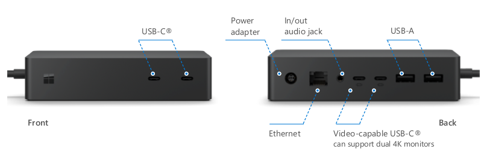

# What’s new in Surface Dock 2

Surface Dock 2, the next generation Surface dock, lets users connect external monitors and multiple peripherals to obtain a fully modernized desktop experience from a Surface device. Built to maximize efficiency at the office, in a flexible workspace, or at home, Surface Dock 2 features seven ports, including two front-facing USB-C ports, with 15 watts of fast charging power for phone and accessories. Surface Dock 2 is designed to simplify IT management, enabling admins to automate firmware updates using Windows Update or centralize updates with internal software distribution tools. Surface Enterprise Management Mode (SEMM) now enables IT admins to secure ports on Surface Dock 2. For more information, see [Secure Surface Dock 2 ports with Surface Enterprise Management Mode](https://techcommunity.microsoft.com/t5/surface-it-pro-blog/secure-surface-dock-2-ports-with-surface-enterprise-management/ba-p/1418999).

## General system requirements

- Windows 10 version 1809. There is no support for Windows 7, Windows 8, or non-Surface host devices. Surface Dock 2 works with the following Surface devices:

  - Surface Pro (5th Gen)
  - Surface Pro (5th Gen) with LTE Advanced
  - Surface Laptop (1st Gen)
  - Surface Pro 6
  - Surface Book 2
  - Surface Laptop 2
  - Surface Go
  - Surface Go with LTE Advanced 
  - Surface Pro 7
  - Surface Laptop 3
  - Surface Book 3
  - Surface Go 2
  - Surface Go 2 with LTE Advanced

## Surface Dock 2 Components

 
### USB

- Two front facing USB-C ports.
- Two rear facing USB-C (gen 2) ports.
- Two rear facing USB-A ports. 

### Video
 	
- Dual 4K@60hz. Supports up to two displays on the following devices:

  - Surface Book 3
  - Surface Go 2
  - Surface Go 2 with LTE Advanced
  - Surface Pro 7
  - Surface Pro X
  - Surface Laptop 3

- Dual 4K@ 4K@30Hz. Supports up to two displays on the following devices:

  - Surface Pro 6
  - Surface Pro (5th Gen)
  - Surface Pro (5th Gen) with LTE Advanced
  - Surface Laptop 2
  - Surface Laptop (1st Gen)
  - Surface Go
  - Surface Book 2.

### Ethernet

- 1 gigabit Ethernet port. 

### External Power supply

- 199 watts supporting 100V-240V.

## Comparing Surface Dock 2 

### Table 1. Surface Dock 2 tech specs comparison

|Component|Surface Dock|Surface Dock 2|
|---|---|---|
|Surflink|Yes|Yes|
|USB-A|2 front facing USB 3.1 Gen 1 2 rear facing USB 3.1 Gen 1|2 rear facing USB 3.2 Gen 2 (7.5W power)|
|Mini Display port|2 rear facing (DP1.2)|None|
|USB-C|None|2 front facing USB 3.2 Gen 2 (15W power) 2 rear facing USB 3.2 Gen 2 (DP1.4a) (7.5W power)|
|3.5 mm Audio in/out|Yes|Yes|
|Ethernet|Yes, 1 gigabit|Yes 1 gigabit|
|DC power in|Yes|Yes|
|Kensington lock|Yes|Yes|
|Surflink cable length|65cm|80cm|
|Surflink host power|60W|120W|
|USB load power|30W|60W|
|USB bit rate|5 Gbps|10 Gbps|
|Monitor support|2 x 4k @30fps, or 1 x 4k @ 60fps|2 x 4K @ 60fps|
|Wake-on-LAN from Connected Standby1|Yes|Yes|
|Wake-on-LAN from S4/S5 sleep modes|No|Yes|
|Network PXE boot|Yes|Yes|
|SEMM host access control|No|Yes
|SEMM port access control2|No|Yes|
|Servicing support|MSI|Windows Update or MSI|
||||

1. *Devices must be configured for Wake on LAN via Surface Enterprise Management Mode (SEMM) or Device Firmware Control Interface (DFCI) to wake from Hibernation or Power-Off states. Wake from Hibernation or Power-Off is supported on Surface Pro 7, Surface Laptop 3, Surface Pro X, Surface Book 3, and Surface Go 2.  Software license required for some features. Sold separately.*

2. *Software license required for some features. Sold separately.*

## Streamlined device management

Surface has released streamlined management functionality via Windows Update enabling IT admins to utilize the following enterprise-grade features:

- **Frictionless updates**. Update your docks silently and automatically, with Windows Update or Microsoft Endpoint Configuration Manager, (formerly System Center Configuration Manager - SCCM) or other MSI deployment tools. 
- **Wake from the network**. Manage and access corporate devices without depending on users to keep their devices powered on. Even when a docked device is in sleep, hibernation, or power off mode, your team can wake from the network for service and management, using Endpoint Configuration Manager or other enterprise management tools.
- **Centralized IT control**. Control who can connect to Surface Dock 2 by turning ports on and off. Restrict which host devices can be used with Surface Dock 2. Limit dock access to a single user or configure docks so they can only be accessed by specific users in your team or across the entire company.

## Next steps

- [Secure Surface Dock 2 ports with Surface Enterprise Management Mode](https://techcommunity.microsoft.com/t5/surface-it-pro-blog/secure-surface-dock-2-ports-with-surface-enterprise-management/ba-p/1418999)
- [Surface Enterprise Management Mode](surface-enterprise-management-mode.md)
- [Best practice power settings for Surface devices](maintain-optimal-power-settings-on-Surface-devices.md)
