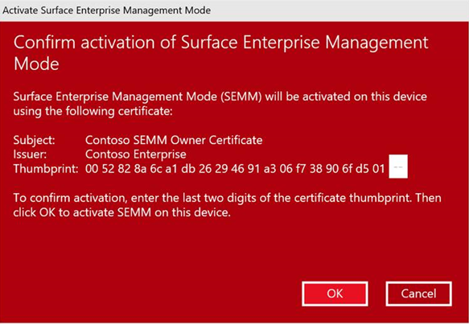
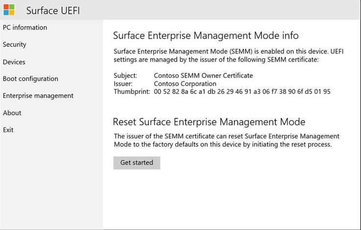

# Microsoft Surface Enterprise Management Mode

Microsoft Surface Enterprise Management Mode (SEMM) is a feature of Surface devices with Surface UEFI that allows you to secure and manage firmware settings within your organization. With SEMM, IT professionals can prepare configurations of UEFI settings and install them on a Surface device. In addition to the ability to configure UEFI settings, SEMM also uses a certificate to protect the configuration from unauthorized tampering or removal.

>[!NOTE]
>SEMM is only available on devices with Surface UEFI firmware. This includes most Surface devices including Surface Pro 7, Surface Pro X, and Surface Laptop 3 commercial SKUs with an Intel processor. SEMM is not supported on the 15" Surface Laptop 3 SKU with AMD processor (only available as a retail SKU). 

When Surface devices are configured by SEMM and secured with the SEMM certificate, they are considered *enrolled* in SEMM. When the SEMM certificate is removed and control of UEFI settings is returned to the user of the device, the Surface device is considered *unenrolled* in SEMM.

There are two administrative options you can use to manage SEMM and enrolled Surface devices – a standalone tool or integration with Microsoft Endpoint Configuration Manager. The SEMM standalone tool, called the Microsoft Surface UEFI Configurator, is described in this article. For more information about how to manage SEMM with Microsoft Endpoint Configuration Manager, see [Use Microsoft Endpoint Configuration Manager to manage devices with SEMM](https://technet.microsoft.com/itpro/surface/use-system-center-configuration-manager-to-manage-devices-with-semm).


## Microsoft Surface UEFI Configurator

The primary workspace of SEMM is Microsoft Surface UEFI Configurator, as shown in Figure 1. Microsoft Surface UEFI Configurator is a tool that is used to create Windows Installer (.msi) packages or WinPE images that are used to enroll, configure, and unenroll SEMM on a Surface device. These packages contain a configuration file where the settings for UEFI are specified. SEMM packages also contain a certificate that is installed and stored in firmware and used to verify the signature of configuration files before UEFI settings are applied.

>[!NOTE]
>You can now use Surface UEFI Configurator and SEMM to manage ports on Surface Dock 2. To learn more, see [Secure Surface Dock 2 ports with SEMM](secure-surface-dock-ports-semm.md).


*Figure 1. Microsoft Surface UEFI Configurator*


You can use the Microsoft Surface UEFI Configurator tool in three modes:

* [Surface UEFI Configuration Package](#configuration-package). Use this mode to create a Surface UEFI configuration package to enroll a Surface device in SEMM and to configure UEFI settings on enrolled devices.
* [Surface UEFI Reset Package](#reset-package). Use this mode to unenroll a Surface device from SEMM.
* [Surface UEFI Recovery Request](#recovery-request). Use this mode to respond to a recovery request to unenroll a Surface device from SEMM where a Reset Package operation is not successful.


#### Download Microsoft Surface UEFI Configurator

You can download Microsoft Surface UEFI Configurator from the [Surface Tools for IT](https://www.microsoft.com/download/details.aspx?id=46703) page in the Microsoft Download Center.

### Configuration package

Surface UEFI configuration packages are the primary mechanism to implement and manage SEMM on Surface devices. These packages contain a configuration file of UEFI settings specified during creation of the package in Microsoft Surface UEFI Configurator and a certificate file, as shown in Figure 2. When a configuration package is run for the first time on a Surface device that is not already enrolled in SEMM, it provisions the certificate file in the device’s firmware and enrolls the device in SEMM. When enrolling a device in SEMM, you will be prompted to confirm the operation by providing the last two digits of the SEMM certificate thumbprint before the certificate file is stored and the enrollment can complete. This confirmation requires that a user be present at the device at the time of enrollment to perform the confirmation.


*Figure 2. Secure a SEMM configuration package with a certificate*

See the [Surface Enterprise Management Mode certificate requirements](#surface-enterprise-management-mode-certificate-requirements) section of this article for more information about the requirements for the SEMM certificate.

>[!NOTE]
>You can also specify a UEFI password with SEMM that is required to view the **Security**, **Devices**, **Boot Configuration**, or **Enterprise Management** pages of Surface UEFI.

After a device is enrolled in SEMM, the configuration file is read and the settings specified in the file are applied to UEFI. When you run a configuration package on a device that is already enrolled in SEMM, the signature of the configuration file is checked against the certificate that is stored in the device firmware. If the signature does not match, no changes are applied to the device.

### Enable or disable devices in Surface UEFI with SEMM

The following list shows all the available devices you can manage in SEMM:

* Docking USB Port
* On-board Audio
* DGPU
* Type Cover
* Micro SD Card
* Front Camera
* Rear Camera
* Infrared Camera, for Windows Hello
* Bluetooth Only
* Wi-Fi and Bluetooth
* LTE

 >[!NOTE]
>The built-in devices that appear in the UEFI Devices page may vary depending on your device or corporate environment. For example, the UEFI Devices page is not supported on Surface Pro X; LTE only appears on LTE-equipped devices. 
### Configure advanced settings with SEMM
**Table 1. Advanced settings**

| Setting                            | Description                                                                                                                                                                                        |
| ---------------------------------- | -------------------------------------------------------------------------------------------------------------------------------------------------------------------------------------------------- |
| IPv6 for PXE Boot                  | Allows you to manage Ipv6 support for PXE boot. If you do not configure this setting, IPv6 support for PXE boot is disabled.                                                                               |
| Alternate Boot                     | Allows you to manage use of an Alternate boot order to boot directly to a USB or Ethernet device by pressing both the Volume Down button and Power button during boot. If you do not configure this setting, Alternate boot is enabled. |
| Boot Order Lock                    | Allows you to lock the boot order to prevent changes. If you do not configure this setting, Boot Order Lock is disabled.                                                                                                        |
| USB Boot                           | Allows you to manage booting to USB devices. If you do not configure this setting, USB Boot is enabled.                                                                                                                 |
| Network Stack                      | Allows you to manage Network Stack boot settings. If you do not configure this setting,  the ability to manage Network Stack boot settings is disabled.                                                                                                           |
| Auto Power On                      | Allows you to manage Auto Power On boot settings. If you do not configure this setting, Auto Power on is enabled.                                                                                                        |
| Simultaneous Multi-Threading (SMT) | Allows you to manage Simultaneous Multi-Threading (SMT) to enable or disable hyperthreading. If you do not configure this setting, SMT is enabled.                                                  |
|Enable Battery limit| Allows you to manage Battery limit functionality. If you do not configure this setting, Battery limit is enabled |
| Security                           | Displays the Surface UEFI **Security** page. If you do not configure this setting, the Security page is displayed.                                                                                                                 |
| Devices                            | Displays the Surface UEFI **Devices** page. If you do not configure this setting,  the Devices page is displayed.                                                                                                                     |
| Boot                               | Displays the Surface UEFI **Boot** page. If you do not configure this setting, the Boot page is displayed.                                                                                                                                                            |
| DateTime                           | Displays the Surface UEFI **DateTime** page. If you do not configure this setting, the DateTime page is displayed.                                                                                                                |


>[!NOTE]
>When you create a SEMM configuration package, two characters are shown on the **Successful** page, as shown in Figure 3.


*Figure 3. Display of the last two characters of the certificate thumbprint on the Successful page*

These characters are the last two characters of the certificate thumbprint and should be written down or recorded. The characters are required to confirm enrollment in SEMM on a Surface device, as shown in Figure 4.



*Figure 4. Enrollment confirmation in SEMM with the SEMM certificate thumbprint*

>[!NOTE]
>Administrators with access to the certificate file (.pfx) can read the thumbprint at any time by opening the .pfx file in CertMgr. To view the thumbprint with CertMgr, follow this process:
>1. Right-click the .pfx file, and then click **Open**.
>2. Expand the folder in the navigation pane.
>3. Click **Certificates**.
>4. Right-click your certificate in the main pane, and then click **Open**.
>5. Click the **Details** tab.
>6. **All** or **Properties Only** must be selected in the **Show** drop-down menu.
>7. Select the field **Thumbprint**.

To enroll a Surface device in SEMM or to apply the UEFI configuration from a configuration package, all you need to do is run the .msi file with administrative privileges on the intended Surface device. You can use application deployment or operating system deployment technologies such as [Microsoft Endpoint Configuration Manager](https://technet.microsoft.com/library/mt346023) or the [Microsoft Deployment Toolkit](https://technet.microsoft.com/windows/dn475741). When you enroll a device in SEMM you must be present to confirm the enrollment on the device. User interaction is not required when you apply a configuration to devices that are already enrolled in SEMM.

For a step-by-step walkthrough of how to enroll a Surface device in SEMM or apply a Surface UEFI configuration with SEMM, see [Enroll and configure Surface devices with SEMM](https://technet.microsoft.com/itpro/surface/enroll-and-configure-surface-devices-with-semm).

### Reset package

A Surface UEFI reset package is used to perform only one task — to unenroll a Surface device from SEMM. The reset package contains signed instructions to remove the SEMM certificate from the device’s firmware and to reset UEFI settings to factory default. Like a Surface UEFI configuration package, a reset package must be signed with the same SEMM certificate that is provisioned on the Surface device. When you create a SEMM reset package, you are required to supply the serial number of the Surface device you intend to reset. SEMM reset packages are not universal and are specific to one device.

### Recovery request

In some scenarios, it may be impossible to use a Surface UEFI reset package. (For example, if Windows becomes unusable on the Surface device.) In these scenarios you can unenroll the Surface device from SEMM through the **Enterprise Management** page of Surface UEFI (shown in Figure 5) with a Recovery Request operation.



*Figure 5. Initiate a SEMM recovery request on the Enterprise Management page*

When you use the process on the **Enterprise Management** page to reset SEMM on a Surface device, you are provided with a Reset Request. This Reset Request can be saved as a file to a USB drive, copied as text, or read as a QR Code with a mobile device to be easily emailed or messaged. Use the Microsoft Surface UEFI Configurator Reset Request option to load a Reset Request file or enter the Reset Request text or QR Code. Microsoft Surface UEFI Configurator will generate a verification code that can be entered on the Surface device. If you enter the code on the Surface device and click **Restart**, the device will be unenrolled from SEMM. 

>[!NOTE]
>A Reset Request expires two hours after it is created.

For a step-by-step walkthrough of how to unenroll Surface devices from SEMM, see [Unenroll Surface devices from SEMM](https://technet.microsoft.com/itpro/surface/unenroll-surface-devices-from-semm).

## Surface Enterprise Management Mode certificate requirements

>[!NOTE]
>The SEMM certificate is required to perform any modification to SEMM or Surface UEFI settings on enrolled Surface devices. If the SEMM certificate is corrupted or lost, SEMM cannot be removed or reset. Manage your SEMM certificate accordingly with an appropriate solution for backup and recovery.

Packages created with the Microsoft Surface UEFI Configurator tool are signed with a certificate. This certificate ensures that after a device is enrolled in SEMM, only packages created with the approved certificate can be used to modify the settings of UEFI. The following settings are recommended for the SEMM certificate:

* **Key Algorithm** – RSA 
* **Key Length** – 2048
* **Hash Algorithm** – SHA-256
* **Type** – SSL Server Authentication
* **Key Usage** – Digital signature, Key Encipherment
* **Provider** – Microsoft Enhanced RSA and AES Cryptographic Provider
* **Expiration Date** – 15 Months from certificate creation
* **Key Export Policy** – Exportable

It is also recommended that the SEMM certificate be authenticated in a two-tier public key infrastructure (PKI) architecture where the intermediate certification authority (CA) is dedicated to SEMM, enabling certificate revocation. For more information about a two-tier PKI configuration, see [Test Lab Guide: Deploying an AD CS Two-Tier PKI Hierarchy](https://technet.microsoft.com/library/hh831348).

>[!NOTE]
>You can use the following PowerShell script to create a self-signed certificate for use in proof-of-concept scenarios.
 > To use this script, copy the following text into Notepad and save the file as a PowerShell script (.ps1). This script creates a certificate with a password of `12345678`.<br/><br/>The certificate generated by this script is not recommended for production environments.
  
   ```
if (-not (Test-Path "Demo Certificate"))  { New-Item -ItemType Directory -Force -Path "Demo Certificate" }
if (Test-Path "Demo Certificate\TempOwner.pfx") { Remove-Item "Demo Certificate\TempOwner.pfx" }

# Generate the Ownership private signing key with password 12345678
$pw = ConvertTo-SecureString "12345678" -AsPlainText -Force

$TestUefiV2 = New-SelfSignedCertificate `
  -Subject "CN=Surface Demo Kit, O=Contoso Corporation, C=US" `
  -Type SSLServerAuthentication `
  -HashAlgorithm sha256 `
  -KeyAlgorithm RSA `
  -KeyLength 2048 `
  -KeyUsage KeyEncipherment `
  -KeyUsageProperty All `
  -Provider "Microsoft Enhanced RSA and AES Cryptographic Provider" `
  -NotAfter (Get-Date).AddYears(25) `
  -TextExtension @("2.5.29.37={text}1.2.840.113549.1.1.1") `
  -KeyExportPolicy Exportable

$TestUefiV2 | Export-PfxCertificate -Password $pw -FilePath "Demo Certificate\TempOwner.pfx"
   ```

For use with SEMM and Microsoft Surface UEFI Configurator, the certificate must be exported with the private key and with password protection. Microsoft Surface UEFI Configurator will prompt you to select the SEMM certificate file (.pfx) and certificate password when it is required.

>[!NOTE]
>For organizations that use an offline root in their PKI infrastructure, Microsoft Surface UEFI Configurator must be run in an environment connected to the root CA to authenticate the SEMM certificate. The packages generated by Microsoft Surface UEFI Configurator can be transferred as files and therefore can be transferred outside the offline network environment with removable storage, such as a USB stick.

### Managing certificates FAQ

The recommended *minimum* length is 15 months. You can use a
certificate that expires in less than 15 months or use a certificate
that expires in longer than 15 months.

>[!NOTE] 
>When a certificate expires, it does not automatically renew. 

**Will existing machines continue to apply the bios settings after 15
months?**

Yes, but only if the package itself was signed when the certificate was
valid.

**Will** **the SEMM package and certificate need to be updated on all
machines that have it?**

If you want SEMM reset or recovery to work, the certificate needs to be
valid and not expired. 

**Can bulk reset packages be created for each surface that we order? Can
one be built that resets all machines in our environment?**

The PowerShell samples that create a config package for a specific
device type can also be used to create a reset package that is
serial-number independent. If the certificate is still valid, you can
create a reset package using PowerShell to reset SEMM.

## Version History

### Version 2.71.139.0

This version of SEMM adds support for Surface Dock 2 management features  for Surface Book 3, Surface Laptop 3, and Surface Pro 7 including:

- Enabling audio (locking/unlocking), Ethernet and USB ports
- Ability to create dock packages for both authenticated and unauthenticated hosts

### Version 2.70.130.0

This version of SEMM includes:

- Support for Surface Go 2
- Support for Surface Book 3
- Bug fixes


### Version 2.59.139.0

* Support for Surface Pro 7, Surface Pro X,  and Surface Laptop 3 13.5" and 15" models with Intel processor. Note:  Surface Laptop 3 15" AMD processor is not supported.

- Support for Wake on Power feature

### Version 2.54.139.0
* Support to Surface Hub 2S
* Bug fixes

### Version 2.43.136.0
* Support to enable/disable simulatenous multithreating 
* Separate options for WiFi and Bluetooth for some devices 
* Battery Limit removed for Surface Studio 

### Version 2.26.136.0
* Add support to Surface Studio 2
* Battery Limit feature

### Version 2.21.136.0
* Add support to Surface Pro 6
* Add support to Surface Laptop 2

### Version 2.14.136.0
* Add support to Surface Go

### Version 2.9.136.0
* Add support to Surface Book 2
* Add support to Surface Pro LTE
* Accessibility improvements

### Version 1.0.74.0
* Add support to Surface Laptop
* Add support to Surface Pro
* Bug fixes and general improvement

## Related topics

- [Enroll and configure Surface devices with SEMM](enroll-and-configure-surface-devices-with-semm.md)
- [Unenroll Surface devices from SEMM](unenroll-surface-devices-from-semm.md)
- [Secure Surface Dock 2 ports with SEMM](secure-surface-dock-ports-semm.md)
